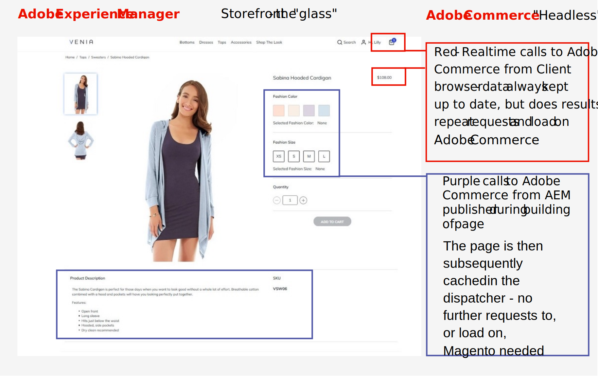

# Ofereça experiências em escala com o Adobe Commerce, a Commerce Integration Framework e o Adobe Experience Manager

Um padrão de integração recomendado entre o AEM e o Adobe Commerce usando a CIF como conector é o AEM para ser o proprietário da camada de apresentação (a &quot;tela&quot;) e o Adobe Commerce para potencializar o back-end de comércio como um back-end &quot;headless&quot;. Essa abordagem de integração aproveita os pontos fortes de cada aplicativo: os recursos de criação, personalização e onicanal de operações de AEM e comércio eletrônico do Adobe Commerce.

Em um ambiente AEM/CIF/Adobe Commerce, os visitantes do site de comércio eletrônico inicialmente chegarão ao AEM. O AEM verificará se a página solicitada está disponível no cache do dispatcher. Se a página existir, ela será disponibilizada para o visitante e não será necessário nenhum processamento adicional. Se o dispatcher não contiver a página solicitada ou se ela tiver expirado, ele solicitará que o publicador do AEM crie a página, com o publicador chamando o Adobe Commerce para obter dados de comércio eletrônico a fim de criar a página, se necessário. A página criada é então passada para o dispatcher para servir ao visitante e, em seguida, é armazenada em cache, evitando a necessidade de mais carga ser colocada nos servidores em solicitações subsequentes de outros visitantes para a mesma página.

Uma combinação de renderização do lado do servidor e do lado do cliente pode ser usada no modelo AEM/CIF/Adobe Commerce: renderização do lado do servidor para fornecer conteúdo estático e renderização do lado do cliente para fornecer conteúdo dinâmico pessoal ou em constante alteração, chamando diretamente o Adobe Commerce para componentes específicos no navegador do usuário.

Um exemplo dos diferentes componentes em uma Página de detalhes do produto em uma vitrine de comércio eletrônico AEM pode ser visto no exemplo abaixo:

## Renderização do lado do servidor

Páginas de comércio eletrônico, como páginas de detalhes do produto (PDPs) e páginas de listagem de produtos (PLPs), provavelmente não serão alteradas com frequência e devem ser totalmente armazenadas em cache após serem renderizadas no lado do servidor usando os Componentes principais da CIF do AEM. As páginas devem ser renderizadas no editor AEM usando modelos genéricos criados no AEM. Esses componentes obtêm dados do Adobe Commerce por meio de APIs do GraphQL. Essas páginas são criadas dinamicamente, renderizadas no servidor, armazenadas em cache no AEM Dispatcher e, em seguida, entregues no navegador. Exemplos disso são mostrados nas caixas roxas do exemplo acima.

## Renderização do lado do cliente

Quando atributos mais dinâmicos, como níveis/disponibilidade de estoque ou preço são exibidos, por exemplo, nas Páginas de detalhes do produto (PDPs), os componentes do lado do cliente podem ser usados. Embora a página de modelo possa ser criada e armazenada em cache no dispatcher usando a abordagem de renderização do lado do servidor acima, na própria página estática pode haver componentes da Web dinâmicos do lado do cliente. Esses componentes dinâmicos podem buscar dados diretamente no navegador do cliente do Adobe Commerce por meio de APIs da GraphQL para verificar, por exemplo, o preço atual ou o nível de estoque em tempo real no PDP. Isso garante que o conteúdo que geralmente é crítico para ser exibido em tempo real seja sempre buscado no carregamento da página. Exemplos disso são mostrados nas caixas vermelhas no exemplo acima.

Uma combinação de modelos de AEM e renderização do lado do cliente também pode ser usada durante o processo de finalização: os componentes do carrinho do lado do cliente renderizam o carrinho de compras, o formulário de finalização e a integração com o provedor de serviços de pagamento. Essa abordagem híbrida também pode ser usada para a funcionalidade de gerenciamento de conta da Adobe Commerce, como criar conta, entrar na conta e esquecer a senha.
