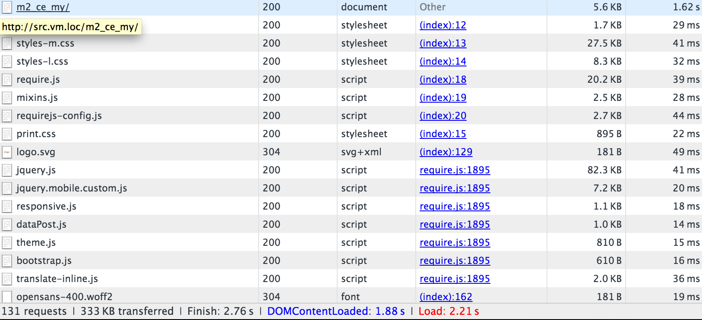

# Configurar verniz

[Cache de verniz] é um acelerador de aplicativo web de código aberto (também conhecido como _Acelerador HTTP_ ou _armazenamento em cache de proxy reverso HTTP_). O Varnish armazena (ou armazena em cache) arquivos ou fragmentos de arquivos na memória, o que permite que o Varnish reduza o tempo de resposta e o consumo de largura de banda da rede em solicitações futuras e equivalentes. Diferentemente de servidores Web como Apache e nginx, o Varnish foi projetado para uso exclusivo com o protocolo HTTP.

O Commerce 2.4.2 é testado com o Verniz 6.4. O Commerce 2.4.x é compatível com o Varnish 6.x

>[!WARNING]
>
>Nós _altamente recomendado_ você usa verniz na produção. O cache interno de página inteira — para o sistema de arquivos ou [banco de dados]— é muito mais lento que o Verniz e este foi projetado para acelerar o tráfego HTTP.

Para obter mais informações sobre verniz, consulte:

- [A Grande Imagem De Verniz]
- [Opções de inicialização de verniz]
- [Desempenho de verniz e site]

## Diagrama de topologia de verniz

A figura a seguir mostra uma exibição básica de Verniz na topologia do Commerce.


Na figura anterior, as solicitações HTTP dos usuários pela Internet resultam em várias solicitações para CSS, HTML, JavaScript e imagens (chamadas coletivamente de _ativos_). O verniz fica na frente do servidor Web e faz o proxy dessas solicitações para o servidor Web.

Como o servidor Web retorna ativos, os ativos que podem ser armazenados em cache são armazenados em verniz. Quaisquer solicitações subsequentes para esses ativos são atendidas pela Verniz (ou seja, as solicitações não chegam ao servidor Web). O verniz retorna conteúdo em cache com extrema rapidez. Os resultados são tempos de resposta mais rápidos para retornar o conteúdo aos usuários e um número reduzido de solicitações que devem ser atendidas pelo Commerce.

Os ativos em cache pelo Vernish expiram em um intervalo configurável ou são substituídos por versões mais recentes dos mesmos ativos. Também é possível limpar o cache manualmente usando o Administrador ou o [`magento cache:clean`](../cli/manage-cache.md#clean-and-flush-cache-types) comando.

## Visão geral do processo

Este tópico discute como instalar inicialmente o Verniz com um conjunto mínimo de parâmetros e testar se ele funciona. Em seguida, exporte uma configuração de verniz do Administrador do Commerce e teste-a novamente.

O processo pode ser resumido da seguinte forma:

1. Instale o Varnish e teste-o acessando qualquer página do Commerce para ver se você está recebendo cabeçalhos de resposta HTTP que indicam que o Varnish está funcionando.
1. Instale o software Commerce e use o Administrador para criar um arquivo de configuração do Vernish.
1. Substitua seu arquivo de configuração de verniz existente pelo arquivo gerado pelo administrador.
1. Teste tudo novamente.

   Se não houver nada em seu `<magento_root>/var/page_cache` diretório, você configurou com sucesso o Varnish com o Commerce!

>[!NOTE]
- Exceto quando observado, você deve inserir todos os comandos discutidos neste tópico como um usuário com `root` privilégios.
- Este tópico foi escrito para Verniz no CentOS e Apache 2.4. Se você estiver configurando o Verniz em um ambiente diferente, alguns comandos poderão ser diferentes. Consulte a documentação do Verniz para obter mais informações.


## Problemas conhecidos

Sabemos dos seguintes problemas com o verniz:

- [O verniz não é compatível com SSL]

   Como alternativa, use a terminação SSL ou um proxy de terminação SSL.

- Se você excluir manualmente o conteúdo da variável `<magento_root>/var/cache` diretório, você deve reiniciar o Varnish.

- Possível erro ao instalar o Commerce:

   ```terminal
   Error 503 Service Unavailable
   Service Unavailable
   XID: 303394517
   Varnish cache server
   ```

   Se você receber esse erro, edite `default.vcl` e adicione um tempo limite à variável `backend` estrofe do seguinte modo:

   ```conf
   backend default {
       .host = "127.0.0.1";
       .port = "8080";
       .first_byte_timeout = 600s;
   }
   ```

## Visão geral do armazenamento em cache do Vernish

O armazenamento em cache de verniz funciona com o Commerce usando:

- [`nginx.conf.sample`](https://github.com/magento/magento2/blob/2.4/nginx.conf.sample) do repositório GitHub do Magento 2
- `.htaccess` arquivo de configuração distribuída para o Apache fornecido com o Commerce
- `default.vcl` configuração para Verniz gerado usando o [Admin](../cache/configure-varnish-commerce.md)

>[!INFO]
Este tópico aborda somente as opções padrão na lista anterior. Há muitas outras maneiras de configurar o armazenamento em cache em cenários complexos (por exemplo, usando uma Rede de entrega de conteúdo); esses métodos estão além do escopo deste guia.

Na primeira solicitação do navegador, os ativos armazenáveis em cache são entregues ao navegador do cliente do Vernish e armazenados em cache no navegador.

Além disso, o verniz usa uma tag de entidade (ETag) para ativos estáticos. O ETag fornece uma maneira de determinar quando os arquivos estáticos são alterados no servidor. Como resultado, os ativos estáticos são enviados ao cliente quando são alterados no servidor, seja em uma nova solicitação de um navegador ou quando o cliente atualiza o cache do navegador, normalmente pressionando F5 ou Control+F5.

Mais detalhes são fornecidos nas seções a seguir.

## Armazenamento em cache por solicitação do navegador

Esta seção usa um inspetor de navegador para mostrar como os ativos são entregues ao navegador na primeira solicitação e depois carregados do cache do navegador local.

### Primeira solicitação do navegador

`nginx.conf.sample` e `.htaccess` forneça opções para o cache do cliente. Quando a primeira solicitação é feita de um navegador para um objeto que pode ser armazenado em cache, o Varnish o entrega ao cliente.

A figura a seguir mostra um exemplo de uso de um inspetor de navegador:



O exemplo anterior mostra uma solicitação para a página principal da loja (`m2_ce_my`). Os ativos CSS e JavaScript são armazenados em cache no navegador do cliente.

>[!NOTE]
A maioria dos ativos estáticos tem um código de status HTTP 200 (OK), indicando que o ativo foi recuperado do servidor.

### Segunda solicitação do navegador

Se o mesmo navegador solicitar a mesma página novamente, esses ativos serão entregues pelo cache do navegador local, como mostra a figura a seguir.


Observe a diferença no tempo de resposta entre a primeira e a segunda solicitação. Novamente, os ativos estáticos têm um código de resposta 200 (OK) porque são entregues do cache local pela primeira vez.

## Como o Commerce usa o Etag

O exemplo a seguir mostra cabeçalhos de resposta para um ativo estático específico.


`calendar.css` tem um cabeçalho de resposta ETag, o que significa que o arquivo CSS no navegador do cliente pode ser comparado ao do servidor.

Além disso, os ativos estáticos são retornados com um código de status HTTP 304 (Não modificado), como mostra a figura a seguir.


O código de status 304 ocorre porque o usuário invalidou o cache local e o conteúdo no servidor não foi alterado. Devido ao código de status 304, o ativo estático _conteúdo_ não é transferido; somente os cabeçalhos HTTP são baixados no navegador.

Se o conteúdo for alterado no servidor, o cliente baixará o ativo estático com um código de status HTTP 200 (OK) e um novo ETag.

<!-- Link Definitions -->

[banco de dados]: https://developer.adobe.com/commerce/php/development/cache/partial/database-caching/
[A Grande Imagem De Verniz]: https://www.varnish-cache.org/docs/trunk/users-guide/intro.html
[Cache de verniz]: https://varnish-cache.org
[Opções de inicialização de verniz]: https://www.varnish-cache.org/docs/trunk/reference/varnishd.html#ref-varnishd-options
[Desempenho de verniz e site]: https://www.varnish-cache.org/docs/trunk/users-guide/performance.html#users-performance
[O verniz não é compatível com SSL]: https://www.varnish-cache.org/docs/3.0/phk/ssl.html
