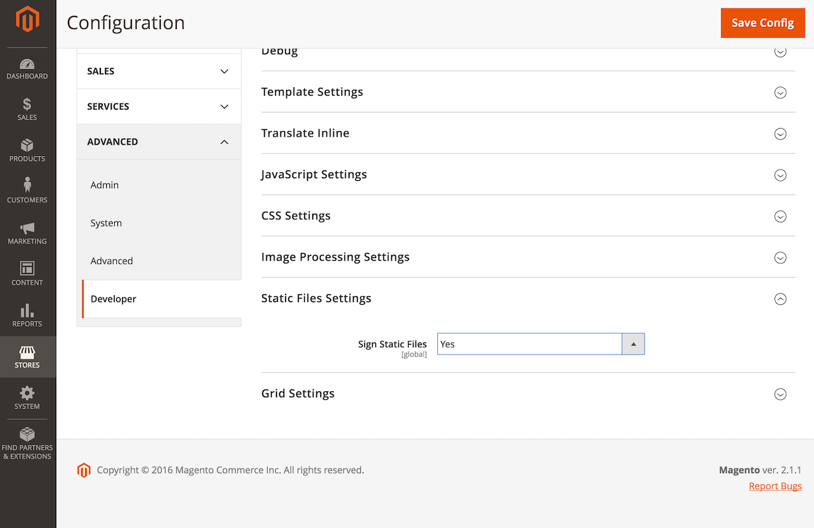

# Cache de conteúdo estático

Para melhorar o desempenho, o Commerce define a variável `Expires` cabeçalhos para recursos estáticos, como imagens, JavaScript e arquivos CSS.
Definir a `Expires` em um recurso estático informa ao navegador para armazenar o recurso em cache nesse URL e veicular a versão em cache até expirar.
Isso é comum [prática recomendada](https://developer.yahoo.com/performance/rules.html#expires=) para armazenar recursos estáticos em cache.

Quando o navegador armazena em cache um recurso estático e esse recurso é alterado no servidor, é necessário limpar o cache do navegador para que ele possa baixar a nova versão.
Limpar manualmente o cache do navegador funcionará se você for um [site](https://glossary.magento.com/website) administrador, mas essa não é uma solicitação apropriada para fazer de seus usuários quando você quiser que eles baixem novas versões de um recurso estático.

## Assinatura de conteúdo estático

[Conteúdo estático](https://glossary.magento.com/static-content) a assinatura é um recurso do Commerce que permite invalidar o cache do navegador para recursos estáticos.
O Commerce faz isso adicionando uma versão de implantação ao URL de [arquivos estáticos](https://glossary.magento.com/static-files).

Este é um exemplo de um URL assinado com uma versão:

```terminal
http://magento2.com/pub/static/version1475604434/frontend/Magento/luma/en_US/images/logo.svg
```

Ao executar o comando [`setup:static-content:deploy`](../cli/static-view-file-deployment.md) para implantar conteúdo estático, o Commerce altera automaticamente a versão de implantação.
Isso altera o URL dos arquivos estáticos e força o navegador a carregar a nova versão dos arquivos.

O Commerce ativa esse recurso por padrão, e o Adobe recomenda manter esse recurso ativado para evitar problemas relacionados a navegadores que exibem recursos estáticos antigos.

Você pode encontrar a configuração desse recurso em [**[!UICONTROL Stores]**> Configurações > Configuração >**[!UICONTROL Advanced]**>**[!UICONTROL Developer]**>**[!UICONTROL Static Files Settings]**](https://docs.magento.com/user-guide/system/static-file-signature.html).



Determine o status:

```bash
bin/magento config:show dev/static/sign
```

Ative ou desative a assinatura de conteúdo estático:

```bash
bin/magento config:set dev/static/sign <value>
```

Onde `<value>` é 1 (ativado) ou 0 (desativado).

## Assinaturas da versão

O Commerce anexa a assinatura da versão como um componente de caminho diretamente após o URL base dos arquivos de visualização estáticos para preservar a integridade dos URLs relativos em recursos estáticos.
Isso também força o navegador a resolver um URL relativo para a fonte assinada correta, mantendo o conteúdo independentemente da presença/ausência do valor de assinatura.

Quando um navegador solicita uma fonte assinada do servidor, o servidor usa regravações de URL para retirar o componente de assinatura do URL.

## Uso durante implantações

Após atualizar ou modificar recursos estáticos, é necessário executar o `setup:static-content:deploy` para implantar a versão e atualizar o conteúdo estático, o que força o navegador a carregar os recursos atualizados.

Se você implantar o código em um servidor separado e movê-lo para produção usando um repositório de código para reduzir o tempo de inatividade, também deverá adicionar o arquivo `pub/static/deployed_version.txt` ao repositório.
Este arquivo contém a nova versão para o conteúdo estático implantado.
