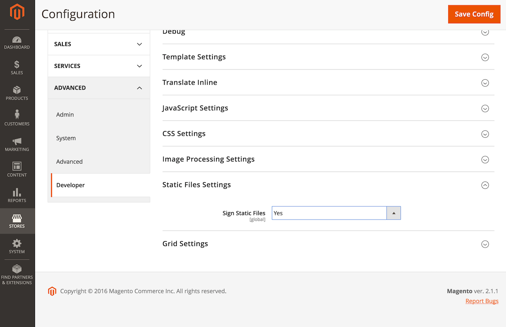

# Assinatura de conteúdo estático e invalidação do cache do navegador

Para melhorar o desempenho, o Commerce define os cabeçalhos `Expires` para recursos estáticos, como imagens, JavaScript e arquivos CSS.
Definir o cabeçalho `Expires` em um recurso estático informa ao navegador para armazenar o recurso em cache nessa URL e fornecer a versão em cache até que ela expire.
Esta é uma [prática recomendada](https://developer.yahoo.com/performance/rules.html#expires=) comum para armazenamento em cache de recursos estáticos.

Quando o navegador armazena em cache um recurso estático e esse recurso é alterado no servidor, é necessário limpar o cache do navegador para que ele possa baixar a nova versão.
A limpeza manual do cache do navegador funciona se você for um administrador de site, mas essa não é uma solicitação apropriada a ser feita aos usuários quando quiser que eles baixem novas versões de um recurso estático.

## Assinatura de conteúdo estático

A assinatura de conteúdo estático é um recurso do Commerce que permite invalidar o cache do navegador para recursos estáticos.
A Commerce consegue isso adicionando uma versão de implantação ao URL dos arquivos estáticos.

Veja a seguir um exemplo de um URL assinado com uma versão:

```text
http://magento2.com/pub/static/version1475604434/frontend/Magento/luma/en_US/images/logo.svg
```

Quando você executa o comando [`setup:static-content:deploy`](../cli/static-view-file-deployment.md) para implantar conteúdo estático, o Commerce altera automaticamente a versão de implantação.
Isso altera o URL dos arquivos estáticos e força o navegador a carregar a nova versão dos arquivos.

O Commerce ativa esse recurso por padrão, e a Adobe recomenda mantê-lo ativado para evitar problemas relacionados a navegadores que servem recursos estáticos antigos.

A configuração para assinatura de conteúdo estático está em [**[!UICONTROL Stores]**> Configurações > Configuração >**[!UICONTROL Advanced]**>**[!UICONTROL Developer]**>**[!UICONTROL Static Files Settings]**](https://experienceleague.adobe.com/pt-br/docs/commerce-admin/systems/tools/developer-tools#static-file-signatures).

- **Somente no local**: essa configuração estará disponível se o site for **não** em [Modo de produção](../bootstrap/application-modes.md#production-mode).
- **Nuvem**: esta configuração está oculta porque o modo de Produção é estritamente aplicado; portanto, você deve usar a linha de comando como mostrado abaixo.



Determine o status:

```shell
bin/magento config:show dev/static/sign
```

Habilitar ou desabilitar assinatura de conteúdo estático:

```shell
bin/magento config:set dev/static/sign <value>
```

Onde `<value>` é 1 (ativado) ou 0 (desativado).

## Assinaturas de versão

O Commerce anexa a assinatura da versão como um componente de caminho diretamente após o URL base dos arquivos de visualização estáticos para preservar a integridade dos URLs relativos nos recursos estáticos.
Isso também força o navegador a resolver um URL relativo para a fonte assinada correta, mantendo seu conteúdo independente da presença/ausência do valor de assinatura.

Quando um navegador solicita uma origem assinada do servidor, o servidor usa substituições de URL para retirar o componente de assinatura do URL.

## Uso durante implantações

Depois de atualizar ou modificar recursos estáticos, você deve executar o comando `setup:static-content:deploy` para implantar a versão e atualizar o conteúdo estático, o que força o navegador a carregar os recursos atualizados.

Se você implantar o código em um servidor separado e movê-lo para produção usando um repositório de códigos para reduzir o tempo de inatividade, também deverá adicionar o arquivo `pub/static/deployed_version.txt` ao repositório.
Esse arquivo contém a nova versão para o conteúdo estático implantado.
