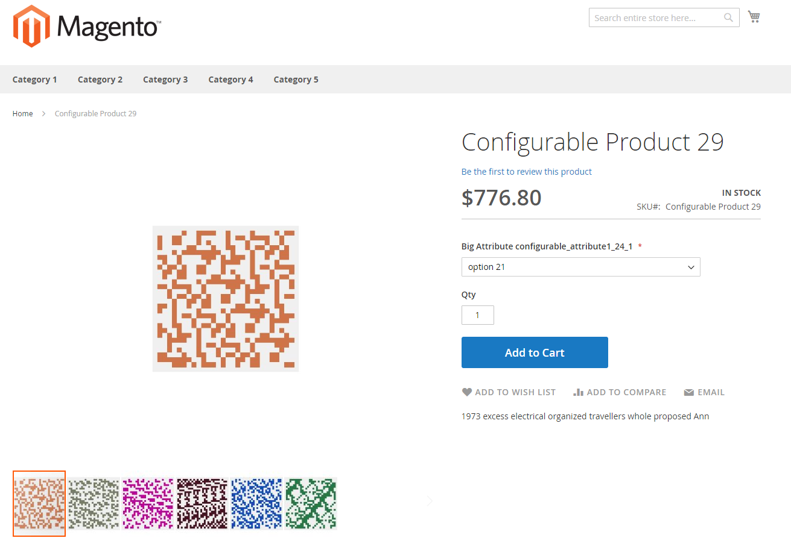

# Dados de teste de desempenho

Para usar o [Kit de ferramentas de desempenho](https://github.com/magento/magento2/blob/2.4/setup/performance-toolkit) ou outra ferramenta para testes de desempenho, você deve gerar uma grande quantidade de dados, como lojas, categorias e produtos.

{{file-system-owner}}

## Perfis

É possível ajustar a quantidade de dados criados usando o _perfis_ (pequeno, médio, grande e extra grande). Os perfis estão localizados na `<magento_root>/setup/performance-toolkit/profiles/<ce|ee>` diretório.

Por exemplo, `/var/www/html/magento2/setup/performance-toolkit/profiles/ce`

A figura a seguir mostra como um produto é exibido na vitrine usando o _pequeno_ perfil:



A tabela a seguir fornece detalhes sobre os perfis do gerador de dados: pequeno, médio, grande e extragrande.

| Parâmetro | Perfil pequeno | Perfil médio | Perfil médio de vários sites | Perfil grande | Perfil extragrande |
| --- | --- | --- | --- | --- | --- |
| `websites` | 1 | 3 | 25 | 5 | 5 |
| `store_groups` | 1 | 3 | 25 | 5 | 5 |
| `store_views` | 1 | 3 | 50 | 5 | 5 |
| `simple_products` | 800 | 24.000 | 4.000 | 300.000 | 600.000 |
| `configurable_products` | 16 com 24 opções | 640 com 24 opções | 800 com 24 opções e 79 com 200 opções | 8.000 com 24 opções | 16.000 com 24 opções |
| `product_images` | 100 imagens/3 imagens por produto | 1000 imagens/3 imagens por produto | 1000 imagens/3 imagens por produto | 2.000 imagens/3 imagens por produto | 2.000 imagens/3 imagens por produto |
| `categories` | 30 | 300 | 100 | 3.000 | 6.000 |
| `categories_nesting_level` | 3 | 3 | 3 | 5 | 5 |
| `catalog_price_rules` | 20 | 20 | 20 | 20 | 20 |
| `catalog_target_rules` | 5 | 5 | 5 | 5 | 5 |
| `cart_price_rules` | 20 | 20 | 20 | 20 | 20 |
| `cart_price_rules_floor` | 2 | 2 | 2 | 2 | 2 |
| `customers` | 200 | 2.000 | 2.000 | 5.000 | 10.000 |
| `tax rates` | 130 | 40.000 | 40.000 | 40.000 | 40.000 |
| `orders` | 80 | 50.000 | 50.000 | 100.000 | 150.000 |

### Execute o gerador de dados

>[!WARNING]
>
>Antes de executar o gerador de dados, desative todos os trabalhos cron em execução no servidor. A desativação dos trabalhos cron impede que o gerador de dados execute ações que entrem em conflito com os trabalhos cron ativos e evita erros desnecessários.
>
>Se você pretende implementar eventos com o [!DNL Adobe I/O Events for Adobe Commerce] ao testar o desempenho, execute este comando antes de assinar [events](https://developer.adobe.com/commerce/extensibility/events/). A inscrição de eventos primeiro pode causar erros.

Execute o comando conforme discutido nesta seção. Depois que o comando for executado, você deverá [reindexar todos os indexadores](../cli/manage-indexers.md).

Opções de comando:

```bash
bin/magento setup:perf:generate-fixtures <path-to-profile>
```

Onde `<path-to-profile>` especifica o caminho absoluto do sistema de arquivos para um perfil e o nome dele.

Por exemplo,

```bash
bin/magento setup:perf:generate-fixtures /var/www/html/magento2/setup/performance-toolkit/profiles/ce/small.xml
```

Exemplo de saída para o perfil pequeno:

```terminal
Generating profile with following params:
    |- Websites: 1
    |- Store Groups Count: 1
    |- Store Views Count: 1
    |- Categories: 30
    |- Attribute Sets (Default): 3
    |- Attribute Sets (Extra): 10
    |- Simple products: 800
    |- Configurable products: 0
    |--- 5 products for attribute set "Attribute Set 1"
    |--- 5 products for attribute set "Attribute Set 2"
    |--- 5 products for attribute set "Attribute Set 3"
    |--- 40 products for attribute set "Dynamic Attribute Set 1-24"
    |- Product images: 100, 3 per product
    |- Customers: 200
    |- Cart Price Rules: 20
    |- Catalog Price Rules: 20
    |- Catalog Target Rules: 5
    |- Orders: 80
Generating websites, stores and store views...  done in <time>
Generating categories...  done in <time>
Generating attribute sets...  done in <time>
Generating simple products...  done in <time>
... more ...
```

## Dispositivos de desempenho

### Usuários administradores

Gera usuários administradores. Nó de perfil XML:

```xml
<!-- Number of admin users -->
<admin_users>{int}</admin_users>
```

### Conjuntos de atributos

Gera conjuntos de atributos com a configuração especificada. Nó de perfil XML:

```xml
<!-- Number of product attribute sets -->
<product_attribute_sets>{int}</product_attribute_sets>

<!-- Number of attributes per set -->
<product_attribute_sets_attributes>{int}</product_attribute_sets_attributes>

<!-- Number of values per attribute -->
<product_attribute_sets_attributes_values>{int}</product_attribute_sets_attributes_values>
```

### Produtos do pacote

Gera produtos agrupados. As seleções de conjunto geradas não são exibidas individualmente no catálogo. Os produtos são distribuídos uniformemente por categorias e sites. Se  `assign_entities_to_all_websites` do perfil estiver definido como `1`. Os produtos são atribuídos a todos os sites.

Nó de perfil XML:

```xml
<!-- Number of products -->
<bundle_products>{int}</bundle_products>

<!-- Number of options per each product -->
<bundle_products_options>{int}</bundle_products_options>

<!-- Number of simple products per each option -->
<bundle_products_variation>{int}</bundle_products_variation>
```

### Regras de preço do carrinho

Gera regras de preço do carrinho. Nó de perfil XML:

```xml
<!-- Number of cart price rules -->
<cart_price_rules>{int}</cart_price_rules>

<!-- Number of conditions per rule -->
<cart_price_rules_floor>{int}</cart_price_rules_floor>
```

### Regras de preço de catálogo

Gera regras de preço de catálogo. Nó de perfil XML:

```xml
<!-- Number of catalog price rules -->
<catalog_price_rules>{int}</catalog_price_rules>
```

### Categorias

Gera categorias. Se `assign_entities_to_all_websites` está definida como `0`, todas as categorias são distribuídas uniformemente por categorias raiz; caso contrário, todas as categorias são atribuídas a uma categoria raiz.

Nó de perfil XML:

```xml
<!-- Number of categories to generate -->
<categories>{int}</categories>

<!-- Nesting level of categories -->
<categories_nesting_level>{int}</categories_nesting_level>
```

### Configurações

Define valores para campos de configuração. Nó de perfil XML:

```xml
<!-- Config variables and values for change -->
<configs>
    <config>
        <path>{string}</path> <!-- e.g. admin/security/use_form_key -->
        <scope>{string}</scope> <!-- e.g. default -->
        <scopeId>{int}</scopeId>
        <value>{int|string}</value>
    </config>

    <!-- ... more entries ... -->
</configs>
```

### Produtos configuráveis

Gera produtos configuráveis. As opções configuráveis geradas não são exibidas individualmente no catálogo. Os produtos são distribuídos uniformemente por categorias e sites. Se `assign_entities_to_all_websites` está definida como `1`, os produtos são atribuídos a todos os sites.

Os seguintes formatos de nó XML são compatíveis:

- Distribuição por Padrão e conjuntos de atributos predefinidos:

  ```xml
  <!-- Number of configurable products -->
  <configurable_products>{int}</configurable_products>
  ```

- Gerar produtos com base em um conjunto de atributos existente:

  ```xml
  <configurable_products>
  
      <config>
              <!-- Existing attribute set name -->
              <attributeSet>{string}</attributeSet>
  
              <!-- Configurable sku pattern with %s -->
              <sku>{string}</sku>
  
              <!-- Number of configurable products -->
              <products>{int}</products>
  
              <!-- Category Name. Optional. By default category name from Categories fixture will be used -->
              <category>[{string}]</category>
  
              <!-- Type of Swatch attribute e.g. color|image -->
              <swatches>{string}</swatches>
      </config>
  
  <!-- ... more entries ... -->
  </configurable_products>
  ```

- Gere produtos com base em um conjunto de atributos criado dinamicamente com um número especificado de atributos e opções:

  ```xml
  <configurable_products>
  
      <config>
          <!-- Number of attributes in configurable product -->
          <attributes>{int}</attributes>
  
          <!-- Number of options per attribute -->
          <options>{int}</options>
  
          <!-- Configurable sku pattern with %s -->
          <sku>{string}</sku>
  
          <!-- Number of configurable products -->
          <products>{int}</products>
  
          <!-- Category Name. Optional. By default category name from Categories fixture will be used -->
          <category>[{string}]</category>
  
          <!-- Type of Swatch attribute e.g. color|image -->
          <swatches>{string}</swatches>
      </config>
  
      <!-- ... more entries ... -->
  </configurable_products>
  ```

- Gerar produtos com base em um conjunto de atributos criado dinamicamente com uma configuração especificada para cada atributo:

  ```xml
  <configurable_products>
  
      <config>
          <attributes>
              <!-- Configuration for a first attribute -->
              <attribute>
                  <!-- Amount of options per attribute -->
                  <options>{int}</options>
  
                  <!-- Type of Swatch attribute -->
                  <swatches>{string}</swatches>
              </attribute>
  
              <!-- Configuration for a second attribute -->
              <attribute>
                  <!-- Amount of options per attribute -->
                  <options>{int}</options>
              </attribute>
          </attributes>
  
          <!-- Configurable sku pattern with %s -->
          <sku>{string}</sku>
  
          <!-- Number of configurable products -->
          <products>{int}</products>
  
          <!-- Category Name. Optional. By default, the category name from Categories fixture will be used -->
          <category>[{string}]</category>
      </config>
  
      <!-- ... more entries ... -->
  </configurable_products>
  ```

### Clientes

Gera clientes. Os clientes têm uma distribuição normal em todos os sites disponíveis. Cada cliente tem os mesmos dados, exceto email do cliente, grupo de clientes e endereços de clientes.

Nó de perfil XML:

```xml
<!-- Number of customers to generate -->
<customers>{int}</customers>
```

Você pode usar o seguinte XML para alterar a configuração do cliente:

```xml
<customer-config>
    <!-- Number of addresses per each customer -->
    <addresses-count>{int}</addresses-count>
</customer-config>
```

### Imagens do produto

Gera imagens de produtos. A geração não inclui o redimensionamento.

Nó de perfil XML:

```xml
<product-images>
    <!-- Number of images to generate -->
    <images-count>{int}</images-count>

    <!-- Number of images to be assigned per each product -->
    <images-per-product>{int}</images-per-product>
</product-images>
```

### Estado dos indexadores

Atualiza o estado dos indexadores. Nó de perfil XML:

```xml
<indexer>
    <!-- Name of indexer (e.g. catalogrule_product) -->
    <id>{string}</id>
    <set_scheduled>{bool}</set_scheduled>
</indexer>
```

### Pedidos

Gera pedidos com o número configurável de diferentes tipos de itens de pedido. Opcionalmente, gera cotas inativas para ordens geradas.

Nó de perfil XML:

```xml
<!-- It is necessary to enable quotes for orders -->
<order_quotes_enable>{bool}</order_quotes_enable>

<!-- Min number of simple products per each order -->
<order_simple_product_count_from>{int}</order_simple_product_count_from>

<!-- Max number of simple products per each order -->
<order_simple_product_count_to>{int}</order_simple_product_count_to>

<!-- Min number of configurable products per each order -->
<order_configurable_product_count_from>{int}</order_configurable_product_count_from>

<!-- Max number of configurable products per each order -->
<order_configurable_product_count_to>{int}</order_configurable_product_count_to>

<!-- Min number of big configurable products (with big amount of options) per each order -->
<order_big_configurable_product_count_from>{int}</order_big_configurable_product_count_from>

<!-- Max number of big configurable products (with big amount of options) per each order -->
<order_big_configurable_product_count_to>{int}</order_big_configurable_product_count_to>

<!-- Number of orders to generate -->
<orders>{int}</orders>
```

### Produtos simples

Gera produtos simples. Os produtos são distribuídos por conjuntos de atributos padrão e predefinidos. Se conjuntos de atributos extras forem especificados no perfil como: `<product_attribute_sets>{int}</product_attribute_sets>`, os produtos também são distribuídos por conjuntos de atributos adicionais.

Os produtos são distribuídos uniformemente por categorias e sites. Se `assign_entities_to_all_websites` está definida como `1`, os produtos são atribuídos a todos os sites.

Nó de perfil XML:

```xml
<!-- Number of simple products to generate -->
<simple_products>{int}</simple_products>
```

### Sites

Gera sites. Nó de perfil XML:

```xml
<!-- Number of websites to be generated -->
<websites>{int}</websites>
```

### Armazenar grupos

Gera grupos de armazenamento (referidos no Administrador como _lojas_). Os grupos de lojas são distribuídos normalmente entre sites.

Nó de perfil XML:

```xml
<!-- Number of store groups to be generated -->
<store_groups>{int}</store_groups>
```

### Visualizações da loja

Gera exibições de loja. As exibições de loja são distribuídas normalmente entre grupos de loja. Nó de perfil XML:

```xml
<!-- Number of store views to be generated -->
<store_views>{int}</store_views>

<!-- 1 means that all stores will have the same root category, 0 means that all stores will have unique root category -->
<assign_entities_to_all_websites>{0|1}<assign_entities_to_all_websites/>
```

### Alíquotas de imposto

Gera alíquotas de imposto. Nó de perfil XML:

```xml
<!-- Accepts name of CSV file with tax rates (<path to Commerce folder>/setup/src/Magento/Setup/Fixtures/_files) -->
<tax_rates_file>{CSV file name}</tax_rates_file>
```

## Informações adicionais de configuração:

- `<Commerce root dir>/setup/performance-toolkit/config/attributeSets.xml`—Conjuntos de atributos padrão

- `<Commerce root dir>/setup/performance-toolkit/config/customerConfig.xml`— Configuração do cliente

- `<Commerce root dir>/setup/performance-toolkit/config/description.xml`—Configuração da descrição completa do produto

- `<Commerce root dir>/setup/performance-toolkit/config/shortDescription.xml`—Configuração da descrição curta do produto

- `<Commerce root dir>/setup/performance-toolkit/config/searchConfig.xml`— Configuração para descrição curta e completa do produto. Esta implementação mais antiga é fornecida para compatibilidade com versões anteriores.

- `<Commerce root dir>/setup/performance-toolkit/config/searchTerms.xml`—Pequeno número de termos de pesquisa em descrições resumidas e completas

- `<Commerce root dir>/setup/performance-toolkit/config/searchTermsLarge.xml`—Maior número de termos de pesquisa para usar em uma descrição curta e completa.
