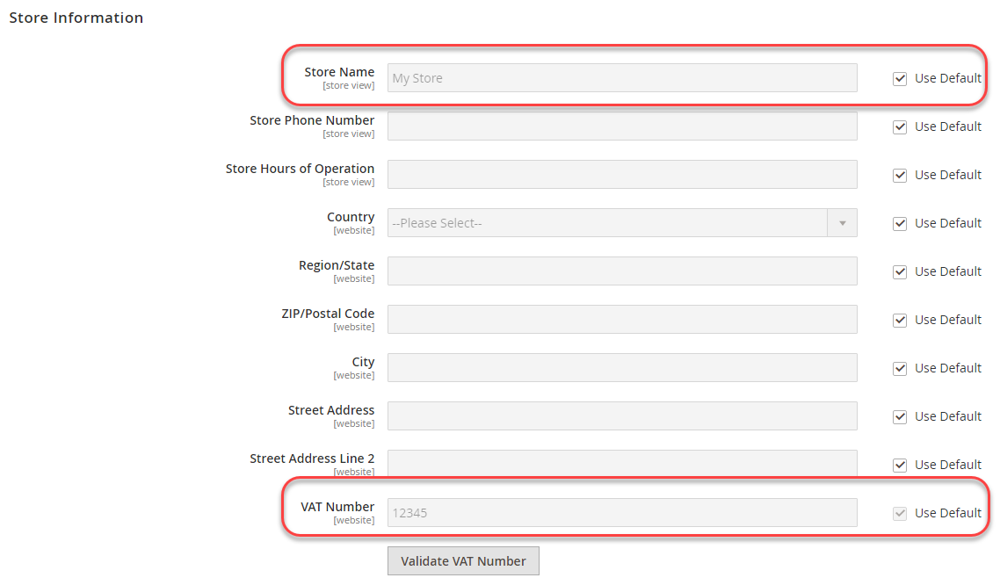

# Exemplo usando variáveis de ambiente

Este exemplo mostra como definir valores compartilhados, específicos do sistema e confidenciais no sistema de desenvolvimento, em seguida, definir todos os valores no sistema de produção usando uma combinação da configuração compartilhada, `config.php`e variáveis de ambiente PHP.

Essas configurações podem ser compartilhadas entre os sistemas de desenvolvimento e produção:

Número IVA e Nome do Armazenamento de **Lojas** > Configurações > **Configuração** > Geral > **Geral**

Essas configurações são específicas do sistema ou confidenciais, conforme indicado:

- Enviar emails para (sensível) de **Lojas** > Configurações > **Configuração** > Geral > **Contatos**
- Domínio de email padrão (específico do sistema) de **Lojas** > Configurações > **Configuração** > Clientes > **Configuração do cliente** > **Criar novas opções de conta**

Você pode usar o mesmo procedimento para configurar qualquer configuração nas seguintes referências:

- [Referência de caminhos de configuração sensíveis e específicos do sistema](../reference/config-reference-sens.md)
- [Referência de caminhos de configuração de pagamento](../reference/config-reference-payment.md)
- [Referência de caminhos de configuração gerais](../reference/config-reference-general.md)
- [Referência de caminhos de configuração da extensão do Commerce Enterprise B2B](../reference/config-reference-b2b.md)

## Antes de começar

Antes de começar, configure as permissões e a propriedade do sistema de arquivos, conforme descrito em [Pré-requisito para os sistemas de desenvolvimento, criação e produção](../deployment/prerequisites.md).

## Pressupostos

Este tópico fornece um exemplo de modificação da configuração do sistema de produção. Se desejar, é possível escolher opções de configuração diferentes.

Para os fins deste exemplo, assumimos o seguinte:

- Você usa o controle de origem Git
- O sistema de desenvolvimento está disponível em um repositório remoto do Git chamado `mconfig`
- Sua ramificação de trabalho do Git é chamada de `m2.2_deploy`

## Etapa 1: Defina a configuração no sistema de desenvolvimento

Para definir a localidade e as unidades de peso padrão em seu sistema de desenvolvimento:

1. Faça logon em Admin.
1. Clique em **Lojas** > Configurações > **Configuração** > Geral > **Geral**.
1. Se você tiver mais de um site disponível, use a variável **Exibição da loja** no canto superior esquerdo para alternar para um site diferente, como mostra a figura a seguir.

   

1. No painel direito, expanda **Informações da loja**.
1. Se necessário, limpe o **Usar padrão** caixa de seleção ao lado da **Número do IVA** campo.
1. Insira um número no campo (por exemplo, `12345`).
1. No **Nome da loja** insira um valor (como `My Store`).
1. Clique em **Salvar configuração**.
1. Use o **Exibição da loja** para selecionar a **Configuração padrão** como mostra a figura a seguir.

   

1. Na navegação à esquerda, em Geral, clique em **Contatos**.
1. Limpe o **Usar padrão** caixa de seleção ao lado da **Enviar Emails para** campo.
1. Insira um endereço de email no campo .
1. Clique em **Salvar configuração**.
1. No painel esquerdo, clique em Clientes > **Configuração do cliente**.
1. No painel direito, expanda **Criar novas opções de conta**.
1. Limpe o **Usar valor do sistema** caixa de seleção ao lado da **Domínio de email padrão** campo.
1. Insira um nome de domínio no campo .
1. Clique em **Salvar configuração**.
1. Se solicitado, libere o cache.

## Etapa 2: Atualizar a configuração

Depois de alterar a configuração no Administrador, grave a configuração compartilhada em um arquivo, como discutido nesta seção.

{{$include /help/_includes/config-save-config.md}}

Observe que, mesmo `app/etc/env.php` (a configuração específica do sistema) foi atualizada, não faça o check-in no controle do código-fonte. Posteriormente, você criará as mesmas configurações em seu sistema de produção, neste procedimento.

## Etapa 3: Atualize seu sistema de build e gere arquivos

Depois de confirmar as alterações na configuração compartilhada com o controle de origem, você pode extrair essas alterações no sistema de compilação, compilar o código e gerar arquivos estáticos. A última etapa é transferir essas alterações para o sistema de produção.

{{$include /help/_includes/config-update-build-system.md}}

## Etapa 4: Atualizar o sistema de produção

A última etapa do processo é atualizar seu sistema de produção. Você deve fazer isso em duas partes:

- Atualizar as configurações sensíveis e específicas do sistema
- Atualizar as configurações compartilhadas

### Atualizar as configurações sensíveis e específicas do sistema

Para definir as configurações confidenciais e específicas do sistema usando variáveis de ambiente, você deve saber o seguinte:

- Escopo para cada configuração

   Se você seguiu as instruções na Etapa 1, o escopo para Enviar emails para é global (ou seja, o escopo de Configuração padrão) e o escopo do Domínio de email padrão é site.

   Você deve saber o código do site para definir o valor de configuração de Domínio de email padrão. Consulte [Usar variáveis de ambiente para substituir configurações](../reference/override-config-settings.md#environment-variables) para obter mais informações sobre como encontrá-lo.

- Caminho de configuração para cada configuração

   Os caminhos de configuração usados neste exemplo seguem:

   | Nome da configuração | Caminho de configuração |
   |--------------|--------------|
   | Enviar Emails para | `contact/email/recipient_email` |
   | Domínio de email padrão | `customer/create_account/email_domain` |

   Você pode encontrar todos os caminhos de configuração confidenciais e específicos do sistema em [Referência de caminhos de configuração sensíveis e específicos do sistema](../reference/config-reference-sens.md).

#### Converter caminhos de configuração em nomes de variáveis

Conforme discutido no [Usar variáveis de ambiente para substituir configurações](../reference/override-config-settings.md#environment-variables), o formato das variáveis é:

```text
<SCOPE>__<SYSTEM__VARIABLE__NAME>
```

O valor de `<SCOPE>` é `CONFIG__DEFAULT__` para âmbito global ou `CONFIG__WEBSITES__<WEBSITE CODE>` para escopo do site.

Para localizar o valor de `<SYSTEM__VARIABLE__NAME>`, substituir cada `/` no caminho de configuração com dois sublinhados.

Os nomes das variáveis seguem:

| Nome | Caminho de configuração | Nome da variável |
|--------------|--------------|--------------|
| Enviar Emails para | `contact/email/recipient_email` | `CONFIG__DEFAULT__CONTACT__EMAIL__RECIPIENT_EMAIL` |
| Domínio de email padrão | `customer/create_account/email_domain` | `CONFIG__WEBSITES__BASE__CUSTOMER__CREATE_ACCOUNT__EMAIL_DOMAIN` |

>[!INFO]
>
>A tabela anterior tem um código de site de amostra, `BASE`, para a configuração Domínio de email padrão . Substituir `BASE` com o código de site apropriado para sua loja.

#### Definir as variáveis usando variáveis de ambiente

É possível definir os valores da variável no `index.php` utilizando o seguinte formato:

```php
$_ENV['VARIABLE'] = 'value';
```

**Para definir valores de variável**:

1. Faça logon no sistema de produção como ou alterne para o proprietário do sistema de arquivos.
1. Abrir `<Commerce root dir>/pub/index.php` em um editor de texto.
1. Em qualquer lugar `index.php`, defina valores para as variáveis semelhantes ao seguinte:

   ```php
   $_ENV['CONFIG__DEFAULT__CONTACT__EMAIL__RECIPIENT_EMAIL'] = 'myname@example.com';
   $_ENV['CONFIG__WEBSITES__BASE__CUSTOMER__CREATE_ACCOUNT__EMAIL_DOMAIN'] = 'magento.com';
   ```

1. Salve as alterações em `pub/index.php` e saia do editor de texto.
1. Continue com a próxima seção.

### Atualizar as configurações compartilhadas

Esta seção discute como obter todas as alterações feitas em seus sistemas de desenvolvimento e criação, o que atualiza as configurações compartilhadas (Nome da loja e Número do IVA).

{{$include /help/_includes/config-update-prod-system.md}}

### Verifique as configurações no Administrador

Esta seção discute como você pode verificar as configurações no Administrador do sistema de produção.

**Para verificar as configurações**:

1. Faça logon no Administrador do sistema de produção.
1. Clique em **Lojas** > Configurações > **Configuração** > Geral > **Geral**.
1. Use o **Exibição da loja** no canto superior esquerdo para alternar para um site diferente.

   As opções de configuração compartilhada definidas no sistema de desenvolvimento são exibidas de maneira semelhante ao seguinte.

   

   >[!INFO]
   >
   >O **Nome da loja** O campo é editável no escopo do site, mas se você alternar para o escopo de configuração padrão, ele não será editável. Esse é o resultado de como você define as opções no sistema de desenvolvimento. O valor de **Número do IVA** não é editável no escopo do site.

1. Se ainda não tiver feito isso, alterne para o escopo de configuração padrão.
1. Na navegação à esquerda, em Geral, clique em **Contatos**.

   O **Enviar Emails para** não é editável, como mostra a figura a seguir. Esta é uma configuração sensível.

   

1. No painel esquerdo, clique em Clientes > **Configuração do cliente**.
1. No painel direito, expanda **Criar novas opções de conta**.

   O valor da variável **Domínio de email padrão** é exibido da seguinte maneira. Esta é uma configuração específica do sistema.

   
