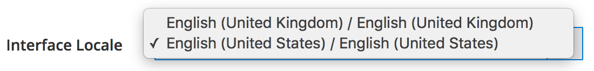

# Detalhes técnicos

Este tópico discute detalhes de implementação técnica sobre a implantação de pipeline no Commerce 2.2 e versões posteriores. As melhorias podem ser divididas nas seguintes áreas:

- [Gerenciamento de configuração](#configuration-management)
- [Alterações no Administrador](#changes-in-the-admin)
- [Instalar e remover o cron](#install-and-remove-cron)

Este tópico também discute o [fluxo de trabalho recomendado](#recommended-workflow) para implantação de pipeline e fornece alguns exemplos para ajudar você a entender como funciona.

Antes de começar, revise o [Pré-requisitos para seus sistemas de desenvolvimento, compilação e produção](../deployment/prerequisites.md).

## Gerenciamento de configuração

Para permitir que você sincronize e mantenha a configuração dos sistemas de desenvolvimento e produção, use o esquema de substituição a seguir.


Como mostra o diagrama, os valores de configuração são usados na seguinte ordem:

1. As variáveis de ambiente, se existirem, substituirão todos os outros valores.
1. Nos arquivos de configuração compartilhados `env.php` e `config.php`. Valores em `env.php` substituir valores em `config.php`.
1. De valores armazenados no banco de dados.
1. Se não houver valor em nenhuma dessas origens, o valor default ou NULL será usado.

### Gerenciar a configuração compartilhada

A configuração compartilhada é armazenada no `app/etc/config.php`, que deve estar no controle de origem.

Defina a configuração compartilhada no Administrador em sua infraestrutura de desenvolvimento (ou Adobe Commerce on cloud) _integração_) e gravar a configuração no `config.php` usando o [`magento app:config:dump` comando](../cli/export-configuration.md).

### Gerenciar a configuração específica do sistema

A configuração específica do sistema é armazenada no `app/etc/env.php`, que deve _não_ estar no controle de origem.

Defina a configuração específica do sistema no Admin em seu sistema de desenvolvimento (ou Adobe Commerce na integração da infraestrutura em nuvem) e grave a configuração em `env.php` usando o [`magento app:config:dump` comando](../cli/export-configuration.md).

Esse comando também grava configurações confidenciais em `env.php`.

### Gerenciar a configuração confidencial

A configuração confidencial também é armazenada no `app/etc/env.php`.

Você pode gerenciar a configuração confidencial de qualquer uma das seguintes maneiras:

- Variáveis de ambiente
- Salvar a configuração confidencial em `env.php` em seu sistema de produção usando o [`magento config:set:sensitive` comando](../cli/set-configuration-values.md)

### Configurações bloqueadas no Admin

Qualquer configuração em `config.php` ou `env.php` são bloqueados no Admin; ou seja, essas configurações não podem ser alteradas no Admin.
Use o [`magento config:set` ou `magento config:set --lock`](../cli/export-configuration.md#config-cli-config-set) para alterar as configurações no campo `config.php` ou `env.php` arquivos.

## O administrador do Commerce

O Administrador exibe o seguinte comportamento enquanto está no modo de produção:

- Não é possível ativar ou desativar os tipos de cache no Administrador
- As configurações do desenvolvedor não estão disponíveis (**Lojas** > Configurações > **Configuração** > Avançado > **Desenvolvedor**), incluindo:

   - Reduza CSS, JavaScript e HTML
   - Mesclar CSS e JavaScript
   - Compilação LESS do lado do servidor ou do lado do cliente
   - Traduções integradas
   - Conforme discutido anteriormente, qualquer definição de configuração em `config.php` ou `env.php` O está bloqueado e não pode ser editado no Administrador.
   - Você pode alterar a localidade do administrador somente para idiomas usados por temas implantados

     A figura a seguir mostra um exemplo de **Configuração da conta** > **Localidade da interface** no Administrador mostrando apenas dois locais implantados:

     

- Não é possível alterar as configurações de local de nenhum escopo usando o Administrador.

  Recomendamos fazer essas alterações antes de alternar para o modo de Produção.

  Você ainda pode configurar o local usando variáveis de ambiente ou o `config:set` Comando CLI com o caminho `general/locale/code`.

## Instalar e remover o cron

Na versão 2.2, pela primeira vez, ajudamos você a configurar o trabalho cron fornecendo o [`magento cron:install` comando](../cli/configure-cron-jobs.md). Este comando configura um crontab como o usuário que executa o comando.

Além disso, você pode remover o crontab usando o `magento cron:remove` comando.

## Fluxo de trabalho de implantação de pipeline recomendado

O diagrama a seguir mostra como recomendamos usar a implantação de pipeline para gerenciar a configuração.


### Sistema de desenvolvimento

No sistema de desenvolvimento, você faz alterações de configuração no Administrador e gera a configuração compartilhada, `app/etc/config.php` e a configuração específica do sistema, `app/etc/env.php`. Verifique o código comercial e a configuração compartilhada no controle do código-fonte e envie-o para o servidor de compilação.

Você também deve instalar extensões e personalizar o código do Commerce no sistema de desenvolvimento.

Em seu sistema de desenvolvimento:

1. Defina a configuração no Admin.

1. Use o `magento app:config:dump` comando para gravar a configuração no sistema de arquivos.

   - `app/etc/config.php` é a configuração compartilhada, que contém todas as configurações _exceto_ configurações confidenciais e específicas do sistema. Este arquivo deve estar no controle do código-fonte.
   - `app/etc/env.php` é a configuração específica do sistema, que contém configurações exclusivas de um sistema específico (por exemplo, nomes de host e números de porta). Esse arquivo deve _não_ estar no controle de origem.

1. Adicione o código modificado e a configuração compartilhada ao controle do código-fonte.

1. Para remover o código php gerado e os arquivos de ativos estáticos enquanto em desenvolvimento, execute os seguintes comandos:

   ```bash
   rm -r var/view_preprocessed/*
   rm -r pub/static/*/*
   rm -r generated/*/*
   ```

Depois de executar os comandos para limpar os ativos, o Commerce gera arquivos de trabalho.

>[!WARNING]
>
>Tenha cuidado com a abordagem acima. Excluir o `.htacces`s arquivo no `generated` ou `pub` pasta pode causar problemas.

### Criar sistema

O sistema de compilação compila o código e gera arquivos de exibição estáticos para temas registrados no Commerce. Ela não precisa de uma conexão com o banco de dados do Commerce; ela precisa apenas da base de código do Commerce.

No sistema de compilação:

1. Extrair o arquivo de configuração compartilhado do controle do código-fonte.
1. Use o `magento setup:di:compile` para compilar o código.
1. Use o `magento setup:static-content:deploy -f` comando para atualizar arquivos de visualização de arquivo estáticos.
1. Verifique as atualizações no controle de origem.

>[!INFO]
>
>Consulte [Estratégias de implantação para arquivos de visualização estáticos](../cli/static-view-file-strategy.md).

### Sistema de produção

No sistema de produção (ou seja, na loja em tempo real), você extrai ativos gerados e atualizações de código do controle de origem e define configurações confidenciais e específicas do sistema usando a linha de comando ou variáveis de ambiente.

Em seu sistema de produção:

1. Iniciar modo de manutenção.
1. Obter atualizações de código e configuração do controle do código-fonte.
1. Se você usar o Adobe Commerce, interrompa os trabalhadores em fila.
1. Use o `magento app:config:import` comando para importar alterações de configuração no sistema de produção.
1. Se você instalou componentes que alteraram o esquema do banco de dados, execute `magento setup:upgrade --keep-generated` para atualizar o esquema e os dados do banco de dados, preservando os arquivos estáticos gerados.
1. Para definir configurações específicas do sistema, use `magento config:set` ou variáveis de ambiente.
1. Para definir configurações confidenciais, use o `magento config:sensitive:set` ou variáveis de ambiente.
1. Clean (também conhecido como _liberar_) o cache.
1. Encerrar modo de manutenção.

## Comandos de gerenciamento de configuração

Fornecemos os seguintes comandos para ajudá-lo a gerenciar a configuração:

- [`magento app:config:dump`](../cli/export-configuration.md) para gravar as definições de configuração do administrador em `config.php` e `env.php` (exceto para configurações confidenciais)
- [`magento config:set`](../cli/set-configuration-values.md) para definir os valores das configurações específicas do sistema no sistema de produção.

  Use o opcional `--lock` opção para bloquear a opção no Administrador (ou seja, tornar a configuração não editável). Se uma configuração já estiver bloqueada, use o `--lock` opção para alterar a configuração.

- [`magento config:sensitive:set`](../cli/set-configuration-values.md) para definir os valores de configurações confidenciais no sistema de produção.
- [`magento app:config:import`](../cli/import-configuration.md) para importar alterações de configuração do `config.php` e `env.php` ao sistema de produção.

## Exemplos de gerenciamento de configuração

Esta seção mostra exemplos de gerenciamento da configuração para que você possa ver como as alterações são feitas no `config.php` e `env.php`.

### Alterar o local padrão

Esta seção mostra a alteração feita no `config.php` quando você altera a unidade de peso padrão usando a variável Admin (**Lojas** > Configurações > **Configuração** > Geral > **Geral** > **Opções de localidade**).

Depois de fazer a alteração no Administrador, execute `bin/magento app:config:dump` para gravar o valor em `config.php`. O valor é gravado na variável `general` matriz em `locale` como o seguinte trecho de `config.php` mostra:

```php
'general' =>
    array (
        'locale' =>
        array (
            'code' => 'en_US',
            'timezone' => 'America/Chicago',
            'weight_unit' => 'kgs'
        )
    )
```

### Alterar várias definições de configuração

Esta seção discute as seguintes alterações de configuração:

- Adição de uma visualização de site, loja e loja (**Lojas** > Configurações > **Todas as lojas**)
- Alteração do domínio de email padrão (**Lojas** > Configurações > **Configuração** > Clientes > **Configuração do cliente**)
- Definição de Nome de Usuário e Senha da API do PayPal (**Lojas** > Configurações > **Configuração** > Vendas > **Métodos de pagamento** > **PayPal** > **Configurações necessárias do PayPal**)

Depois de fazer a alteração no Administrador, execute `bin/magento app:config:dump` no sistema de desenvolvimento. Desta vez, nem todas as alterações foram gravadas em `config.php`; na verdade, somente a visualização do site, da loja e da loja são gravadas nesse arquivo, conforme mostrado nos trechos a seguir.

### config.php

`config.php` contém:

- Alterações na exibição do site, da loja e da loja.
- Configurações do mecanismo de pesquisa não específicas do sistema
- Configurações não confidenciais do PayPal
- Comentários que informam você sobre configurações confidenciais que foram omitidas de `config.php`

`websites` matriz:

```php
      'new' =>
      array (
        'website_id' => '2',
        'code' => 'new',
        'name' => 'New website',
        'sort_order' => '0',
        'default_group_id' => '2',
        'is_default' => '0',
      ),
```

`groups` matriz:

```php
      2 =>
      array (
        'group_id' => '2',
        'website_id' => '2',
        'code' => 'newstore',
        'name' => 'New store',
        'root_category_id' => '2',
        'default_store_id' => '2',
      ),
```

`stores` matriz:

```php
     'newview' =>
      array (
        'store_id' => '2',
        'code' => 'newview',
        'website_id' => '2',
        'group_id' => '2',
        'name' => 'New store view',
        'sort_order' => '0',
        'is_active' => '1',
      ),
```

`payment` matriz:

```php
      'payment' =>
      array (
        'paypal_express' =>
        array (
          'active' => '0',
          'in_context' => '0',
          'title' => 'PayPal Express Checkout',
          'sort_order' => NULL,
          'payment_action' => 'Authorization',
          'visible_on_product' => '1',
          'visible_on_cart' => '1',
          'allowspecific' => '0',
          'verify_peer' => '1',
          'line_items_enabled' => '1',
          'transfer_shipping_options' => '0',
          'solution_type' => 'Mark',
          'require_billing_address' => '0',
          'allow_ba_signup' => 'never',
          'skip_order_review_step' => '1',
        ),
```

### env.php

A definição de configuração específica do sistema de domínio de email padrão é gravada em `app/etc/env.php`.

As configurações do PayPal não são gravadas em nenhum arquivo porque `bin/magento app:config:dump` O comando não grava configurações confidenciais. Você deve definir as configurações do PayPal no sistema de produção usando os seguintes comandos:

```bash
bin/magento config:sensitive:set paypal/wpp/api_username <username>
```

```bash
bin/magento config:sensitive:set paypal/wpp/api_password <password>
```
