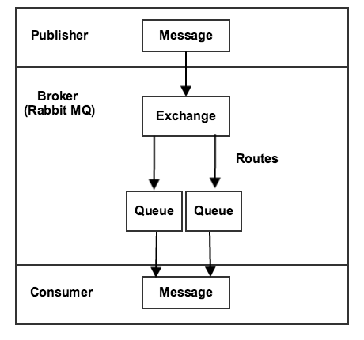

# Visão geral das filas de mensagens

A Estrutura da Fila de Mensagens (MQF) é um sistema que permite uma [módulo](https://glossary.magento.com/module) para publicar mensagens em filas. Também define a variável [consumidores](consumers.md) que receberá as mensagens de forma assíncrona. O MQF usa [[!DNL RabbitMQ]](https://www.rabbitmq.com) como o corretor de mensagens, que fornece uma plataforma escalável para enviar e receber mensagens. Também inclui um mecanismo para armazenar mensagens não entregues. [!DNL RabbitMQ] é baseado na especificação AMQP (Advanced Message Queuing Protocol) 0.9.1.

O diagrama a seguir ilustra a Estrutura da Fila de Mensagens:

- A [editor](https://glossary.magento.com/publisher-subscriber-pattern) é um componente que envia mensagens para uma troca. Ele sabe para qual troca publicar e o formato das mensagens que envia.

- Uma troca recebe mensagens de editores e as envia para filas. Embora [!DNL RabbitMQ] O suporta vários tipos de trocas, o Commerce utiliza apenas trocas de tópicos. Um tópico inclui uma chave de roteamento, que contém sequências de texto separadas por pontos. O formato de um nome de tópico é `string1.string2`: por exemplo, `customer.created` ou `customer.sent.email`.

   O broker permite usar curingas ao definir regras para o encaminhamento de mensagens. Você pode usar um asterisco (`*`) para substituir _one_ sequência ou um sinal de número (`#`) para substituir 0 ou mais strings. Por exemplo, `customer.*` filtra em `customer.create` e `customer.delete`, mas não `customer.sent.email`. No entanto `customer.#` filtra em `customer.create`,  `customer.delete`e `customer.sent.email`.

- Uma fila é um buffer que armazena mensagens.

- Um consumidor recebe mensagens. Ele sabe qual fila consumir. Ele pode mapear processadores da mensagem para uma fila específica.

Um sistema básico de fila de mensagens também pode ser configurado sem usar [!DNL RabbitMQ]. Neste sistema, um MySQL [adaptador](https://glossary.magento.com/adapter) armazena mensagens no banco de dados. Três tabelas de banco de dados (`queue`, `queue_message`e `queue_message_status`) gerencie a carga de trabalho da fila de mensagens. Empregos ativos garantem que os consumidores possam receber mensagens. Essa solução não é muito escalável. [!DNL RabbitMQ] deve ser usada sempre que possível.
