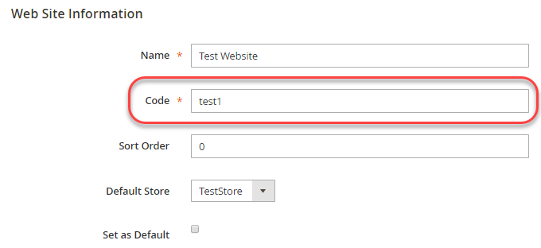

# Substituir configurações

Este tópico discute como derivar um nome de variável de ambiente sabendo um caminho de configuração. Você pode substituir as configurações do Adobe Commerce usando variáveis de ambiente. Por exemplo, você pode substituir o valor do URL ativo de um processador de pagamento em seu sistema de produção.

Você pode substituir o valor de _any_ configuração usando variáveis de ambiente; no entanto, o Adobe recomenda que você mantenha configurações consistentes usando o arquivo de configuração compartilhado, `config.php`e o arquivo de configuração específico do sistema, `env.php`, como discutido em [Visão geral da implantação](../deployment/overview.md).

>[!TIP]
>
>Confira o [Configurar ambientes](https://experienceleague.adobe.com/docs/commerce-cloud-service/user-guide/configure/env/stage/variables-intro.html) no tópico _Guia do Commerce on Cloud Infrastructure_.

## Variáveis de ambiente

Um nome de variável de ambiente consiste em seu escopo seguido pelo caminho de configuração em um formato específico. As seções a seguir discutem como determinar um nome de variável com mais detalhes.

Você pode usar variáveis para qualquer um dos seguintes:

- [Valores sensíveis](config-reference-sens.md) deve ser definido usando as variáveis de ambiente ou a variável [`magento config:sensitive:set`](../cli/set-configuration-values.md) comando.
- Valores específicos do sistema devem ser definidos usando:

   - Variáveis de ambiente
   - O [`magento config:set`](../cli/set-configuration-values.md) comando
   - O Administrador seguido pela variável [`magento app:config:dump` comando](../cli/export-configuration.md)

Os caminhos de configuração podem ser encontrados em:

- [Referência de caminhos de configuração sensíveis e específicos do sistema](config-reference-sens.md)
- [Referência de caminhos de configuração de pagamento](config-reference-payment.md)
- [Referência de caminhos de configuração da extensão do Commerce B2B](config-reference-b2b.md)
- [Referência de outros caminhos de configuração](config-reference-general.md)

### Nomes de variáveis

O formato geral dos nomes de variáveis das configurações do sistema é o seguinte:

`<SCOPE>__<SYSTEM__VARIABLE__NAME>`

`<SCOPE>` pode ser:

- Escopo global (ou seja, a configuração global para _all_ escopos)

   As variáveis de escopo global têm o seguinte formato:

   `CONFIG__DEFAULT__<SYSTEM__VARIABLE__NAME>`

- Um escopo específico (ou seja, a configuração afeta apenas uma exibição de loja ou site especificado)

   As variáveis de escopo da exibição de armazenamento, por exemplo, têm o seguinte formato:

   `CONFIG__STORES__ <STORE_VIEW_CODE>__<SYSTEM__VARIABLE__NAME>`

   Para obter mais informações sobre escopos, consulte:

   - [Etapa 1: Localizar o valor do escopo de visualização do site ou da loja](#step-1-find-the-website-or-store-view-scope-value)
   - [Tópico do Guia do usuário do Commerce sobre escopo](https://docs.magento.com/user-guide/configuration/scope.html)
   - [Referência rápida do escopo](https://docs.magento.com/user-guide/stores/store-scope-reference.html)

`<SYSTEM__VARIABLE__NAME>` é o caminho de configuração com caracteres sublinhados duplos substituídos por `/`. Para obter mais informações, consulte [Etapa 2: Definir variáveis do sistema](#step-2-set-global-website-or-store-view-variables).

### Formato da variável

`<SCOPE>` é separado de `<SYSTEM__VARIABLE__NAME>` por dois caracteres sublinhados.

`<SYSTEM__VARIABLE__NAME>` é derivado de um _caminho da configuração_, que é um `/` string delimitada que identifica exclusivamente uma configuração específica. Substituir cada `/` no caminho de configuração com dois caracteres sublinhados para criar a variável do sistema.

Se um caminho de configuração contiver um caractere sublinhado, o caractere sublinhado permanecerá na variável .

Uma lista completa de caminhos de configuração pode ser encontrada em:

- [Referência de caminhos de configuração sensíveis e específicos do sistema](config-reference-sens.md)
- [Referência de caminhos de configuração de pagamento](config-reference-payment.md)
- [Referência de caminhos de configuração da extensão do Commerce Enterprise B2B](config-reference-b2b.md)
- [Referência de outros caminhos de configuração](config-reference-general.md)

## Etapa 1: Localizar o valor do escopo de visualização do site ou da loja

Esta seção discute como encontrar e definir valores de configuração do sistema por _escopo_ (exibição de loja ou site). Para definir variáveis de escopo global, consulte [Etapa 2: Definir variáveis de exibição globais, de site ou de armazenamento](#step-2-set-global-website-or-store-view-variables).

Os valores de escopo vêm do `store`, `store_group`e `store_website` tabelas.

- O `store` a tabela especifica nomes e códigos de exibição de armazenamento
- O `store_website` a tabela especifica os nomes e códigos do site

Também é possível encontrar os valores do código usando o Administrador.

Como ler a tabela:

- `Path in Admin` column

   Os valores antes da vírgula são caminhos na navegação do Administrador. Os valores após a vírgula são opções no painel direito.

- `Variable name` coluna é o nome da variável de ambiente correspondente.

   Se desejar, você tem a opção de especificar valores do sistema para esses parâmetros de configuração como variáveis de ambiente.

   - O nome da variável inteira é sempre ALL CAPS
   - Inicie um nome de variável com `CONFIG__` (observe dois caracteres sublinhados)
   - Você pode encontrar a variável `<STORE_VIEW_CODE>` ou `<WEBSITE_CODE>` parte de um nome de variável no banco de dados Admin ou Commerce, conforme indicado nas seções a seguir.
   - Você pode encontrar `<SYSTEM__VARIABLE__NAME>` como discutido no [Etapa 2: Definir variáveis de exibição globais, de site ou de armazenamento](#step-2-set-global-website-or-store-view-variables).

### Encontrar um site ou um escopo de exibição de loja no Administrador

A tabela a seguir resume como encontrar o valor de exibição do site ou da loja no Administrador.

| Descrição | Caminho no Admin | Nome da variável |
|--------------|--------------|----------------------|
| Criar, editar, excluir visualizações de loja | **[!UICONTROL Stores]** > **[!UICONTROL All Stores]** | `CONFIG__STORES__<STORE_VIEW_CODE>__<SYSTEM__VARIABLE__NAME>` |
| Criar, editar, excluir sites | **[!UICONTROL Stores]** > **[!UICONTROL All Store]s** | `CONFIG__WEBSITES__<WEBSITE_CODE>__<SYSTEM__VARIABLE__NAME>` |

Por exemplo, para localizar um site ou valor de escopo de exibição de loja no Administrador:

1. Faça logon em Admin como um usuário autorizado a visualizar sites.
1. Clique em **[!UICONTROL Stores]** > **[!UICONTROL All Store]s**.
1. Clique no nome de um site ou exibição de loja.

   O painel direito é exibido de forma semelhante ao seguinte.

   

1. O nome do escopo é exibido na variável **[!UICONTROL Code]** campo.
1. Continue com [Etapa 2: Definir variáveis de exibição globais, de site ou de armazenamento](#step-2-set-global-website-or-store-view-variables).

### Encontrar um escopo de visualização de site ou armazenamento no banco de dados

Para obter esses valores do banco de dados:

1. Faça logon no sistema de desenvolvimento como proprietário do sistema de arquivos, caso ainda não o tenha feito.
1. Digite o seguinte comando:

   ```bash
   mysql -u <database-username> -p
   ```

1. Na `mysql>` , insira os seguintes comandos na ordem mostrada:

   ```shell
   use <database-name>;
   ```

1. Use as seguintes queries SQL para localizar os valores relevantes:

   ```shell
   SELECT * FROM STORE;
   SELECT * FROM STORE_WEBSITE;
   ```

   Uma amostra:

   ```shell
   mysql> SELECT * FROM STORE_WEBSITE;
   +------------+-------+--------------+------------+------------------+------------+
   | website_id | code  | name         | sort_order | default_group_id | is_default |
   +------------+-------+--------------+------------+------------------+------------+
   |          0 | admin | Admin        |          0 |                0 |          0 |
   |          1 | base  | Main Website |          0 |                1 |          1 |
   |          2 | test1 | Test Website |          0 |                3 |          0 |
   +------------+-------+--------------+------------+------------------+------------+
   ```

1. Use o valor da variável `code` coluna como o nome do escopo, não a `name` valor.

   Por exemplo, para definir uma variável de configuração para Testar site, use o seguinte formato:

   ```shell
   CONFIG__WEBSITES__TEST1__<SYSTEM__VARIABLE__NAME>
   ```

   em que `<SYSTEM__VARIABLE__NAME>` vem da próxima seção.

## Etapa 2: Definir variáveis de exibição globais, de site ou de armazenamento

Esta seção discute como definir variáveis do sistema.

- Para definir valores para o escopo global (ou seja, todos os sites, lojas e visualizações de armazenamento), inicie o nome da variável com `CONFIG__DEFAULT__`.

- Para definir um valor para uma exibição de loja ou site específico, inicie o nome da variável, como discutido em [Etapa 1: Localizar o valor do escopo](#step-1-find-the-website-or-store-view-scope-value):

   - `CONFIG__WEBSITES`
   - `CONFIG__STORES`

- A última parte do nome da variável é o caminho de configuração, que é exclusivo para cada configuração.

[Veja alguns exemplos](#examples).

A tabela a seguir mostra algumas variáveis de amostra.

| Descrição | Caminho em Admin (omissão) **Lojas** > **Configurações** > **Configuração**) | Nome da variável |
|--------------|--------------|----------------------|
| Nome do host do servidor Elasticsearch | Catálogo > **Catálogo**, **Nome do host do servidor Elasticsearch** | `<SCOPE>__CATALOG__SEARCH__ELASTICSEARCH_SERVER_HOSTNAME` |
| Porta do servidor Elasticsearch | Catálogo > **Catálogo**, **Porta do Servidor Elasticsearch** | `<SCOPE>__CATALOG__SEARCH__ELASTICSEARCH_SERVER_PORT` |
| Origem do país de expedição | Vendas > **Configurações de envio** | `<SCOPE>__SHIPPING__ORIGIN__COUNTRY_ID` |
| URL de administrador personalizado | Avançado > **Administrador** | `<SCOPE>__ADMIN__URL__CUSTOM` |
| Caminho de administração personalizado | Avançado > **Administrador** | `<SCOPE>__ADMIN__URL__CUSTOM_PATH` |

## Exemplos

Esta seção mostra como localizar valores de algumas variáveis de amostra.

### Nome do host do servidor Elasticsearch

Para localizar o nome da variável para minificação de HTML global:

1. Determine o escopo.

   É o escopo global, então o nome da variável começa com `CONFIG__DEFAULT__`

1. O restante do nome da variável é `CATALOG__SEARCH__ELASTICSEARCH_SERVER_HOSTNAME`.

   **Resultado**: O nome da variável é `CONFIG__DEFAULT__CATALOG__SEARCH__ELASTICSEARCH_SERVER_HOSTNAME`

### Origem do país de expedição

Para localizar o nome da variável para a origem do país de entrega:

1. Determine o escopo.

   Encontre o escopo na [banco de dados](#find-a-website-or-store-view-scope-in-the-database) conforme discutido na Etapa 1: Encontre o valor do escopo de visualização do site ou do armazenamento. (Também é possível encontrar o valor em Admin , como mostrado na guia [na Etapa 2: Definir variáveis de exibição globais, de site ou de armazenamento](#step-2-set-global-site-or-store-view-variables.

   Por exemplo, o escopo pode ser `CONFIG__WEBSITES__DEFAULT`.

1. O restante do nome da variável é `SHIPPING__ORIGIN__COUNTRY_ID`.

   **Resultado**: O nome da variável é `CONFIG__WEBSITES__DEFAULT__SHIPPING__ORIGIN__COUNTRY_ID`

## Como usar variáveis de ambiente

Defina valores de configuração como variáveis usando PHP&#39;s [`$_ENV`](https://php.net/manual/en/reserved.variables.environment.php) matriz associada. Você pode definir os valores em qualquer script PHP que seja executado quando o Commerce for executado.

>[!TIP]
>
>Configuração de valores de variável em `index.php` ou `pub/index.php` nem sempre funciona conforme o esperado, pois é possível usar pontos de entrada de aplicativos diferentes dependendo da configuração do servidor da Web. Ao `$_ENV` nas diretivas `app/bootstrap.php` , independentemente dos diferentes pontos de entrada do aplicativo, a variável `$_ENV` as diretivas sempre são executadas desde que a variável `app/bootstrap.php` é carregado como parte da arquitetura do Commerce.

Um exemplo de definição de dois `$_ENV` valores a seguir:

```php
$_ENV['CONFIG__DEFAULT__CATALOG__SEARCH__ELASTICSEARCH_SERVER_HOSTNAME'] = 'http://search.example.com';
$_ENV['CONFIG__DEFAULT__GENERAL__STORE_INFORMATION__MERCHANT_VAT_NUMBER'] = '1234';
```

Um exemplo passo a passo é mostrado em [Definir valores de configuração usando variáveis de ambiente](../deployment/example-environment-variables.md).

>[!WARNING]
>
>- Para usar valores definidos na variável `$_ENV` matriz, você deve definir `variables_order = "EGPCS"`(Ambiente, Get, Post, Cookie e Servidor) em seu `php.ini` arquivo. Para obter detalhes, consulte [documentação PHP](https://www.php.net/manual/en/ini.core.php).
>
>- Para o Adobe Commerce na infraestrutura de nuvem, se você estiver tentando substituir as configurações usando o [Interface da Web do projeto](https://experienceleague.adobe.com/docs/commerce-cloud-service/user-guide/project/overview.html#configure-the-project), você deve anexar o nome da variável como `env:`. Por exemplo:
>
>
