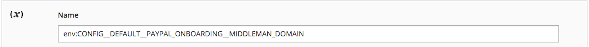

# Substituir definições de configuração

Este tópico discute como derivar um nome de variável de ambiente conhecendo um caminho de configuração. Você pode substituir as definições de configuração do Adobe Commerce usando variáveis de ambiente. Por exemplo, você pode substituir o valor do URL ativo de um processador de pagamento em seu sistema de produção.

É possível substituir o valor de _qualquer_ configuração usando variáveis de ambiente; no entanto, o Adobe recomenda que você mantenha configurações consistentes usando o arquivo de configuração compartilhado, `config.php`e o arquivo de configuração específico do sistema, `env.php`, conforme discutido em [Visão geral da implantação](../deployment/overview.md).

>[!TIP]
>
>Confira o [Configurar ambientes](https://experienceleague.adobe.com/docs/commerce-cloud-service/user-guide/configure/env/stage/variables-intro.html) tópico no _Guia do Commerce na infraestrutura em nuvem_.

## Variáveis de ambiente

Um nome de variável de ambiente consiste em seu escopo seguido por seu caminho de configuração em um formato específico. As seções a seguir discutem como determinar um nome de variável com mais detalhes.

É possível usar variáveis para qualquer um dos seguintes:

- [Valores sensíveis](config-reference-sens.md) deve ser definido usando as variáveis de ambiente ou a variável [`magento config:sensitive:set`](../cli/set-configuration-values.md) comando.
- Os valores específicos do sistema devem ser definidos usando:

   - Variáveis de ambiente
   - A variável [`magento config:set`](../cli/set-configuration-values.md) comando
   - O Administrador seguido pela [`magento app:config:dump` comando](../cli/export-configuration.md)

Os caminhos de configuração podem ser encontrados em:

- [Referência de caminhos de configuração sensíveis e específicos do sistema](config-reference-sens.md)
- [Referência de caminhos de configuração de pagamento](config-reference-payment.md)
- [Referência de caminhos de configuração da extensão B2B do Commerce](config-reference-b2b.md)
- [Referência a outros caminhos de configuração](config-reference-general.md)

### Nomes de variáveis

O formato geral dos nomes das variáveis de configurações do sistema é o seguinte:

`<SCOPE>__<SYSTEM__VARIABLE__NAME>`

`<SCOPE>` pode ser:

- Escopo global (ou seja, a configuração global para _all_ escopos)

  As variáveis de escopo globais têm o seguinte formato:

  `CONFIG__DEFAULT__<SYSTEM__VARIABLE__NAME>`

- Um escopo específico (ou seja, a configuração afeta apenas uma exibição de loja ou site especificado)

  As variáveis de escopo de visualização de armazenamento, por exemplo, têm o seguinte formato:

  `CONFIG__STORES__ <STORE_VIEW_CODE>__<SYSTEM__VARIABLE__NAME>`

  Para obter mais informações sobre escopos, consulte:

   - [Etapa 1: Localizar o valor do escopo de exibição do site ou da loja](#step-1-find-the-website-or-store-view-scope-value)
   - [Tópico do Guia do usuário do Commerce sobre escopo](https://docs.magento.com/user-guide/configuration/scope.html)
   - [Referência rápida do escopo](https://docs.magento.com/user-guide/stores/store-scope-reference.html)

`<SYSTEM__VARIABLE__NAME>` é o caminho de configuração com caracteres de sublinhado duplo substituído por `/`. Para obter mais informações, consulte [Etapa 2: definir variáveis do sistema](#step-2-set-global-website-or-store-view-variables).

### Formato da variável

`<SCOPE>` é separado de `<SYSTEM__VARIABLE__NAME>` por dois caracteres sublinhados.

`<SYSTEM__VARIABLE__NAME>` é derivado de uma configuração do _caminho de configuração_, que é uma `/` string delimitada que identifica exclusivamente uma configuração específica. Substituir cada `/` caractere no caminho de configuração com dois caracteres sublinhados para criar a variável de sistema.

Se um caminho de configuração contiver um caractere de sublinhado, ele permanecerá na variável.

Uma lista completa de caminhos de configuração pode ser encontrada em:

- [Referência de caminhos de configuração sensíveis e específicos do sistema](config-reference-sens.md)
- [Referência de caminhos de configuração de pagamento](config-reference-payment.md)
- [Referência de caminhos de configuração da extensão B2B do Commerce Enterprise](config-reference-b2b.md)
- [Referência a outros caminhos de configuração](config-reference-general.md)

## Etapa 1: Localizar o valor do escopo de exibição do site ou da loja

Esta seção discute como você pode encontrar e definir valores de configuração do sistema por _escopo_ (visualização de loja ou site). Para definir variáveis de escopo globais, consulte [Etapa 2: definir variáveis de exibição globais, de site ou de loja](#step-2-set-global-website-or-store-view-variables).

Os valores de escopo vêm da variável `store`, `store_group`, e `store_website` tabelas.

- A variável `store` a tabela especifica nomes e códigos de exibição da loja
- A variável `store_website` a tabela especifica nomes e códigos de sites

Você também pode encontrar os valores do código usando o Admin.

Como ler a tabela:

- `Path in Admin` coluna

  Os valores antes da vírgula são caminhos na navegação de Admin. Os valores depois da vírgula são opções no painel direito.

- `Variable name` column é o nome da variável de ambiente correspondente.

  Você tem a opção de especificar valores do sistema para esses parâmetros de configuração como variáveis de ambiente, se desejar.

   - O nome inteiro da variável é sempre ALL CAPS
   - Iniciar um nome de variável com `CONFIG__` (observe dois caracteres sublinhados)
   - Você pode encontrar o `<STORE_VIEW_CODE>` ou `<WEBSITE_CODE>` parte de um nome de variável no banco de dados de Administração ou Comércio, conforme indicado nas seções a seguir.
   - Você pode encontrar `<SYSTEM__VARIABLE__NAME>` conforme discutido em [Etapa 2: definir variáveis de exibição globais, de site ou de loja](#step-2-set-global-website-or-store-view-variables).

### Localizar um escopo de exibição de site ou loja no Administrador

A tabela a seguir resume como localizar o site ou armazenar o valor da exibição no Administrador.

| Descrição | Caminho no administrador | Nome da variável |
|--------------|--------------|----------------------|
| Criar, editar, excluir visualizações de loja | **[!UICONTROL Stores]** > **[!UICONTROL All Stores]** | `CONFIG__STORES__<STORE_VIEW_CODE>__<SYSTEM__VARIABLE__NAME>` |
| Criar, editar, excluir sites | **[!UICONTROL Stores]** > **[!UICONTROL All Store]s** | `CONFIG__WEBSITES__<WEBSITE_CODE>__<SYSTEM__VARIABLE__NAME>` |

Por exemplo, para localizar um site ou um valor de escopo de exibição de loja no campo Admin:

1. Faça logon no Administrador como um usuário autorizado a visualizar sites.
1. Clique em **[!UICONTROL Stores]** > **[!UICONTROL All Store]s**.
1. Clique no nome de um site ou exibição de loja.

   O painel direito é exibido de forma semelhante ao seguinte.

   

1. O nome do escopo é exibido no campo **[!UICONTROL Code]** campo.
1. Continuar com [Etapa 2: definir variáveis de exibição globais, de site ou de loja](#step-2-set-global-website-or-store-view-variables).

### Localizar um escopo de exibição de site ou loja no banco de dados

Para obter esses valores do banco de dados:

1. Faça logon no sistema de desenvolvimento como proprietário do sistema de arquivos, se ainda não tiver feito isso.
1. Digite o seguinte comando:

   ```bash
   mysql -u <database-username> -p
   ```

1. No `mysql>` digite os seguintes comandos na ordem mostrada:

   ```shell
   use <database-name>;
   ```

1. Use as seguintes consultas SQL para localizar os valores relevantes:

   ```shell
   SELECT * FROM STORE;
   SELECT * FROM STORE_WEBSITE;
   ```

   A seguir, há uma amostra:

   ```shell
   mysql> SELECT * FROM STORE_WEBSITE;
   +------------+-------+--------------+------------+------------------+------------+
   | website_id | code  | name         | sort_order | default_group_id | is_default |
   +------------+-------+--------------+------------+------------------+------------+
   |          0 | admin | Admin        |          0 |                0 |          0 |
   |          1 | base  | Main Website |          0 |                1 |          1 |
   |          2 | test1 | Test Website |          0 |                3 |          0 |
   +------------+-------+--------------+------------+------------------+------------+
   ```

1. Use o valor do `code` como o nome do escopo, não a `name` valor.

   Por exemplo, para definir uma variável de configuração para o Site de teste, use o seguinte formato:

   ```shell
   CONFIG__WEBSITES__TEST1__<SYSTEM__VARIABLE__NAME>
   ```

   onde `<SYSTEM__VARIABLE__NAME>` vem da próxima seção.

## Etapa 2: definir variáveis de exibição globais, de site ou de loja

Esta seção discute como definir variáveis do sistema.

- Para definir valores para o escopo global (ou seja, todos os sites, lojas e visualizações de loja), inicie o nome da variável com `CONFIG__DEFAULT__`.

- Para definir um valor para uma exibição de loja ou site específico, inicie o nome da variável, conforme discutido em [Etapa 1: encontrar o valor do escopo](#step-1-find-the-website-or-store-view-scope-value):

   - `CONFIG__WEBSITES`
   - `CONFIG__STORES`

- A última parte do nome da variável é o caminho de configuração, que é exclusivo para cada definição de configuração.

[Veja alguns exemplos](#examples).

A tabela a seguir mostra alguns exemplos de variáveis.

| Descrição | Caminho no Administrador (omissão) **Lojas** > **Configurações** > **Configuração**) | Nome da variável |
|--------------|--------------|----------------------|
| nome de host do servidor Elasticsearch | Catálogo > **Catálogo**, **Nome de host do servidor Elasticsearch** | `<SCOPE>__CATALOG__SEARCH__ELASTICSEARCH_SERVER_HOSTNAME` |
| porta do servidor Elasticsearch | Catálogo > **Catálogo**, **Porta do servidor Elasticsearch** | `<SCOPE>__CATALOG__SEARCH__ELASTICSEARCH_SERVER_PORT` |
| Origem do país de remessa | Vendas > **Configurações de envio** | `<SCOPE>__SHIPPING__ORIGIN__COUNTRY_ID` |
| URL de administração personalizada | Avançado > **Admin** | `<SCOPE>__ADMIN__URL__CUSTOM` |
| Caminho de administração personalizado | Avançado > **Admin** | `<SCOPE>__ADMIN__URL__CUSTOM_PATH` |

## Exemplos

Esta seção mostra como localizar valores de algumas variáveis de exemplo.

### nome de host do servidor Elasticsearch

Para localizar o nome da variável para a minificação do HTML global:

1. Determine o escopo.

   É o escopo global, portanto, o nome da variável começa com `CONFIG__DEFAULT__`

1. O restante do nome da variável é `CATALOG__SEARCH__ELASTICSEARCH_SERVER_HOSTNAME`.

   **Resultado**: o nome da variável é `CONFIG__DEFAULT__CATALOG__SEARCH__ELASTICSEARCH_SERVER_HOSTNAME`

### Origem do país de remessa

Para localizar o nome da variável para a origem do país de entrega:

1. Determine o escopo.

   Encontre o escopo na [banco de dados](#find-a-website-or-store-view-scope-in-the-database) conforme discutido na Etapa 1: Encontre o valor do escopo de exibição do site ou da loja. (Você também pode encontrar o valor no Administrador, como mostrado na [tabela na Etapa 2: definir variáveis de exibição globais, de site ou de loja](#step-2-set-global-website-or-store-view-variables.

   Por exemplo, o escopo pode ser `CONFIG__WEBSITES__DEFAULT`.

1. O restante do nome da variável é `SHIPPING__ORIGIN__COUNTRY_ID`.

   **Resultado**: o nome da variável é `CONFIG__WEBSITES__DEFAULT__SHIPPING__ORIGIN__COUNTRY_ID`

## Como usar variáveis de ambiente

Defina os valores de configuração como variáveis usando o PHP [`$_ENV`](https://php.net/manual/en/reserved.variables.environment.php) matriz associada. Você pode definir os valores em qualquer script PHP executado quando o Commerce é executado.

>[!TIP]
>
>Configuração de valores de variáveis no `index.php` ou `pub/index.php` nem sempre funciona como esperado, pois diferentes pontos de entrada de aplicativo podem ser usados, dependendo da configuração do servidor Web. Ao colocar `$_ENV` diretivas na `app/bootstrap.php` independentemente dos diferentes pontos de entrada do aplicativo, a variável `$_ENV` as diretivas sempre são executadas desde que `app/bootstrap.php` O arquivo é carregado como parte da arquitetura do Commerce.

Um exemplo de configuração de dois `$_ENV` valores:

```php
$_ENV['CONFIG__DEFAULT__CATALOG__SEARCH__ELASTICSEARCH_SERVER_HOSTNAME'] = 'http://search.example.com';
$_ENV['CONFIG__DEFAULT__GENERAL__STORE_INFORMATION__MERCHANT_VAT_NUMBER'] = '1234';
```

Um exemplo passo a passo é mostrado na [Definir valores de configuração usando variáveis de ambiente](../deployment/example-environment-variables.md).

>[!WARNING]
>
>- Para usar os valores definidos na variável `$_ENV` , você deve definir `variables_order = "EGPCS"`(Ambiente, Obter, Publicar, Cookie e Servidor) no seu `php.ini` arquivo. Para obter detalhes, consulte [Documentação do PHP](https://www.php.net/manual/en/ini.core.php).
>
>- Para o Adobe Commerce na infraestrutura em nuvem, se você estiver tentando substituir as definições de configuração usando o [Interface da Web do Project](https://experienceleague.adobe.com/docs/commerce-cloud-service/user-guide/project/overview.html#configure-the-project), você deve anexar o nome da variável como `env:`. Por exemplo:
>
>
