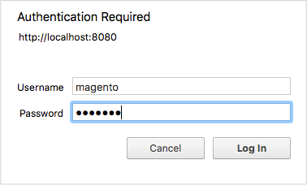

# PHP cron seguro

Este tópico aborda a proteção `pub/cron.php` para impedir que seja usado em uma exploração mal-intencionada. Se você não proteger o cron, qualquer usuário poderá executar o cron para atacar seu aplicativo do Commerce.

O trabalho cron executa várias tarefas agendadas e é uma parte vital da sua configuração do Commerce. As tarefas agendadas incluem, mas não estão limitadas a:

- Reindexação
- Geração de emails
- Gerar informativos
- Gerar mapas de site

>[!INFO]
>
>Consulte [Configurar e executar o cron](../cli/configure-cron-jobs.md#run-cron-from-the-command-line) para obter mais informações sobre grupos cron.

Você pode executar um trabalho cron das seguintes maneiras:

- Usar o [`magento cron:run`](../cli/configure-cron-jobs.md#run-cron-from-the-command-line) comando na linha de comando ou em um crontab
- Acesso ao `pub/cron.php?[group=<name>]` em um navegador da web

>[!INFO]
>
>Não é necessário fazer nada se você usar o [`magento cron:run`](../cli/configure-cron-jobs.md#run-cron-from-the-command-line) comando para executar o cron porque ele usa um processo diferente que já é seguro.

## Cron seguro com Apache

Esta seção discute como proteger o CRON usando autenticação básica HTTP com o Apache. Estas instruções são baseadas no Apache 2.2 com CentOS 6. Para obter mais informações, consulte um dos seguintes recursos:

- [Tutorial de autenticação e autorização do Apache 2.2](https://httpd.apache.org/docs/2.2/howto/auth.html)
- [Tutorial de autenticação e autorização do Apache 2.4](https://httpd.apache.org/docs/2.4/howto/auth.html)

### Criar um arquivo de senha

Por motivos de segurança, você pode localizar o arquivo de senha em qualquer lugar, exceto no docroot do servidor Web. Neste exemplo, estamos armazenando o arquivo de senha em um novo diretório.

Insira os seguintes comandos como um usuário com `root` privilégios:

```bash
mkdir -p /usr/local/apache/password
```

```bash
htpasswd -c /usr/local/apache/password/passwords <username>
```

Onde `<username>` pode ser o usuário do servidor Web ou outro usuário. Neste exemplo, usamos o usuário do servidor Web, mas a escolha do usuário depende de você.

Siga as instruções na tela para criar uma senha para o usuário.

Para adicionar outro usuário ao seu arquivo de senhas, digite o seguinte comando como um usuário com `root` privilégios:

```bash
htpasswd /usr/local/apache/password/passwords <username>
```

### Adicionar usuários para criar um grupo cron autorizado (opcional)

Você pode permitir que mais de um usuário execute o cron adicionando esses usuários ao seu arquivo de senhas, incluindo um arquivo de grupo.

Para adicionar outro usuário ao seu arquivo de senha:

```bash
htpasswd /usr/local/apache/password/passwords <username>
```

Para criar um grupo autorizado, crie um arquivo de grupo em qualquer lugar fora do docroot do servidor Web. O arquivo de grupo especifica o nome do grupo e os usuários no grupo. Neste exemplo, o nome do grupo é `MagentoCronGroup`.

```bash
vim /usr/local/apache/password/group
```

Conteúdo do arquivo:

```text
MagentoCronGroup: <username1> ... <usernameN>
```

### Entrada segura do cron `.htaccess`

Para proteger o CRON no `.htaccess` arquivo:

1. Faça logon no servidor do Commerce como ou alterne para o proprietário do sistema de arquivos.
1. Abertura `<magento_root>/pub/.htaccess` em um editor de texto.

   (Porque `cron.php` está localizado na `pub` diretório, edite este `.htaccess` somente.)

1. _Acesso CRON para um ou mais usuários._ Substituir o existente `<Files cron.php>` diretiva com o seguinte:

   ```conf
   <Files cron.php>
      AuthType Basic
      AuthName "Cron Authentication"
      AuthUserFile /usr/local/apache/password/passwords
      Require valid-user
   </Files>
   ```

1. _Acesso CRON para um grupo._ Substituir o existente `<Files cron.php>` diretiva com o seguinte:

   ```conf
   <Files cron.php>
      AuthType Basic
      AuthName "Cron Authentication"
      AuthUserFile /usr/local/apache/password/passwords
      AuthGroupFile <path to optional group file>
      Require group <name>
   </Files>
   ```

1. Salvar as alterações em `.htaccess` e saia do editor de texto.
1. Continuar com [Verificar se o cron está seguro](#verify-cron-is-secure).

## Cron seguro com Nginx

Esta seção discute como proteger o CRON usando o servidor Web Nginx. Você deve executar as seguintes tarefas:

1. Configurar um arquivo de senha criptografado para o Nginx
1. Modifique sua configuração nginx para fazer referência ao arquivo de senhas ao acessar `pub/cron.php`

### Criar um arquivo de senha

Consulte um dos seguintes recursos para criar um arquivo de senha antes de continuar:

- [Como configurar a autenticação de senha com o Nginx no Ubuntu 14.04 (DigitalOcean)](https://www.digitalocean.com/community/tutorials/how-to-set-up-password-authentication-with-nginx-on-ubuntu-14-04)
- [Autenticação HTTP básica com Nginx (howtoforge)](https://www.howtoforge.com/basic-http-authentication-with-nginx)

### Entrada segura do cron `nginx.conf.sample`

O Commerce fornece uma amostra otimizada do arquivo de configuração nginx pronto para uso. Recomendamos modificá-lo para proteger o cron.

1. Adicione o seguinte ao [`nginx.conf.sample`](https://github.com/magento/magento2/blob/2.4/nginx.conf.sample) arquivo:

   ```conf
   #Securing cron
   location ~ cron\.php$ {
      auth_basic "Cron Authentication";
      auth_basic_user_file /etc/nginx/.htpasswd;
   
      try_files $uri =404;
      fastcgi_pass   fastcgi_backend;
      fastcgi_buffers 1024 4k;
   
      fastcgi_read_timeout 600s;
      fastcgi_connect_timeout 600s;
   
      fastcgi_index  index.php;
      fastcgi_param  SCRIPT_FILENAME  $document_root$fastcgi_script_name;
      include        fastcgi_params;
   }
   ```

1.Reinicie o nginx:

```bash
systemctl restart nginx
```

1. Continuar com [Verificar se o cron está seguro](#verify-cron-is-secure).

## Verificar se o cron está seguro

A maneira mais fácil de verificar se `pub/cron.php` é seguro é verificar se está criando linhas na variável `cron_schedule` tabela de banco de dados após configurar a autenticação de senha. Este exemplo usa comandos SQL para verificar o banco de dados, mas você pode usar qualquer ferramenta que desejar.

>[!INFO]
>
>A variável `default` o cron que você está executando neste exemplo é executado de acordo com o agendamento definido em `crontab.xml`. Alguns trabalhos cron são executados apenas uma vez por dia. Na primeira vez que você executar o cron no navegador, a variável `cron_schedule` a tabela é atualizada, mas subsequente `pub/cron.php` solicitações são executadas de acordo com a programação configurada.

**Para verificar se o cron é seguro**:

1. Faça logon no banco de dados como o usuário do banco de dados do Commerce ou como `root`.

   Por exemplo,

   ```bash
   mysql -u magento -p
   ```

1. Usar o banco de dados do Commerce:

   ```shell
   use <database-name>;
   ```

   Por exemplo,

   ```shell
   use magento;
   ```

1. Excluir todas as linhas da `cron_schedule` tabela de banco de dados:

   ```shell
   TRUNCATE TABLE cron_schedule;
   ```

1. Executar cron de um navegador:

   ```shell
   http[s]://<Commerce hostname or ip>/cron.php?group=default
   ```

   Por exemplo:

   ```shell
   http://magento.example.com/cron.php?group=default
   ```

1. Quando solicitado, digite o nome e a senha de um usuário autorizado. A figura a seguir mostra um exemplo.

   

1. Verifique se as linhas foram adicionadas à tabela:

   ```shell
   SELECT * from cron_schedule;
   
   mysql> SELECT * from cron_schedule;
   +-------------+-----------------------------------------------+---------+----------+---------------------+---------------------+-------------+-------------+
   | schedule_id | job_code                             | status  | messages | created_at        | scheduled_at      | executed_at | finished_at |
   +-------------+-----------------------------------------------+---------+----------+---------------------+---------------------+-------------+-------------+
   |         1 | catalog_product_outdated_price_values_cleanup | pending | NULL    | 2017-09-27 14:24:17 | 2017-09-27 14:24:00 | NULL      | NULL      |
   |         2 | sales_grid_order_async_insert             | pending | NULL    | 2017-09-27 14:24:17 | 2017-09-27 14:24:00 | NULL      | NULL      |
   |         3 | sales_grid_order_invoice_async_insert       | pending | NULL    | 2017-09-27 14:24:17 | 2017-09-27 14:24:00 | NULL      | NULL      |
   |         4 | sales_grid_order_shipment_async_insert      | pending | NULL    | 2017-09-27 14:24:17 | 2017-09-27 14:24:00 | NULL      | NULL      |
   |         5 | sales_grid_order_creditmemo_async_insert     | pending | NULL    | 2017-09-27 14:24:17 | 2017-09-27 14:24:00 | NULL      | NULL      |
   |         6 | sales_send_order_emails                  | pending | NULL    | 2017-09-27 14:24:17 | 2017-09-27 14:24:00 | NULL      | NULL      |
   |         7 | sales_send_order_invoice_emails            | pending | NULL    | 2017-09-27 14:24:17 | 2017-09-27 14:24:00 | NULL      | NULL      |
   |         8 | sales_send_order_shipment_emails           | pending | NULL    | 2017-09-27 14:24:17 | 2017-09-27 14:24:00 | NULL      | NULL      |
   |         9 | sales_send_order_creditmemo_emails         | pending | NULL    | 2017-09-27 14:24:17 | 2017-09-27 14:24:00 | NULL      | NULL      |
   |        10 | newsletter_send_all                     | pending | NULL    | 2017-09-27 14:24:17 | 2017-09-27 14:25:00 | NULL      | NULL      |
   |        11 | captcha_delete_old_attempts               | pending | NULL    | 2017-09-27 14:24:17 | 2017-09-27 14:30:00 | NULL      | NULL      |
   |        12 | captcha_delete_expired_images             | pending | NULL    | 2017-09-27 14:24:17 | 2017-09-27 14:30:00 | NULL      | NULL      |
   |        13 | outdated_authentication_failures_cleanup     | pending | NULL    | 2017-09-27 14:24:17 | 2017-09-27 14:24:00 | NULL      | NULL      |
   |        14 | magento_newrelicreporting_cron            | pending | NULL    | 2017-09-27 14:24:17 | 2017-09-27 14:24:00 | NULL      | NULL      |
   +-------------+-----------------------------------------------+---------+----------+---------------------+---------------------+-------------+-------------+
   14 rows in set (0.00 sec)
   ```

## Executar cron de um navegador da Web

Você pode executar o cron a qualquer momento, como durante o desenvolvimento, usando um navegador da Web.

>[!WARNING]
>
>Fazer _não_ execute o cron em um navegador sem protegê-lo primeiro.

Se estiver usando um servidor Web Apache, você deve remover a restrição da variável `.htaccess` antes de executar o cron em um navegador:

1. Faça logon no servidor do Commerce como um usuário com permissões para gravar no sistema de arquivos do Commerce.
1. Abra qualquer um dos itens a seguir em um editor de texto (dependendo do ponto de entrada para Magento):

   ```text
   <magento_root>/pub/.htaccess
   <magento_root>/.htaccess
   ```

1. Exclua ou comente o seguinte:

   ```conf
   ## Deny access to cron.php
     <Files cron.php>
        order allow,deny
        deny from all
     </Files>
   ```

   Por exemplo,

   ```conf
   ## Deny access to cron.php
      #<Files cron.php>
         # order allow,deny
         # deny from all
      #</Files>
   ```

1. Salve as alterações e saia do editor de texto.

   Você pode executar o cron em um navegador da Web da seguinte maneira:

   ```text
   <your hostname or IP>/<Commerce root>/pub/cron.php[?group=<group name>]
   ```

Onde:

- `<your hostname or IP>` é o nome do host ou endereço IP da sua instalação do Commerce
- `<Commerce root>` é o diretório relativo ao docroot do servidor Web no qual você instalou o software Commerce

   O URL exato que você usa para executar o aplicativo Commerce depende de como você configurou o servidor Web e o host virtual.

- `<group name>` é qualquer nome de grupo cron válido (opcional)

Por exemplo,

```http
https://magento.example.com/magento2/pub/cron.php?group=index
```

>[!INFO]
>
>Você deve executar cron duas vezes: primeiro para descobrir tarefas a serem executadas e novamente para executar as próprias tarefas. Consulte [Configurar e executar o cron](../cli/configure-cron-jobs.md) para obter mais informações sobre grupos cron.
