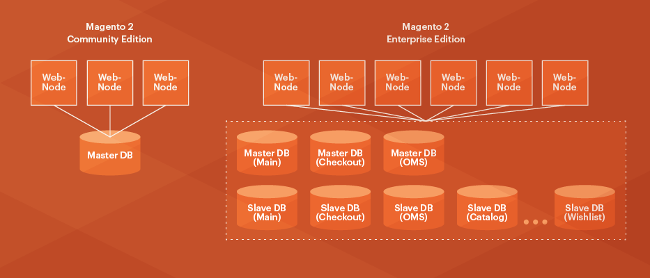

# Visão geral da solução de banco de dados dividido

{{ee-only}}

{{deprecate-split-db}}

O Adobe Commerce oferece várias vantagens de escalabilidade, incluindo a capacidade de usar três bancos de dados principais separados para diferentes áreas funcionais do aplicativo Commerce.

Os dados de check-out, pedidos e produtos podem usar um banco de dados principal separado que pode ser replicado opcionalmente. Essa separação dimensiona independentemente a carga de check-outs do site, atividades de gerenciamento de pedidos, navegação no site e atividades de merchandising, dependendo das suas necessidades. Essas alterações fornecem flexibilidade considerável na maneira como o nível do banco de dados pode ser dimensionado.

>[!INFO]
>
>A Adobe Commerce na infraestrutura em nuvem _não_ oferecem suporte a esse recurso.

A variável `ResourceConnections` A classe fornece a conexão unificada do banco de dados MySQL com o aplicativo Commerce. Para consultas aos bancos de dados principais, implementamos o padrão de banco de dados Command Query Responsibility Segregation (CQRS). Esse padrão lida com a lógica do roteamento de consultas de leitura e gravação para os bancos de dados apropriados. Os desenvolvedores não precisam saber qual configuração está sendo usada e não há conexões separadas de banco de dados de leitura e gravação.

Se você configurar a replicação opcional do banco de dados, obterá as seguintes vantagens:

- Backup de dados
- Análise de dados sem afetar o banco de dados principal
- Escalabilidade

Os bancos de dados MySQL são replicados de forma assíncrona, o que significa que os escravos não precisam ser conectados permanentemente para receber atualizações do principal.

A figura a seguir mostra como esse recurso funciona.

No Magento Open Source, somente um banco de dados principal é usado.

O Adobe Commerce usa três bancos de dados principais e um número configurável de bancos de dados escravos para replicação. O Adobe Commerce tem uma única interface para conexões de banco de dados, resultando em desempenho mais rápido e melhor escalabilidade.

## Opções de configuração

Devido ao modo como a solução de desempenho de banco de dados dividido é projetada, o código personalizado e os componentes instalados _não é possível_ execute um dos procedimentos a seguir:

- Gravar diretamente no banco de dados (em vez disso, você deve usar a interface de banco de dados do Adobe Commerce)
- Usar JOINs que afetam os bancos de dados de vendas ou cotação
- Usar chaves estrangeiras para tabelas no check-out, vendas ou bancos de dados principais

>[!WARNING]
>
>Entre em contato com os desenvolvedores de componentes para verificar se seus componentes fazem qualquer uma das ações anteriores. Em caso afirmativo, você deve escolher apenas um dos seguintes:
>
>- Peça aos desenvolvedores de componentes que atualizem seus componentes.
>- Usar os componentes como estão _sem_ a solução de banco de dados dividido.
>- Remova os componentes para que você possa usar a solução de banco de dados dividido.

Isso também significa que você pode:

- Configurar a solução de banco de dados dividido _antes_ colocar o Commerce em produção.

   A Adobe recomenda configurar bancos de dados divididos assim que possível após a instalação do software Commerce.

- [Configurar manualmente](multi-master-manual.md) a solução de banco de dados dividido.

   Você deve executar essa tarefa se já tiver instalado componentes ou se o Commerce já estiver em produção. (_Não_ atualizar um sistema de produção; fazer as atualizações em um sistema de desenvolvimento e sincronizar as alterações depois de testá-las.)

   >[!WARNING]
   >
   >Você deve fazer backup das duas instâncias adicionais do banco de dados manualmente. O Commerce faz backup somente da instância do banco de dados principal. A variável [`magento setup:backup --db`](../../installation/tutorials/backup.md) O comando e as opções de Admin não fazem backup das tabelas adicionais.

## Pré-requisitos

O banco de dados dividido requer que você configure três bancos de dados MySQL principais em qualquer host (todos os três no servidor Commerce, cada banco de dados em um servidor separado e assim por diante). Estas são as _principal_ bancos de dados e são usados da seguinte maneira:

- Um banco de dados principal para tabelas de check-out
- Um banco de dados principal para tabelas de vendas (também conhecido como _Sistema do Order Management_ ou _OMS_, tabelas)
- Um banco de dados principal para o restante das tabelas de aplicativos do Commerce 2

Além disso, você pode, opcionalmente, configurar qualquer número de _slave_ bancos de dados que servem como balanceadores de carga e backups.

Este guia discute como configurar somente os bancos de dados principais. Fornecemos exemplos de configurações e referências para que você possa configurar bancos de dados subordinados, se desejar.

Neste guia, os três bancos de dados principais são nomeados como:

- `magento_quote`
- `magento_sales`
- `magento`

(Você pode dar aos seus bancos de dados o nome que desejar.)
