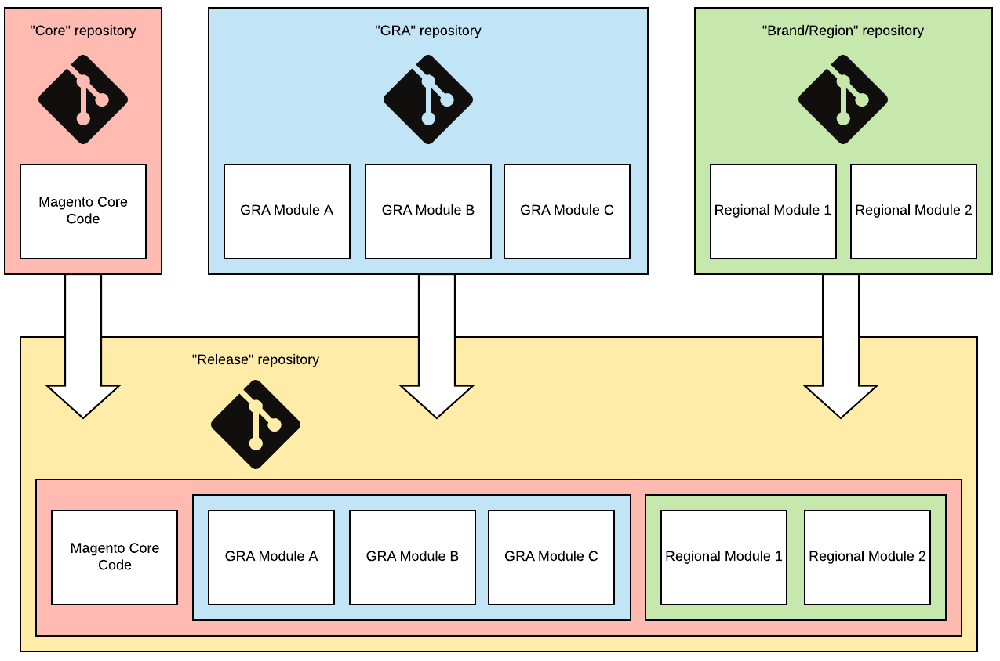

# Exemplos de arquitetura de referência global

Este tópico descreve maneiras comuns de organizar uma [base de código da GRA (arquitetura de referência global)](overview.md). Embora a opção [pacotes separados](#option-1-separate-packages) seja preferida, algumas situações exigem uma das outras opções descritas abaixo.

## Definições

{{$include /help/_includes/gra-definitions.md}}

## Opção 1: pacotes separados

Consulte as práticas recomendadas da [estrutura do projeto do Composer](composer/project-structure.md) para configurar este método.


A maneira mais flexível de gerenciar pacotes do GRA Composer é por meio de metapackages. Os metapackages contêm apenas um arquivo `composer.json`, o que define outras dependências de pacote. Crie metapackages usando repositórios [Private Packagist](https://packagist.com/).

### Projeto principal `composer.json`

```json
{
    "name": "example-client/region-1",
    "description": "Example Client Region 1",
    "type": "project",
    "require": {
        "magento/product-enterprise-edition": "2.3.5",
        "example-client/meta-region-1": "~1.0"
    },
    "minimum-stability": "dev",
    "prefer-stable": true,
    "repositories": [
        {"type": "composer", "url": "https://repo.packagist.com/example-client/"},
        {"packagist.org": false}
    ]
}
```

### `example-client/meta-region-1 composer.json`

```json
{
    "name": "example-client/meta-region-1",
    "description": "Region 1 meta package",
    "type": "metapackage",
    "require": {
        "example-client/meta-gra": "~1.0",
        "example-client/theme-frontend-region1",
        "example-client/language-es-es",
        "ingenico/ogone-client"
    }
}
```

### `example-client/meta-gra composer.json`

```json
{
    "name": "example-client/meta-gra",
    "description": "GRA meta package",
    "type": "metapackage",
    "require": {
        "geoip2/geoip2": "~2.0",
        "magento-services/module-stackify-logger": "~1.1",
        "example-client/sap-connector",
        "example-client/service-chat",
        "example-client/store-locator"
    }
}
```

Cada módulo, pacote de idiomas, tema e biblioteca tem seu próprio repositório Git. Cada repositório Git é sincronizado automaticamente com o repositório do Private Packagist e gera um pacote nele, desde que haja um arquivo `composer.json` na raiz do repositório Git.

## Opções 2: pacotes em massa

Veja abaixo um exemplo de vários módulos dentro de um único pacote do Composer.

Um pacote em massa só pode incluir pacotes do mesmo tipo. Por exemplo, se você tiver vários pacotes para módulos, temas, pacotes de idiomas e bibliotecas do Adobe Commerce, será necessário criar pacotes em massa separados para cada tipo.

A estrutura de arquivos dentro do diretório de fornecedor deve ser semelhante ao exemplo a seguir. No entanto, verifique seu projeto para ver o que deve ser incluído no repositório Git):

```tree
.
└── example-client/
    └── gra/
        └── src/
            ├── SapConnector/
            │   ├── etc/
            │   └── registration.php
            ├── ServiceChat/
            │   ├── etc/
            │   └── registration.php
            ├── StoreLocator/
            │   ├── etc/
            │   └── registration.php
            └── composer.json
```

O arquivo `composer.json` deve ter esta aparência:

```json
{
    "name": "example-client/gra",
    "description": "GRA Modules",
    "require": {
        "magento/magento-composer-installer": "*"
    },
    "type": "magento2-module",
    "autoload": {
        "files": [
            "src/SapConnector/registration.php",
            "src/ServiceChat/registration.php",
            "src/StoreLocator/registration.php"
        ],
        "psr-4": {
            "ExampleClient\\SapConnector\\": "src/SapConnector",
            "ExampleClient\\ServiceChat\\": "src/ServiceChat",
            "ExampleClient\\StoreLocator\\": "src/StoreLocator"
        }
    }
}
```

## Opção 3: Dividir o Git

Essa arquitetura usa quatro repositórios Git para armazenar código:

- `core`: contém a instalação principal do Adobe Commerce. É usado para atualizar versões do Adobe Commerce.
- `GRA`: contém o código GRA. Todos os módulos GRA, pacotes de idiomas, temas de rótulo branco e bibliotecas.
- `brand/region`: cada marca ou região tem seu próprio repositório com apenas o código específico da marca ou da região.
- `release`: todas as opções acima são mescladas neste repositório Git. Somente confirmações de mesclagem são permitidas aqui.



Para configurar essa opção:

1. Crie os quatro tipos de repositório no Git. Crie os repositórios `core` e `GRA` apenas uma vez. Crie um repositório `brand/region` e um repositório `release` para cada marca.

   Nomes de repositório sugeridos:

   - `m2-core`
   - `m2-gra`
   - `m2-region-x`/`m2-brand-x` (por exemplo, `m2-emea`/`m2-adobe`)
   - `m2-release-region-x`/`m2-release-brand-x` (por exemplo, `m2-release-emea`/`m2-release-adobe`)

1. Crie um diretório `release/` e execute o seguinte para criar um histórico Git compartilhado para todos os repositórios.

   ```bash
   git init
   git remote add origin git@github.com:example-client/m2-release-brand-x.git
   git remote add core git@github.com:example-client/m2-core.git
   git remote add gra git@github.com:example-client/m2-gra.git
   git remote add region-x git@github.com:example-client/m2-region-x.git
   touch .gitkeep
   git add .gitkeep
   git commit -m 'initialize repository'
   git push -u origin master
   git push core master
   git push gra master
   git push region-x master
   ```

1. Clonar cada repositório, exceto `core`, em um diretório diferente no computador.

   ```bash
   git clone git@github.com:example-client/m2-release-brand-x.git
   git clone git@github.com:example-client/m2-region-x.git
   git clone git@github.com:example-client/m2-gra.git
   ```

1. [Instalar o Adobe Commerce com o Composer](../../../installation/composer.md). Remova o arquivo `.gitignore`, adicione o controle remoto `core`, adicione e confirme o código e envie por push.

   ```bash
   composer create-project --repository-url=https://repo.magento.com/ magento/project-enterprise-edition m2-core
   cd m2-core
   git init
   rm .gitignore
   git remote add origin git@github.com:example-client/m2-core.git
   git fetch
   git checkout .gitkeep
   git add --all
   git commit -m 'install Adobe Commerce'
   git push
   ```

1. No repositório `GRA`, crie os seguintes diretórios:

   - `app/code/`
   - `app/design/`
   - `app/i18n/`
   - `lib/`

1. Adicionar código. Remova o arquivo `.gitignore`, adicione e confirme o código, adicione o remoto e envie por push.

1. No repositório `brand/region`. Faça o mesmo que no repositório `GRA` e lembre-se de que os arquivos devem ser exclusivos. Você não pode incluir o mesmo arquivo neste repositório e no repositório `GRA`.

1. No repositório `release`, aplique a mesclagem.

   ```bash
   git clone git@github.com:example-client/m2-release-brand-x.git
   cd m2-release-brand-x
   git remote add core git@github.com:example-client/m2-core.git
   git remote add gra git@github.com:example-client/m2-gra.git
   git remote add region-x git@github.com:example-client/m2-region-x.git
   git fetch --all
   git merge core/master gra/master brand-a/master
   git push
   ```

1. Remova o arquivo `.gitkeep`.

1. Implante o repositório do `release` nos servidores de produção, teste, controle de qualidade e desenvolvimento. Atualizar o código `core`, `GRA` e `brand` é tão fácil quanto executar os seguintes comandos:

   ```bash
   git fetch --all
   git merge core/master gra/master brand-a/master
   git push
   ```

## Opção 4: Monorepo (recomendado)

Essa estratégia imita de perto a forma como o repositório Git do Magento Open Source funciona.

Todo o código é desenvolvido e testado em um único repositório. A automação exibe pacotes desse único repositório, que pode ser instalado em ambientes UAT e de produção usando o Composer.


A opção monorepo oferece a facilidade de trabalhar em um único repositório, além de fornecer a flexibilidade de compor instâncias com pacotes.

O controle de versão e a destilação de pacotes são feitos por automação, usando Ações do GitHub ou Ações do GitLab.


Consulte os seguintes recursos para obter mais informações sobre essa automação:

- [https://github.com/symplify/monorepo-builder](https://github.com/symplify/monorepo-builder)
- [https://github.com/danharrin/monorepo-split-github-action](https://github.com/danharrin/monorepo-split-github-action)

>[!TIP]
>
>A configuração de um monorepo é avançada, mas oferece mais flexibilidade com o menor custo geral.

## Não misture estratégias

Não é aconselhável usar uma abordagem combinada usando o Composer para pacotes GRA e o diretório `app/` para pacotes de marca ou região.

Você não só obtém todas as _vantagens_, mas também todas as _desvantagens_ de ambos os métodos. Você deve escolher um ou outro (Git ou Composer) para funcionar de maneira ideal.

## Soluções a serem evitadas

- **Convenções de nomenclatura de módulo para significar GRA ou marca**

  A nomenclatura dos módulos para significar GRA ou marca leva à falta de flexibilidade. Em vez disso, use metapackages do Composer para determinar a qual grupo um módulo pertence. Por exemplo, para o VF do cliente, o pacote `vf/meta-gra` contém referências a todos os pacotes GRA e pode ser instalado usando o comando `composer require vf/meta-gra`. O pacote `vf/meta-kipling` contém referências a todos os pacotes específicos do Kipling e ao pacote `vf/meta-gra`. Os módulos são nomeados como `vf/module-sales` e `vf/module-sap` por exemplo. Essa convenção de nomenclatura permite mover pacotes entre o status da marca e do GRA, com baixo impacto.

- **Atualizações principais do Adobe Commerce por instância**

  Programe as atualizações principais do Adobe Commerce, incluindo atualizações de patches, para diferentes marcas ou regiões a serem executadas o mais próximo possível. O suporte a várias versões do Adobe Commerce para módulos compartilhados leva à bifurcação de módulos devido a restrições de compatibilidade e mais do que dobra o esforço de manutenção. Evite esse maior esforço certificando-se de que todas as instâncias estejam em execução na mesma versão do Adobe Commerce antes de continuar o desenvolvimento regular.
