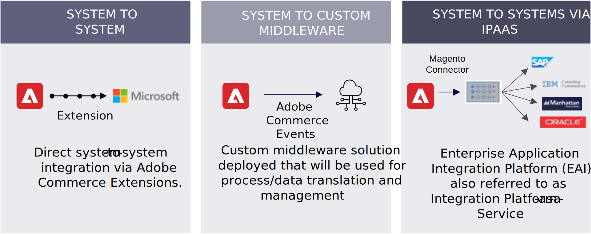

# Estratégia de integração do Adobe Commerce

A capacidade de integrar sua plataforma é &quot;não negociável&quot;. As empresas desejam que suas plataformas de comércio eletrônico sejam acessíveis a partir de vários pontos de contato e perfeitamente integradas a seus sistemas tecnológicos, especialmente seu ERP. A personalização, a escalabilidade global e a acessibilidade financeira também desempenham um papel na compra final da plataforma.

Uma abordagem de integração holística para sistemas de armazenamento e back-end é compatível com APIs GraphQL de desempenho, APIs REST abrangentes e importação de arquivos em lote entre a Adobe Commerce e outros sistemas ou serviços.

A API GraphQL da Adobe Commerce fornece uma cobertura de vitrine abrangente que pode ser usada para integrar com outras vitrines, incluindo:

- Plataformas de experiência digital (DXPs) como Adobe Experience Manager e Bloomreach
- Sistemas de gerenciamento de conteúdo (CMS) como Drupal e WordPress
- Aplicativo de vitrine personalizada moderno, como Adobe Commerce, PWA Studio e Vue Storefront

O GraphQL fornece uma resposta eficiente e específica do canal, sem busca excessiva de dados e uma implantação ágil de novos recursos de ponto de contato. Geralmente, também é escolhida para integrar canais de vendas, como aplicativos nativos móveis, POS, IoT, canais sociais e canais de comércio livestream, como Facebook, Google, Instagram, WeChat e TikTok.

A API REST do Adobe Commerce fornece ampla cobertura de configuração do sistema e recursos de gerenciamento de dados, incluindo produtos e catálogos; carrinho, cotação e check-out; clientes, contas e empresas; e pedidos e devoluções. As APIs REST são compatíveis com operações em massa, vários modos de autenticação e autorização granular, portanto, as APIs REST geralmente são escolhidas para integrar com sistemas corporativos, incluindo:

- Sistemas de planejamento de recursos empresariais (ERP) como SAP
- Sistemas de gerenciamento de informações de produtos (PIM) como o Akeneo
- Sistemas de gerenciamento de relacionamento com o cliente (CRM) como o Salesforce
- Sistemas de gerenciamento de pedidos (OMS) como MOM, Manhattan e SAP
- WMS (Warehouse Management System) ou logística de terceiros (3PL) como Oracle, NetSuite e SAP WM
- Configurar, Preço, Cotação (CPQ) como SalesforceCPQ
- Gerenciamento de ativos digitais (DAM) como o Adobe DAM.

As importações de arquivos em lote também são consideradas uma boa opção para integrar sistemas corporativos, como ERPs e PIMs, pois esses dados não mudam com muita frequência e você geralmente tem melhor desempenho com as importações de arquivos programados. Portanto, as importações de arquivos em lote geralmente são escolhidas para sincronização de dados em massa diariamente/semanalmente e sincronizações mensais completas de dados, enquanto as APIs REST são escolhidas para sincronização de alterações de dados incrementais, para melhor desempenho. Isso também é considerado apenas um trabalho programado, mas pode ser feito com frequência — potencialmente a cada 15 minutos a 1 hora — dependendo das necessidades dos negócios.

## Opções de integração

O Adobe Commerce oferece três opções flexíveis de integração:

- Integração direta entre sistemas com conectores pré-construídos. Alguns sistemas podem já ter as extensões do Adobe Commerce no Adobe Commerce Marketplace ou em seu próprio site.

- Integração de sistema para sistema por meio de middleware personalizado. A solução middleware personalizada implantada será usada para mapeamento de dados de processo, tradução e gerenciamento.

- Integração de sistema a sistema por meio de iPaaS (Integration Platform-as-Service), também conhecida como EAI (Enterprise Application Integration Platform), como Mulesoft, Boomi e Software AG.

Embora as integrações em tempo real geralmente sejam desejadas, não é necessário para alguns cenários. A Adobe Commerce oferece suporte nativo ao RabbitMQ como barramento de mensagens para habilitar processos assíncronos, o que é recomendado para alguns dados que não são necessários para troca em tempo real, mas para atualizar com a troca de arquivos em lote ou a API do processo de dados em lote REST para processar de forma assíncrona.
