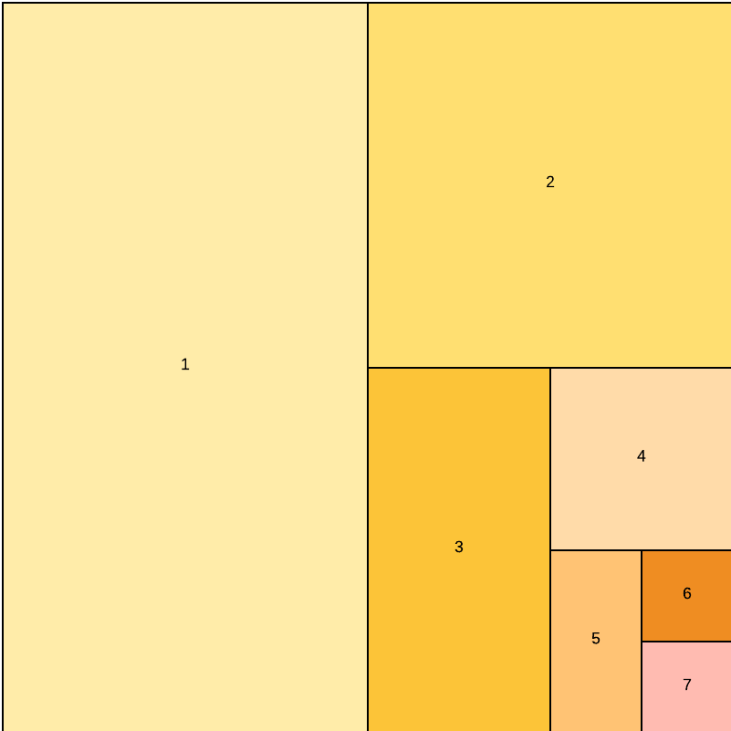

# Práticas recomendadas de depuração do Adobe Commerce

Este tópico explica maneiras de depurar a estrutura do Adobe Commerce de forma sistemática e eficaz. O objetivo é ajudá-lo a chegar à raiz de um problema rapidamente e minimizar o tempo de investigação.

## Solução de problemas: suspeitos comuns

Esta seção descreve os problemas mais comuns que você pode encontrar durante o desenvolvimento.

### Cache

- Liberar o cache antes de mais investigação
- Considere o cache APC, CDN, Verniz, código gerado e os diretórios `var/view_preprocessed` e `pub/static/`
- Interromper e reiniciar manipuladores de fila após a liberação do cache ou a modificação do código

A amostra de código a seguir fornece comandos úteis relacionados ao gerenciamento do cache (não execute em ambientes de produção):

```bash
# restart php-fpm to flush APC
sudo service php-fpm restart
 
# restart varnish to force full flush
sudo service varnish restart
 
# clear generated files
rm -rf generated/*
 
# clear static file cache
rm -rf var/view_preprocessed/*
rm -rf pub/static/*
 
# flush redis cache
redis-cli -n <db_number> FLUSHDB
 
# flush redis cache and sessions
redis-cli FLUSHALL
 
# flush redis cache with telnet
telnet <ip_or_host> 6379
SELECT <db_number>
FLUSHDB
Ctrl + ]
quit
 
# flush redis cache and sessions with telnet
telnet <ip_or_host> 6379
FLUSHALL
Ctrl + ]
quit
 
# find consumers
pgrep -af queue:consumers:start
 
# kill all queue consumers (they will restart by cron job)
sudo pkill -f queue:consumers:start
 
# kill a specific queue consumer (it will restart by cron job)
sudo kill <process_id>
```

### Dados indexados

Reindexe tudo se o problema puder ser relacionado ao índice. A depuração de dados indexados normalmente ocorre em ambientes de não produção. Em ambientes de produção, talvez você queira investigar a origem do desalinhamento do índice antes de reindexar. As características do estado defeituoso podem dizer algo sobre a origem do problema.

### Compositor

Você pode ter um código desatualizado devido a uma alteração na ramificação ou devido a arquivos principais que foram editados em um esforço de depuração anterior. Para eliminar possíveis problemas, execute os seguintes comandos:

```bash
rm -rf vendor/*
composer clear-cache
composer install
```

### Conteúdo gerado

Recrie os arquivos de front-end antes de depurar o conteúdo gerado em JS, CSS, imagens, traduções e outros arquivos.

```bash
rm -rf generated/* var/cache/* var/page_cache/* var/session/* var/view_preprocessed/* pub/static/*
bin/magento setup:static-content:deploy
bin/magento cache:flush
```

### Modo de desenvolvedor

Certifique-se de que sua instalação local esteja no modo `developer`.

### Novo módulo

Se você criou um módulo, verifique os seguintes problemas:

- O módulo está ativado?

  ```bash
  bin/magento module --enable Your_Module
  ```

  Procure o novo módulo no arquivo `app/etc/config.php`.

- Verifique o aninhamento da estrutura de arquivos e diretórios. Por exemplo, os arquivos de layout estão no diretório `view/layout/` em vez do diretório `view/frontend/layout`? Os modelos estão no diretório `view/frontend/template` em vez do diretório `view/frontend/templates`?

## Solução de problemas: half-splitting

Se os suspeitos habituais não oferecerem uma solução para o problema, a maneira mais rápida de proceder é dividir o problema pela metade (ou dividi-lo). Com esse método, você elimina partes grandes e divide o que resta para localizar a causa raiz em vez de percorrer o código de forma linear.

Consulte os seguintes diagramas:




Há várias abordagens para a divisão, mas o Adobe recomenda seguir esta ordem:

- Bissecto por tópico
- Bisect por confirmações
- Dividir por arquivos

### Etapa 1: Segmentar por tópico

Se o problema não estiver relacionado a código, elimine primeiro as partes grandes. Alguns dos grandes blocos que devem ser considerados incluem:

- **Estrutura do Adobe Commerce**—O problema está relacionado ao Adobe Commerce ou pode estar relacionado a outro sistema conectado?
- **Servidor e cliente** — Limpar o cache e o armazenamento do navegador. O problema foi resolvido? Isso pode descartar uma causa relacionada ao servidor. O problema ainda existe? Não é necessário perder mais tempo na depuração do navegador.
- **Sessão**—O problema ocorre para cada usuário? Caso contrário, seu problema pode estar limitado a tópicos relacionados à sessão ou ao navegador.
- **Cache** — A desabilitação de todos os caches altera alguma coisa? Em caso afirmativo, você pode se concentrar em tópicos relacionados ao cache.
- **Banco de Dados** — O problema ocorre em todos os ambientes que executam o mesmo código? Caso contrário, procure por problemas na configuração e outros tópicos relacionados ao banco de dados.
- **Código**—Procure problemas de código se nenhuma das opções acima resolveu o problema.

### Etapa 2: Bisect por confirmações

Se o problema tiver começado entre agora e dois meses atrás, reverta o código para dois meses atrás. Verifique se o problema ainda existe. Avance um mês. O problema ocorre lá? Caso contrário, avance duas semanas. Isso ocorre agora? Volte uma semana. Ainda está aí? Volte quatro dias. Em algum momento, você tem apenas uma confirmação restante que provavelmente conterá o código relacionado ao problema. Sua causa raiz agora provavelmente está limitada aos arquivos editados nessa confirmação.

Você pode substituir semanas e dias por confirmações. Por exemplo, reverter 100 confirmações, avançar 50, avançar 25, voltar 12.

### Etapa 3: segmentar por arquivos

- Dividir o Adobe Commerce por tipos de arquivo (principal e não principal). Primeiro, desative todos os módulos do cliente e do marketplace. O problema ainda existe? É provavelmente um problema não essencial.
- Habilite (aproximadamente) metade dos módulos novamente no arquivo `app/etc/config.php`. Esteja ciente das dependências. É melhor ativar clusters de módulo com o mesmo tópico todos de uma só vez. O problema ainda existe?
- Ative um quarto dos módulos restantes. O problema ainda existe? Desative metade do que você ativou. Esse método pode ajudá-lo a isolar a causa raiz em um único módulo.

## Economizadores de tempo

Além das técnicas de solução de problemas, esta seção fornece algumas regras gerais que podem ajudar a economizar tempo durante a depuração.

### Limitar dados

Considere se é necessário o catálogo completo ou todas as exibições de armazenamento para replicar o problema. Você pode depurar problemas de indexação com um clone do banco de dados em que tenha removido 95% do catálogo antes de iniciar a depuração. Esse método economiza um tempo considerável durante os processos de indexação. Crie uma duplicata do banco de dados do cliente com contagem e catálogo reduzidos. Isso também pode se aplicar a outras entidades (como clientes), dependendo da área que você está depurando.

### Solicitar mais informações

Às vezes, um passo fácil para esquecer em meio a todo o código e trabalho técnico: pedir mais informações. Capturas de tela inteira, um vídeo, um bate-papo em videoconferência com a pessoa que identificou o problema, etapas de replicação, dúvidas sobre se outras coisas aparentemente sem importância aconteceram em torno do evento problemático. Pergunte o que alguém esperava que acontecesse. Isso é realmente um erro ou talvez apenas um mal-entendido do modo como o código funciona?

### Língua e interpretação

A descrição do problema está clara? Tem certeza de que nenhum termo ou descrição pode ser interpretado de várias maneiras? Se sim, certifique-se de que você esteja falando sobre a mesma coisa.

### Pesquisa na Internet

Faça uma pesquisa na Internet com termos relacionados ao problema. Há chances de outra pessoa já ter encontrado o mesmo problema. Pesquise os [problemas do Adobe Commerce GitHub](https://github.com/magento/magento2/issues).

### Faça uma pausa

Se você estiver observando um problema por muito tempo, pode ser desafiador encontrar uma solução. Abaixe o seu trabalho e pegue outra tarefa ou dê um passeio. A resposta pode chegar a você quando você esquecer o problema por um tempo.

## Ferramentas

As Ferramentas CLI n98 magerun ([https://github.com/netz98/n98-magerun2](https://github.com/netz98/n98-magerun2)) fornecem recursos úteis para trabalhar com o Adobe Commerce a partir da linha de comando. Especialmente estes comandos:

```bash
n98-magerun2.phar dev:console
n98-magerun2.phar sys:cron:run
n98-magerun2.phar db:console
n98-magerun2.phar index:trigger:recreate
```


## Trechos de código

Os tópicos a seguir fornecem trechos de código que podem ser usados para registrar ou identificar problemas em projetos Commerce.

### Verificar se um arquivo XML é usado pelo Commerce

Adicione um erro de sintaxe óbvio em um arquivo XML para ver se ele é usado. Abra uma tag e não a feche, por exemplo:

```xml
<?xml version="1.0"?>
<test
```

Se esse arquivo for usado, ele gerará um erro. Se não estiver, o módulo pode não ser usado ou pode não estar habilitado, por exemplo, ou o arquivo XML pode estar no local errado.

### Logs

>[!BEGINTABS]

>[!TAB Adobe Commerce]

```php
\Magento\Framework\App\ObjectManager::getInstance()
    ->get(\Psr\Log\LoggerInterface::class)->debug('message');
```

>[!TAB Monólogo]

```php
$log = new \Monolog\Logger('custom', [new \Monolog\Handler\StreamHandler(BP.'/var/log/test.log')]);
$log->info('Your Logging Message', ['context' => ['email' => 'john@example.com']]);
```

>[!TAB Zend]

```php
$writer = new \Zend\Log\Writer\Stream(BP . '/var/log/test.log');
$logger = new \Zend\Log\Logger();
$logger->addWriter($writer);
$logger->info('Your text message');
$logger->info(print_r($yourArray, true));
```

>[!ENDTABS]

### Registro em log de baixo nível

Dois exemplos que sempre funcionam em qualquer arquivo PHP:

```php
file_put_contents('/var/www/html/var/log/example.log', "example line\n", FILE_APPEND);
file_put_contents('/var/www/html/var/log/example.log', print_r($yourArray, true) . "\n", FILE_APPEND);
```

E para um rastreamento de pilha:

```php
try {
    throw new \Exception('example');
} catch (\Exception $e) {
    file_put_contents('/var/www/html/var/log/example.log', $e->getTraceAsString() . "\n", FILE_APPEND);
}
```
