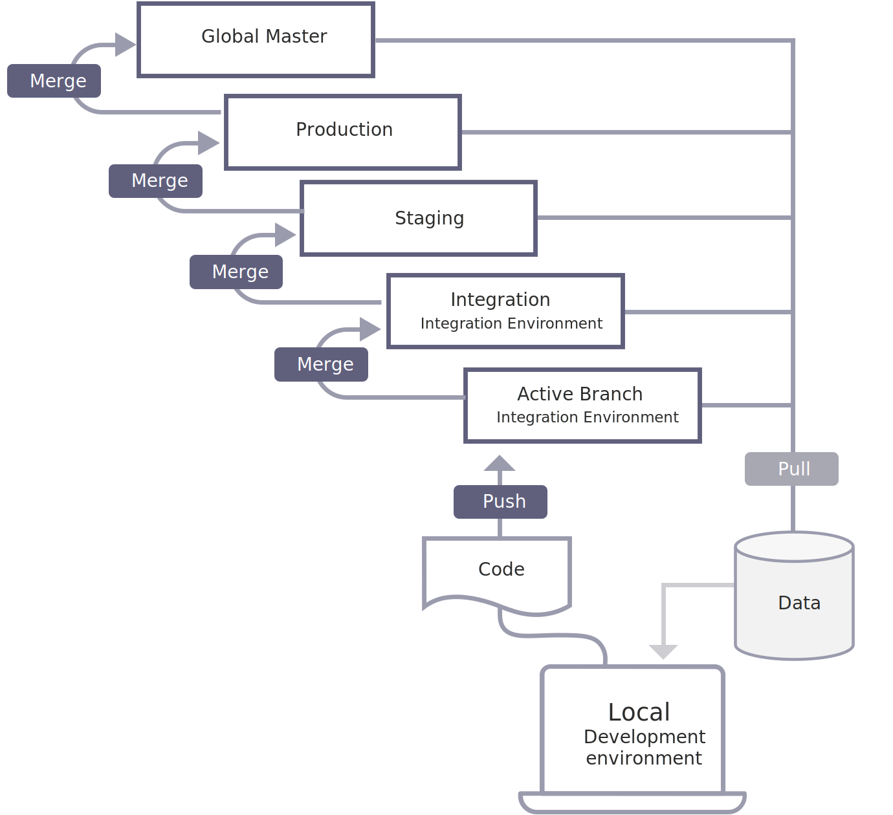

# Ambientes

A arquitetura Pro do Adobe Commerce na infraestrutura em nuvem é compatível com ambientes que você pode usar para desenvolver, testar e iniciar sua loja. Cada ambiente contém um banco de dados e um servidor Web. Os quatro ambientes aproveitados pelo Adobe Commerce são:

- **Integração**— fornece uma única ramificação de ambiente e você pode criar até quatro ramificações de ambiente adicionais. Isso permite um máximo de cinco ramificações ativas implantadas em contêineres de Plataforma como serviço (PaaS).

- **Estágios**— fornece uma única ramificação de ambiente implantada em contêineres IaaS (Infrastructure-as-a-Service, infraestrutura como serviço) dedicados.

- **Produção**— fornece uma única ramificação de ambiente implantada em contêineres IaaS (Infrastructure-as-a-Service, infraestrutura como serviço) dedicados.

- **Mestre Global**—Fornece uma ramificação mestre implantada em contêineres PaaS (Platform-as-a-Service).

## Ramificações Git

O ambiente de integração fornece uma ramificação de integração de base única contendo seu código Adobe Commerce implantado em contêineres PaaS (Platform-as-a-Service).

O Adobe Commerce em ambientes de infraestrutura em nuvem oferece suporte a um processo de integração flexível e contínuo. Comece clonando a ramificação de integração na pasta local do projeto. Crie uma nova ramificação ou várias ramificações para desenvolver novos recursos, configurar alterações e adicionar extensões. Com uma ramificação de código desenvolvida e os arquivos de configuração correspondentes, as alterações de código estão prontas para serem mescladas à ramificação de integração para testes mais abrangentes.

