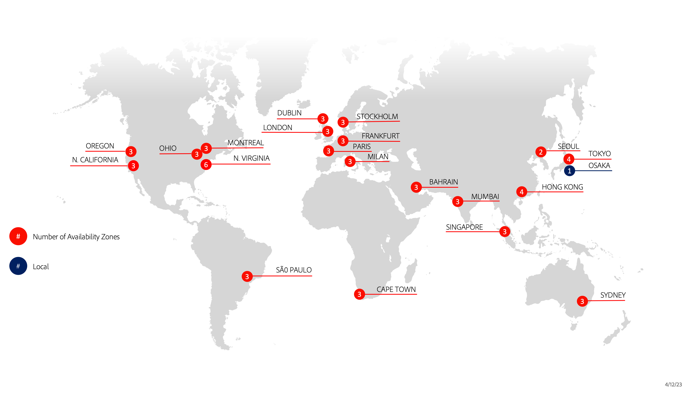

# Regiões da nuvem

As seções a seguir fornecem detalhes sobre as diferentes regiões do AWS e do Azure disponíveis para o Adobe Commerce na infraestrutura em nuvem.

## Regiões do AWS

>[!NOTE]
>
> Apenas nas instalações da China e da Rússia.

## Regiões do Azure

>[!NOTE]
>
> Apenas nas instalações da China e da Rússia. Todos os comerciantes que exigem ambientes de Integração devem usar regiões dos EUA.
