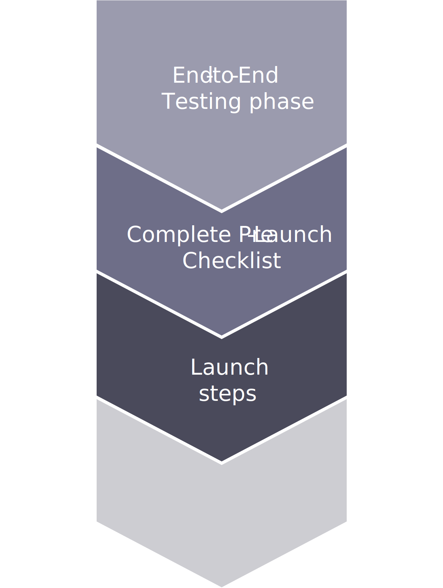

# Etapas de inicialização

Após testar e concluir a lista de verificação de pré-lançamento, podemos iniciar as etapas finais para iniciar no momento da transferência. Essas etapas incluem inserir tíquetes de inicialização do site (entrar online), cortar o acesso e, finalmente, testar sua(s) loja(s) ao vivo.

A equipe de suporte da Adobe Commerce trabalha com você durante todo o processo, verificando o status e ajudando a resolver quaisquer dúvidas ou problemas que ocorram. Todos os problemas devem ser rastreados com tíquetes para melhor capturar o que aconteceu e como foi resolvido. Ao começar a implantar iterações contínuas de atualizações no armazenamento iniciado, você pode ter problemas semelhantes a ocorrer novamente. Esses tíquetes podem ajudar a identificar os problemas e ajustar as tarefas de implantação.

- Configurar aplicativo para URL de base
   - Alternar o DNS para o novo site
   - Acessar o serviço DNS
   - Atualize os registros A e CNAME dos domínios e nomes de host
   - Aguarde o tempo de TTL passar e acesse seu armazenamento

- Teste completo na produção
   - Verificando todas as funções do site
   - Verificando o cache da CDN
   - Verificação de todos os serviços integrados de terceiros
   - Verificação de todos os sistemas de terceiros

- Entre em contato com a linha direta da Adobe Commerce caso algum problema esteja bloqueando a ativação

