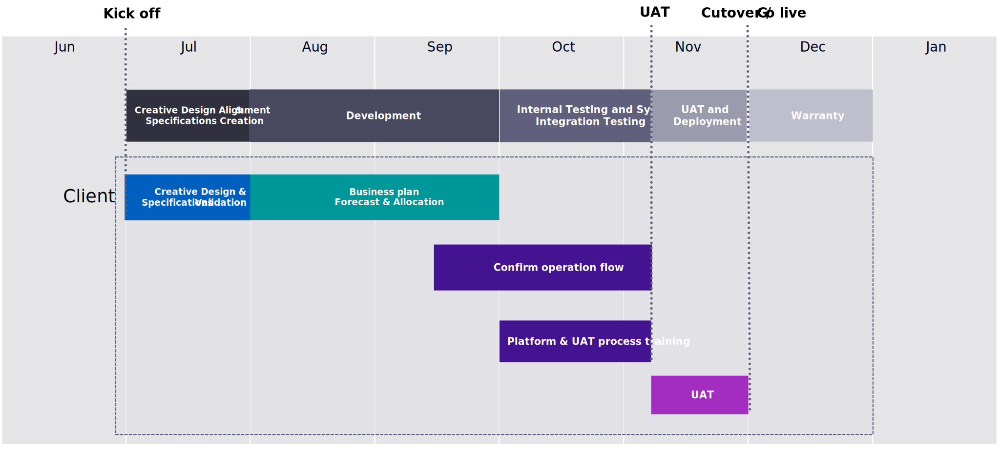

# Processo de implementação e cronograma típicos

Muitas organizações se preparam para uma transformação comercial criando uma solicitação de proposta (RFP). Isso inclui requisitos detalhados, sistemas atuais de registro, um caso comercial e objetivos específicos (por exemplo, receita, conversão, valor médio de pedido) para definir o sucesso. A marca então se aproxima de dois a três integradores de sistemas de comércio diferentes ou agências digitais para avaliar, revisar estimativas e propostas, selecionar uma empresa e começar a trabalhar para a linha do tempo projetada para o lançamento.

Esta pode ser uma abordagem bem sucedida. No entanto, uma recomendação que diminui o risco (antes de se comprometer com uma implementação completa) é trabalhar com uma organização em um processo de avaliação ou descoberta de requisitos que possa confirmar o preparo organizacional, o escopo do projeto, o cronograma, o orçamento, os requisitos comerciais e a abordagem técnica. Em média, esse processo deve demorar de quatro a seis semanas, mas varia dependendo do tamanho do projeto.

## Exemplo de linha do tempo típica

## Atividades de linha do tempo de amostra

