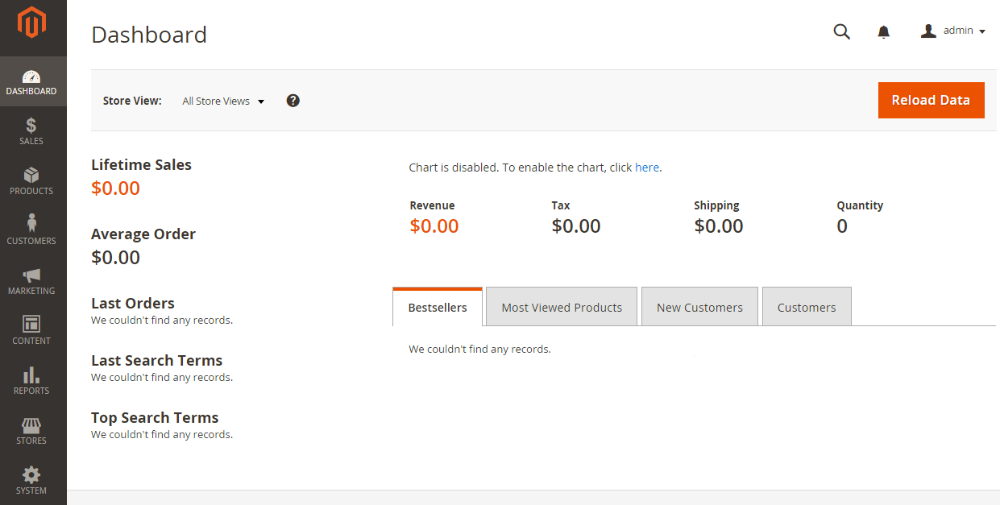

# Verificar a instalação

Acesse a loja em um navegador da Web. Por exemplo, se o URL de base da instalação for `http://www.example.com`, insira-o na barra de endereço ou local do navegador.

A figura a seguir mostra um exemplo de página da loja. Se for exibido da seguinte maneira, sua instalação foi um sucesso!

## Verifique a loja (sem dados de amostra)

Acesse a loja em um navegador da Web. Por exemplo, se o URL de base da instalação for `http://www.example.com`, insira-o na barra de endereço ou local do navegador.

A figura a seguir mostra um exemplo de página da loja. Se for exibido da seguinte maneira, sua instalação foi um sucesso!

Se a página exibir um `404 (Not Found)` ou não exibir estilos, consulte [soluções de problemas](https://support.magento.com/hc/en-us/articles/360032994352).

## Verifique o administrador

Acesse o Administrador em um navegador da Web. Por exemplo, se o URL de base da instalação for `http://www.example.com`, e o URI de Admin é `admin_au1nT`, insira `http://www.example.com/admin_au1nT` na barra de endereço ou local do navegador.

(O URI de Administrador é especificado pelo valor do parâmetro `backend-frontname` parâmetro de instalação.)

Quando solicitado, efetue login como administrador.

A figura a seguir mostra um exemplo da página de Administração. Se for exibido da seguinte maneira, sua instalação foi um sucesso!

Se a página não exibir estilos, consulte [solução de problemas](https://support.magento.com/hc/en-us/articles/360032994352).

Se você receber um erro 404 (Não encontrado) semelhante ao seguinte, consulte [Erro de versão do PHP ou 404 ao acessar o Adobe Commerce no navegador](https://support.magento.com/hc/en-us/articles/360033117152).

`The requested URL /magento2index.php/admin/admin/dashboard/index/key/0c81957145a968b697c32a846598dc2e/ was not found on this server.`
