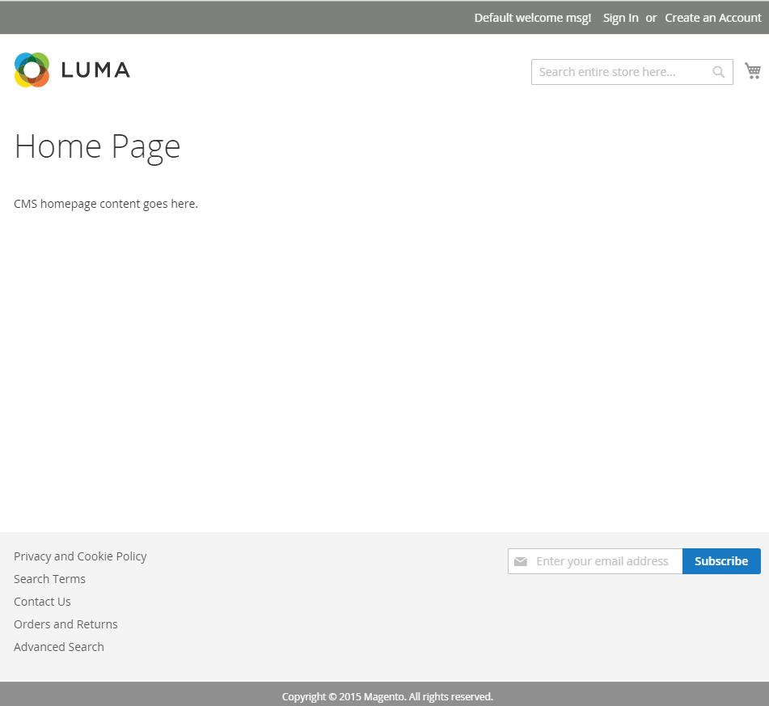

# Modifique docroot para melhorar a segurança

Em uma instalação padrão com um servidor Web Apache, o Adobe Commerce e o Magento Open Source são instalados na raiz da Web padrão: `/var/www/html/magento2`.

A variável `magento2/` contém o seguinte:

- `pub/`
- `setup/`
- `var/`

O aplicativo é distribuído a partir de `/var/www/html/magento2/pub`. O restante do sistema de arquivos é vulnerável porque pode ser acessado de um navegador.
Definir o webroot para o `pub/` O diretório impede que os visitantes do site acessem áreas confidenciais do sistema de arquivos por meio de um navegador.

Este tópico descreve como alterar o docroot do Apache em uma instância existente para servir arquivos do `pub/` o diretório, que é mais seguro.

## Uma observação sobre o nginx

Se você estiver usando [nginx](../prerequisites/web-server/nginx.md) e a variável [`nginx.conf.sample`](https://github.com/magento/magento2/blob/2.4/nginx.conf.sample) arquivo incluído no diretório de instalação, você provavelmente já está disponibilizando arquivos do `pub/` diretório.

Quando usado no bloco do servidor que define o site, a variável `nginx.conf.sample` A configuração do substitui as configurações docroot do servidor para servir arquivos do `pub/` diretório. Por exemplo, consulte a última linha na seguinte configuração:

```conf
# /etc/nginx/sites-available/magento

upstream fastcgi_backend {
   server  unix:/run/php/php7.4-fpm.sock;
}

server {

         listen 80;
         server_name 192.168.33.10;
         set $MAGE_ROOT /var/www/html/magento2ce;
         include /var/www/html/magento2ce/nginx.conf.sample;
}
```

## Antes de começar

Para concluir este tutorial, você precisa acessar uma instalação em execução em um [LÂMPADA](https://en.wikipedia.org/wiki/LAMP_(software_bundle)) pilha:

- Linux
- Apache (2.4+)
- MySQL (5.7+)
- PHP (7.4)
- Elasticsearch (7.x) ou OpenSearch (1.2)
- Adobe Commerce ou Magento Open Source (2.4+)

>[!NOTE]
>
>Consulte [Pré-requisitos](../prerequisites/overview.md) e a variável [Guia de instalação](../overview.md) para obter mais informações.

## 1. Editar a configuração do servidor

O nome e o local do arquivo de host virtual dependem da versão do Apache que você está executando. Este exemplo mostra o nome e o local do arquivo de host virtual no Apache v2.4.

1. Faça logon no servidor de aplicativos.
1. Edite seu arquivo de host virtual:

   ```bash
   vim /etc/apache2/sites-available/000-default.conf
   ```

1. Adicione o caminho ao `pub/` diretório para o `DocumentRoot` diretiva:

   ```conf
   <VirtualHost *:80>
   
            ServerAdmin webmaster@localhost
            DocumentRoot /var/www/html/magento2ce/pub
   
            ErrorLog ${APACHE_LOG_DIR}/error.log
            CustomLog ${APACHE_LOG_DIR}/access.log combined
   
            <Directory "/var/www/html">
                        AllowOverride all
            </Directory>
    </VirtualHost>
   ```

1. Reiniciar o Apache:

   ```bash
   systemctl restart apache2
   ```

## 2. Atualize seu URL base

Se você anexou um nome de diretório ao nome do host ou endereço IP do servidor para criar o URL base quando instalou o aplicativo (por exemplo, `http://192.168.33.10/magento2`), você precisa removê-lo.

>[!NOTE]
>
>Substituir `192.168.33.10` com o nome de host do servidor.

1. Fazer logon no banco de dados:

   ```bash
   mysql -u <user> -p
   ```

1. Especifique o banco de dados criado quando você instalou o aplicativo:

   ```shell
   use <database-name>
   ```

1. Atualize o URL de base:

   ```shell
   UPDATE core_config_data SET value='http://192.168.33.10' WHERE path='web/unsecure/base_url';
   ```

## 3. Atualize o arquivo env.php

Anexe o seguinte nó à `env.php` arquivo.

```conf
'directories' => [
    'document_root_is_pub' => true
]
```

Consulte a [referência env.php](../../configuration/reference/config-reference-envphp.md) para obter mais informações.

## 4. Alternar modos

[Modos de aplicação](../../configuration/bootstrap/application-modes.md), que incluem `production` e `developer`, foram projetados para melhorar a segurança e facilitar o desenvolvimento. Como os nomes sugerem, você deve alternar para `developer` ao estender ou personalizar o aplicativo e alternar para `production` ao ser executado em um ambiente ativo.

Alternar entre os modos é uma etapa importante para verificar se a configuração do servidor está funcionando corretamente. Você pode alternar entre os modos usando a ferramenta da CLI:

1. Vá para o diretório de instalação.
1. Alternar para `production` modo.

   ```bash
   bin/magento deploy:mode:set production
   ```

   ```bash
   bin/magento cache:flush
   ```

1. Atualize o navegador e verifique se a loja é exibida corretamente.
1. Alternar para `developer` modo.

   ```bash
   bin/magento deploy:mode:set developer
   ```

   ```bash
   bin/magento cache:flush
   ```

1. Atualize o navegador e verifique se a loja é exibida corretamente.

## 5. Verifique a vitrine

Acesse a loja em um navegador da Web para verificar se tudo está funcionando.

1. Abra um navegador da Web e digite o nome de host ou endereço IP do servidor na barra de endereços. Por exemplo, `http://192.168.33.10`.

   A figura a seguir mostra um exemplo de página da loja. Se for exibido da seguinte maneira, sua instalação foi um sucesso!

   

   Consulte a [seção solução de problemas](https://support.magento.com/hc/en-us/articles/360032994352) se a página exibir um 404 (não encontrado) ou falhar ao carregar outros ativos como imagens, CSS e JS.

1. Tente acessar um diretório de aplicativo de um navegador. Anexe o nome do diretório ao nome de host ou endereço IP do servidor na barra de endereços:

   Se aparecer a mensagem 404 ou &quot;Acesso negado&quot;, você restringiu com êxito o acesso ao sistema de arquivos.

   
