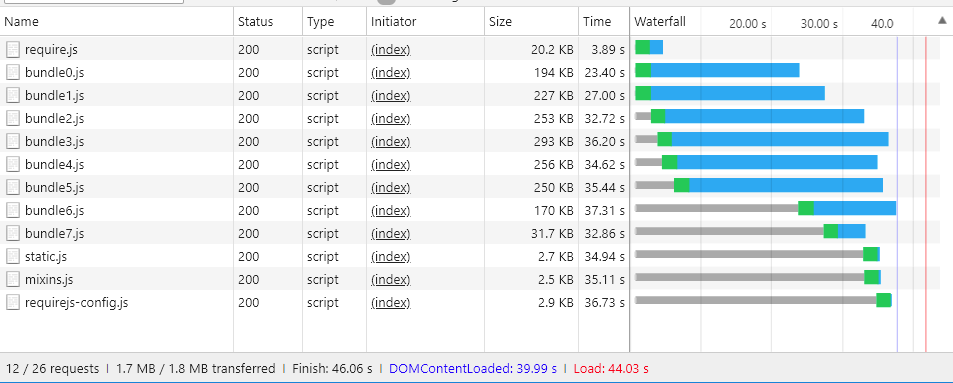

# Agrupamento [!DNL JavaScript] avançado

O agrupamento de [!DNL JavaScript] módulos para obter melhor desempenho tem a ver com a redução de dois fatores:

1. O número de solicitações do servidor.
1. O tamanho dessas solicitações de servidor.

Em um aplicativo modular, o número de solicitações de servidor pode chegar a centenas. Por exemplo, a captura de tela a seguir mostra apenas o início da lista de módulos do [!DNL JavaScript] carregados na home page de uma instalação limpa.


## Mesclagem e agrupamento

Pronto para uso, o [!DNL Commerce] fornece duas maneiras de reduzir o número de solicitações do servidor: mesclando e agrupando. Essas configurações estão desativadas por padrão. Você pode ativá-los na interface do Administrador em **[!UICONTROL Stores]** > **Configurações** > **[!UICONTROL Configuration]** > **[!UICONTROL Advanced]** > **[!UICONTROL Developer]** > **[!UICONTROL [!DNL JavaScript] Settings]** ou na linha de comando.


### Empacotamento básico

Para habilitar o agrupamento interno na linha de comando:

```bash
php -f bin/magento config:set dev/js/enable_js_bundling 1
```

Este é um mecanismo nativo [!DNL Commerce] que combina todos os ativos presentes no sistema e os distribui entre pacotes do mesmo tamanho (bundle_0.js, bundle_1.js ... bundle_x.js):

![[!DNL Commerce] agrupamento](../assets/performance/images/magentoBundling.png)

Melhor, mas o navegador ainda carrega TODOS os pacotes [!DNL JavaScript], não apenas os necessários.

O agrupamento [!DNL Commerce] reduz o número de conexões por página, mas para cada solicitação de página ele carrega todos os pacotes, mesmo quando a página solicitada só pode depender de arquivos dentro de um ou dois dos pacotes. O desempenho melhora depois que o navegador armazena os pacotes em cache. Mas, como o navegador carrega esses pacotes de forma síncrona, a primeira visita do usuário a uma loja [!DNL Commerce] pode demorar um pouco para renderizar e prejudicar a experiência do usuário.

### Mesclagem básica

Para habilitar a mesclagem interna na linha de comando:

```bash
php -f bin/magento config:set dev/js/merge_files 1
```

Este comando mescla todos os arquivos [!DNL JavaScript] síncronos em um único arquivo. Habilitar mesclagem sem também habilitar agrupamento não é útil porque [!DNL Commerce] usa RequireJS. Se você não habilitar o agrupamento, [!DNL Commerce] mesclará somente RequireJS e suas configurações. Quando você habilita o agrupamento e a mesclagem, o [!DNL Commerce] cria um único arquivo [!DNL JavaScript]:


## Tempos de renderização do mundo real

Os tempos de carregamento agrupados e mesclados anteriores parecem ótimos em um ambiente de desenvolvimento. Mas no mundo real, muitas coisas podem desacelerar a renderização: conexões lentas, grandes limiares de conexão, redes limitadas. Além disso, os dispositivos móveis não são renderizados tão rapidamente quanto os desktops.

Para testar e preparar a implantação de sua loja para o mundo real, recomendamos que você teste com o perfil de limitação nativo de &quot;Slow 3G&quot; da Chrome. Com o Slow 3G, nossos tempos de saída empacotados anteriores agora refletem as realidades de conexão de muitos usuários:



Na conectividade Slow 3G, leva cerca de 44 segundos para carregar todos os pacotes da página inicial de uma instalação limpa do [!DNL Commerce].

O mesmo é verdadeiro ao mesclar os pacotes em um único arquivo. Os usuários ainda podem aguardar cerca de 42 segundos pelo carregamento da página inicial, como mostrado aqui:


Com uma abordagem mais avançada ao agrupamento [!DNL JavaScript], podemos melhorar esses tempos de carregamento.

## Agrupamento avançado

Lembre-se, o objetivo do agrupamento [!DNL JavaScript] é reduzir o número e o tamanho dos ativos solicitados para cada página carregada no navegador. Para fazer isso, queremos criar nossos pacotes para que cada página em nossa loja só precise baixar um pacote comum e um pacote específico da página para cada página acessada.

Uma maneira de fazer isso é definir seus pacotes por tipos de página. Você pode categorizar as páginas de [!DNL Commerce] em vários tipos de página, incluindo Categoria, Produto, CMS, Cliente, Carrinho e Check-out. Cada página categorizada em um desses tipos de página tem um conjunto diferente de dependências do módulo RequireJS. Ao agrupar os módulos RequireJS por tipo de página, você acabará com apenas alguns pacotes que cobrem as dependências de qualquer página em sua loja.

Por exemplo, você pode acabar com um pacote para as dependências comuns a todas as páginas, um pacote para páginas somente CMS, um pacote para páginas somente Catálogo, outro pacote para páginas somente Pesquisa e um pacote para páginas de Check-out.

Você também pode criar pacotes por finalidade: para recursos comuns, recursos relacionados ao produto, recursos de envio, recursos de check-out, impostos e validações de formulário. A forma como você define os pacotes depende de você e da estrutura da loja. Você pode descobrir que algumas estratégias de agrupamento funcionarão melhor do que outras.

Uma instalação limpa do [!DNL Commerce] permite alcançar um bom desempenho suficiente ao dividir pacotes por tipos de página, mas algumas personalizações podem exigir análise mais profunda e outras distribuições de ativos.

### Ferramentas necessárias

As etapas a seguir exigem que você instale e esteja familiarizado com as seguintes ferramentas:

- [nodejs](https://nodejs.org/en/download/)
- [r.js](http://requirejs.org/docs/optimization.html#download)
- [[!DNL PhantomJS]](https://phantomjs.org/) (opcional)

### Código de exemplo

As versões completas do código de amostra usado neste artigo estão disponíveis aqui:

- [build.js](../assets/performance/code-samples/build.js)
- [deps.js](../assets/performance/code-samples/deps.js)
- [deps-map.sh](../assets/performance/code-samples/deps-map.sh.txt)

### Parte 1: Criar uma configuração de pacote

#### 1. Adicionar um arquivo build.js

Crie um arquivo `build.js` no diretório raiz [!DNL Commerce]. Esse arquivo conterá toda a configuração de build dos seus pacotes.

```javascript
({
    optimize: 'none',
    inlineText: true
})
```

Posteriormente, alteraremos a configuração `optimize:` de_ `none` para `uglify2` para minificar a saída do pacote. Mas, por enquanto, durante o desenvolvimento, você pode deixá-lo definido como `none` para garantir compilações mais rápidas.

#### 2\ Adicionar dependências, calços, caminhos e mapa RequireJS

Adicione os seguintes nós de configuração de compilação RequireJS, `deps`, `shim`, `paths` e `map`, ao seu arquivo de compilação:

```javascript
({
    optimize: 'none',
    inlineText: true,

    deps: [],
    shim: {},
    paths: {},
    map: { "*": {} },
})
```

#### 3 Agregar os valores de instância do requirements-config.js

Nesta etapa, será necessário agregar todos os vários nós de configuração do `deps`, `shim`, `paths` e `map` do arquivo `requirejs-config.js` do armazenamento nos nós correspondentes no arquivo `build.js`. Para fazer isso, abra a guia **[!UICONTROL Network]** no painel Ferramentas do Desenvolvedor do seu navegador e navegue para qualquer página da sua loja, como a página inicial. Na guia Rede, você verá a instância do arquivo `requirejs-config.js` da sua loja próxima à parte superior, realçada aqui:


Neste arquivo, você encontrará várias entradas para cada um dos nós de configuração (`deps`, `shim`, `paths`, `map`). Você precisa agregar esses vários valores de nó no único nó de configuração do arquivo build.js. Por exemplo, se a instância `requirejs-config.js` do seu armazenamento tiver entradas para 15 nós `map` separados, você precisará mesclar as entradas para todos os 15 nós no único nó `map` no arquivo `build.js`. O mesmo ocorrerá para os nós `deps`, `shim` e `paths`. Sem um script para automatizar esse processo, pode demorar.

Você precisará alterar o caminho `mage/requirejs/text` para `requirejs/text` no nó de configuração `paths` da seguinte maneira:

```javascript
({
    //...
    paths: {
        //...
        "text": "requirejs/text"
    },
})
```

#### 4\ Adicionar um nó de módulos

Ao final do arquivo `build.js`, adicione a matriz modules[] como espaço reservado para os pacotes que você definirá para sua loja mais tarde.

```javascript
({
    optimize: 'none',
    inlineText: true,

    deps: [],
    shim: {},
    paths: {},
    map: { "*": {} },

    modules: [],
})
```

#### 5\ Recuperar dependências RequireJS

Você pode recuperar todas as dependências de módulo [!DNL RequireJS] dos tipos de página de seu armazenamento usando:

1. [!DNL PhantomJS] da linha de comando (supondo que você tenha [!DNL PhantomJS] instalado).
1. Comando RequireJS no console do navegador.

#### Para usar [!DNL PhantomJS]:

No diretório raiz [!DNL Commerce], crie um novo arquivo chamado `deps.js` e copie no código abaixo. Este código usa [!DNL [!DNL PhantomJS]] para abrir uma página e aguardar o navegador carregar todos os ativos da página. Em seguida, ele gera todas as dependências [!DNL RequireJS] de uma determinada página.

```javascript
"use strict";
var page = require('webpage').create(),
    system = require('system'),
    address;

if (system.args.length === 1) {
    console.log('Usage: $phantomjs deps.js url');
    phantom.exit(1);
} else {
    address = system.args[1];
    page.open(address, function (status) {
        if (status !== 'success') {
            console.log('FAIL to load the address');
        } else {
            setTimeout(function () {
                console.log(page.evaluate(function () {
                    return Object.keys(window.require.s.contexts._.defined);
                }));
                phantom.exit();
            }, 5000);
        }
    });
}
```

Abra um terminal dentro do diretório raiz [!DNL Commerce] e execute o script em cada página do armazenamento que represente um tipo de página específico:

<pre>
phantomjs deps.js <i>url-to-specific-page</i> &gt; <i>arquivo-texto-representação-pagetype-dependencies</i>
</pre>

Por exemplo, aqui estão quatro páginas da loja de amostra com tema Luma que representam os quatro tipos de página que usaremos para criar nossos quatro pacotes (página inicial, categoria, produto, carrinho):

```terminal
phantomjs deps.js http://m2.loc/ > bundle/homepage.txt
phantomjs deps.js http://m2.loc/women/tops-women/jackets-women.html > bundle/category.txt
phantomjs deps.js http://m2.loc/beaumont-summit-kit.html > bundle/product.txt
phantomjs deps.js http://m2.loc/checkout/cart/?SID=m2tjdt7ipvep9g0h8pmsgie975 > bundle/cart.txt (prepare a shopping cart)
..............
```

#### Para usar o console do navegador:

Se você não quiser usar o [!DNL PhantomJS], execute o seguinte comando no console do navegador ao visualizar cada tipo de página na vitrine:

```shell
Object.keys(window.require.s.contexts._.defined)
```

Este comando (usado no script [!DNL PhantomJS]) cria a mesma lista de dependências [!DNL RequireJS] e as exibe no console do navegador. A desvantagem dessa abordagem é que você terá que criar seus próprios arquivos de texto do tipo pacote/página.

#### 6\. Formatar e filtrar a saída

Depois de mesclar as dependências de [!DNL RequireJS] em arquivos de texto do tipo página, você pode usar o seguinte comando em cada arquivo de dependência do tipo página para substituir as vírgulas em seus arquivos por novas linhas:

```terminal
sed -i -e $'s/,/\\\n/g' bundle/category.txt
sed -i -e $'s/,/\\\n/g' bundle/homepage.txt
sed -i -e $'s/,/\\\n/g' bundle/product.txt
....
```

Você também deve remover todos os mixins de cada arquivo, pois os mixins duplicam dependências. Use o seguinte comando em cada arquivo de dependência:

```terminal
sed -i -e 's/mixins\!.*$//g' bundle/homepage.txt
sed -i -e 's/mixins\!.*$//g' bundle/category.txt
sed -i -e 's/mixins\!.*$//g' bundle/product.txt
...
```

#### 7\ Identificar pacotes exclusivos e comuns

O objetivo é criar um pacote comum de [!DNL JavaScript] arquivos necessários para todas as páginas. Dessa forma, o navegador só precisa carregar o pacote comum juntamente com um ou mais tipos de página específicos.

Abra um terminal no diretório raiz [!DNL Commerce] e use o seguinte comando para verificar se você tem dependências que podem ser divididas em conjuntos separados:

```bash
sort bundle/*.txt |uniq -c |sort -n
```

Este comando mescla e classifica as dependências encontradas nos arquivos `bundle/*.txt`.  A saída também mostra o número de arquivos que contêm cada dependência:

```terminal
1 buildTools,
1 jquery/jquery.parsequery,
1 jsbuild,
2 jquery/jquery.metadata,
2 jquery/validate,
2 mage/bootstrap,
3 jquery
3 jquery/ui
3 knockoutjs/knockout
...
```

Esta saída mostra que `buildTools` é uma dependência em apenas um dos arquivos bundle/*.txt. A dependência `jquery/jquery.metadata` está em dois (2) arquivos e `es6-collections` está em três (3) arquivos.

Nossa saída mostra apenas três tipos de página (página inicial, categoria e produto), que nos informa:

- Três dependências são exclusivas de apenas um tipo de página (mostradas pelo número 1).
- Mais três dependências ocorrem em dois tipos de página (mostrados pelo número 2).
- As três últimas dependências são comuns aos três tipos de página (mostradas pelo número 3).

Isso nos diz que provavelmente podemos melhorar as velocidades de carregamento de página de nossa loja dividindo nossas dependências em um pacote diferente, assim que soubermos quais tipos de página precisam de quais dependências.

#### 8\ Criar um arquivo de distribuição de dependências

Para descobrir quais tipos de página precisam de quais dependências, crie um novo arquivo no diretório raiz [!DNL Commerce] chamado `deps-map.sh` e copie no código abaixo:

```shell
awk 'END {
 for (R in rec) {
   n = split(rec[R], t, "/")
   if (n > 1)
     dup[n] = dup[n] ? dup[n] RS sprintf("\t%-20s -->\t%s", rec[R], R) : \
       sprintf("\t%-20s -->\t%s", rec[R], R)
   }
 for (D in dup) {
   printf "records found in %d files:\n\n", D
   printf "%s\n\n", dup[D]
   }
 }
{
 rec[$0] = rec[$0] ? rec[$0] "/" FILENAME : FILENAME
}' bundle/*.txt
```

Você também pode encontrar o script em [https://www.unix.com/shell-programming-and-scripting/140390-get-common-lines-multiple-files.html](https://www.unix.com/shell-programming-and-scripting/140390-get-common-lines-multiple-files.html)

Abra um terminal no diretório raiz [!DNL Commerce] e execute o arquivo:

```bash
bash deps-map.sh
```

A saída desse script, aplicada aos nossos três tipos de página de exemplo, deve ser semelhante a (mas muito maior):

```terminal
bundle/product.txt   -->   buildTools,
bundle/category.txt  -->   jquery/jquery.parsequery,
bundle/product.txt   -->   jsbuild,

bundle/category.txt/bundle/homepage.txt -->    jquery/jquery.metadata,
bundle/category.txt/bundle/homepage.txt -->    jquery/validate,
bundle/category.txt/bundle/homepage.txt -->    mage/bootstrap,

bundle/category.txt/bundle/homepage.txt/bundle/product.txt --> jquery,
bundle/category.txt/bundle/homepage.txt/bundle/product.txt --> jquery/ui,
bundle/category.txt/bundle/homepage.txt/bundle/product.txt --> knockoutjs/knockout,
```

Essas informações são suficientes para criar uma configuração de pacotes.

#### 9\ Criar pacotes no arquivo build.js

Abra o arquivo de configuração `build.js` e adicione seus pacotes ao nó `modules`. Cada pacote deve definir as seguintes propriedades:

- `name`— o nome do pacote. Por exemplo, um nome de `bundles/cart` gera um pacote `cart.js` em um subdiretório `bundles`.

- `create`— um sinalizador booleano para criar o pacote (valores: `true` ou `false`).

- `include`— uma matriz de ativos (sequências de caracteres) incluídos como dependências para a página. RequireJS rastreia todas as dependências e as inclui no pacote, a menos que excluídas.

- `exclude`— uma matriz de pacotes ou ativos a serem excluídos do pacote.

```javascript
{
    name: 'bundles/catalog',
    create: true,
    include: [
        'addToWishlist',
        'priceBundle',
        'priceUtils',
        'priceOptions',
        'sticky',
        'productSummary',
        'slide'
    ],
    exclude: [
        'requirejs/require',
        'bundles/default',
        'mage/bootstrap'
    ],
}
```

Este exemplo reutiliza `mage/bootstrap` e `requirejs/require` ativos, colocando maior prioridade em seus componentes mais importantes e componentes que precisam ser carregados de forma síncrona. Os pacotes presentes são:

- `requirejs/require` — o único pacote carregado de forma síncrona
- `mage/bootstrap`—o pacote de inicialização com componentes de UI
- `bundles/default`—pacote padrão necessário para todas as páginas
- `bundles/cart` — um pacote necessário para a página do carrinho
- `bundles/shipping` — pacote comum para carrinho de compras e página de check-out (supondo que o check-out nunca seja aberto diretamente, a página de check-out será carregada ainda mais rápido se a página do carrinho tiver sido aberta anteriormente e o pacote de remessa já tiver sido carregado)
- `bundles/checkout`—tudo para finalização
- `bundles/catalog`—tudo para páginas de produto e categoria

### Parte 2: Gerar pacotes

As etapas abaixo descrevem o processo básico para gerar pacotes [!DNL Commerce] mais eficientes. Você pode automatizar esse processo da maneira que quiser, mas ainda precisará usar `nodejs` e `r.js` para realmente gerar seus pacotes. E se os temas tiverem personalizações relacionadas a [!DNL JavaScript] e não puderem reutilizar o mesmo arquivo `build.js`, talvez seja necessário criar várias configurações de `build.js` por tema.

#### 1. Gerar sites de armazenamento estáticos

Antes de gerar pacotes, execute o comando static deployment:

```bash
php -f bin/magento setup:static-content:deploy -f -a frontend
```

Esse comando gera implantações de armazenamento estáticas para cada tema e localidade configurados. Por exemplo, se você usar o tema Luma e um tema personalizado com códigos de idioma em inglês e francês, gerará quatro implantações estáticas:

- ...luma/en_US
- ...luma/fr_FR
- ...custom/en_US
- ...custom/fr_FR

Para gerar pacotes para todos os temas e localidades da loja, repita as etapas abaixo para cada tema e localidade da loja.

#### 2. Mova o conteúdo estático do armazenamento para um diretório temporário

Primeiro, você precisa mover o conteúdo estático do diretório de destino para algum diretório temporário, pois RequireJS substitui todo o conteúdo no diretório de destino.

```bash
mv pub/static/frontend/Magento/{theme}/{locale} pub/static/frontend/Magento/{theme}/{locale}_tmp
```

Por exemplo:

```bash
mv pub/static/frontend/Magento/luma/en_US pub/static/frontend/Magento/luma/en_US_tmp
```

#### 3. Execute o otimizador r.js

Em seguida, execute o otimizador r.js no arquivo `build.js` do diretório raiz de [!DNL Commerce]. Os caminhos para todos os diretórios e arquivos são relativos ao diretório de trabalho.

```bash
r.js -o build.js baseUrl=pub/static/frontend/Magento/luma/en_US_tmp dir=pub/static/frontend/Magento/luma/en_US
```

Este comando gera pacotes em um subdiretório `bundles` do diretório de destino, que neste caso resulta em `pub/static/frontend/Magento/luma/en_US/bundles`.

A listagem do conteúdo do novo diretório do pacote pode ser semelhante a:

```bash
ll pub/static/frontend/Magento/luma/en_US/bundles
```

```terminal
total 1900
drwxr-xr-x  2 root root    4096 Mar 28 11:24 ./
drwxr-xr-x 70 root root    4096 Mar 28 11:24 ../
-rw-r--r--  1 root root  116417 Mar 28 11:24 cart.js
-rw-r--r--  1 root root  187090 Mar 28 11:24 catalog.js
-rw-r--r--  1 root root  307619 Mar 28 11:24 checkout.js
-rw-r--r--  1 root root 1240608 Mar 28 11:24 default.js
-rw-r--r--  1 root root   74233 Mar 28 11:24 shipping.js
```

#### 4. Configurar RequireJS para usar pacotes

Para fazer com que RequireJS use seus pacotes, adicione um retorno de chamada `onModuleBundleComplete` após o nó `modules` no arquivo `build.js`:

```javascript
[
    {
       //...
       exclude: [
           'requirejs/require',
           'bundles/default',
           'bundles/checkout',
           'bundles/cart',
           'bundles/shipping',
           'mage/bootstrap'
       ],
   },
],
bundlesConfigOutFile: `${config.dir}/requirejs-config.js`,
onModuleBundleComplete: function(data) {
    if (this.bundleConfigAppended) {
        return;
    }
    this.bundleConfigAppended = true;

    // bundlesConfigOutFile requires a simple require.config call in order to modify the configuration
    const bundleConfigPlaceholder = `
(function (require) {
require.config({});
})(require);
    `;

    fs.appendFileSync(this.bundlesConfigOutFile, bundleConfigPlaceholder);
}
```

#### 5. Execute o comando implantar novamente

Execute o seguinte comando para implantar:

```bash
r.js -o app/design/frontend/Magento/luma/build.js baseUrl=pub/static/frontend/Magento/luma/en_US_tmp dir=pub/static/frontend/Magento/luma/en_US
```

Abra `requirejs-config.js` no diretório `pub/static/frontend/Magento/luma/en_US` para verificar se RequireJS anexou o arquivo com chamadas de configuração agrupadas:

```javascript
require.config({
    bundles: {
        "bundles/default": ["mage/template", "mage/apply/scripts", "mage/apply/main", "mage/mage", "mage/translate", "mage/loader"],
        "bundles/cart": ["Magento_Ui/js/lib/validation/utils", "Magento_Ui/js/lib/validation/rules", "Magento_Ui/js/lib/validation/validation"]
    }
}
```

>[!NOTE]
>
>Ao configurar pacotes, certifique-se de colocar as chamadas `requirejs.config()` na ordem em que deseja que sejam executadas, já que as chamadas são executadas na ordem em que aparecem.

#### 6. Testar os resultados

Depois que a página for carregada, observe o navegador carregando diferentes dependências e pacotes. Por exemplo, estes são os resultados para o perfil &quot;Slow 3G&quot;:


O tempo de carregamento de uma página inicial vazia agora é duas vezes mais rápido do que o uso do agrupamento [!DNL Commerce] nativo. Mas podemos fazer ainda melhor.

#### 7. Otimizar os pacotes

Mesmo se forem compactados, os arquivos [!DNL JavaScript] ainda serão grandes. Reduza-os com RequireJS, que usa um modificador para minificar [!DNL JavaScript] para um bom resultado.

Para habilitar o otimizador no arquivo `build.js`, adicione `uglify2` como o valor para a propriedade de otimização na parte superior do arquivo `build.js`:

```javascript
({
    optimize: 'uglify2',
    inlineText: true
})
```

Os resultados podem ser significativos:


Os tempos de carregamento agora são três vezes mais rápidos que com o agrupamento [!DNL Commerce] nativo.
