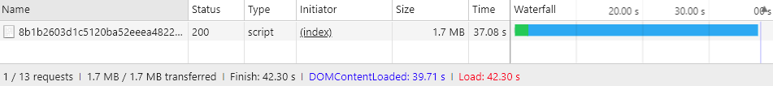

# Avançado [!DNL JavaScript] agrupamento

Pacote [!DNL JavaScript] módulos para um melhor desempenho é reduzir duas coisas:

1. O número de solicitações do servidor.
1. O tamanho dessas solicitações do servidor.

Em um aplicativo modular, o número de solicitações do servidor pode chegar às centenas. Por exemplo, a captura de tela a seguir mostra apenas o início da lista de [!DNL JavaScript] módulos carregados na home page de uma instalação limpa.


## Mesclagem e agrupamento

Pronto para uso, [!DNL Commerce] O fornece duas maneiras de reduzir o número de solicitações do servidor: fusão e agrupamento. Essas configurações são desativadas por padrão. Você pode ativá-los na interface do usuário do administrador em **[!UICONTROL Stores]** > **Configurações** > **[!UICONTROL Configuration]** > **[!UICONTROL Advanced]** > **[!UICONTROL Developer]** > **[!UICONTROL [!DNL JavaScript] Settings]** ou da linha de comando.


### Pacote básico

Para ativar o empacotamento integrado da linha de comando:

```bash
php -f bin/magento config:set dev/js/enable_js_bundling 1
```

Este é um [!DNL Commerce] mecanismo que combina todos os ativos presentes no sistema e os distribui entre pacotes de mesmo tamanho (bundle_0.js, bundle_1.js ... bundle_x.js):

![[!DNL Commerce] agrupamento](../assets/performance/images/magentoBundling.png)

Melhor, mas o navegador ainda carrega TODAS as [!DNL JavaScript] pacotes, não apenas os necessários.

[!DNL Commerce] o pacote reduz o número de conexões por página, mas para cada solicitação de página ele carrega todos os pacotes, mesmo quando a página solicitada pode depender apenas de arquivos em um ou dois pacotes. O desempenho melhora depois que o navegador armazena os pacotes em cache. Mas, como o navegador carrega esses pacotes de forma síncrona, a primeira visita do usuário a um [!DNL Commerce] a loja pode levar algum tempo para renderizar e prejudicar a experiência do usuário.

### Mesclagem básica

Para habilitar a mesclagem interna a partir da linha de comando:

```bash
php -f bin/magento config:set dev/js/merge_files 1
```

Este comando mescla todos os síncronos [!DNL JavaScript] arquivos em um arquivo. Habilitar a mesclagem sem também habilitar o empacotamento não é útil porque [!DNL Commerce] usa RequireJS. Se você não ativar o empacotamento, [!DNL Commerce] mescla somente RequireJS e sua configuração. Ao ativar o empacotamento e a mesclagem, [!DNL Commerce] cria um único [!DNL JavaScript] arquivo:


## Tempos de renderização do mundo real

Os tempos de carregamento agrupados e mesclados anteriores parecem excelentes em um ambiente de desenvolvimento. Mas no mundo real, muitas coisas podem retardar a renderização: conexões lentas, limites de conexão grandes, redes limitadas. Além disso, os dispositivos móveis não são renderizados tão rápido quanto os desktops.

Para testar e preparar a implantação da loja para o mundo real, recomendamos que você teste com o perfil nativo de controle do Chrome &quot;Slow 3G&quot;. Com o Slow 3G, nossos tempos de saída agrupados anteriores agora refletem as realidades de conexão de muitos usuários:


Na conectividade Lenta em 3G, leva cerca de 44 segundos para carregar todos os pacotes da página inicial de uma limpeza [!DNL Commerce] instalação.

O mesmo é verdadeiro ao mesclar os pacotes em um único arquivo. Os usuários ainda podem esperar cerca de 42 segundos para o carregamento da página inicial, como mostrado aqui:



Com uma abordagem mais avançada para [!DNL JavaScript] , podemos melhorar esses tempos de carga.

## Pacote avançado

Lembre-se, a meta de [!DNL JavaScript] o é reduzir o número e o tamanho dos ativos solicitados para cada página carregada no navegador. Para fazer isso, queremos criar nossos pacotes para que cada página na loja precise apenas baixar um pacote comum e um pacote específico da página para cada página acessada.

Uma maneira de fazer isso é definir seus pacotes por tipos de página. Você pode categorizar [!DNL Commerce]As páginas do em vários tipos de página, incluindo Categoria, Produto, CMS, Cliente, Carrinho e Check-out. Cada página categorizada em um desses tipos de página tem um conjunto diferente de dependências do módulo RequireJS. Ao agrupar os módulos RequireJS por tipo de página, você acabará com apenas alguns pacotes que cobrem as dependências de qualquer página em sua loja.

Por exemplo, você pode acabar com um pacote para as dependências comuns a todas as páginas, um pacote para páginas somente CMS, um pacote para páginas somente catálogo, outro pacote para páginas somente pesquisa e um pacote para páginas de check-out.

Você também pode criar pacotes por finalidade: para recursos comuns, recursos relacionados ao produto, recursos de envio, recursos de check-out, impostos e validações de formulário. A forma como você define seus pacotes depende de você e da estrutura de sua loja. Você pode achar que algumas estratégias de empacotamento funcionarão melhor do que outras.

Uma limpeza [!DNL Commerce] a instalação do permite atingir um bom desempenho suficiente dividindo pacotes por tipos de página, mas algumas personalizações podem exigir análises mais profundas e outras distribuições de ativos.

### Ferramentas necessárias

As etapas a seguir exigem que você instale e tenha familiaridade com as seguintes ferramentas:

- [nodejs](https://nodejs.org/en/download/)
- [r.js](http://requirejs.org/docs/optimization.html#download)
- [[!DNL PhantomJS]](https://phantomjs.org/) (opcional)

### Código de exemplo

Versões completas do código de amostra usado neste artigo estão disponíveis aqui:

- [build.js](../assets/performance/code-samples/build.js)
- [deps.js](../assets/performance/code-samples/deps.js)
- [deps-map.sh](../assets/performance/code-samples/deps-map.sh.txt)

### Parte 1: Criar uma configuração de pacote

#### 1\. Adicionar um arquivo build.js

Crie um `build.js` no [!DNL Commerce] diretório raiz. Esse arquivo conterá a configuração de build inteira para seus pacotes.

```javascript
({
    optimize: 'none',
    inlineText: true
})
```

Mais tarde, alteraremos a `optimize:` configuração de_ `none` para `uglify2` para minimizar a saída do pacote. Mas por enquanto, durante o desenvolvimento, você pode deixá-lo configurado como `none` para garantir criações mais rápidas.

#### 2\. Adicionar dependências, calços, caminhos e mapa do RequireJS

Adicione os seguintes nós de configuração da compilação RequireJS, `deps`, `shim`, `paths`e `map`, no arquivo de build:

```javascript
({
    optimize: 'none',
    inlineText: true,

    deps: [],
    shim: {},
    paths: {},
    map: { "*": {} },
})
```

#### 3\. Agregue os valores da instância requirements.js-config.js

Nesta etapa, será necessário agregar todos os `deps`, `shim`, `paths`e `map` nós de configuração do `requirejs-config.js` para os nós correspondentes em seu `build.js` arquivo. Para fazer isso, você pode abrir o **[!UICONTROL Network]** no painel Ferramentas do desenvolvedor do seu navegador e navegue até qualquer página da loja, como a página inicial. Na guia Rede, você verá a instância da loja da variável `requirejs-config.js` arquivo próximo ao topo, destacado aqui:


Nesse arquivo, você encontrará várias entradas para cada um dos nós de configuração (`deps`, `shim`, `paths`, `map`). Você precisa agregar esses vários valores de nó no nó de configuração único do arquivo build.js. Por exemplo, se o `requirejs-config.js` a instância tem entradas para 15 separadas `map` , será necessário unir as entradas de todos os 15 nós no único `map` no seu `build.js` arquivo. O mesmo será verdadeiro para o `deps`, `shim`e `paths` nós. Sem um script para automatizar esse processo, pode levar tempo.

Você precisará alterar o caminho `mage/requirejs/text` para `requirejs/text` em `paths` nó de configuração como o seguinte:

```javascript
({
    //...
    paths: {
        //...
        "text": "requirejs/text"
    },
})
```

#### 4\. Adicionar um nó de módulos

No final do `build.js` , adicione os módulos[] como espaço reservado para os pacotes que você definirá para sua loja mais tarde.

```javascript
({
    optimize: 'none',
    inlineText: true,

    deps: [],
    shim: {},
    paths: {},
    map: { "*": {} },

    modules: [],
})
```

#### 5\. Recuperar dependências RequireJS

Você pode recuperar todas as variáveis [!DNL RequireJS] dependências de módulo dos tipos de página da sua loja usando:

1. [!DNL PhantomJS] na linha de comando (supondo que você tenha [!DNL PhantomJS] instalado).
1. RequireJS no console do navegador.

#### Para usar [!DNL PhantomJS]:

No [!DNL Commerce] diretório raiz, crie um novo arquivo chamado `deps.js` e copie no código abaixo. Este código usa o [!DNL [!DNL PhantomJS]] para abrir uma página e esperar que o navegador carregue todos os ativos da página. Em seguida, produz todos os [!DNL RequireJS] dependências para uma determinada página.

```javascript
"use strict";
var page = require('webpage').create(),
    system = require('system'),
    address;

if (system.args.length === 1) {
    console.log('Usage: $phantomjs deps.js url');
    phantom.exit(1);
} else {
    address = system.args[1];
    page.open(address, function (status) {
        if (status !== 'success') {
            console.log('FAIL to load the address');
        } else {
            setTimeout(function () {
                console.log(page.evaluate(function () {
                    return Object.keys(window.require.s.contexts._.defined);
                }));
                phantom.exit();
            }, 5000);
        }
    });
}
```

Abra um terminal dentro da [!DNL Commerce] diretório raiz e execute o script em cada página na sua loja que represente um tipo de página específico:

<pre>
phantomjs deps.js <i>url para página específica</i> &gt; <i>text-file-representando-pagetype-dependencies</i>
</pre>

Por exemplo, aqui estão quatro páginas da loja de amostras de temas do Luma que representam os quatro tipos de página que usaremos para criar nossos quatro pacotes (página inicial, categoria, produto, carrinho):

```terminal
phantomjs deps.js http://m2.loc/ > bundle/homepage.txt
phantomjs deps.js http://m2.loc/women/tops-women/jackets-women.html > bundle/category.txt
phantomjs deps.js http://m2.loc/beaumont-summit-kit.html > bundle/product.txt
phantomjs deps.js http://m2.loc/checkout/cart/?SID=m2tjdt7ipvep9g0h8pmsgie975 > bundle/cart.txt (prepare a shopping cart)
..............
```

#### Para usar o console do navegador:

Se não quiser usar [!DNL PhantomJS], execute o seguinte comando no console do navegador enquanto visualiza cada tipo de página na loja:

```shell
Object.keys(window.require.s.contexts._.defined)
```

Esse comando (usado na função [!DNL PhantomJS] script) cria a mesma lista de [!DNL RequireJS] e as exibe no console do navegador. A desvantagem dessa abordagem é que você terá que criar seus próprios arquivos de texto do tipo pacote/página.

#### 6\. Formatar e filtrar a saída

Depois de mesclar o [!DNL RequireJS] Dependências em arquivos de texto do tipo página, você pode usar o seguinte comando em cada arquivo de dependência do tipo página para substituir as vírgulas nos arquivos por novas linhas:

```terminal
sed -i -e $'s/,/\\\n/g' bundle/category.txt
sed -i -e $'s/,/\\\n/g' bundle/homepage.txt
sed -i -e $'s/,/\\\n/g' bundle/product.txt
....
```

Você também deve remover todas as combinações de cada arquivo, pois mescla dependências duplicadas. Use o seguinte comando em cada arquivo de dependência:

```terminal
sed -i -e 's/mixins\!.*$//g' bundle/homepage.txt
sed -i -e 's/mixins\!.*$//g' bundle/category.txt
sed -i -e 's/mixins\!.*$//g' bundle/product.txt
...
```

#### 7\. Identificar pacotes exclusivos e comuns

O objetivo é criar um pacote comum de [!DNL JavaScript] arquivos necessários para todas as páginas. Dessa forma, o navegador só precisa carregar o pacote comum junto com um ou mais tipos de página específicos.

Abra um terminal no [!DNL Commerce] diretório raiz e use o seguinte comando para verificar se você tem dependências que você pode dividir em pacotes separados:

```bash
sort bundle/*.txt |uniq -c |sort -n
```

Esse comando mescla e classifica as dependências encontradas no `bundle/*.txt` arquivos.  A saída também mostra o número de arquivos que contêm cada dependência:

```terminal
1 buildTools,
1 jquery/jquery.parsequery,
1 jsbuild,
2 jquery/jquery.metadata,
2 jquery/validate,
2 mage/bootstrap,
3 jquery
3 jquery/ui
3 knockoutjs/knockout
...
```

Esta saída mostra que `buildTools` é uma dependência em apenas um dos arquivos bundle/*.txt. O `jquery/jquery.metadata` a dependência está em dois (2) arquivos e `es6-collections` está em três (3) arquivos.

Nossa saída mostra apenas três tipos de página (página inicial, categoria e produto), o que nos informa:

- Três dependências são exclusivas para apenas um tipo de página (mostradas pelo número 1).
- Mais três dependências ocorrem em dois tipos de página (mostrado pelo número 2).
- As três últimas dependências são comuns a todos os três tipos de página (mostrados pelo número 3).

Isso nos diz que provavelmente podemos melhorar as velocidades de carregamento de página da loja dividindo nossas dependências em um pacote diferente, uma vez que sabemos quais tipos de página precisam quais dependências.

#### 8\. Criar um arquivo de distribuição de dependências

Para descobrir quais tipos de página precisam ter quais dependências, crie um novo arquivo na [!DNL Commerce] diretório raiz chamado `deps-map.sh` e copie no código abaixo:

```shell
awk 'END {
 for (R in rec) {
   n = split(rec[R], t, "/")
   if (n > 1)
     dup[n] = dup[n] ? dup[n] RS sprintf("\t%-20s -->\t%s", rec[R], R) : \
       sprintf("\t%-20s -->\t%s", rec[R], R)
   }
 for (D in dup) {
   printf "records found in %d files:\n\n", D
   printf "%s\n\n", dup[D]
   }
 }
{
 rec[$0] = rec[$0] ? rec[$0] "/" FILENAME : FILENAME
}' bundle/*.txt
```

Também é possível encontrar o script em [https://www.unix.com/shell-programming-and-scripting/140390-get-common-lines-multiple-files.html](https://www.unix.com/shell-programming-and-scripting/140390-get-common-lines-multiple-files.html)

Abra um terminal no [!DNL Commerce] diretório raiz e execute o arquivo:

```bash
bash deps-map.sh
```

A saída desse script, aplicada aos três tipos de página de exemplo, deve ser semelhante a isto (mas muito maior):

```terminal
bundle/product.txt   -->   buildTools,
bundle/category.txt  -->   jquery/jquery.parsequery,
bundle/product.txt   -->   jsbuild,

bundle/category.txt/bundle/homepage.txt -->    jquery/jquery.metadata,
bundle/category.txt/bundle/homepage.txt -->    jquery/validate,
bundle/category.txt/bundle/homepage.txt -->    mage/bootstrap,

bundle/category.txt/bundle/homepage.txt/bundle/product.txt --> jquery,
bundle/category.txt/bundle/homepage.txt/bundle/product.txt --> jquery/ui,
bundle/category.txt/bundle/homepage.txt/bundle/product.txt --> knockoutjs/knockout,
```

Essas são informações suficientes para criar uma configuração de pacotes.

#### 9\. Criar pacotes no arquivo build.js

Abra o `build.js` arquivo de configuração e adicione seus pacotes à `modules` nó . Cada pacote deve definir as seguintes propriedades:

- `name`— o nome do pacote. Por exemplo, um nome de `bundles/cart` gera um `cart.js` pacote em um `bundles` subdiretório.

- `create`— um sinalizador booleano para criar o pacote (valores: `true` ou `false`).

- `include`— uma matriz de ativos (strings) incluídos como dependências da página. RequireJS rastreia todas as dependências e as inclui no pacote, a menos que sejam excluídas.

- `exclude`— uma matriz de pacotes ou ativos a serem excluídos do pacote.

```javascript
{
    name: 'bundles/catalog',
    create: true,
    include: [
        'addToWishlist',
        'priceBundle',
        'priceUtils',
        'priceOptions',
        'sticky',
        'productSummary',
        'slide'
    ],
    exclude: [
        'requirejs/require',
        'bundles/default',
        'mage/bootstrap'
    ],
}
```

Este exemplo reutiliza `mage/bootstrap` e `requirejs/require` ativos, colocando maior prioridade em seus componentes e componentes mais importantes que precisam ser carregados de forma síncrona. Os pacotes presentes são:

- `requirejs/require`—o único pacote carregado sincronicamente
- `mage/bootstrap`—o pacote de inicialização com componentes da interface do usuário
- `bundles/default`—pacote padrão necessário para todas as páginas
- `bundles/cart`—um pacote necessário para a página do carrinho
- `bundles/shipping`—pacote comum para carrinho de compras e página de check-out (supondo que o check-out nunca seja aberto diretamente, a página de check-out será carregada ainda mais rápido se a página do carrinho tiver sido aberta anteriormente e o pacote de envio já tiver sido carregado)
- `bundles/checkout`—tudo para finalização
- `bundles/catalog`—tudo para páginas de produto e categoria

### Parte 2: Gerar pacotes

As etapas abaixo descrevem o processo básico de geração mais eficiente [!DNL Commerce] pacotes. Você pode automatizar esse processo da maneira que quiser, mas ainda precisará usar `nodejs` e `r.js` para realmente gerar seus pacotes. E se seus temas tiverem [!DNL JavaScript]personalizações relacionadas e não é possível reutilizar o mesmo `build.js` , talvez seja necessário criar vários `build.js` configurações por tema.

#### 1. Gerar sites de armazenamento estático

Antes de gerar pacotes, execute o comando de implantação estática:

```bash
php -f bin/magento setup:static-content:deploy -f -a frontend
```

Esse comando gera implantações estáticas de armazenamento para cada tema e localidade que você configurou. Por exemplo, se você usar o tema Luma e um tema personalizado com localidades em inglês e francês, você geraria quatro implantações estáticas:

- ...luma/en_US
- ...luma/fr_FR
- ...custom/en_US
- ...custom/fr_FR

Para gerar pacotes para todos os temas e localidades da loja, repita as etapas abaixo para cada tema e localidade da loja.

#### 2. Mova o conteúdo de armazenamento estático para um diretório temporário

Primeiro, você precisa mover o conteúdo estático do diretório de destino para algum diretório temporário porque RequireJS substitui todo o conteúdo dentro do diretório de destino.

```bash
mv pub/static/frontend/Magento/{theme}/{locale} pub/static/frontend/Magento/{theme}/{locale}_tmp
```

Por exemplo:

```bash
mv pub/static/frontend/Magento/luma/en_US pub/static/frontend/Magento/luma/en_US_tmp
```

#### 3. Execute o r.js otimizer

Em seguida, execute o otimizador do r.js no `build.js` arquivo de [!DNL Commerce]Diretório raiz do . Os caminhos para todos os diretórios e arquivos são relativos ao diretório de trabalho.

```bash
r.js -o build.js baseUrl=pub/static/frontend/Magento/luma/en_US_tmp dir=pub/static/frontend/Magento/luma/en_US
```

Esse comando gera pacotes em uma `bundles` subdiretório do diretório de destino, que nesse caso resulta em `pub/static/frontend/Magento/luma/en_US/bundles`.

A listagem do conteúdo do novo diretório do pacote pode ser semelhante a:

```bash
ll pub/static/frontend/Magento/luma/en_US/bundles
```

```terminal
total 1900
drwxr-xr-x  2 root root    4096 Mar 28 11:24 ./
drwxr-xr-x 70 root root    4096 Mar 28 11:24 ../
-rw-r--r--  1 root root  116417 Mar 28 11:24 cart.js
-rw-r--r--  1 root root  187090 Mar 28 11:24 catalog.js
-rw-r--r--  1 root root  307619 Mar 28 11:24 checkout.js
-rw-r--r--  1 root root 1240608 Mar 28 11:24 default.js
-rw-r--r--  1 root root   74233 Mar 28 11:24 shipping.js
```

#### 4. Configurar o RequireJS para usar pacotes

Para obter o RequireJS para usar seus pacotes, adicione um `onModuleBundleComplete` retorno de chamada após a `modules` no nó `build.js` arquivo:

```javascript
[
    {
       //...
       exclude: [
           'requirejs/require',
           'bundles/default',
           'bundles/checkout',
           'bundles/cart',
           'bundles/shipping',
           'mage/bootstrap'
       ],
   },
],
bundlesConfigOutFile: `${config.dir}/requirejs-config.js`,
onModuleBundleComplete: function(data) {
    if (this.bundleConfigAppended) {
        return;
    }
    this.bundleConfigAppended = true;

    // bundlesConfigOutFile requires a simple require.config call in order to modify the configuration
    const bundleConfigPlaceholder = `
(function (require) {
require.config({});
})(require);
    `;

    fs.appendFileSync(this.bundlesConfigOutFile, bundleConfigPlaceholder);
}
```

#### 5. Executar novamente o comando de implantação

Execute o seguinte comando para implantar:

```bash
r.js -o app/design/frontend/Magento/luma/build.js baseUrl=pub/static/frontend/Magento/luma/en_US_tmp dir=pub/static/frontend/Magento/luma/en_US
```

Abrir `requirejs-config.js` no `pub/static/frontend/Magento/luma/en_US` diretório para verificar se RequireJS anexou o arquivo com chamadas de configuração de pacote:

```javascript
require.config({
    bundles: {
        "bundles/default": ["mage/template", "mage/apply/scripts", "mage/apply/main", "mage/mage", "mage/translate", "mage/loader"],
        "bundles/cart": ["Magento_Ui/js/lib/validation/utils", "Magento_Ui/js/lib/validation/rules", "Magento_Ui/js/lib/validation/validation"]
    }
}
```

>[!NOTE]
>
>Ao configurar pacotes, certifique-se de colocar a variável `requirejs.config()` na ordem em que deseja executá-las, já que as chamadas são executadas na ordem em que são exibidas.

#### 6. Testar os resultados

Depois que a página é carregada, observe que o navegador está carregando diferentes dependências e pacotes. Por exemplo, aqui estão os resultados para o perfil &#39;Lento 3G&#39;:


O tempo de carregamento da página para uma página inicial vazia agora é duas vezes mais rápido do que o uso de dados nativos [!DNL Commerce] agrupamento. Mas podemos fazer ainda melhor.

#### 7. Otimizar os pacotes

Mesmo que tenha disparado, a variável [!DNL JavaScript] os arquivos ainda são grandes. Reduza-os com RequireJS, que usa o identificador para minificar [!DNL JavaScript] bom resultado.

Para ativar o otimizador no `build.js` arquivo, adicionar `uglify2` como o valor da propriedade otimize na parte superior do `build.js` arquivo:

```javascript
({
    optimize: 'uglify2',
    inlineText: true
})
```

Os resultados podem ser significativos:


Agora, os tempos de carregamento são três vezes mais rápidos do que com o nativo [!DNL Commerce] agrupamento.
