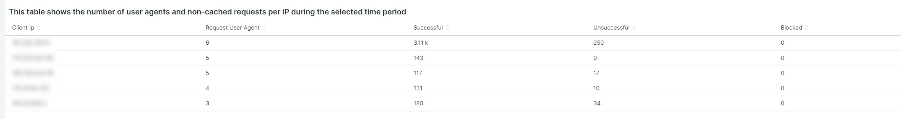
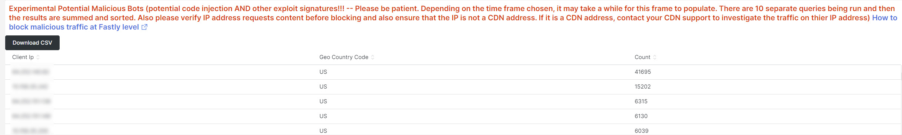

# A variável [!UICONTROL bots] guia

Esta guia tem informações que explicam como identificar se e o que [!DNL bots] estão causando problemas no site.

## Visão geral de alto nível do [!DNL bots]:

* A [!DNL bot] O é um software que executa tarefas repetitivas automatizadas. Com a evolução da inteligência artificial e do aprendizado de máquina, as tarefas, os métodos e as [!DNL bots] estão mudando. Há *bom* [!DNL bots] que beneficiam os sites rastreando-os e adicionando-os aos mecanismos de pesquisa da internet. Isso faz com que os usuários da Internet sejam guiados para o site por meio dos resultados do mecanismo de pesquisa. A *bom* [!DNL bot] normalmente respeita os limites colocados no [!DNL bot] por um `robots.txt` arquivo ou configurações em um console do mecanismo de pesquisa. Limites podem restringir o acesso ao site ou a partes do site.
* Mal-intencionado [!DNL bots] ignorar o `robots.txt` arquivo ou eles podem falsificar uma boa [!DNL bot] por meio do campo agente do usuário da solicitação dos dados da solicitação HTTP. Algumas coisas que são maliciosas [!DNL bots] faça:
   * Adicione carga a um site para negar acesso ao site a usuários legítimos.
   * Remover e reutilizar conteúdo sem permissão.
   * Registre contas falsas para inundar serviços de email ou endereços ou redirecione para outros sites ([!DNL SPAM bots]).
   * Criar visualizações falsas ([!DNL Viewbots]).
   * Compre produtos ou ingressos ([!DNL Focused bots]).
* Gerenciamento [!DNL bots]
   * [!DNL Observation for Adobe Commerce] tem exibições de [!DNL bot] tráfego:
      * Ele mostra o total de arquivos não armazenados em cache [!DNL bot] atividade que exibe a carga que um [!DNL bot] O está adicionando a um site e quando essa carga está acontecendo.
      * Ele mostra o [!DNL bots] que estão gerando erros. Normalmente, se um [!DNL bot] O está adicionando carga que causa problemas no site, que [!DNL bot] ou o endereço IP tem a frequência mais alta de erros.
      * Ele mostra [!DNL bot] nomes (solicitar valores de campo do agente do usuário) e endereços IP para gerenciar por meio de:
         * [!DNL Fastly] (limite de taxa ou [!DNL VCLs] que bloqueiam endereços IP, intervalos ou [!DNL bots] por valor de nome).
         * Adicionando bom [!DNL bot] informações para o `robots.txt field` para restringir ou limitar a taxa de acesso ao site.
         * Gerenciamento [!DNL Bing] ou [!DNL Google bots] por meio do console do mecanismo de pesquisa.

## [!UICONTROL Total Bot traffic by bot name]:

* A variável **[!UICONTROL Total Bot traffic by bot name during selected time period]** contém a contagem agregada de solicitações não armazenadas em cache em que a variável [!UICONTROL request_user_agent] O campo tem uma cadeia de caracteres de [!DNL bots] no valor. Este pode ou não ser o nome [!DNL bot] como o [!UICONTROL request_user_agent] o valor do campo pode ser falsificado. O valor sob o [!UICONTROL Count] é a mais importante.

## [!UICONTROL Total Bot Traffic by Bot name/IP address]

* A variável **[!UICONTROL Total Bot Traffic by Bot name/IP address during selected time period How to block bot traffic on Fastly level OR manage bots through your robots.txt file Best practices for Adobe Commerce robots.txt]** A tabela mostra os mesmos dados que a tabela anterior, mas adiciona endereços IP que fazem as solicitações em nome da [!DNL bot]. Como mal-intencionado [!DNL bots] boa falsificação [!DNL bots], os endereços IP devem ser verificados por meio de sites que identifiquem endereços IP abusivos ou por meio de *whois* serviços ou [!DNL DNS lookups]. Por exemplo, [!DNL Google] publica seu [[!DNL googlebot] Endereços IP](https://developers.google.com/search/apis/ipranges/googlebot.json) e [!DNL Microsoft] tem uma ferramenta de verificação para [[!DNL Bingbots]](https://www.bing.com/webmasters/help/Verify-Bingbot-2195837f).

## [!UICONTROL Graph - Bots with HTTP status errors]

* A variável **[!UICONTROL Graph - Bots with HTTP status errors during selected time period How to block bot traffic on Fastly level OR manage bots through your robots.txt file Best practices for Adobe Commerce robots.txt]** o gráfico mostra erros em [!DNL bots] que se declaram no campo agente do usuário de solicitação. Isso não significa necessariamente que o erro é causado pelo volume do [!DNL bot] ou outro tráfego. Os erros podem ser que a variável [!DNL bot] O está solicitando informações que não existem ou há outro problema na solicitação.
* Se houver um pico de erros nos endereços IP durante a instabilidade ou a interrupção do site, eles poderão ser suspeitos do problema do site.

## [!UICONTROL Table - IPs that do not identify as bots]

* A variável **[!UICONTROL Table - IPs that do not identify as bots with HTTP status errors during selected time period How to block bot traffic on Fastly level OR manage bots through your robots.txt file Best practices for Adobe Commerce robots.txt]** A tabela mostrará solicitações de IP com códigos de status http não 200 que NÃO se identificam como [!DNL bots] no campo agente do usuário da solicitação. Esses endereços IP podem ser endereços IP mal-intencionados, especialmente se as contagens forem altas para o período selecionado.
* Se as contagens de código de status http não 200 forem baixas e os intervalos de endereço IP não forem semelhantes, os endereços podem não estar contribuindo para os problemas do site.

## [!UICONTROL Table – Cache Status 'ERROR']

* Quando os endereços IP estiverem gerando uma alta frequência de erros, pergunte o que eles estão fazendo? A variável **[!UICONTROL Table – Cache Status 'ERROR' detail table (what are these IPs doing?) How to block bot traffic on Fastly level OR manage bots through your robots.txt file Best practices for Adobe Commerce robots.txt]** A tabela mostrará o URL solicitado junto com o valor de status HTTP para solicitações com um status de cache [!UICONTROL ERROR] valor. A frequência é facetada pelo URL, portanto, a contagem pode ser baixa. Lembre-se de que o endereço IP pode estar fazendo milhares de solicitações durante o período selecionado. Essa é uma visualização em relação a até 2000 solicitações durante o período de tempo (o limite de exibição do registro).

## [!UICONTROL Show 5XX status distribution]

* A variável **[!UICONTROL Show 5XX status distribution across IP addresses (top 200 addresses) How to block bot traffic on Fastly level OR manage bots through your robots.txt file Best practices for Adobe Commerce robots.txt]** quadro é eficiente. Ele mostra os endereços IP que têm códigos de status http 5XX durante o período selecionado. Se um endereço IP estiver fazendo um grande volume de solicitações e o site for afetado até o ponto em que não consegue lidar com o tráfego, os endereços IP que estão fazendo a maior frequência de solicitações normalmente terão o maior volume de erros. Os códigos de status http 5XX geralmente indicam um site que está com dificuldades para responder a solicitações.
* Quanto maior a barra, maior a porcentagem de erros que o endereço IP tem no número total de erros 5xx durante esse período. Observação: um endereço IP pode ter vários segmentos no gráfico se tiver vários códigos de status http (exemplo, status http 502 e 503).
* A distribuição típica seria indicada na direção do lado direito da barra, onde os endereços IP são iguais em largura, ou haveria algumas barras largas com contagens muito baixas.
* Se você passar o mouse sobre o segmento de barra, ele mostrará o número dos erros indicados durante o período selecionado.

## [!UICONTROL IP cache status (MISS, PASS, ERROR) and HTTP status]

* Este **[!UICONTROL IP cache status (MISS, PASS, ERROR) and HTTP status during selected time period How to block bot traffic on Fastly level OR manage bots through your robots.txt file Best practices for Adobe Commerce robots.txt]** O quadro mostra a contagem de código do status HTTPS e solicitações não armazenadas em cache por IP no intervalo de tempo selecionado. Isso indica a carga proporcional de cada endereço IP e o volume total. Ele mostrará os endereços IP com mais solicitações.

## [!UICONTROL Fastly Cache Summary for selected time period]

* Se você clicar no botão [!UICONTROL Error] no gráfico abaixo, é possível comparar os dois últimos gráficos. Isso pode ajudar a indicar onde a carga contribui para problemas do site.

## [!UICONTROL Graph - IPs that do not identify as bots]

* A variável **[!UICONTROL Graph - IPs that do not identify as bots without error during selected time period How to block bot traffic on Fastly level OR manage bots through your robots.txt file Best practices for Adobe Commerce robots.txt]** O quadro mostra o campo agente do usuário da solicitação, o endereço IP e o código de status das solicitações em que o campo agente do usuário da solicitação não indica um [!DNL bot]. Esse quadro pode mostrar solicitações de alta frequência de qualquer endereço IP, mas preste atenção a solicitações de alta frequência, especialmente durante um período em que o site possa ter problemas.

## [!UICONTROL Graph - Suspicious Non-Bot traffic]

* A variável **[!UICONTROL Graph - Suspicious Non-Bot traffic during selected time period]** O gráfico procura um valor de agente do usuário de solicitação de Go-http-client, mas será estendido para procurar outros valores de agente do usuário de solicitação suspeitos. Esse valor do agente do usuário de solicitação é usado pelos sites para conexão de serviços da e pode ser válido, mas também é usado por usuários mal-intencionados [!DNL bots].

## [!UICONTROL Graph - Bot traffic by Bot name]

* A variável **[!UICONTROL Graph - Bot traffic by Bot name during selected time period]** mostra os mesmos dados que o tráfego Total de bot por [!DNL Bot] nomeie durante a tabela de período selecionada na parte superior da guia. Os dados são exibidos na linha do tempo para que seja possível ver quando as solicitações do [!DNL bots] e suas distribuições.

## [!UICONTROL Graph - Top 250 Bot Names and IP addresses]

* A variável **[!UICONTROL Graph - Top 250 Bot Names and IP addresses during selected time period How to block bot traffic on Fastly level OR manage bots through your robots.txt file Best practices for Adobe Commerce robots.txt]** mostra os mesmos dados que o Total [!DNL Bot] Tráfego por nome de bot/endereço IP durante a tabela de período selecionada na parte superior da guia. Ele mostra os dados por meio da linha do tempo e os encaminha pelo endereço IP. Isso mostra quando as solicitações do [!DNL bots] são feitas, que IP está fazendo solicitações e as distribuições das solicitações.

## [!UICONTROL Blocked Bot name / IP addresses (in Fastly)]

* A variável **[!UICONTROL Blocked Bot name / IP addresses (in Fastly) during selected time period. This graph displays bot traffic and IPs that were returned a 403 Forbidden HTTP Status code]** O quadro mostra o nome do bot e os endereços IP bloqueados. Você pode ver neste gráfico como todas as solicitações são bloqueadas no [!DNL Fastly] daqui para frente.

## [!UICONTROL Blocked non-Bot name / IP addresses (in Fastly)]

* A variável **[!UICONTROL Blocked non-Bot name / IP addresses (in Fastly) during selected time period graph displays non-bot traffic and IPs that were returned a 403 Forbidden HTTP Status code]** mostra endereços IP que não se identificam como um [!DNL bot] que foram bloqueadas por meio de [!DNL Fastly].

## [!UICONTROL This table shows the number of user agents per IP address, number of successful, unsuccessful and blocked requests:]

* Mal-intencionado [!DNL bots] muitas vezes falsificar outros [!DNL bots] pelo valor de [!UICONTROL Request User Agent] campo. Esta tabela mostra quantos valores únicos o endereço IP tem nesse campo. Quanto maior o valor na variável [!UICONTROL Request User Agent] , quanto mais suspeito for o endereço IP.

## [!UICONTROL IP with non-200 status errors]

* A variável **[!UICONTROL IP with non-200 status errors – without 403 status]** mostra a distribuição, ao longo do período selecionado, de endereços IP com códigos de status HTTP diferentes de 200. Quando você vê valores mais altos em um único IP ou grupo de endereços IP, eles exigem mais investigação.

## [!UICONTROL IP with 403 status codes:]

* A variável **[!UICONTROL IP with 403 status codes]** O quadro mostra solicitações não armazenadas em cache sem [!UICONTROL cache_status=ERROR] que tenham um status HTTP 403. Isso pode mostrar que o servidor de origem é a origem do 403 (não autorizado) em vez de um bloqueio do [!DNL Fastly].

## [!UICONTROL Top 5 with non-200 status codes]

* A variável **[!UICONTROL Top 5 with non-200 status codes showing cache_status]** A tabela mostra, em um nível de IP/status, as contagens de cada um com a [!UICONTROL cache_status] valor.

## [!UICONTROL Pageview Latency will show as spikes]

* A variável **[!UICONTROL Pageview Latency will show as spikes on this graph:]** mostra a latência de resposta de carregamento de página/API que pode estar alinhada com a variável [!DNL bot] tráfego.

## [!UICONTROL Experimental Potential Malicious Bots] quadro

A variável **[!UICONTROL Experimental Potential Malicious Bots]** O quadro executa dez consultas complexas e separadas. Ele detecta assinaturas de solicitações de IP mal-intencionadas e agrega os resultados, soma e classifica por contagem em ordem decrescente. Os queries contêm uma infinidade de assinaturas de dados de explorações CVE e outras solicitações mal-intencionadas. Mesmo quando as explorações são bloqueadas por correções/patches de segurança e não são uma ameaça para o site, a solicitação ainda tem que ser tratada pelo site. O volume de solicitações pode se tornar bastante significativo em um curto período de tempo. Esse quadro não mostra o total de solicitações do endereço IP, mas as solicitações que têm sinais que indicam que as solicitações tinham intenção suspeita.

Verifique se o tráfego é suspeito e se não é originário de um endereço de rede distribuída de conteúdo (CDN) que também possa estar entregando solicitações válidas. Se as solicitações forem determinadas como provenientes de um endereço IP CDN, entre em contato com esse fornecedor de serviços para obter ajuda no bloqueio do tráfego suspeito por meio de sua rede. Se precisar bloquear o endereço ou solicitar o URL, consulte [Bloquear tráfego mal-intencionado para o Adobe Commerce em [!DNL Fastly] nível](https://experienceleague.adobe.com/docs/commerce-knowledge-base/kb/how-to/block-malicious-traffic-for-magento-commerce-on-fastly-level.html) na Base de conhecimento de suporte da Adobe Commerce.
