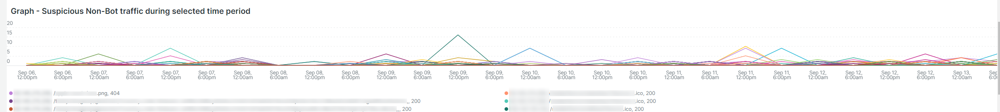

# O [!UICONTROL bots] guia

Essa guia tem informações que explicam como identificar se e o que [!DNL bots] estão causando problemas no site.

## Visão geral de alto nível da [!DNL bots]:

* A [!DNL bot] é um software que executa tarefas automáticas repetitivas. Com a inteligência artificial e a evolução do aprendizado de máquina, as tarefas, os métodos e as interações de [!DNL bots] estão mudando. Existem *bom* [!DNL bots] que beneficiam sites rastreando e adicionando-os a mecanismos de pesquisa da Internet. Isso resulta em usuários da Internet serem guiados para o site por meio de resultados de mecanismos de pesquisa. A *bom* [!DNL bot] normalmente respeita os limites colocados na [!DNL bot] por um `robots.txt` arquivo ou configurações em um console de mecanismo de pesquisa. Os limites podem restringir o acesso ao site ou a partes do site.
* Malicioso [!DNL bots] ignorar o `robots.txt` ou podem ser uma boa prova [!DNL bot] por meio do campo request user agent dos dados de solicitação HTTP. Algumas coisas que são mal-intencionadas [!DNL bots] fazer:
   * Adicione carregamento a um site para negar aos usuários legítimos acesso ao site.
   * Comprima e reutilize conteúdo sem permissão.
   * Registre contas falsas para inundar serviços ou endereços de email ou redirecionar para outros sites ([!DNL SPAM bots]).
   * Criar exibições falsas ([!DNL Viewbots]).
   * Compre produtos ou tíquetes ([!DNL Focused bots]).
* Gerenciamento [!DNL bots]
   * [!DNL Observation for Adobe Commerce] tem pontos de vista de [!DNL bot] tráfego:
      * Mostra o total não armazenado em cache [!DNL bot] atividade que exibe a carga que uma [!DNL bot] está sendo adicionado a um site e quando essa carga está acontecendo.
      * Mostra o [!DNL bots] que estão gerando erros. Normalmente, se uma [!DNL bot] está adicionando carga que causa problemas no site, que [!DNL bot] ou endereço IP tem a maior frequência de erros.
      * Ele mostra [!DNL bot] nomes (solicitar valores de campo do agente do usuário) e endereços IP para gerenciar por meio de:
         * [!DNL Fastly] (limite de velocidade ou [!DNL VCLs] que bloqueiam endereços IP, intervalos ou [!DNL bots] por valor de nome).
         * Adição de bom [!DNL bot] à `robots.txt field` para restringir ou limitar a taxa de acesso ao site.
         * Gerenciamento [!DNL Bing] ou [!DNL Google bots] pelo console do mecanismo de pesquisa.

## [!UICONTROL Total Bot traffic by bot name]:

* O **[!UICONTROL Total Bot traffic by bot name during selected time period]** a tabela contém a contagem agregada de solicitações não armazenadas em cache, onde a variável [!UICONTROL request_user_agent] tem uma string de [!DNL bots] no valor . Pode ou não ser nomeado [!DNL bot] como [!UICONTROL request_user_agent] o valor do campo pode ser falsificado. O valor sob a variável [!UICONTROL Count] é a coluna mais importante.

## [!UICONTROL Total Bot Traffic by Bot name/IP address]

* O **[!UICONTROL Total Bot Traffic by Bot name/IP address during selected time period How to block bot traffic on Fastly level OR manage bots through your robots.txt file Best practices for Adobe Commerce robots.txt]** mostra os mesmos dados da tabela anterior, mas adiciona endereços IP fazendo as solicitações em nome do nome [!DNL bot]. Como mal-intencionado [!DNL bots] porcaria boa [!DNL bots], o(s) endereço(s) IP(s) deve(m) ser verificado(s) através de sites que identifiquem endereços IP abusivos ou através de *whois* serviços ou [!DNL DNS lookups]. Por exemplo, [!DNL Google] publica seus [[!DNL googlebot] Endereços IP](https://developers.google.com/search/apis/ipranges/googlebot.json) e [!DNL Microsoft] tem um instrumento de verificação para [[!DNL Bingbots]](https://www.bing.com/webmasters/help/Verify-Bingbot-2195837f).

## [!UICONTROL Graph - Bots with HTTP status errors]

* O **[!UICONTROL Graph - Bots with HTTP status errors during selected time period How to block bot traffic on Fastly level OR manage bots through your robots.txt file Best practices for Adobe Commerce robots.txt]** o gráfico mostra erros em [!DNL bots] que se declaram no campo solicitar agente do usuário. Isso não significa necessariamente que o erro seja causado pelo volume da variável [!DNL bot] ou outro tráfego. Os erros podem ser que a variável [!DNL bot] O está solicitando informações que não existem ou há outro problema na solicitação.
* Se houver um pico de erros em endereços IP durante a instabilidade ou interrupção do site, eles poderão ser suspeitos do problema do site.

## [!UICONTROL Table - IPs that do not identify as bots]

* O **[!UICONTROL Table - IPs that do not identify as bots with HTTP status errors during selected time period How to block bot traffic on Fastly level OR manage bots through your robots.txt file Best practices for Adobe Commerce robots.txt]** a tabela mostrará solicitações de IP com códigos de status http não-200 que NÃO SE autoidentificam como [!DNL bots] no campo solicitar agente do usuário. Esses endereços IP podem ser endereços IP mal-intencionados, especialmente se as contagens forem altas para o período selecionado.
* Se as contagens de código de status http não-200 forem baixas e os intervalos de endereço IP não forem semelhantes, os endereços podem não estar contribuindo para os problemas do site.

## [!UICONTROL Table – Cache Status 'ERROR']

* Quando os endereços IP estão gerando uma alta frequência de erros, pergunte o que eles estão fazendo? O **[!UICONTROL Table – Cache Status 'ERROR' detail table (what are these IPs doing?) How to block bot traffic on Fastly level OR manage bots through your robots.txt file Best practices for Adobe Commerce robots.txt]** a tabela mostrará o URL solicitado junto com o valor de status HTTP para solicitações que têm um status de cache [!UICONTROL ERROR] valor. A frequência é facetada pelo URL para que a contagem possa ser baixa. Lembre-se de que o endereço IP pode estar fazendo milhares de solicitações durante o período de tempo selecionado. Essa é uma visualização em relação a até 2000 solicitações durante o período (o limite de exibição do registro).

## [!UICONTROL Show 5XX status distribution]

* O **[!UICONTROL Show 5XX status distribution across IP addresses (top 200 addresses) How to block bot traffic on Fastly level OR manage bots through your robots.txt file Best practices for Adobe Commerce robots.txt]** O quadro é potente. Ele mostra os endereços IP que têm códigos de status http 5XX durante o período selecionado. Se um endereço IP estiver fazendo um alto volume de solicitações e o site for afetado ao ponto em que não pode lidar com o tráfego, os endereços IP que estão fazendo a maior frequência de solicitações normalmente terão o maior volume de erros. Os códigos de status http 5XX geralmente indicam um site que está se esforçando para responder a solicitações.
* Quanto maior a barra, maior a % de erros que o endereço IP tem no número total de erros 5xx durante esse período. Observação: um endereço IP pode ter vários segmentos no gráfico se ele tiver vários códigos de status http (por exemplo, status http 502 e 503).
* A distribuição típica seria indicada no lado direito da barra, onde os endereços IP são iguais em largura, ou haveria algumas barras largas com contagens muito baixas.
* Se você passar o mouse sobre o segmento de barras, ele mostrará o número de erros indicados durante o período de tempo selecionado.

## [!UICONTROL IP cache status (MISS, PASS, ERROR) and HTTP status]

* Essa **[!UICONTROL IP cache status (MISS, PASS, ERROR) and HTTP status during selected time period How to block bot traffic on Fastly level OR manage bots through your robots.txt file Best practices for Adobe Commerce robots.txt]** quadro mostra a contagem de código do status HTTPS e as solicitações não armazenadas em cache por IP no período selecionado. Isso indica a carga proporcional de cada endereço IP e o volume total. Ele mostrará os endereços IP com mais solicitações.

## [!UICONTROL Fastly Cache Summary for selected time period]

* Se você clicar no botão [!UICONTROL Error] no gráfico abaixo, é possível comparar os dois últimos gráficos entre si. Isso pode ajudar a indicar onde a carga contribui para problemas do site.

## [!UICONTROL Graph - IPs that do not identify as bots]

* O **[!UICONTROL Graph - IPs that do not identify as bots without error during selected time period How to block bot traffic on Fastly level OR manage bots through your robots.txt file Best practices for Adobe Commerce robots.txt]** quadro mostra o campo agente do usuário da solicitação, o endereço IP e o código de status das solicitações em que o campo agente do usuário da solicitação não indica um [!DNL bot]. Esse quadro pode mostrar solicitações de alta frequência de qualquer endereço IP, mas prestar atenção a solicitações de alta frequência, especialmente durante um período em que o site pode ter problemas.

## [!UICONTROL Graph - Suspicious Non-Bot traffic]

* O **[!UICONTROL Graph - Suspicious Non-Bot traffic during selected time period]** O gráfico procura um valor de agente de usuário de solicitação de Go-http-client, mas será estendido para examinar outros valores suspeitos do agente de usuário de solicitação. Este valor de agente de usuário de solicitação é usado por sites para conexão a partir de serviços e pode ser válido, mas também é usado por mal-intencionado [!DNL bots].

## [!UICONTROL Graph - Bot traffic by Bot name]

* O **[!UICONTROL Graph - Bot traffic by Bot name during selected time period]** O quadro está mostrando os mesmos dados que o tráfego total de bot por [!DNL Bot] durante a tabela do período de tempo selecionado na parte superior da guia . Ela está mostrando os dados através da linha do tempo para que você possa ver quando as solicitações do [!DNL bots] estão a ser feitas e as suas distribuições.

## [!UICONTROL Graph - Top 250 Bot Names and IP addresses]

* O **[!UICONTROL Graph - Top 250 Bot Names and IP addresses during selected time period How to block bot traffic on Fastly level OR manage bots through your robots.txt file Best practices for Adobe Commerce robots.txt]** O quadro está mostrando os mesmos dados do Total [!DNL Bot] Tráfego por nome do robô/endereço IP durante a tabela do período de tempo selecionado na parte superior da guia . Ela está mostrando os dados pela linha do tempo e os lapidando por endereço IP. Isso mostra quando as solicitações da [!DNL bots] são feitas, qual IP está fazendo solicitações e a distribuição das solicitações.

## [!UICONTROL Blocked Bot name / IP addresses (in Fastly)]

* O **[!UICONTROL Blocked Bot name / IP addresses (in Fastly) during selected time period. This graph displays bot traffic and IPs that were returned a 403 Forbidden HTTP Status code]** frame mostra o nome do bot e os endereços IP que estão bloqueados. Você pode ver neste gráfico como todas as solicitações são bloqueadas no [!DNL Fastly] Avançar.

## [!UICONTROL Blocked non-Bot name / IP addresses (in Fastly)]

* O **[!UICONTROL Blocked non-Bot name / IP addresses (in Fastly) during selected time period graph displays non-bot traffic and IPs that were returned a 403 Forbidden HTTP Status code]** quadro mostra endereços IP que não se identificam como um [!DNL bot] que tenham sido bloqueados [!DNL Fastly].

## [!UICONTROL This table shows the number of user agents per IP address, number of successful, unsuccessful and blocked requests:]

* Malicioso [!DNL bots] frequentemente falsa [!DNL bots] através do valor da variável [!UICONTROL Request User Agent] campo. Esta tabela mostra quantos valores únicos o endereço IP tem nesse campo. Quanto maior o valor na variável [!UICONTROL Request User Agent] , quanto mais suspeito for o endereço IP.

## [!UICONTROL IP with non-200 status errors]

* O **[!UICONTROL IP with non-200 status errors – without 403 status]** O quadro está mostrando a distribuição no período selecionado de endereços IP com códigos de status HTTP diferentes de 200. Quando você vê valores mais altos em um único IP ou grupo de endereços IP, eles exigem mais investigação.

## [!UICONTROL IP with 403 status codes:]

* O **[!UICONTROL IP with 403 status codes]** quadro mostra solicitações não armazenadas em cache sem [!UICONTROL cache_status=ERROR] que têm um status HTTP 403. Isso pode mostrar que o servidor de origem é a fonte do 403 (não autorizado) em vez de um bloco de [!DNL Fastly].

## [!UICONTROL Top 5 with non-200 status codes]

* O **[!UICONTROL Top 5 with non-200 status codes showing cache_status]** A tabela está mostrando em um nível de IP / status as contagens de cada um com a variável [!UICONTROL cache_status] valor.

## [!UICONTROL Pageview Latency will show as spikes]

* O **[!UICONTROL Pageview Latency will show as spikes on this graph:]** o quadro mostra a latência de resposta de carregamento de página/API que pode estar em conformidade com o [!DNL bot] tráfego.

## [!UICONTROL Experimental Potential Malicious Bots] quadro

O **[!UICONTROL Experimental Potential Malicious Bots]** O quadro executa dez consultas separadas e complexas. Ele detecta assinaturas de solicitação de IP mal-intencionadas e agrega os resultados, soma e classifica por contagem em ordem decrescente. As consultas contêm uma grande variedade de assinaturas de dados de explorações CVE e outras solicitações mal-intencionadas. Mesmo quando as explorações são bloqueadas por correções/patches de segurança e não são uma ameaça ao site, a solicitação ainda precisa ser gerenciada pelo site. O volume de pedidos pode tornar-se bastante significativo num curto período de tempo. Esse quadro não mostra o total de solicitações do endereço IP, mas as solicitações que têm sinais que indicam que as solicitações tiveram intenção suspeita.

Certifique-se de verificar se o tráfego é suspeito e se o tráfego não é originário de um endereço da Rede distribuída de conteúdo (CDN) que também pode estar fornecendo solicitações válidas. Se as solicitações forem determinadas como sendo de um endereço IP CDN, entre em contato com esse fornecedor de serviços para ajudar a bloquear o tráfego suspeito por meio de sua rede. Se precisar bloquear o endereço ou o URL da solicitação, consulte [Bloquear tráfego mal-intencionado no Adobe Commerce em [!DNL Fastly] nível](https://experienceleague.adobe.com/docs/commerce-knowledge-base/kb/how-to/block-malicious-traffic-for-magento-commerce-on-fastly-level.html) na Base de conhecimento de suporte da Adobe Commerce.
