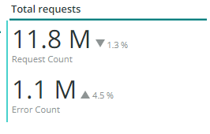
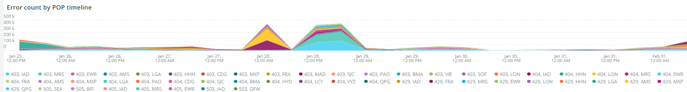

# A guia [!UICONTROL CDN]

Esta guia tem informações com foco no [!DNL content delivery network (CDN)]. No caso do Adobe Commerce Cloud, esse é o serviço [!DNL Fastly].

## [!UICONTROL HIT rate]

O quadro **[!UICONTROL HIT rate]** mostra o número de solicitações armazenáveis em cache que resultaram em [!UICONTROL HITS] no último minuto. Isso indica cache bem-sucedido. A seta para a direita mostrará a porcentagem acima ou abaixo do mesmo horário uma semana atrás.

## [!UICONTROL HIT Processing]

Esta caixa **[!UICONTROL HIT processing]** mostra o número de solicitações armazenáveis em cache que resultaram em [!UICONTROL HITS] durante a semana.

## [!UICONTROL MISS rate]

Esta caixa **[!UICONTROL MISS rate]** mostra o número de solicitações que podem ser armazenadas em cache no último minuto. Uma falha ocorre quando a solicitação não é armazenada em cache e deve ser passada para o servidor de origem para fornecer o conteúdo. O valor à direita é a comparação do aumento/diminuição com o número de minutos por minuto, uma semana antes.

## [!UICONTROL MISS time]

## [!UICONTROL HIT Ratio]

## [!UICONTROL Error Percentage]

A caixa **[!UICONTROL Error Percentage]** exibe o valor da porcentagem de ERRO das solicitações e mostra o aumento/diminuição relativos em comparação com o mesmo período na semana anterior.

## [!UICONTROL Total Requests]

## [!UICONTROL ERROR rate]

## [!UICONTROL Fastly Cache Average Response for selected time period in seconds]

Este quadro mostra a duração em segundos das solicitações armazenáveis em cache, o que significa que, se `cache_response` for um [!UICONTROL MISS], ele exibirá a média de respostas não armazenadas em cache para o tempo selecionado.

## [!UICONTROL Fastly Cache Average Response for selected time period in seconds, faceted by POP]

*POP* neste contexto refere-se a um Ponto de Presença (POP) configurado para funcionar como um pool para armazenamento em cache. Consulte [Pontos de presença](https://developer.fastly.com/learning/concepts/pop/).

## [!UICONTROL Total Bandwidth (All POPs) during the selected timeframe, compared with 1 week ago (% increase/decrease)]

## [!UICONTROL Requests – Since selected timeframe compared with one week ago]

Este quadro é semelhante à caixa de resumo para [!UICONTROL Total Requests] na parte superior, mas mostra as contagens de solicitações de semanas anteriores. Estas são todas as solicitações, não apenas solicitações que podem ser armazenadas em cache (onde `is_cacheable` é verdadeiro).

## [!UICONTROL Response Count]

## [!UICONTROL Bandwidth by POP]

## [!UICONTROL Top 5 URLs (5xx or 3xx status codes)]

A exibição **[!UICONTROL Top 5 URLs]** mostra as 5 URLs principais que estão apresentando respostas de erro 5xx ou 3xx. Devido à restrição de espaço, será necessário passar o mouse sobre o URL para ver o código de erro específico associado a esse URL. (exemplo na caixa vermelha da figura acima).

## [!UICONTROL Top 25 URLs (200 status)]

O quadro **[!UICONTROL Top 25 URLs]** mostra as URLs que retornaram um status 200 por contagem durante o período selecionado.

## [!UICONTROL Duration by Response Status]

O gráfico **[!UICONTROL Duration by Response Status]** exibe as respostas de erro por contagem durante o período selecionado, facetadas pelo código de status de erro.

## [!UICONTROL Duration by Response Status, top 25 urls]

O gráfico **[!UICONTROL Duration by Response Status, top 25 URLs]** mostra as 25 principais URLs pela duração da resposta em segundos. Talvez seja necessário passar o mouse sobre o URL para ver todo o caminho. Além disso, para remover todos, exceto um URL, clique nesse URL. Você pode adicionar outros URLs novamente clicando neles individualmente. Se quiser remover URLs individuais, mantenha a tecla e clique em cada URL para removê-los do gráfico.

## [!UICONTROL Duration by Response Status, top 25 non-200 status]

O gráfico **[!UICONTROL Duration by Response Status, top 25 non-200 status]** é semelhante ao último, exceto que o foco está em códigos de status diferentes de 200 ou códigos de status de erro. Ele mostrará o código de erro e, em seguida, o URL. Talvez seja necessário passar o mouse sobre o URL para ver todo o caminho. Além disso, para remover todos, exceto um URL, clique nesse URL. Você pode adicionar outros URLs novamente clicando neles individualmente. Se quiser remover URLs individuais, mantenha a tecla e clique em cada URL para removê-los do gráfico.

## [!UICONTROL Error Count by POP timeline]

O gráfico **[!UICONTROL Error Count by POP timeline]** exibe a contagem dos status de erro ao longo da linha do tempo do período selecionado, facetada pelo código de erro.

## [!UICONTROL Duration by Response status, top 25 client IP, non-200 status]

O gráfico **[!UICONTROL Duration by Response status, top 25 client IP, non 200 status]** mostra os endereços IP pela duração média no período selecionado em que havia códigos de erro de status.

## [!UICONTROL IP Frequency]

O quadro **[!UICONTROL IP Frequency]** conta os status (&#39;MISS&#39; e &#39;PASS&#39;) para cada IP dos logs [!DNL Fastly]. As solicitações da Web com esses status chegarão ao servidor de origem e adicionarão carga ao servidor. Ele mostra os vinte principais endereços em frequência. Esse quadro pode ser usado para detectar ataques de IP ou origens de carga pesada em um site. Este gráfico também está presente na guia de resumo e é colocado aqui para facilitar a comparação com mais detalhes sobre as informações de log do [!DNL Fastly] exibidas nessa guia.
