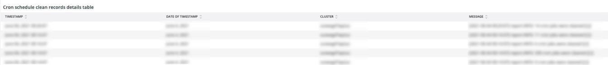

# O [!DNL Cron] guia

Esta guia é uma tentativa de isolar rapidamente os problemas e as causas de [!DNL cron] problemas.

## [!UICONTROL Cron transaction duration in seconds]

O **[!UICONTROL Cron transaction duration in seconds]** quadros exibidos [!DNL crons] duração da transação em segundos. Isso exibirá as transações que têm tempos de execução longos. Um mergulho mais profundo no APM mostrará mais detalhes sobre qual query a transação/operação pode estar sendo executada.

## [!UICONTROL MySQL Non-Sleeping Threads by Node]

O **[!UICONTROL MySQL Non-Sleeping Threads by Node]** O quadro mostra os threads do MySQL Non-Sleching por nó no período selecionado.

## [!UICONTROL SQL Trace count by path]

O **[!UICONTROL SQL Trace count by path]** O quadro procura as contagens de rastreamento do MySQL por caminho, o que pode ajudar a rastrear instruções SQL em um período selecionado.

## [!UICONTROL Cron database call]

O **[!UICONTROL Cron database call]** o quadro observa o número de [!DNL crons] chamada para o banco de dados em um período selecionado.

## [!UICONTROL Cron schedule table locks]

O **[!UICONTROL Cron schedule table locks]** o quadro procura [!DNL cron] a tabela do agendamento é bloqueada em um período selecionado.

## [!UICONTROL Cron schedule clean cron fired]

O **[!UICONTROL Cron schedule clean cron fired]** o quadro observa o número de [!DNL crons] limpo em um período selecionado. Se nenhum dado for exibido nesse quadro, isso pode indicar um problema com [!DNL crons] em execução corretamente. Se a variável [!DNL cron] a programação de tarefas não é limpa, [!DNL crons] não será executado de maneira ideal e pode demorar mais para ser executado.

## [!UICONTROL Cron schedule clean records details table]

O **[!UICONTROL Cron schedule clean records details table]** a tabela fornece detalhes sobre a tarefa para limpar registros da `cron_schedule` em um período selecionado.

## [!UICONTROL cron_schedule table updates]

O **[!UICONTROL cron_schedule table updates]** o quadro observa o número de [!DNL cron] atualizações de tabela programadas em um período selecionado. A alta atividade na exclusão ou atualização desta tabela pode indicar um problema com [!DNL crons]. Além disso, [!DNL crons] atualize esta tabela quando elas forem executadas e concluídas, portanto, se não houver nenhuma atividade nessa tabela e houver [!DNL crons] configurado, pode haver um problema com [!DNL crons].

## [!UICONTROL Datastore Operations Tables]

O **[!UICONTROL Datastore Operations Tables]** observa as operações da tabela do banco de dados, incluindo `SELECT`, `DELETE`e `UPDATE` em um período selecionado. Este quadro mostra as tabelas do banco de dados com a maior frequência de operação em relação a elas.
