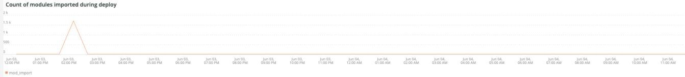

# O [!UICONTROL Deploy] guia

Esta guia é uma tentativa de isolar rapidamente os problemas e as causas dos problemas de implantação.

## [!UICONTROL Deploy log Deployment Troubleshooter]

O **[!UICONTROL Deploy log Deployment Troubleshooter]** quadro mostra uma contagem de eventos de log de implantação que ocorreram no período selecionado. O objetivo é fornecer uma visualização instantânea da atividade de implantação e determinar a complexidade da implantação pela contagem. Quanto mais mensagens registradas, mais complexa a implantação normalmente é.

## [!UICONTROL Deploy State]

O **[!UICONTROL Deploy State]** quadro mostra os eventos de implantação que ocorreram ao longo do período selecionado. O analisador deste quadro está procurando estes sinais específicos:

* &#39;%AVISO: Iniciando gerar comando%&#39;) como &#39;start_gen&#39;
* &#39;%git apply /app/vendor/magento/ece-tools/patches%&#39;) como &#39;apply_patches&#39;
* &#39;%Definir sinalizador: .static_content_deploy%&#39;) como &#39;SCD&#39;
* &#39;%AVISO: Gerar comando concluído%&#39;) como &#39;gen_compl&#39;
* &#39;%AVISO: Iniciando implantação.%&#39;) como &#39;start_deploy&#39;
* &#39;%AVISO: Implantação concluída%&#39;) como &#39;deploy_compl&#39;
* &#39;%AVISO: Iniciar pós-implantação.%&#39;) como &#39;start_deploy&#39;
* &#39;%AVISO: A pós-implantação foi concluída (%) como &quot;implantar&quot;
* &#39;%deploy-complete%&#39;) como &#39;cl_deploy_compl&#39;

## [!UICONTROL Deploy Log Detail]

O **[!UICONTROL Deploy Log Detail]** quadro mostra os detalhes resumidos da mensagem de log de implantação que ocorreram ao longo do período selecionado. O quadro está analisando as seguintes strings nos logs de implantação:

* ‘%AVISO: Iniciando implantação.%&#39;) como &#39;start_ply&#39;
* &#39;%INFO: Iniciando cenário(s): scenario/deploy.xml%&#39;) como &#39;start_scenario&#39;
* &#39;%AVISO: Iniciando o pre-deploy%&#39;) como &#39;start_predply&#39;
* &#39;% INFORMAÇÕES: Restaurando arquivo de log de patch%&#39;) como &#39;rstr_ptch_log&#39;
* &#39;%INFO: Atualização da configuração do cache.%&#39;) como &#39;updt_cach_config&#39;
* &#39;%INFO: Definir Conexão Subordinada de Redis%&#39;) como &#39;redis_sec_conn_set&#39;
* &#39;%INFO: A implantação de conteúdo estático foi executada durante o gancho da compilação, limpando o conteúdo antigo%&#39;) como &#39;scd_build_hk&#39;
* &#39;%INFO: Limpando pub/static%&#39;) como &#39;clr_pub_static&#39;
* &#39;%NFO: Limpando cache de redis:%&#39;) como &#39;clr_redis_cach&#39;
* &#39;%INFO: Limpando var/cache diretory%&#39;) como &#39;clr_var_cach&#39;
* AVISO &#39;%: Ativando o modo de manutenção%&#39;) como &#39;enable_maint_mode&#39;
* &#39;%INFO: Desativar cron%&#39;) como &#39;disable_cron&#39;
* &#39;%INFO: Tentando interromper a execução de trabalhos cron e processos de consumidores (%) como &#39;kill_cron_try&#39;
* &#39;%INFO: A execução de processos de Magento cron e de consumidores não foi encontrada.%&#39;) como &#39;no_cron_fnd&#39;,
* %AVISO: Validando a configuração%&#39;) como &#39;validate_config&#39;
* &#39;%Os seguintes dados de administrador são necessários para criar um usuário administrador durante a instalação inicial%&#39;) como &#39;no_admin&#39;
* &#39;%version PHP recomendada satisfazendo a restrição%&#39;) como &#39;php_ver_constraint&#39;
* &#39;%AVISO: Corrigir a configuração com determinadas sugestões:%&#39;) como &#39;fix_config_sugg&#39;
* &#39;%AVISO: [2003] O valor do nível de aninhamento de diretório para relatório de erros não foi configurado.%&#39;) como&#39;nest_err_reporting&#39;
* &#39;%AVISO: Fim da validação%&#39;) como &#39;end_validation&#39;
* &#39;%AVISO: Iniciando atualização.%&#39;) como &#39;start_update&#39;
* &#39;%INFO: Atualização de env.php.%&#39;) como &#39;update_php_env&#39;
* &#39;%INFO: Atualizando a configuração da conexão de banco de dados env.php.%&#39;) como &#39;update_php_env_db&#39;
* &#39;%INFO: Atualizando a configuração do AMQP env.php%&#39;) como &#39;update_php_env_amqp&#39;
* &#39;%INFO: Defina o mecanismo de pesquisa como: elasticsearch7%&quot;) como &#39;set_elastic7&#39;
* &#39;%elasticsearch 6.5.4 passou EOL%&#39;) como &#39;elastic_ver_EOL&#39;
* &#39;%INFO: Defina o mecanismo de pesquisa como: elasticsearch6%&#39;) como &#39;set_elastic6&#39;
* &#39;%INFO: Atualizar URLs seguras e inseguras%&#39;) como &#39;update_urls&#39;
* &#39;%INFO: Executando atualização de configuração.%&#39;) como &#39;setup_upgrade_run&#39;
* &#39;%INFO: Gancho pós-implantação ativado. Ativação de cron, limpeza de cache e operações de pré-aquecimento são adiadas%&#39;) como &#39;post_hook_enabled&#39;
* &#39;%AVISO: O modo de manutenção está desativado.%&#39;) como &#39;maint_mode_disabled&#39;
* &#39;%INFO: Cenário(s) concluído(s)%&#39;) como &#39;cenário_concluído&#39;
* &#39;%AVISO: Manutenção de comando:habilitar concluído com um erro. Criando um arquivo sinalizador de manutenção%&#39;) como &#39;enable_maintenance_fail&#39;
* &#39;%MySQL server has away%&#39;) como &#39;MySQL_has_away&#39;

## [!UICONTROL Post Deploy Log Detail]

O **[!UICONTROL Post Deploy Log Detail]** quadro mostra os detalhes do log pós-implantação que ocorreram ao longo do período selecionado. Esse quadro está focado em mensagens de log específicas que contêm as seguintes strings:

* &#39;%Disabled manutenção mode%&#39;) como &#39;disabled_maint_mode&#39;
* &#39;%INFO: Iniciando cenário(s): scenario/post-deploy.xml%&#39;) como &#39;start_pstdply_scenario&#39;
* AVISO &#39;%: Validando configuração%&#39;) como &#39;val_config&#39;
* AVISO &#39;%: Fim da validação%&#39;) como &#39;end_val_config&#39;
* &#39;%INFO: Ativar cron%&#39;) como &#39;cron_enabled&#39;
* &#39;% INFORMAÇÕES: Crie backup de arquivos importantes.%&#39;) como &#39;file_backup&#39;
* &#39;%INFO: Backup% criado com êxito) como &#39;file_backup_success&#39;
* &#39;%INFO: Iniciando o aquecimento da página%&#39;) como &#39;pg_warmup_start&#39;
* &#39;%INFO: Página aquecida:%&#39;) como &#39;warmed_up_pg&#39;
* &#39;%ERROR: O aquecimento falhou:%&#39;) como &#39;hot_up_pg_err&#39;
* &#39;% INFORMAÇÕES: Cenário(s) concluído(s)%&#39;) como &#39;cenário_concluído&#39;

## [!UICONTROL Cloud Log Detail]

O **[!UICONTROL Cloud Log Detail]** quadro mostra os detalhes do log de nuvem que ocorreram ao longo do período selecionado. As strings a seguir são analisadas e retornadas com o rótulo &quot;AS&quot; abaixo:

* &#39;%DEBUG: /bin/bash -c &quot;set -o pipefail; php ./bin/magento configuração:upgrade%&#39;) como &#39;start_update&#39;
* &#39;%Schema creation/updates:%&#39;) como &#39;schema_updates&#39;
* &#39;%Nada para importar.%&#39;) como &#39;mod_import_end&#39;
* &#39;%AVISO: Fim da atualização.%&#39;) como &#39;update_completed&#39;
* &#39;%DEBUG: Etapa de execução: deploy-static-content%&#39;) como &#39;scd_run&#39;
* AVISO &#39;%: Ignorando implantação de conteúdo estático. O SCD On Demand está ativado.%&#39;) como &#39;scd_ondemand&#39;
* &#39;%INFO: Limpar%&#39;) como&#39;clr_dirs&#39;
* &#39;%DEBUG: Etapa &quot;deploy-static-content&quot; completed%&#39;) como &quot;scd_completed&quot;
* &#39;%AVISO: Ignorando a compactação de conteúdo estático. O SCD On Demand está ativado.%&#39;) como &#39;scd_compression_run&#39;,
* &#39;%INFO: Limpando var/cache diretory%&#39;) como &#39;clr_var_cach&#39;
* &#39;%DEBUG: Etapa &quot;compress-static-content&quot; completed%&#39;) como &#39;scd_compression_completed&#39;
* &#39;%DEBUG: Etapa de execução: deploy-complete%&#39;) como &#39;deploy_completed&#39;
* &#39;%INFO: Gancho pós-implantação ativado. As operações de ativação de Cron, limpeza de cache e pré-aquecimento são adiadas para o estágio pós-implantação.%&#39;) como &#39;Post_deploy_hook_enabled&#39;
* &#39;%AVISO: O modo de manutenção está desativado.%&#39;) como &#39;maint_mode_disabled&#39;
* &#39;%INFO: Cenário(s) concluído(s)%&#39;) como &#39;cenário_concluído&#39;
* &#39;%post-deploy.xml%&#39;) como &#39;post_deploy_start&#39;
* &#39;%AVISO: Validando a configuração%&#39;) como &#39;validate_config&#39;
* &#39;%AVISO: [2003] O valor do nível de aninhamento de diretório para relatório de erros não foi configurado.%&#39;) como&#39;nest_err_reporting&#39;
* &#39;%AVISO: Fim da validação%&#39;) como &#39;end_validation&#39;
* &#39;%INFO: Ativar cron%&#39;) como &#39;enable_cron&#39;
* &#39;%INFO: Criar backup de arquivos importantes%&#39;) como &#39;create_backup&#39;
* &#39;%DEBUG: Etapa &quot;backup&quot; concluído%&quot;) como &quot;backup_concluído&quot;
* &#39;%INFO: Iniciando o aquecimento de página%&#39;) como &#39;warmup_start&#39;
* &#39;%ERROR: O aquecimento falhou:%&#39;) como &#39;hot_up_fail&#39;
* &#39;%DEBUG: Etapa &quot;aquecimento&quot; concluído%&quot;) como &quot;warmup_completed&quot;
* &#39;% DEBUG: Etapa &quot;tempo para primeiro byte&quot; concluído%&quot;) como &quot;ttfb_completed&quot;
* &#39;%INFO: Cenário(s) concluído(s)%&#39;) como &#39;post_deploy_completed&#39;
* &#39;%DEBUG: Etapa de execução: pre-build%&#39;) como &#39;run_pre-build&#39;
* &#39;%DEBUG: Sinalizador .static_content_deploy já foi excluído%&#39;) como &#39;scd_flag_del&#39;
* &#39;%DEBUG: Etapa &quot;pré-compilação&quot; concluída%&quot;) como &quot;pré-build_completed&quot;
* &#39;%AVISO: Aplicar patches%&#39;) como &#39;apply_patches&#39;
* &#39;%foi aplicado%&#39;) como &#39;patches_apply&#39;
* &#39;%DEBUG: Etapa &quot;apply-patches&quot; concluída%&#39;) como &#39;apply_patches_complete&#39;
* &#39;%Implantar usando a estratégia rápida%&#39;) como &#39;quick_strategy_deploy&#39;
* AVISO &#39;%: Executando ID compilation%&#39;) como &#39;di_complation_start&#39;
* &#39;%AVISO: Fim da execução da compilação de ID%&#39;) como &#39;di_complementares_concluído&#39;
* &#39;%AVISO: Gerando conteúdo estático fresco%&#39;) como &#39;gen_frsh_static_content&#39;
* Configuração &#39;%magento:static-content:deploy%&#39;) como &#39;scd_execution&#39;
* &#39;%AVISO: Fim da geração de conteúdo estático novo%&#39;) como &#39;gen_frsh_static_cont_completed&#39;
* &#39;%INFO: Iniciando cenário(s): scenario/build/transfer.xml%&#39;) como &#39;start_transferxml&#39;
* &#39;%INFO: Tentando matar trabalhos em cron%&#39;) como &#39;kill_crons&#39;
* &#39;%INFO: Limpando cache de reversão:%&#39;) como &#39;clear_redis_cache&#39;
* &#39;%INFO: Verificando se o db existe e se é estável%&#39;) como &#39;db_check&#39;
* &#39;%AVISO: [2010] O serviço Elasticsearch é instalado na camada de infraestrutura, mas não é usado como mecanismo de pesquisa.%&#39;) como&#39;es_not_used&#39;
* &#39;%AVISO: Iniciando atualização.%&#39;) como &#39;start_update&#39;
* &#39;%INFO: Defina o mecanismo de pesquisa como: mysql%&#39;) como &#39;mysql_search&#39;
* &#39;%SQLSTATE[HY000] [2006] O servidor MySQL sumiu%&#39;) como &#39;mysql_Go&#39;

## [!UICONTROL Count of modules imported during deploy]

O **[!UICONTROL Count of modules imported during deploy]** frame mostra o número de módulos importados durante a implantação no período selecionado.

## [!UICONTROL Deployed module list]

O **[!UICONTROL Deployed module list]** quadro mostra os módulos implantados no período selecionado.

