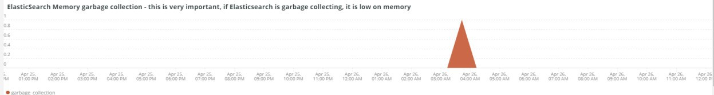

# A guia [!UICONTROL Elasticsearch]

## [!UICONTROL Cluster Status Summary]:

Durante o período selecionado, o quadro **[!UICONTROL Cluster Status Summary]** mostra os status de cores pelos quais o cluster [!DNL Elasticsearch] passou. Neste exemplo, durante o período selecionado, o cluster estava no status Verde uma vez e no status Amarelo uma vez durante o período selecionado.

## [!UICONTROL Active Primary Shards]

O quadro **[!UICONTROL Active Primary Shards]** mostra os números diferentes, dependendo do número de fragmentos principais ativos para o serviço [!DNL Elasticsearch] da conta selecionada.

De [!DNL Elasticsearch]: o Guia definitivo [2.x]:

&quot;Em [Índices Atualizáveis Dinamicamente](https://www.elastic.co/guide/en/elasticsearch/guide/2.x/dynamic-indices.html), explicamos que um fragmento é um índice Lucene e que um índice [!DNL Elasticsearch] é uma coleção de fragmentos. Seu aplicativo se comunica com um índice e o [!DNL Elasticsearch] roteia suas solicitações para os fragmentos apropriados. Um fragmento é a unidade de escala. O menor índice que você pode ter é um com um único fragmento. Isso pode ser mais do que suficiente para suas necessidades — um único fragmento pode conter muitos dados — mas limita sua capacidade de expansão.&quot;

Quando um índice é criado, há vários fragmentos criados com esse índice. Por padrão, cinco fragmentos principais são atribuídos a cada novo índice, o que significa que um índice pode ser distribuído entre cinco nós (um fragmento por nó). Há também fragmentos de réplicas. Elas se destinam principalmente ao failover. Fragmentos de réplica podem atender a solicitações de leitura.

## [!UICONTROL Active Shards in Cluster]

O quadro **[!UICONTROL Active Shards in Cluster]** mostra o número total de fragmentos primários e de réplica em um cluster [!DNL Elasticsearch].

## [!UICONTROL Index health - this will show the index name and color status]

Esse quadro mostra o nome do índice e a contagem de status da cor do índice. Ao rolar para baixo na tabela, você verá o mesmo nome de índice com os status de cores Amarelo e Vermelho. O número que segue o nome de índice 27 é a contagem da cor de status. Se for zero, não havia ocorrências do índice nesse status de cor durante os intervalos selecionados.

## [!UICONTROL Elasticsearch Status by node information]

O quadro **[!UICONTROL Elasticsearch Status by node information]** mostra o status do cluster [!DNL Elasticsearch] por cor e por nó. Isso ajuda a indicar qual nó no cluster [!DNL Elasticsearch] está retornando qual status durante o período selecionado.

## [!UICONTROL Elasticsearch index information]

A tabela **[!UICONTROL Elasticsearch index information]** mostra o nome do índice, em que nó ele está, o número de documentos indexados, a integridade do índice e o tamanho do índice em MB em um determinado momento.

## [!UICONTROL Elasticsearch process CPU %]

O quadro **[!UICONTROL Elasticsearch process CPU %]** mostra a porcentagem de CPU do processo [!DNL Elasticsearch] durante o período selecionado.

## [!UICONTROL Elasticsearch Memory garbage collection]

[!DNL Elasticsearch] é um processo Java. Se a memória alocada for insuficiente, ele iniciará a coleta de lixo para liberar memória. Se a coleta de lixo for frequente, isso indica que pode haver muitos índices ou fragmentos para a memória alocada. Pode haver uma oportunidade de limpar os índices e fragmentos ou [!DNL Elasticsearch] pode precisar de mais memória.

## [!UICONTROL Elasticsearch Index information]

À medida que os índices são criados e atualizados, a integridade do índice pode mudar.

## [!UICONTROL Elasticsearch Index Size]

O quadro **[!UICONTROL Elasticsearch Index Size]** indica o nome e o tamanho do índice no período selecionado. Isso pode indicar problemas com a forma como um site está indexando.

## [!UICONTROL Elasticsearch Errors]

O quadro **[!UICONTROL Elasticsearch Errors]** exibe erros com [!DNL Elasticsearch], como falta de espaço, alternando do status Amarelo para Vermelho, quando todos os fragmentos falham, quando há problemas de parâmetro com pesquisas, erros de versão e quando todos os nós estão indisponíveis.

## [!UICONTROL Elasticsearch Unassigned Shards]:

Fragmentos não atribuídos farão com que um cluster mude do status Verde para o status Amarelo.
