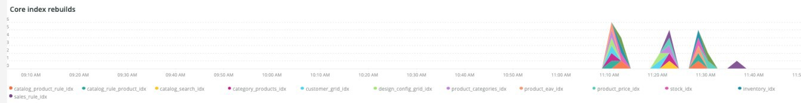

# O [!UICONTROL Indexing] guia

O **[!UICONTROL Indexing]** A guia tenta explicar problemas com indexação e identificar possíveis causas.

## [!UICONTROL Core index invalidated]

O **[!UICONTROL Core index invalidated]** O quadro observa a invalidação de indexação em um período selecionado. Se a indexação estiver acontecendo ao mesmo tempo que outros recursos intensivos [!DNL crons], isso colocará uma carga pesada nos recursos do site.

* `%Catalog Product Rule indexer has been invalidated%`) como `catalog_product_rule_idx_reset`
* `%Catalog Rule Product indexer has been invalidated%`) como `catalog_rule_product_idx_reset`
* `%Catalog Search indexer has been invalidated%`) como `catalog_search_idx_reset`
* `%Category Products indexer has been invalidated%`) como `category_products_idx_reset`
* `%Customer Grid indexer has been invalidated%`) como `customer_grid_idx_reset`
* `%Design Config Grid indexer has been invalidated%`) como `design_config_grid_idx_`
* `%Product Categories indexer has been invalidated%`) como `product_categories_idx_reset`
* `%Product EAV indexer has been invalidated%`) como `product_eav_idx_reset`
* `%Product Price indexer has been invalidated%`) como `product_price_idx_reset`
* `%Stock indexer has been invalidated%`) como `stock_idx_reset`
* `%Inventory indexer has been invalidated%`) como `inventory_idx_reset`
* `%Inventory indexer has been invalidated%`) como `inventory_idx_reset`
* `%Sales Rule indexer has been invalidated%`) como `sales_rule_idx_reset`

## [!UICONTROL Core index rebuilds]

O **[!UICONTROL Core index rebuilds]** O quadro observa as recriações do índice principal em um período selecionado. Estas são as cadeias de caracteres analisadas dos logs para indicar a conclusão da reconstrução do índice.

* `%Catalog Product Rule index has been rebuilt%`) como `catalog_product_rule_idx`
* `%Catalog Rule Product index has been rebuilt%`) como `catalog_rule_product_idx`
* `%Catalog Search index has been rebuilt%`) como `catalog_search_idx`
* `%Category Products index has been rebuilt successfully%`) como `category_products_idx`
* `%Customer Grid index has been rebuilt%`) como `customer_grid_idx`
* `%Design Config Grid index has been rebuilt%`) como `design_config_grid_idx`
* `%Product Categories index has been rebuilt%`) como `product_categories_idx`
* `%Product EAV index has been rebuilt%`) como `product_eav_idx`
* `%Product Price index has been rebuilt%`) como `product_price_idx`
* `%Stock index has been rebuilt%`) como `stock_idx`
* `%Inventory index has been rebuilt successfully%`) como `inventory_idx`
* `%Product/Target Rule index has been rebuilt successfully%`) como `prod_target_rule_idx`
* `%Sales Rule index has been rebuilt successfully%`) como `sales_rule_idx`

## [!UICONTROL catalogsearch index table(s)]

O **[!UICONTROL catalogsearch index table(s)]** o frame procura as tabelas de índice do catalogsearch em um período selecionado. Esta consulta está analisando a duração de quaisquer operações do armazenamento de dados em relação a tabelas com `%catalogsearch%` no nome da tabela.

## [!UICONTROL product index table(s)]

O **[!UICONTROL product index table(s)]** O frame procura as tabelas do índice do produto em um período selecionado. Esta consulta está analisando a duração de quaisquer operações do armazenamento de dados em relação a tabelas com `%product%` no nome da tabela.
