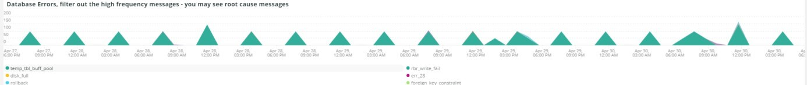
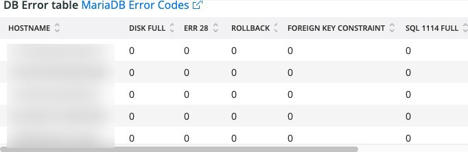
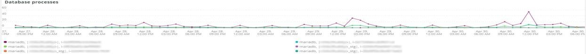

# O [!UICONTROL MySQL] guia

## [!UICONTROL MySQL% free storage by node]

Muitos problemas são causados pelo MySQL que está ficando sem armazenamento no armazenamento atribuído ao MySQL (`datadir` Configuração do MySQL, o padrão é `/data/mysql`) ou o `tmpdir` acabando com o espaço. O padrão `tmpdir` (Configuração MySQL) é `/tmp`. Esse quadro observa o `/, /tmp` (se definida como montagem separada) e a variável `/data/mysql` % de armazenagem livre. A partir do MySQL versão 5.7 (MariaDB versão 10.2), tabelas tmp descompactadas são gravadas em um tablespace tmp no `/data/mysql` no arquivo (ibtmp1). Por padrão, esse arquivo é expandido automaticamente sem limite. Como é um tablespace, ele não diminuirá em tamanho e será redefinido para 12MB quando o MySQL for reiniciado.

## [!UICONTROL MySQL Connections by Node]

O **[!UICONTROL MySQL Connections by Node]** frame indica períodos de interrupção do nó do banco de dados ou grandes volumes de conexões.

## [!UICONTROL MySQL Node Summary]

O **[!UICONTROL MySQL Node Summary]** a tabela mostra detalhes do nó do banco de dados, como versão do software e tipo de instância (tamanho).

## [!UICONTROL Galera Number of Nodes in cluster]

O **[!UICONTROL Galera Number of Nodes in cluster]** quadro exibe informações dos logs do MySQL. À medida que os nós ingressam e deixam um cluster, somente as mensagens para o período selecionado serão mostradas. Se um nó deixar o cluster antes do período, nenhuma mensagem existirá durante esse período. Se você suspeitar que o banco de dados está ficando sem um nó, expanda o período para um maior período para ver se você pode ver informações adicionais. Se houver informações durante o período que indicam menos de todos os nós no [!DNL Galera] , expanda o período para ver se é possível determinar quando o nó deixou o cluster.

## [!UICONTROL MySQL shutdowns and starts]

O **[!UICONTROL MySQL shutdowns and starts]** O quadro detecta quando há um desligamento de um nó. [!DNL Galera] os nós serão removidos e serão removidos automaticamente do [!DNL Galera] nó . Isso normalmente resultará em uma reinicialização do serviço MySQL.

## [!UICONTROL Galera log]

O **[!UICONTROL Galera log]** frame mostra contagens de sinais específicos dos logs do MySQL relativos a [!DNL Galera] nós, seus estados e as alterações de estado dos [!DNL Galera] cluster.

* &#39;%1047 WSREP ainda não preparou o nó para a utilização da aplicação%&#39;) como &#39;node_not_prep_for_use&#39;
* &#39;%\[ERROR\] WSREP: Falha ao ler de: wsrep_sst_xtrabackup-v2%&#39;) como &#39;xtrabackup_read_fail&#39;
* &#39;%\[ERROR\] WSREP: Processo concluído com erro: wsrep_sst_xtrabackup-v2 %&#39;) como &#39;xtrabackup_compl_w_err&#39;
* &#39;%\[ERROR\] WSREP: rbr write fail%&#39;) como &#39;rbr_write_fail&#39;
* &#39;%self-Leave%&#39;) como &#39;susp_node&#39;
* &#39;%membros = 3/3 (associado/total)%&#39;) como &#39;3of3&#39;
* &#39;%membros = 2/3 (associado/total)%&#39;) como &#39;2of3&#39;
* &#39;%membros = 2/2%&#39;) como &#39;2of2&#39;
* &#39;%membros = 1/2%&#39;) como &#39;1of2&#39;
* ‘%membros = 1/3%&#39;) como &#39;1of3&#39;
* ‘%membros = 1/1%&#39;) como &#39;1of1&#39;
* &#39;%\[Observação\] /usr/sbin/mysqld (mysqld 10.%&#39;) como&#39;sql_restart&#39;
* &#39;%Quorum: Nenhum nó com estado completo:%&#39;) como &#39;no_node_count&#39;
* &#39;%WSREP: Membro 0%&quot;) como &#39;mem_0&#39;
* &#39;%WSREP: Membro 1,0%&quot;) como &#39;mem_1&#39;
* &#39;%WSREP: Membro 2%&#39;) como &#39;mem2&#39;
* &#39;%WSREP: Sincronizado com grupo, pronto para conexões%&#39;) como &#39;pronto&#39;
* &#39;%/usr/sbin/mysqld, Version:%&#39;) como &#39;mysql_restart_mysql.low&#39;
* &#39;%\[Nota\] WSREP: Nova visualização de cluster: estado global:%&#39;) como &#39;galera_cluster_view_change&#39;

## [!UICONTROL Galera Log by Host]

O **[!UICONTROL Galera Log by Host]** o quadro é igual ao **[!UICONTROL Galera log]** , exceto que é dividido por nó para ajudar na solução de problemas.

## [!UICONTROL Database performance]

O **[!UICONTROL Database performance]** O quadro mostra o desempenho do banco de dados durante solicitações específicas. Você pode ver cada métrica clicando neles nos ícones coloridos abaixo do gráfico. Muitas das métricas chamadas em [Monitorando o Desempenho do Banco de Dados MySQL com o Novo Relic](https://newrelic.com/blog/how-to-relic/how-to-monitor-mysql) são encontrados neste quadro.

* average(query.queriesPerSecond)
* average(query.lowQueriesPerSecond)
* average(db.createdTmpDiskTablesPerSecond)
* average(db.createdTmpFilesPerSecond)
* average(db.tablesLocksWaitedPerSecond)
* average(db.inovdb.rowLockTimeAvg)
* average(db.inovdb.rowLockWaitsPerSecond)

## [!UICONTROL Transaction Database Call Count]

O **[!UICONTROL Transaction Database Call Count]** frame mostra o número de chamadas do banco de dados feitas por cada aspecto de transação. Isso parece estar focado em linhas e não em declarações.

## [!UICONTROL Cron_schedule table updates]

O **[!UICONTROL Cron_schedule table updates]** frame exibe a duração máxima das atualizações do banco de dados para a tabela cron_schedule para o período selecionado.

## [!UICONTROL Slow Query Traces]

O **[!UICONTROL Slow Query Traces]** quadro exibe a tabela e o tipo de solicitação onde existem rastreamentos lentos de consulta. Um rastreamento de consulta lento é criado para transações de consulta que levam mais de 5 segundos. Importante para esse quadro são as consultas de atualização. Se uma tabela estiver sendo atualizada por `UPDATE`, `DELETE`e `INSERT` podem bloquear tabelas por um período.

Mesmo `SELECT` instruções podem bloquear linhas se usadas com FOR UPDATE.

## [!UICONTROL Datastore Operations tables]

## [!UICONTROL Cron table change]

O **[!UICONTROL Cron table change]** o frame está procurando mensagens de erro &quot;não foi possível adquirir bloqueio para trabalho cron:&quot;, juntamente com um erro de memória PHP específico e bloqueios envolvendo o `cron_schedule` tabela. Se a variável `cron_schedule` está bloqueada (por exemplo, por uma `DELETE` sendo executado em relação a ele), isso impedirá que outras crons sejam executadas.

## [!UICONTROL Deadlocks]

O **[!UICONTROL Deadlocks]** O frame está olhando para as seguintes strings analisadas dos logs do MySQL.

* &#39;%PHP Erro fatal: Tamanho de memória permitido de%&#39;) como php_mem_error
* &#39;%get lock; tentar reiniciar transação, a consulta foi: DELETE FROM \`cron_schedule%&#39;) como cron_sched_lock_del
* Bloqueio de &#39;% para trabalho cron: indexer_reindex_all_invalid%&#39;) como &#39;lock_indexer_reindex_all_invalid%&#39;
* Bloqueio de &#39;% para trabalho cron: cron_schedule%&#39;) como &#39;lock_cron_schedule&#39;
* &#39;% lock para trabalho cron:%&#39;) como &#39;total_cron_lock&#39;
* &#39;%Erro geral: 1205 Tempo limite de espera de bloqueio excedido%&#39;) como &#39;sql_1205_lock&#39;
* &#39;%ERROR 1213 (40001): Deadlock encontrado ao tentar obter lock%&quot;) como &#39;sql_1213_lock&#39;
* &#39;%SQLSTATE[40001]: Falha de serialização: 1213 Deadlock found%&#39;) como &#39;sql_1213_lock2&#39;
* Bloqueio de &#39;% para trabalho cron: indexer_update_all_views%) como &#39;lock_indexer_update_all_views&#39;
* Bloqueio de &#39;% para trabalho cron: sales_grid_order_Invoice_async_insert%&#39;) como &#39;lock_sales_grid_order_Invoice_async_insert&#39;,
* Bloqueio de &#39;% para trabalho cron: staging_remove_updates%&#39;) como &#39;lock_staging_remove_updates&#39;
* Bloqueio de &#39;% para trabalho cron: sales_grid_order_ship_async_insert%) como &#39;lock_sales_grid_order_ship_async_insert&#39;
* Bloqueio de &#39;% para trabalho cron: amazon_payments_process_queued_answers%&quot;) como &quot;lock_amazon_payments_process_queued_delays&quot;
* Bloqueio de &#39;% para trabalho cron: sales_send_order_ship_emails%) como &#39;lock_sales_send_order_ship_emails&#39;
* Bloqueio de &#39;% para trabalho cron: staging_synchronize_entities_period%&#39;) como &#39;lock_staging_synchronize_entities_period&#39;
* Bloqueio de &#39;% para trabalho cron: indexer_clean_all_changelogs%&#39;) como &#39;lock_indexer_clean_all_changelogs&#39;
* Bloqueio de &#39;% para trabalho cron: magento_targetrule_index_reindex%&#39;) como &#39;lock_magento_targetrule_index_reindex&#39;
* Bloqueio de &#39;% para trabalho cron: newsletter_send_all%&#39;) como &#39;lock_newsletter_send_all&#39;
* Bloqueio de &#39;% para trabalho cron: newsletter_send_all%&#39;) como &#39;lock_newsletter_send_all&#39;
* Bloqueio de &#39;% para trabalho cron: sales_send_order_emails%&#39;) como &#39;lock_sales_send_order_emails&#39;
* Bloqueio de &#39;% para trabalho cron: sales_send_order_creditmemo_emails%&#39;) como &#39;lock_sales_send_order_creditmemo_emails&#39;
* Bloqueio de &#39;% para trabalho cron: sales_grid_order_creditmemo_async_insert%) como &#39;lock_sales_grid_order_creditmemo_async_insert&#39;
* Bloqueio de &#39;% para trabalho cron: bulk_cleanup%&#39;) como &#39;lock_bulk_cleanup&#39;
* Bloqueio de &#39;% para trabalho cron: flush_preview_quotas%&#39;) como &#39;lock_flush_preview_quotas&#39;
* Bloqueio de &#39;% para trabalho cron: sales_send_order_Invoice_emails%&#39;) como &#39;lock_sales_send_order_Invoice_emails&#39;
* Bloqueio de &#39;% para trabalho cron: sales_send_order_Invoice_emails%&#39;) como &#39;lock_sales_send_order_Invoice_emails&#39;
* Bloqueio de &#39;% para trabalho cron: captcha_delete_expires_images%&#39;) como &#39;lock_captcha_delete_expirated_images&#39;
* Bloqueio de &#39;% para trabalho cron: magento_newrelicreporting_cron%&#39;) como &#39;lock_magento_newrelicreporting_cron&#39;
* Bloqueio de &#39;% para trabalho cron: desatualizado_authentication_failed_cleanup%&#39;) como &#39;lock_outdated_authentication_cleanup_cleanup&#39;
* Bloqueio de &#39;% para trabalho cron: send_notification%&#39;) como &#39;lock_send_notification&#39;
* Bloqueio de &#39;% para trabalho cron: magento_giftcardaccount_generage_codes_pool%&#39;) como &#39;lock_magento_giftcardaccount_generage_codes_pool&#39;
* Bloqueio de &#39;% para trabalho cron: catalog_product_frontend_actions_flush%&quot;) como &quot;lock_catalog_product_frontend_actions_flush&quot;
* Bloqueio de &#39;% para trabalho cron: mysqlmq_clean_messages%&#39;) como &#39;mysqlmq_clean_messages&#39;
* Bloqueio de &#39;% para trabalho cron: catalog_product_attribute_value_synchronize%&#39;) como &#39;lock_catalog_product_attribute_value_synchronize&#39;
* Bloqueio de &#39;% para trabalho cron: ddg_automation_importer%&#39;) como &#39;lock_ddg_automation_importer&#39;
* Bloqueio de &#39;% para trabalho cron: ddg_automation_resviews_and_wishlist%&#39;) como &#39;lock_ddg_automation_views_and_wishlist&#39;
* Bloqueio de &#39;% para trabalho cron: captcha_delete_old_tries%&#39;) como &#39;lock_captcha_delete_old_tries&#39;
* Bloqueio de &#39;% para trabalho cron: catalog_product_outdated_price_values_cleanup%&#39;) como &#39;lock_catalog_product_outdated_price_values_cleanup&#39;
* Bloqueio de &#39;% para trabalho cron: consumer_runner%&#39;) como &#39;lock_consumer_runner&#39;
* Bloqueio de &#39;% para trabalho cron: ddg_automation_customer_subscriber_convidado_sync%&#39;) como &#39;lock_ddg_automation_customer_subscriber_convidado_sync&#39;
* Bloqueio de &#39;% para trabalho cron: get_amazon_capture_updates%&#39;) como &#39;lock_get_amazon_capture_updates&#39;
* Bloqueio de &#39;% para trabalho cron: get_amazon_authorization_updates%&#39;) como &#39;lock_send_get_amazon_authorization_updates&#39;
* Bloqueio de &#39;% para trabalho cron: temando_process_platform_events%&#39;) como &#39;lock_temando_process_platform_events&#39;
* Bloqueio de &#39;% para trabalho cron: ddg_automation_status%&#39;) como &#39;lock_ddg_automation_status&#39;
* Bloqueio de &#39;% para trabalho cron: ddg_automation_status%&#39;) como &#39;lock_ddg_automation_status&#39;
* Bloqueio de &#39;% para trabalho cron: sales_clean_orders%&#39;) como &#39;lock_sales_clean_orders&#39;
* Bloqueio de &#39;% para trabalho cron: catalog_index_refresh_price%&#39;) como &#39;lock_catalog_index_refresh_price&#39;
* Bloqueio de &#39;% para trabalho cron: magento_premie_balance_warning_notification%&quot;) como &quot;lock_magento_premient_balance_warning_notification&quot;
* Bloqueio de &#39;% para trabalho cron: analytics_update%&#39;) como &#39;lock_analytics_update&#39;
* Bloqueio de &#39;% para trabalho cron: messagequeue_clean_outdated_locks%&#39;) como &#39;lock_messagequeue_clean_outdated_locks&#39;
* Bloqueio de &#39;% para trabalho cron: messagequeue_clean_outdated_locks%&#39;) como &#39;lock_messagequeue_clean_outdated_locks&#39;
* Bloqueio de &#39;% para trabalho cron: staging_apply_version%&#39;) como &#39;lock_staging_apply_version&#39;
* Bloqueio de &#39;% para trabalho cron: magento_recompensa_expira_points%&#39;) como &#39;lock_magento_premie_expires_points&#39;
* Bloqueio de &#39;% para trabalho cron: yotpo_yotpo_orders_sync%&#39;) como &#39;lock_yotpo_yotpo_orders_sync&#39;
* Bloqueio de &#39;% para trabalho cron: catalog_event_status_checker%&#39;) como &#39;lock_catalog_event_status_checker&#39;
* Bloqueio de &#39;% para trabalho cron: ddg_automation_campaign%&#39;) como &#39;lock_ddg_automation_campaign&#39;
* Bloqueio de &#39;% para trabalho cron: visitor_clean%&#39;) como &#39;lock_visitor_clean&#39;
* Bloqueio de &#39;% para trabalho cron: scconnector_verify_website%&#39;) como &#39;lock_scconnector_verify_website&#39;
* Bloqueio de &#39;% para trabalho cron: ddg_automation_email_templates%&#39;) como &#39;lock_ddg_automation_email_templates&#39;
* Bloqueio de &#39;% para trabalho cron: aggregate_sales_report_order_data%&#39;) como &#39;lock_aggregate_sales_report_order_data&#39;
* Bloqueio de &#39;% para trabalho cron: ddg_automation_catalog_sync%&#39;) como &#39;lock_ddg_automation

## [!UICONTROL DB Statistics]

O **[!UICONTROL DB Statistics]** o quadro exibe exclusões, gravações, linhas lidas, atualizações e consultas lentas por segundo.

## [!UICONTROL Request frequency]

## [!UICONTROL Database Errors]

O **[!UICONTROL Database Errors]** quadro mostra uma variedade de bancos de dados [avisos e erros](https://mariadb.com/kb/en/mariadb-error-codes/).

* &#39;%O tamanho da memória alocado para a tabela temporária é superior a 20% de inocdb_buffer_pool_size%&#39; como &#39;temp_tbl_buff_pool&#39;
* &#39;%\[ERROR\] WSREP: rbr write fail%&#39;) como &#39;rbr_write_fail&#39;
* &#39;%mysqld: Disco cheio%&#39;) como &#39;disk_full&#39;
* &#39;%Error number 28%&#39;) como &#39;err_28&#39;
* &#39;%rollback%&#39;) como &#39;rollback&#39;
* &#39;%Restrição de chave estrangeira falha para tabela%&#39;) como &#39;external_key_constraint&#39;
* &#39;%Error_code: 1114%&#39;) como &#39;sql_1114_full&#39;&#39;&#39;%CRÍTICO: SQLSTATE[HY000] [2006] O servidor MySQL sumiu%&#39;) como &#39;sql_Go&#39;
* &#39;%SQLSTATE[HY000] [1040] Muitas conexões%&#39;) como &#39;sql_1040&#39;
* &#39;%CRÍTICO: SQLSTATE[HY000] [2002]%&#39;) como &#39;sql_2002&#39;
* &#39;%SQLSTATE[08S01]:%&#39;) como &#39;sql_1047&#39;
* &#39;%[Aviso] Interconexão anulada%&#39;) como &#39;aborted_conn&#39;
* &#39;%SQLSTATE[23000]: Violação de restrição de integridade:%&#39;) como &#39;sql_23000&#39;
* &#39;%1205 Bloquear tempo limite de espera%&#39;) como &#39;sql_1205&#39;
* &#39;%SQLSTATE[HY000] [1049] Banco de dados desconhecido%&#39;) como &#39;sql_1049&#39;
* &#39;%SQLSTATE[42S02]: Tabela ou exibição base não encontrada:%&#39;) como &#39;sql_42S02&#39;
* &#39;%Erro geral: 1114%&#39;) como &#39;sql_1114&#39;
* &#39;%SQLSTATE[40001]%&#39;) como &#39;sql_1213&#39;
* &#39;%SQLSTATE[42S22]: Coluna não encontrada: 1054 Unknown column%&#39;) como &#39;sq1_1054&#39;
* &#39;%SQLSTATE[42000]: Erro de sintaxe ou violação de acesso:%&#39;) como&#39;sql_42000&#39;
* &#39;%SQLSTATE[21000]: Violação de cardinalidade:%&#39;) como &#39;sql_1241&#39;
* &#39;%SQLSTATE[22003]:%&#39;) como &#39;sql_22003&#39;
* &#39;%SQLSTATE[HY000] [9000] Cliente com endereço IP%&#39;) como &#39;sql_9000&#39;
* &#39;%SQLSTATE[HY000]: Erro geral: 2014%&#39;) como &#39;sql_2014&#39;
* &#39;%1927 A ligação foi eliminada%&#39;) como &#39;sql_1927&#39;
* &#39;%1062 \[ERROR\] InnoDB:%&#39;) como &#39;sql_1062_e&#39;
* ‘&#39;%[Observação] WSREP: A transferir mapa de memória para o disco...%&#39;) como &#39;mem_map_flush&#39;
* &#39;%Código de erro interno de MariaDB: 1146%&#39;) como &#39;sql_1146&#39;
* &#39;%Código de erro interno de MariaDB: 1062%&#39;) como &#39;sql_1062&#39; ・ &#39;%1062 [Aviso] InnoDB:%&#39;) como &#39;sql_1062_w&#39;
* &#39;%Código de erro interno de MariaDB: 1064%&#39;) como &#39;sql_1064&#39;
* &#39;%InnoDB: Falha de asserção no arquivo%&#39;) como &#39;assertion_err&#39;
* &#39;%mysqld_safe Número de processos em execução agora: 0%&#39;) como &#39;mysql_oom&#39;
* &#39;%\[ERROR\] mysqld got signal%&#39;) como &#39;mysql_sigterm&#39;
* &#39;%1452 Não é possível adicionar%&#39;) como &#39;sql_1452&#39;
* &#39;%ERROR 1698%&#39;) como &#39;sql_1698&#39;
* &#39;%SQLSTATE[HY000]: Erro geral: 3%&#39;) como &#39;cnt_write_tmp&#39;
* &#39;%Erro geral: 1 %&#39;) como &#39;sql_syntax&#39;
* &#39;%42S22%&#39;) como &#39;sql_42S22&#39;
* &#39;%InnoDB: Erro (Chave duplicada)%&#39;) como &#39;inocdb_dup_key&#39; DE TIMESERIES de Log

## [!UICONTROL DB Error Table]

O **[!UICONTROL DB Error Table]** quadro mostra as mesmas informações que o **[!UICONTROL Database Errors]** , mas é possível visualizá-lo por nó e em um formato de tabela. Consulte [Códigos de erro do MariaDB](https://mariadb.com/kb/en/mariadb-error-codes/) para obter mais informações.

## [!UICONTROL Database Traces]

O **[!UICONTROL Database Traces]** quadro mostra os rastreamentos do banco de dados por tipo na linha do tempo selecionada.

## [!UICONTROL Database processes]

O **[!UICONTROL Database processes]** frame mostra os processos, ambientes e identificadores de nó do banco de dados.

## [!UICONTROL MySQL Non-Sleeping Threads by Node]

O **[!UICONTROL MySQL Non-Sleeping Threads by Node]** frame mostra os threads de conexão para o banco de dados. Este quadro mostra os threads ativos.

## [!UICONTROL MySQL Running and Sleeping Threads by environment]

O **[!UICONTROL MySQL Running and Sleeping Threads by environment]** quadro mostra conexões ativas e em espera com o banco de dados. Se houver conexões com o banco de dados em que consultas lentas foram para o modo de espera, haverá conexões inativas. Conexões suspensas podem ser consultas de banco de dados bloqueadas por linhas ou tabelas bloqueadas. Essas conexões de espera também mantêm conexões de trabalho PHP.

## [!UICONTROL MySQL mem used by node]

O **[!UICONTROL MySQL mem used by node]** quadro mostra o uso de memória por nó pelo MySQL. Em sites maiores, esse quadro pode ser barras contínuas com GBs de memória usados.

## [!UICONTROL Database mysql-slow.log]

O **[!UICONTROL Database mysql-slow.log]** quadro mostra os tipos de instrução de consulta que estavam no `mysql-slow.log` ao longo do período de tempo selecionado.

