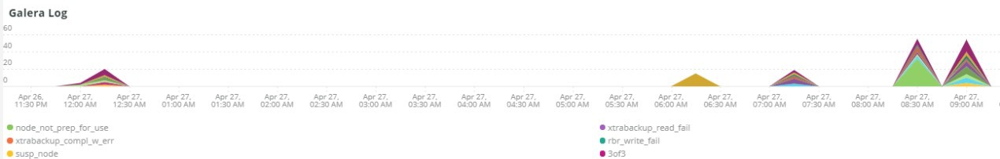
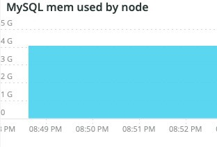

# A guia [!UICONTROL MySQL]

## [!UICONTROL MySQL% free storage by node]

Armazenamento livre de 

Muitos problemas são causados pela falta de armazenamento do MySQL no armazenamento atribuído ao MySQL (`datadir` definição de configuração do MySQL, o padrão é `/data/mysql`) ou pela falta de espaço de `tmpdir`. O padrão `tmpdir` (configuração do MySQL) é `/tmp`. O quadro **[!UICONTROL MySQL% free storage by node]** analisa o `/, /tmp` (se definido como uma montagem separada) e o percentual de `/data/mysql` de armazenamento livre. A partir do MySQL versão 5.7 (MariaDB versão 10.2), as tabelas `tmp` descompactadas são gravadas em um tablespace `tmp` no diretório `/data/mysql` no arquivo (ibtmp1). Por padrão, esse arquivo é expandido automaticamente sem limite. Como é um tablespace, ele não diminuirá de tamanho e será redefinido para 12 MB quando o MySQL for reiniciado.

## [!UICONTROL MySQL Connections by Node]

O quadro **[!UICONTROL MySQL Connections by Node]** indica períodos de paralisações do nó de banco de dados ou grandes volumes de conexões.

## [!UICONTROL MySQL Node Summary]

A tabela **[!UICONTROL MySQL Node Summary]** mostra detalhes do nó do banco de dados, como versão do software e tipo de instância (tamanho).

## [!UICONTROL Galera Number of Nodes in cluster]

O quadro **[!UICONTROL Galera Number of Nodes in cluster]** exibe informações dos logs do MySQL. À medida que os nós ingressam e saem de um cluster, somente as mensagens do período selecionado são exibidas. Se um nó sair do cluster antes do período, nenhuma mensagem existirá durante esse período. Se você suspeitar que o banco de dados pode estar em execução a menos de um nó, expanda o período para um período maior para ver se você pode ver informações adicionais. Se houver informações durante o período de tempo que indiquem menos do que todos os nós no cluster [!DNL Galera], expanda o período de tempo para ver se você pode determinar quando o nó deixou o cluster.

## [!UICONTROL MySQL shutdowns and starts]

O quadro **[!UICONTROL MySQL shutdowns and starts]** detecta quando há um desligamento de um nó. Os nós [!DNL Galera] serão removidos e serão removidos automaticamente do nó [!DNL Galera]. Isso normalmente resultará em uma reinicialização do serviço MySQL.

## [!UICONTROL Galera log]

O quadro **[!UICONTROL Galera log]** mostra as contagens de sinais específicos dos logs do MySQL relativos aos nós [!DNL Galera], seus estados e as alterações de estado do cluster [!DNL Galera].

* &#39;%1047 O WSREP ainda não preparou o nó para uso do aplicativo (%node_not_prep_for_use&#39;)
* &#39;%\[ERROR\] WSREP: Falha ao ler de: wsrep_sst_xtrabackup-v2%&#39;) como &#39;xtrabackup_read_fail&#39;
* &#39;%\[ERROR\] WSREP: Processo concluído com erro: wsrep_sst_xtrabackup-v2 %&#39;) como &#39;xtrabackup_compl_w_err&#39;
* &#39;%\[ERROR\] WSREP: rbr write fail%&#39;) como &#39;rbr_write_fail&#39;
* &#39;%self-leave%&#39;) como &#39;susp_node&#39;
* &#39;%member = 3/3 (unido/total)%&#39;) como&#39;3of3&#39;
* &#39;%member = 2/3 (unido/total)%&#39;) como&#39;2of3&#39;
* &#39;%member = 2/2%&#39;) como &#39;2of2&#39;
* &#39;%member = 1/2%&#39;) como &#39;1of2&#39;
* &#39;%member = 1/3%&#39;) como &#39;1of3&#39;
* &#39;%member = 1/1%&#39;) como &#39;1of1&#39;
* &#39;%\[Nota\] /usr/sbin/mysqld (mysqld 10.%&#39;) como&#39;sql_restart&#39;
* &#39;%Quorum: Nenhum nó com estado concluído:%&#39;) como &#39;no_node_count&#39;
* &#39;%WSREP: Membro 0%&#39;) como &#39;mem_0&#39;
* &#39;%WSREP: Membro 1.0%&#39;) como &#39;mem_1&#39;
* &#39;%WSREP: Membro 2%&#39;) como&#39;mem2&#39;
* &#39;%WSREP: Sincronizado com grupo, pronto para conexões&#39;) como &#39;pronto&#39;
* &#39;%/usr/sbin/mysqld, Version:%&#39;) como &#39;mysql_restart_mysql.slow&#39;
* &#39;%\[Note\] WSREP: Nova exibição de cluster: estado global:%&#39;) como &#39;galera_cluster_view_change&#39;

## [!UICONTROL Galera Log by Host]

O quadro **[!UICONTROL Galera Log by Host]** é igual ao quadro **[!UICONTROL Galera log]**, exceto que é dividido pelo nó para ajudar na solução de problemas.

## [!UICONTROL Database performance]

O quadro **[!UICONTROL Database performance]** mostra o desempenho do banco de dados durante solicitações específicas. Você pode ver cada métrica clicando nelas nos ícones coloridos abaixo do gráfico. Muitas das métricas chamadas em [Monitorando o Desempenho do Banco de Dados MySQL com o New Relic](https://newrelic.com/blog/how-to-relic/how-to-monitor-mysql) são encontradas neste quadro.

* average(query.queriesPerSecond)
* average(query.slowQueriesPerSecond)
* average(db.createdTmpDiskTablesPerSecond)
* average(db.createdTmpFilesPerSecond)
* average(db.tablesLocksWaitedPerSecond)
* average(db.innodb.rowLockTimeAvg)
* average(db.innodb.rowLockWaitsPerSecond)

## [!UICONTROL Transaction Database Call Count]

O quadro **[!UICONTROL Transaction Database Call Count]** mostra o número de chamadas de banco de dados feitas por cada faceta de transação. Isso parece ser focado em linhas e não em instruções.

## [!UICONTROL Cron_schedule table updates]

O quadro **[!UICONTROL Cron_schedule table updates]** exibe a duração máxima das atualizações do banco de dados na tabela cron_schedule para o período selecionado.

## [!UICONTROL Slow Query Traces]

O quadro **[!UICONTROL Slow Query Traces]** exibe a tabela e o tipo de solicitação em que há rastreamentos de consulta lenta. Um rastreamento de consulta lento é criado para transações de consulta que levam mais de cinco segundos. Importantes para este quadro são as consultas de atualização. Se uma tabela estiver sendo atualizada por instruções `UPDATE`, `DELETE` e `INSERT`, elas podem bloquear tabelas por um período.

Mesmo instruções `SELECT` podem bloquear linhas se usadas com FOR UPDATE.

## [!UICONTROL Datastore Operations tables]

## [!UICONTROL Cron table change]

O quadro **[!UICONTROL Cron table change]** procura mensagens de erro &quot;não foi possível adquirir bloqueio para o trabalho cron:&quot;, juntamente com um erro de memória de PHP específico e bloqueios envolvendo a tabela `cron_schedule`. Se a tabela `cron_schedule` estiver bloqueada (por exemplo, por uma consulta `DELETE` sendo executada em relação a ela), ela bloqueará a execução de outros crons.

## [!UICONTROL Deadlocks]

O quadro **[!UICONTROL Deadlocks]** analisa as seguintes cadeias de caracteres analisadas dos logs do MySQL:

* &#39;%PHP erro fatal: tamanho de memória permitido de &#39;%&#39;) como php_mem_error
* &#39;%get lock; tente reiniciar a transação; a consulta era: DELETE FROM \`cron_schedule%&#39;) as cron_sched_lock_del
* &#39;% lock para o trabalho cron: indexer_reindex_all_invalid%&#39;) como &#39;lock_indexer_reindex_all_invalid%&#39;
* &#39;% lock para o trabalho cron: cron_schedule%&#39;) como &#39;lock_cron_schedule&#39;
* &#39;% lock para trabalho cron:%&#39;) como &#39;total_cron_lock&#39;
* &#39;%General error: 1205 Lock wait timeout aded%&#39;) as &#39;sql_1205_lock&#39;
* &#39;%ERROR 1213 (40001): Deadlock encontrado ao tentar obter lock%&#39;) como &#39;sql_1213_lock&#39;
* &#39;%SQLSTATE[40001]: falha de serialização: 1213 Deadlock encontrado%&#39;) como &#39;sql_1213_lock2&#39;
* &#39;% lock para o trabalho cron: indexer_update_all_views%&#39;) como &#39;lock_indexer_update_all_views&#39;
* &#39;% lock para o trabalho cron: sales_grid_order_Invoice_async_insert%&#39;) como &#39;lock_sales_grid_order_Invoice_async_insert&#39;,
* &#39;% lock para o trabalho cron: staging_remove_updates%&#39;) as &#39;lock_staging_remove_updates&#39;
* &#39;% lock para o trabalho cron: sales_grid_order_ship_async_insert%&#39;) como &#39;lock_sales_grid_order_ship_async_insert&#39;
* &#39;% lock para o trabalho cron: amazon_payments_process_queued_returns%&#39;) como &#39;lock_amazon_payments_process_queued_returns&#39;
* &#39;% lock para a tarefa cron: sales_send_order_ship_emails%&#39;) como &#39;lock_sales_send_order_shipemails&#39;
* &#39;% lock para o trabalho cron: staging_synchronize_entities_period%&#39;) como &#39;lock_staging_synchronize_entities_period&#39;
* &#39;% lock para o trabalho cron: indexer_clean_all_changelogs%&#39;) as &#39;lock_indexer_clean_all_changelogs&#39;
* &#39;% lock para o trabalho cron: magento_targetTrule_index_reindex%&#39;) como &#39;lock_magento_targetTrule_index_reindex&#39;
* &#39;% lock para a tarefa cron: newsletter_send_all%&#39;) como &#39;lock_newsletter_send_all&#39;
* &#39;% lock para a tarefa cron: newsletter_send_all%&#39;) como &#39;lock_newsletter_send_all&#39;
* &#39;% lock para o trabalho cron: sales_send_order_emails%&#39;) como &#39;lock_sales_send_order_emails&#39;
* &#39;% lock para a tarefa cron: sales_send_order_creditmemo_emails%&#39;) como &#39;lock_sales_send_order_creditmemo_emails&#39;
* &#39;% lock para o trabalho cron: sales_grid_order_creditmemo_async_insert%&#39;) como &#39;lock_sales_grid_order_creditmemo_async_insert&#39;
* &#39;% lock para o trabalho cron: bulk_cleanup%&#39;) como &#39;lock_bulk_cleanup&#39;
* &#39;% lock para o trabalho cron: flush_preview_quotas%&#39;) como &#39;lock_flush_preview_quotas&#39;
* &#39;% lock para a tarefa cron: sales_send_order_Invoice_emails%&#39;) como &#39;lock_sales_send_order_Invoice_emails&#39;
* &#39;% lock para a tarefa cron: sales_send_order_Invoice_emails%&#39;) como &#39;lock_sales_send_order_Invoice_emails&#39;
* &#39;% lock para o trabalho cron: captcha_delete_expired_images%&#39;) como &#39;lock_captcha_delete_expired_images&#39;
* &#39;% lock para o trabalho cron: magento_newrelicreporting_cron%&#39;) como &#39;lock_magento_newrelicreporting_cron&#39;
* &#39;% lock para o trabalho cron: outdated_authentication_failures_cleanup%&#39;) como &#39;lock_outdated_authentication_failures_cleanup&#39;
* &#39;% lock para o trabalho cron: send_notification%&#39;) como &#39;lock_send_notification&#39;
* &#39;% lock para o trabalho cron: magento_giftcardaccount_generage_codes_pool%&#39;) como &#39;lock_magento_giftcardaccount_generage_codes_pool&#39;
* &#39;% lock para o trabalho cron: catalog_product_frontend_actions_flush%&#39;) como &#39;lock_catalog_product_frontend_actions_flush&#39;
* &#39;% lock para o trabalho cron: mysqlmq_clean_messages%&#39;) como &#39;mysqlmq_clean_messages&#39;
* &#39;% lock para o trabalho cron: catalog_product_attribute_value_synchronize%&#39;) como &#39;lock_catalog_product_attribute_value_synchronize&#39;
* &#39;% lock para o trabalho cron: ddg_automation_importer%&#39;) como &#39;lock_ddg_automation_import&#39;
* &#39;% lock para o trabalho cron: ddg_automation_review_and_wishlist%&#39;) como &#39;lock_ddg_automation_review_and_wishlist&#39;
* &#39;% lock para o trabalho cron: captcha_delete_old_tries%&#39;) como &#39;lock_captcha_delete_old_tries&#39;
* &#39;% bloqueio para o trabalho cron: catalog_product_outdated_price_values_cleanup%&#39;) como &#39;lock_catalog_product_outdated_price_values_cleanup&#39;
* &#39;% lock para a tarefa cron: consumer_runner%&#39;) como &#39;lock_consumer_runner&#39;
* &#39;% lock para o trabalho cron: ddg_automation_customer_subscriber_guest_sync%&#39;) como &#39;lock_ddg_automation_customer_subscriber_guest_sync&#39;
* &#39;% lock para o trabalho cron: get_amazon_capture_updates%&#39;) como &#39;lock_get_amazon_capture_updates&#39;
* &#39;% lock para o trabalho cron: get_amazon_authorization_updates%&#39;) como &#39;lock_send_get_amazon_authorization_updates&#39;
* &#39;% lock para o trabalho cron: temando_process_platform_events%&#39;) como &#39;lock_temando_process_platform_events&#39;
* &#39;% lock para o trabalho cron: ddg_automation_status%&#39;) como &#39;lock_ddg_automation_status&#39;
* &#39;% lock para o trabalho cron: ddg_automation_status%&#39;) como &#39;lock_ddg_automation_status&#39;
* &#39;% bloqueio para o trabalho cron: sales_clean_orders%&#39;) como &#39;lock_sales_clean_orders&#39;
* &#39;% lock para o trabalho cron: catalog_index_refresh_price%&#39;) como &#39;lock_catalog_index_refresh_price&#39;
* &#39;% lock para o trabalho cron: magento_recompensa_balance_warning_notification%&#39;) como &#39;lock_magento_recompensa_balance_warning_notification&#39;
* &#39;% lock para o trabalho cron: analytics_update%&#39;) como &#39;lock_analytics_update&#39;
* &#39;% lock para o trabalho cron: messagequeue_clean_outdated_locks%&#39;) como &#39;lock_messagequeue_clean_outdated_locks&#39;
* &#39;% lock para o trabalho cron: messagequeue_clean_outdated_locks%&#39;) como &#39;lock_messagequeue_clean_outdated_locks&#39;
* &#39;% lock para o trabalho cron: staging_apply_version%&#39;) como &#39;lock_staging_apply_version&#39;
* &#39;% lock para a tarefa cron: magento_reforço_expire_points%&#39;) como &#39;lock_magento_recompensa_expire_points&#39;
* &#39;% lock para o trabalho cron: yotpo_yotpo_orders_sync%&#39;) como &#39;lock_yotpo_yotpo_orders_sync&#39;
* &#39;% lock para o trabalho cron: catalog_event_status_checker%&#39;) como &#39;lock_catalog_event_status_checker&#39;
* &#39;% lock para o trabalho cron: ddg_automation_campaign%&#39;) como &#39;lock_ddg_automation_campaign&#39;
* &#39;% lock para a tarefa cron: visitor_clean%&#39;) as &#39;lock_visitor_clean&#39;
* &#39;% lock para o trabalho cron: scconnector_verify_website%&#39;) como &#39;lock_scconnector_verify_website&#39;
* &#39;% lock para o trabalho cron: ddg_automation_email_templates%&#39;) como &#39;lock_ddg_automation_email_templates&#39;
* &#39;% lock para o trabalho cron: aggregate_sales_report_order_data%&#39;) como &#39;lock_aggregate_sales_report_order_data&#39;
* &#39;% lock para o trabalho cron: ddg_automation_catalog_sync%&#39;) como &#39;lock_ddg_automation

## [!UICONTROL DB Statistics]

O quadro **[!UICONTROL DB Statistics]** exibe exclusões, gravações, linhas lidas, atualizações e consultas lentas por segundo.

## [!UICONTROL Request frequency]

## [!UICONTROL Database Errors]

O quadro **[!UICONTROL Database Errors]** mostra uma variedade de [avisos e erros](https://mariadb.com/kb/en/mariadb-error-codes/) do banco de dados:

* &#39;%Memory size alocado para a tabela temporária é mais de 20% de innodb_buffer_pool_size%&#39; como &#39;temp_tbl_buff_pool&#39;
* &#39;%\[ERROR\] WSREP: rbr write fail%&#39;) como &#39;rbr_write_fail&#39;
* &#39;%mysqld: Disco cheio%&#39;) como &#39;disk_full&#39;
* &#39;%Número do erro 28%&#39;) como &#39;err_28&#39;
* &#39;%rollback%&#39;) como &#39;reversão&#39;
* &#39;%Foreign key constraint falha para a tabela &#39;%&#39;) como &#39;Foreign_key_constraint&#39;
* &#39;%Error_code: 1114%&#39;) como &#39;sql_1114_full&#39;&#39;%CRITICAL: SQLSTATE[HY000] [2006] (O servidor MySQL desapareceu%&#39;) como &#39;sql_went&#39;
* &#39;%SQLSTATE[HY000] [1040] Muitas conexões (%)&#39;) como &#39;sql_1040&#39;
* &#39;%CRITICAL: SQLSTATE[HY000] [2002]%&#39;) como &#39;sql_2002&#39;
* &#39;%SQLSTATE[08S01]:%&#39;) como &#39;sql_1047&#39;
* &#39;%[Aviso] Conexão anulada%&#39;) como &#39;aborted_conn&#39;
* &#39;%SQLSTATE[23000]: violação de restrição de integridade:%&#39;) como &#39;sql_23000&#39;
* &#39;%1205 Tempo limite de espera de bloqueio (%1) como &#39;sql_1205&#39;
* &#39;%SQLSTATE[HY000] [1049] Banco de dados desconhecido%&#39;) como &#39;sql_1049&#39;
* &#39;%SQLSTATE[42S02]: Tabela ou exibição base não encontrada:%&#39;) como &#39;sql_42S02&#39;
* &#39;%General error: 1114%&#39;) as &#39;sql_1114&#39;
* &#39;%SQLSTATE[40001]%&#39;) como &#39;sql_1213&#39;
* &#39;%SQLSTATE[42S22]: coluna não encontrada: 1054 Coluna desconhecida%&#39;) como &#39;sq1_1054&#39;
* &#39;%SQLSTATE[42000]: Erro de sintaxe ou violação de acesso:%&#39;) as&#39;sql_42000&#39;
* &#39;%SQLSTATE[21000]: violação de cardinalidade:%&#39;) como &#39;sql_1241&#39;
* &#39;%SQLSTATE[22003]:%&#39;) como &#39;sql_22003&#39;
* &#39;%SQLSTATE[HY000] [9000] Cliente com endereço IP%&#39;) como &#39;sql_9000&#39;
* &#39;%SQLSTATE[HY000]: Erro geral: 2014%&#39;) como &#39;sql_2014&#39;
* &#39;%1927 Conexão eliminada (%1927) como &#39;sql_1927&#39;
* &#39;%1062 \[ERRO\] InnoDB:%&#39;) as &#39;sql_1062_e&#39;
* &#39;%[Nota] WSREP: liberando mapa de memória para disco...%&#39;) como &#39;mem_map_flush&#39;
* &#39;%Código de erro interno do MariaDB: 1146%&#39;) como &#39;sql_1146&#39;
* &#39;%Internal MariaDB (código de erro: 1062%&#39;) as &#39;sql_1062&#39; * &#39;%1062 [Aviso] InnoDB:%&#39;) as &#39;sql_1062_w&#39;
* &#39;%Código de erro interno do MariaDB: 1064%&#39;) como &#39;sql_1064&#39;
* &#39;%InDB: falha de asserção no arquivo &#39;%&#39;) como &#39;assertion_err&#39;
* &#39;%mysqld_safe Número de processos em execução agora: 0%&#39;) como &#39;mysql_oom&#39;
* &#39;%\[ERROR\] mysqld obteve sinal%&#39;) como &#39;mysql_sigterm&#39;
* &#39;%1452 Não é possível adicionar &#39;%&#39;) como &#39;sql_1452&#39;
* &#39;%ERROR 1698%&#39;) como &#39;sql_1698&#39;
* &#39;%SQLSTATE[HY000]: Erro geral: 3%&#39;) como &#39;cnt_wrt_tmp&#39;
* &#39;%General error: 1 %&#39;) como &#39;sql_syntax&#39;
* &#39;%42S22%&#39;) como &#39;sql_42S22&#39;
* &#39;%InDB: Erro (Chave duplicada)%&#39;) como &#39;innodb_dup_key&#39; DE SÉRIE TEMPORAL de Log

## [!UICONTROL DB Error Table]

O quadro **[!UICONTROL DB Error Table]** mostra as mesmas informações que o quadro **[!UICONTROL Database Errors]**, mas você pode vê-lo por nó e em um formato de tabela. Consulte [Códigos de erro do MariaDB](https://mariadb.com/kb/en/mariadb-error-codes/) para obter mais informações.

## [!UICONTROL Database Traces]

O quadro **[!UICONTROL Database Traces]** mostra os rastreamentos do banco de dados por tipo na linha do tempo selecionada.

## [!UICONTROL Database processes]

O quadro **[!UICONTROL Database processes]** mostra os processos de banco de dados, ambientes e identificadores de nó.

## [!UICONTROL MySQL Non-Sleeping Threads by Node]

O quadro **[!UICONTROL MySQL Non-Sleeping Threads by Node]** mostra as threads de conexão com o banco de dados. Este quadro mostra as threads ativas.

## [!UICONTROL MySQL Running and Sleeping Threads by environment]

O quadro **[!UICONTROL MySQL Running and Sleeping Threads by environment]** mostra conexões ativas e inativas com o banco de dados. Se houver conexões com o banco de dados em que as consultas lentas entraram em suspensão, haverá conexões em suspensão. As conexões em suspensão podem ser consultas de banco de dados bloqueadas por linhas ou tabelas bloqueadas. Estas conexões em repouso também contêm conexões de trabalho do PHP.

## [!UICONTROL MySQL mem used by node]

O quadro **[!UICONTROL MySQL mem used by node]** mostra o uso de memória do nó pelo MySQL. Em sites maiores, esse quadro pode ser barras contínuas com GBs de memória usados.

## [!UICONTROL Database mysql-slow.log]

O quadro **[!UICONTROL Database mysql-slow.log]** mostra os tipos de instrução de consulta que estavam no arquivo `mysql-slow.log` durante o período selecionado.
