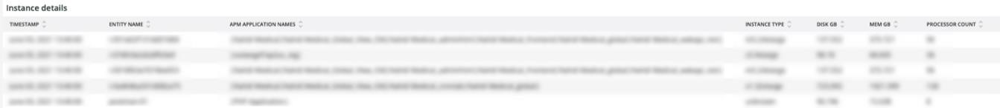

# A guia [!DNL Infra]

A guia **[!DNL Infra]** isola os problemas e as causas dos problemas de infraestrutura. Além disso, são descritos os quadros que você pode ver na guia.

## [!UICONTROL Service Alerts – Infrastructure Alerts by Application name]

O gráfico **[!UICONTROL Service Alerts – Infrastructure Alerts by Application name]** mostra os alertas de serviço coletados pelo agente de infraestrutura [!DNL New Relic]. Isso mostrará reinicializações do serviço, muitas associadas a implantações.

## [!UICONTROL Inode usage by mount]

O quadro **[!UICONTROL Inode usage by mount]** mostra o uso de [!DNL inode] por montagem durante o período selecionado. Embora possa haver bastante armazenamento livre, se um nó ficar sem [!DNL inodes], isso mostrará uma falta de armazenamento disponível. A remoção de arquivos (especialmente os pequenos) liberará espaço e disponibilizará o [!DNL inodes].

## [!UICONTROL vCPU tier view over timeline GREATER 2 weeks]

O quadro **[!UICONTROL vCPU tier view over timeline GREATER 2 weeks]** mostra a exibição de camada do vCPU no período selecionado de mais de duas semanas. Este quadro analisa o número de vCPUs atribuídas ao nome do aplicativo [!DNL New Relic] mostrado.

## [!UICONTROL vCPU tier view over timeline]

O quadro **[!UICONTROL vCPU tier view over timeline]** mostra a exibição de camada vCPU no período selecionado de mais de 24 horas. Este quadro analisa o número de vCPUs atribuídas ao nome do aplicativo [!DNL New Relic] mostrado. Ele mostrará tanto upsizing quanto downsizes do cluster.

## [!UICONTROL vCPU tier view over timeline BY NODE]

O quadro **[!UICONTROL vCPU tier view over timeline BY NODE]** mostra exibições da camada vCPU por nó ao longo do período selecionado. Esse quadro é útil para detectar a perda de nó(s) ou quando os nós são submetidos a upsizing ou downsizing. A visualização do nível da vCPU em relação à linha do tempo POR NÓ deve observar a linha do tempo MENOS de 24 horas.

## [!UICONTROL Instance details]

A tabela **[!UICONTROL Instance details]** mostra os detalhes da instância de cada aplicativo [!DNL New Relic].

## [!UICONTROL Logging, if there is a broken line for a node, it indicates non-responsive node during that time period]

O quadro **[!UICONTROL Logging, if there is a broken line for a node, it indicates non-responsive node during that time period]** mostra nós sem resposta durante um período.
