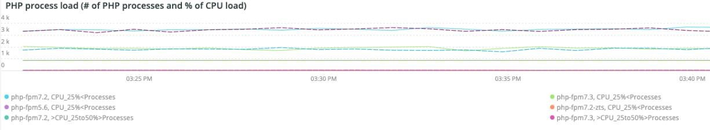

# A guia [!UICONTROL PHP]

A aba **PHP** mostra problemas do processo PHP para fornecer uma análise mais profunda dos problemas do PHP.

## [!UICONTROL PHP active process details]

O quadro **[!UICONTROL PHP active process details]** mostra os processos PHP, incluindo php-fpm, durante o período selecionado.

## [!UICONTROL PHP process load (# of PHP processes and % of CPU load)]

O quadro **[!UICONTROL PHP process load (# of PHP processes and % of CPU load)]** mostra a carga de CPU dos processos PHP-FPM ao longo do período selecionado.

## [!UICONTROL PHP Memory detail]

O quadro **[!UICONTROL PHP Memory detail]** mostra o uso de memória de processos PHP durante o período selecionado.

## [!UICONTROL PHP CPU Utilization]

O quadro **[!UICONTROL PHP CPU Utilization]** mostra a utilização percentual de CPU dos processos PHP durante o período selecionado.

## [!UICONTROL PHP Process states]

O quadro **[!UICONTROL PHP Process states]** mostra os estados do processo PHP durante o período selecionado. Ele é exibido quando os processos do PHP terminam e reiniciam. Cuidado com os processos terminados do PHP que não mostram reinicializações.

* &#39;%NOTICE: Encerrando ...%&#39;) como &#39;php_term&#39;
* &#39;% AVISO: saindo, até logo!%&#39;) como &#39;php_ exit&#39;
* &#39;% NOTICE: fpm está em execução, pid%&#39;) como &#39;fpm_start&#39;
* &#39;%NOTICE: pronto para manipular conexões&#39;) como &#39;php_ready&#39;

## [!UICONTROL PHP Errors]

O quadro **[!UICONTROL PHP Errors]** mostra o número de erros de trabalho do PHP durante o período selecionado. As mensagens de erro analisadas e exibidas incluem:

* &#39;%worker_connections are not insufficient%&#39;) como &#39;worker&#39;
* Erro fatal &#39;%PHP: tamanho de memória permitido!%&#39;) como &#39;mem_size&#39;
* &#39;%exited on signal 11 (SIGSEGV)%&#39;) como &#39;sig_11&#39;
* &#39;%exited on signal 7 (SIGBUS)%&#39;) como &#39;sig_7&#39;
* &#39;%aumente pm.start_servers%&#39;) como &#39;pmstart_serv&#39;
* &#39;%max_children%&#39;) como &#39;max_children_cnt&#39;
* &#39;%PHP Erro fatal: tamanho de memória permitido de &#39;%&#39;) como &#39;mem_exhst_count&#39;
* &#39;%Unable to allocate memory for pool%&#39;) como &#39;opc_mem_count&#39;
* &#39;%Warning Interned string buffer overflow%&#39;) como &#39;opc_str_buf&#39;
* &#39;%Illegal string offsetl%&#39;) como &#39;opc_sv_comments&#39;
* &#39;%PHP Erro fatal: RedisException não detectada: erro de leitura na conexão &#39;%&#39;) como &#39;php_exc&#39;

## [!UICONTROL PHP processes count]

O quadro **[!UICONTROL PHP processes count]** mostra uma contagem de processos PHP ao longo do período selecionado.

## [!UICONTROL Database Errors]

O quadro **[!UICONTROL Database Errors]** mostra erros de banco de dados no período selecionado. Os erros analisados incluem:

* &#39;%Memory size alocado para a tabela temporária é mais de 20% de innodb_buffer_pool_size%&#39;) como &#39;temp_tbl_buff_pool&#39;
* &#39;%\[ERROR\] WSREP: rbr write fail%&#39;) como &#39;rbr_write_fail&#39;
* &#39;%mysqld: Disco cheio%&#39;) como &#39;disk_full&#39;
* &#39;%Número do erro 28%&#39;) como &#39;err_28&#39;
* &#39;%rollback%&#39;) como &#39;reversão&#39;
* &#39;%Foreign key constraint falha para a tabela &#39;%&#39;) como &#39;Foreign_key_constraint&#39;
* &#39;%Error_code: 1114%&#39;) como &#39;sql_1114_full&#39;
* &#39;%CRITICAL: SQLSTATE[HY000] [2006] O servidor MySQL desapareceu%&#39;) como &#39;sql_went&#39;
* &#39;%SQLSTATE[HY000] [1040] Muitas conexões (%)&#39;) como &#39;sql_1040&#39;
* &#39;%CRITICAL: SQLSTATE[HY000] [2002]%&#39;) como &#39;sql_2002&#39;
* &#39;%SQLSTATE[08S01]:%&#39;) como &#39;sql_1047&#39;
* &#39;%[Aviso] Conexão anulada%&#39;) como &#39;aborted_conn&#39;
* &#39;%SQLSTATE[23000]: violação de restrição de integridade:%&#39;) como &#39;sql_23000&#39;
* &#39;%1205 Tempo limite de espera de bloqueio (%1) como &#39;sql_1205&#39;
* &#39;%SQLSTATE[HY000] [1049] Banco de dados desconhecido%&#39;) como &#39;sql_1049&#39;
* &#39;%SQLSTATE[42S02]: Tabela ou exibição base não encontrada:%&#39;) como &#39;sql_42S02&#39;
* &#39;%General error: 1114%&#39;) as &#39;sql_1114&#39;
* &#39;%SQLSTATE[40001]%&#39;) como &#39;sql_1213&#39;
* &#39;%SQLSTATE[42S22]: coluna não encontrada: 1054 Coluna desconhecida%&#39;) como &#39;sq1_1054&#39;
* &#39;%SQLSTATE[42000]: Erro de sintaxe ou violação de acesso:%&#39;) como &#39;sql_42000&#39;
* &#39;%SQLSTATE[21000]: violação de cardinalidade:%&#39;) como &#39;sql_1241&#39;
* &#39;%SQLSTATE[22003]:%&#39;) como &#39;sql_22003&#39;
* &#39;%SQLSTATE[HY000] [9000] Cliente com endereço IP%&#39;) como &#39;sql_9000&#39;
* &#39;%SQLSTATE[HY000]: Erro geral: 2014%&#39;) como &#39;sql_2014&#39;
* &#39;%1927 Conexão eliminada (%1927) como &#39;sql_1927&#39;
* &#39;%1062 \[ERRO\] InnoDB:%&#39;) as &#39;sql_1062_e&#39;
* &#39;%[Nota] WSREP: liberando mapa de memória para disco...%&#39;) como &#39;mem_map_flush&#39;
* &#39;%Código de erro interno do MariaDB: 1146%&#39;) como &#39;sql_1146&#39;
* &#39;%Internal MariaDB (código de erro: 1062%&#39;) as &#39;sql_1062&#39; * &#39;%1062 [Aviso] InnoDB:%&#39;) as &#39;sql_1062_w&#39;
* &#39;%Código de erro interno do MariaDB: 1064%&#39;) como &#39;sql_1064&#39;
* &#39;%InDB: falha de asserção no arquivo &#39;%&#39;) como &#39;assertion_err&#39;
* &#39;%mysqld_safe Número de processos em execução agora: 0%&#39;) como &#39;mysql_oom&#39;
* &#39;%\[ERROR\] mysqld obteve sinal%&#39;) como &#39;mysql_sigterm&#39;
* &#39;%1452 Não é possível adicionar &#39;%&#39;) como &#39;sql_1452&#39;
* &#39;%ERROR 1698%&#39;) como &#39;sql_1698&#39;
* &#39;%SQLSTATE[HY000]: Erro geral: 3%&#39;) como &#39;cnt_wrt_tmp&#39;
* &#39;%General error: 1 %&#39;) como &#39;sql_syntax&#39;
* &#39;%42S22%&#39;) como &#39;sql_42S22&#39;
* &#39;%InDB: Erro (Chave duplicada)%&#39;) como &#39;innodb_dup_key&#39;

## [!UICONTROL Database traces]

O quadro **[!UICONTROL Database traces]** mostra informações de rastreamento do banco de dados. Esse quadro é alinhado à exibição do resumo de transações APM para a linha do tempo selecionada.

## [!UICONTROL Database mysql-slow.log]

O quadro **[!UICONTROL Database mysql-slow.log]** mostra os tipos de instrução de consulta que estavam no arquivo `mysql-slow.log` durante o período selecionado.
