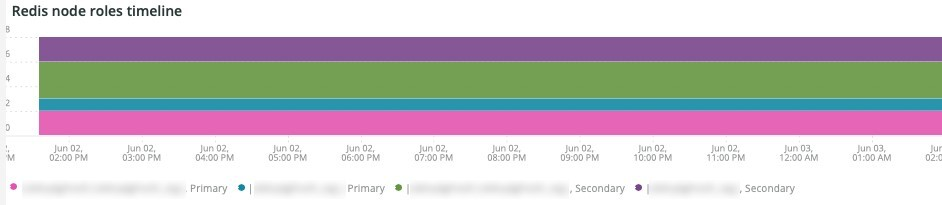
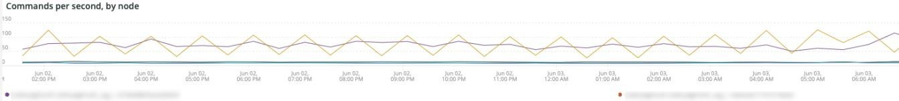

# A guia [!DNL Redis]

## [!UICONTROL Redis Node summary]

O **[!UICONTROL Redis Node summary]** inclui todos os nós em um ambiente. O exemplo acima inclui os nós para preparo compartilhado. Há um primário e dois secundários na produção e também um primário e dois secundários no preparo.

## [!UICONTROL Redis node detail]

O quadro **[!UICONTROL Redis node detail]** indica o ambiente, a função [!DNL Redis], a versão do software e o tamanho do nó.

## [!UICONTROL Redis node roles timeline]

O quadro **[!UICONTROL Redis node roles timeline]** indica a perda do serviço [!DNL Redis] em funções específicas. Se uma linha cair, isso indica que a função específica que a linha representa perdeu um ou mais nós.

## [!UICONTROL Connection to Redis]

O quadro **[!UICONTROL Connection to Redis]** exibe o valor net.connectedClients dos dados de amostra [!DNL New Relic Redis]. Ele exibe a contagem de conexões por [!DNL New Relic] aplicativo (ambiente) e nó.

## [!UICONTROL Commands per second by node]

O quadro **[!UICONTROL Commands per second by node]** mostra os comandos [!DNL Redis] por nó por segundo durante o período selecionado.

## [!UICONTROL Redis % of memory used]

O quadro **[!UICONTROL Redis % of memory used]** mostra a porcentagem de memória máxima usada pelos servidores [!DNL Redis].

## [!UICONTROL Redis used memory]

O quadro **[!UICONTROL Redis used memory]** mostra o uso de memória do nó em GB/MB.

## [!UICONTROL Redis changes since last db save]

[!DNL Redis] reside na memória e salva as informações no armazenamento. O quadro **[!UICONTROL Redis changes since last db save]** indica o número de alterações na memória ocorridas desde que o último banco de dados foi salvo no armazenamento. Consulte [Persistência de Redis](https://redis.io/docs/latest/operate/oss_and_stack/management/persistence/) para obter mais explicações sobre a persistência [!DNL Redis's].

## [!UICONTROL Redis synchronization from Log]

O quadro **[!UICONTROL Redis synchronization from Log]** focaliza os erros encontrados durante a sincronização de [!DNL Redis] ou erros que ocorrem devido a problemas de sincronização. Para obter mais informações sobre [!DNL Redis], consulte [[!DNL Redis] Documentação](https://redis.io/docs/).
