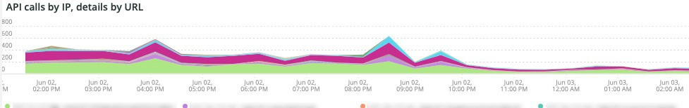
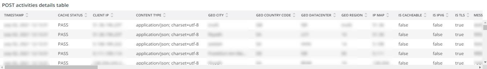

# O [!UICONTROL Security] guia

O **[!UICONTROL Security]** A guia explica os problemas de segurança e isola as possíveis causas. Além disso, os quadros da guia são descritos.

## [!UICONTROL API calls by IP, details by URL]

O **[!UICONTROL API calls by IP, details by URL]** mostra um número de chamadas de API por IP em um período selecionado. Este quadro exibe o endereço IP e o URL da API acessado por esse endereço IP.

## [!UICONTROL Forgot Password]

O **[!UICONTROL Forgot Password]** quadro de acesso mostra o número de tentativas de senha esquecidas em um período selecionado. A alta atividade contra um endereço IP pode ser um ataque no site.

## [!UICONTROL Create Account access]

O **[!UICONTROL Create Account access]** quadro mostra o número de novas atividades de conta em um período selecionado. A alta atividade de um único endereço IP pode indicar um ataque.

## [!UICONTROL POST activities]

O **[!UICONTROL POST activities]** quadro mostra as atividades do POST para o site, faceadas em client_ip do [!DNL Fastly] logs. Também mostra o URL que é acessado pelo endereço IP.

## [!UICONTROL POST activities summary table]

O **Tabela de resumo de atividades do POST** quadro mostra as atividades de POST resumidas para o site, faceadas em client_ip do [!DNL Fastly] logs. Também mostra a contagem do URL que é acessado pelo endereço IP. A contagem é para o período de tempo selecionado.

## [!UICONTROL POST activities details table]

O **[!UICONTROL POST activities details table]** quadro mostra as atividades do POST para o site a partir do [!DNL Fastly] logs. Também mostra todos os detalhes da [!DNL Fastly] registre essas solicitações. Limita-se aos últimos 2000 pedidos.

## [!UICONTROL Guest Carts activities]

O **[!UICONTROL Guest Carts activities]** quadro mostra o número de atividades do carrinho de hóspedes em um período selecionado, faceado pelo endereço IP e URL acessado. Carrinhos convidados podem ser usados em um ataque de cardado. Este quadro mostra o número total de solicitações em que os URLs de carrinhos de convidado são acessados.

## [!UICONTROL API – forgot password, create account by Countries]

O **[!UICONTROL API – forgot password, create account by Countries]** frame mostra o número de contas criadas e de solicitações para redefinir uma senha esquecida em um período selecionado. O fato é que também mostra o país de origem do pedido. Esse quadro está focado no país de origem da solicitação.

## [!UICONTROL API - forgot password, create account by Countries and IP address]

O **[!UICONTROL API - forgot password, create account by Countries and IP address]** frame mostra o número de contas criadas e de solicitações para redefinir uma senha esquecida em um período selecionado. Ele é facetado para mostrar o endereço IP, o URL acessado e o país de origem da solicitação também. Esse quadro está focado na contagem de IP.

## [!UICONTROL Guest cart activities by IP]

O **[!UICONTROL Guest cart activities by IP]** quadro mostra atividades de carrinho de convidado por IP em um período selecionado.

## [!UICONTROL Guest cart activities by Countries]

O **[!UICONTROL Guest cart activities by Countries]** mostra as atividades do carrinho de hóspedes por países ao longo de um período selecionado.

