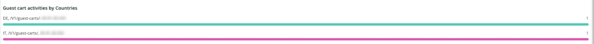

# A guia [!UICONTROL Security]

A guia **[!UICONTROL Security]** explica os problemas de segurança e isola suas possíveis causas. Além disso, os quadros da guia são descritos.

## [!UICONTROL API calls by IP, details by URL]

O quadro **[!UICONTROL API calls by IP, details by URL]** mostra várias chamadas de API por IP ao longo de um período selecionado. Esse quadro exibe o endereço IP e o URL da API que foi acessado por esse endereço IP.

## [!UICONTROL Forgot Password]

O quadro de acesso **[!UICONTROL Forgot Password]** mostra o número de tentativas de senhas esquecidas em um período selecionado. A alta atividade em relação a um endereço IP pode ser um ataque ao site.

## [!UICONTROL Create Account access]

O quadro **[!UICONTROL Create Account access]** mostra o número de novas atividades de conta em um período selecionado. A alta atividade de um único endereço IP pode indicar um ataque.

## [!UICONTROL POST activities]

O quadro **[!UICONTROL POST activities]** mostra as atividades `POST` do site, facetadas em `client_ip` dos logs [!DNL Fastly]. Ele também mostra o URL que é acessado pelo endereço IP.

## [!UICONTROL POST activities summary table]

O quadro **[!UICONTROL POST activities summary table]** mostra as `POST` atividades resumidas para o site, facetadas em `client_ip` dos logs [!DNL Fastly]. Ele também mostra a contagem do URL que é acessado pelo endereço IP. A contagem é para o período selecionado.

## [!UICONTROL POST activities details table]

O quadro **[!UICONTROL POST activities details table]** mostra as atividades `POST` do site dos logs [!DNL Fastly]. Ele também mostra todos os detalhes do log [!DNL Fastly] para essas solicitações. Está limitado às últimas 2000 solicitações.

## [!UICONTROL Guest Carts activities]

O quadro **[!UICONTROL Guest Carts activities]** mostra o número de atividades do carrinho de convidado em um período selecionado, facetado por endereço IP e URL acessado. Carrinhos convidados podem ser usados em um ataque de cartão. Este quadro mostra o número total de solicitações nas quais os URLs dos carrinhos convidados são acessados.

## [!UICONTROL API – forgot password, create account by Countries]

O quadro **[!UICONTROL API – forgot password, create account by Countries]** mostra o número de contas criadas e solicitações para redefinir uma senha esquecida em um período selecionado. Também é facetado mostrar o país de origem do pedido. Esse quadro focaliza o país de origem da solicitação.

## [!UICONTROL API - forgot password, create account by Countries and IP address]

O quadro **[!UICONTROL API - forgot password, create account by Countries and IP address]** mostra o número de contas criadas e solicitações para redefinir uma senha esquecida em um período selecionado. Também é facetado mostrar o endereço IP, o URL acessado e o país de origem da solicitação. Esse quadro focaliza a contagem de IP.

## [!UICONTROL Guest cart activities by IP]

O quadro **[!UICONTROL Guest cart activities by IP]** mostra as atividades do carrinho de convidado por IP em um período selecionado.

## [!UICONTROL Guest cart activities by Countries]

O quadro **[!UICONTROL Guest cart activities by Countries]** mostra as atividades do carrinho de convidado por países em um período selecionado.

