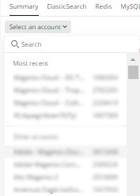

# Selecionar a conta e o período:

Ao clicar no botão [!UICONTROL Observation for Adobe Commerce] ícone, o [!DNL Observation for Adobe Commerce] o nerdlet abrirá.

1. Clique no link **Selecione uma conta** lista suspensa. Se você não vir a variável **Selecione uma conta** , talvez você não tenha acesso. Clique em [aqui](https://adobe.sharepoint.com/sites/MG/it/IT%20Services%20Wiki/Requesting%20access%20to%20Magento%20Commerce%20New%20Relic.aspx) para solicitar acesso.

   

1. Você pode colar a project_id, digite o [!DNL New Relic] número da conta ou nome da conta, ou navegue pela lista de contas.

   

1. Clique no link **azul claro** (na parte superior direita da janela do nerdlet) com o ícone de relógio.

   

1. Você deve definir a hora antes da data e hora do ticket para ver se houve eventos/dados anteriores. Você pode usar os intervalos de tempo predefinidos à esquerda ou definir um período personalizado selecionando **Definir personalizado**.
