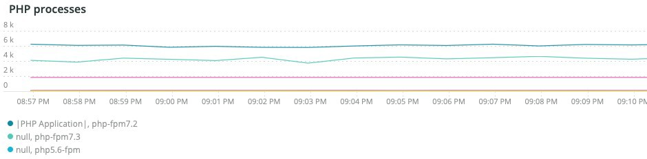

# A variável [!UICONTROL Summary] guia

A variável [!UICONTROL Summary] guia de [!DNL Observation for Adobe Commerce] O tem como objetivo ver rapidamente alguns dos problemas enfrentados pelos sites para ajudá-lo a resolver automaticamente ou identificar possíveis causas básicas de problemas no site. As guias adicionais fornecem informações mais detalhadas sobre os serviços de componentes, banco de dados, infraestrutura e estados do processo.

## [!UICONTROL Transaction Overview]

### [O que é uma transação?](https://docs.newrelic.com/docs/apm/transactions/intro-transactions/transactions-new-relic-apm/#:%7E:text=transactions%20are%20reported.-,What%20is%20a%20transaction%3F,work%20in%20a%20software%20application.&amp;text=For%20APM%2C%20it%20will%20frequency,when%20the%20response%20is%20sent)

&quot;Em [!DNL New Relic], uma transação é definida como uma unidade lógica de trabalho em um aplicativo de software. Especificamente, ele se refere às chamadas de função e chamadas de método que compõem essa unidade de trabalho. Geralmente se refere a uma transação da web, que representa uma atividade que acontece de quando o aplicativo recebe uma solicitação da web até quando a resposta é enviada.&quot;

### Tipos de transações:

**Web:** As transações da Web são iniciadas com uma solicitação HTTP. Para a maioria das organizações, elas representam interações centradas no cliente e, portanto, são as transações mais importantes a serem monitoradas.

**Não-Web:** As transações que não são da Web não são iniciadas com uma solicitação da Web. Eles podem incluir processos que não sejam processos de trabalho na Web, processos em segundo plano, scripts, atividade da fila de mensagens e outras tarefas.

Se você observar o **[!UICONTROL Transaction Overview]** acima, havia quase 53.000 transações com uma pontuação APDEX média de 0,76, e 95% dessas transações ocorreram em menos de 2,313 segundos. Esse seria um quadro em que um período mais curto pode mostrar um desvio em relação à média atual se houver uma ocorrência de APDEX durante um período curto.

## [!UICONTROL 404 page errors frame]

A variável **[!UICONTROL 404 page errors]** quadro lista os [URI](https://en.wikipedia.org/wiki/Uniform_Resource_Identifier) e a contagem de erros de página 404 para um período selecionado.

## [!UICONTROL % of Storage Free frame]

A variável **[!UICONTROL % of Storage Free]** exibe o percentual médio livre das montagens de armazenamento em todos os nós do cluster. Por exemplo, se você tiver um cluster de três nós, o quadro mostrará a variável \&lt;mount point=&quot;&quot;>, \&lt;environment name=&quot;&quot;>. Esse quadro pode ser enganoso se houver uma variação entre três nós. Um exemplo de variação seria se a variável `/data/mysql` o ponto de montagem livre era um valor diferente no cluster de três nós. Há um quadro abaixo de [!UICONTROL MySQL] guia que faceta os pontos de montagem por nome de nó para ver com mais precisão o que a `/data/mysql` o armazenamento livre em cada nó é.

## [!UICONTROL % of system memory that is free frame]

A variável **% de memória do sistema livre** quadro exibe, por nó, a quantidade de memória do sistema que está livre em cada nó.

## [!UICONTROL Swap memory free in bytes]

A variável **[!UICONTROL Swap memory free in bytes]** exibe, por nó, a quantidade de memória SWAP livre no nó.

## [!UICONTROL CPU % by host]

A agregação de todos os ambientes e nós é exibida no campo **[!UICONTROL CPU % by host]** quadro. Você deve desmarcar os ambientes de não produção. Observe também quaisquer instâncias em que todos os nós do ambiente de produção não estejam presentes. Para obter mais dicas sobre alta utilização da CPU, consulte [Solucionar problemas de desempenho usando o New Relic no Adobe Commerce](https://experienceleague.adobe.com/docs/commerce-knowledge-base/kb/troubleshooting/miscellaneous/troubleshoot-performance-using-new-relic-on-magento-commerce.html).

## [!UICONTROL Alerts during timeframe]

A variável **[!UICONTROL Alerts during timeframe]** exibe todos os alertas, incluindo o [!UICONTROL Managed Alerts] adicionado pelo suporte da Adobe Commerce.

## [!UICONTROL CPU Usage]

Se a variável **[!UICONTROL CPU Usage]** quadro é em branco, é uma indicação de que a aplicação da infraestrutura [!DNL New Relic] não está ativado. Se seu site está no Starter, você não vê essas informações. Se o site for Pro, abra um [tíquete de suporte](https://experienceleague.adobe.com/docs/commerce-knowledge-base/kb/help-center-guide/magento-help-center-user-guide.html) ter [!DNL New Relic Infrastructure] habilitado para o site.

## [!UICONTROL Average Response Time]

A variável **[!UICONTROL Average Response Time]** o gráfico mostra o tempo médio de resposta para transações (web e outras).

## [!UICONTROL Long duration cron_schedule updates]

A variável **[!UICONTROL cron_schedule]** a tabela é gravada no início e no fim dos trabalhos cron. Trabalhos cron de longa duração podem indicar latência na atualização desta tabela, o que pode indicar empilhamento cron ou um problema com a forma como os crons são agendados.

## [!UICONTROL Response Code]

A variável **[!UICONTROL Response Code]** O quadro é uma boa indicação do tráfego da web e do código de resposta das solicitações. É necessário [!DNL New Relic's] dados da transação, e é facetada pela `httpResponseCode` retornado.

## [!UICONTROL Web Traffic volume compared with one week ago Magento Managed Alerts Information]

Esse quadro exibe o volume de tráfego comparativo da Web da última semana e da semana atual.

## [!UICONTROL Deployment Log Entries]

A variável **[!UICONTROL Deployment Log Entries]** o quadro exibe uma contagem de entradas de log de implantação e nuvem e decompõe as contagens pelo nome do log de implantação.

## [!UICONTROL Deployment State]

A variável **[!UICONTROL Deployment State]** O quadro enfoca fases específicas de implantação a partir dos logs de implantação. Estes são alguns exemplos de fases contadas no log e o nome da faceta:

**Fases de Log de Implantação:**

* &#39;%Starting generate command%&#39;) como &#39;start_gen&#39;
* &#39;%git apply /app/vendor/magento/ece-tools/patches%&#39;) como &#39;apply_patches&#39;
* &#39;%Set flag: .static_content_deploy%&#39;) como &#39;SCD&#39;
* &#39;%NOTICE: comando de geração concluído (%) como &#39;gen_compl&#39;
* &#39;%NOTICE: implantação concluída (%) como &#39;deploy_compl&#39;
* &#39;%NOTA: iniciando pós-implantação.%&#39;) como &#39;start_deploy&#39;
* &#39;%NOTICE: a pós-implantação está concluída (%) como &#39;implantação&#39;
* &#39;%deploy-complete%&#39;) como &#39;cl_deploy_compl&#39;

## [!UICONTROL IP Frequency]

A variável **[!UICONTROL IP Frequency]** quadro conta os status (&#39;MISS&#39; e &#39;PASS&#39;) para cada IP do [!DNL Fastly] logs. As solicitações da Web com esses status chegam ao servidor de origem e adicionarão carga ao servidor. Ele mostra os vinte principais endereços em frequência. Esse quadro pode ser usado para detectar ataques de IP ou origens de carga pesada em um site.

## [!UICONTROL IP Response – top 20 URLs in duration]

A variável **[!UICONTROL IP Response – top 20 URLs in duration]** exibe os URLs com a maior duração na resposta. Ele pode indicar arquivos de imagem ou páginas grandes, API ou páginas com a maior duração de resposta.

## [!UICONTROL API Calls by IP]

A variável **[!UICONTROL API Calls by IP]** O quadro ajuda a identificar tráfego intenso nas APIs e nos endereços IP que fazem solicitações dos URLs da API.

## [!UICONTROL API Calls by IP, details by URL]

A variável **[!UICONTROL API Calls by IP, details by URL]** O quadro fornece detalhes do tráfego intenso em relação às APIs e detalhes dos URLs que fazem as solicitações.

## [!UICONTROL IP Frequency Rate per minute]

Às vezes, é difícil saber qual endereço IP tem mais solicitações nos outros quadros. A variável **[!UICONTROL IP Frequency Rate per minute]** mostra a taxa por minuto por endereço IP.

## [!UICONTROL Potential Bots]

A variável **[!UICONTROL Potential Bots]** o quadro analisa as solicitações com um nome request_user_agent como NULL ou &#39;%bot%&#39;. Normalmente, o request_user_agent &#39;%bot%&#39; segue a configuração de política em `robots.txt` arquivo.

## [!UICONTROL Transaction Errors]

A variável **[!UICONTROL Transaction Errors]** quadro exibe a contagem de erros de transação de [!DNL New Relic].

## [!UICONTROL Nginx access by node]

A variável **[!UICONTROL Nginx access by node]** o quadro observa contagens do `access.log` por nó. É útil ver se a carga está distribuída uniformemente. Geralmente, mostra quando um nó cai. O quadro também mostra a carga no site.

## [!UICONTROL Galera Log]

[[!DNL Galera]](https://galeracluster.com/library/galera-documentation.pdf) é usado para o cluster de banco de dados. Esse quadro focaliza sinais específicos do [!UICONTROL Galera] cluster. Os sinais se concentram nos nós que entram e saem do cluster, o que é um comportamento normal para manter a integridade dos dados do banco de dados. Os nós são mantidos sincronizados como o [!UICONTROL Galera] alterações no estado do cluster.

**Lista de [!UICONTROL Galera] alterações de estado:**

* &#39;%1047 O WSREP ainda não preparou o nó para uso do aplicativo (%node_not_prep_for_use&#39;)
* &#39;%\[ERROR\] WSREP: Falha ao ler de: wsrep_sst_xtrabackup-v2%&#39;) como &#39;xtrabackup_read_fail&#39;
* &#39;%\[ERROR\] WSREP: Processo concluído com erro: wsrep_sst_xtrabackup-v2 %&#39;) como &#39;xtrabackup_compl_w_err&#39;
* &#39;%\[ERROR\] WSREP: rbr write fail%&#39;) como &#39;rbr_write_fail&#39;
* &#39;%self-leave%&#39;) como &#39;susp_node&#39;
* &#39;%member = 3/3 (unido/total)%&#39;) como &#39;3of3&#39;
* &#39;%member = 2/3 (unido/total)%&#39;) como &#39;2of3&#39;
* &#39;%member = 2/2%&#39;) como &#39;2of2&#39; * &#39;%member = 1/2%&#39;) como &#39;1of2&#39; * &#39;%member = 1/3%&#39;) como &#39;1of3&#39;
* &#39;%member = 1/1%&#39;) como &#39;1of1&#39;
* &#39;%\[Nota\] /usr/sbin/mysqld (mysqld 10.%&#39;) como &#39;sql_restart&#39;
* &#39;%Quorum: Nenhum nó com estado concluído:%&#39;) como &#39;no_node_count&#39;
* &#39;%WSREP: Membro 0%&#39;) como &#39;mem_0&#39;
* &#39;%WSREP: Membro 1.0%&#39;) como &#39;mem_1&#39;
* &#39;%WSREP: Membro 2%&#39;) como &#39;mem2&#39;
* &#39;%WSREP: Sincronizado com grupo, pronto para conexões&#39;) como &#39;pronto&#39;
* &#39;%/usr/sbin/mysqld, Version:%&#39;) como &#39;mysql_restart_mysql.slow&#39;
* &#39;%\[Note\] WSREP: Nova exibição de cluster: estado global:%&#39;) como &#39;galera_cluster_view_change&#39;

Esses sinais podem indicar problemas de armazenamento, memória ou query se o estado mudar com frequência.

## [!UICONTROL Database errors]

**Lista de mensagens ou erros de banco de dados detectados:**

* &#39;%Memory size alocado para a tabela temporária é mais de 20% de innodb_buffer_pool_size%&#39;) como &#39;temp_tbl_buff_pool&#39;
* &#39;%\[ERROR\] WSREP: rbr write fail%&#39;) como &#39;rbr_write_fail&#39;
* &#39;%mysqld: Disco cheio%&#39;) como &#39;disk_full&#39;
* &#39;%Número do erro 28%&#39;) como &#39;err_28&#39;
* &#39;%rollback%&#39;) como &#39;reversão&#39;
* &#39;%Foreign key constraint falha para a tabela &#39;%&#39;) como &#39;Foreign_key_constraint&#39;
* &#39;%Error_code: 1114%&#39;) como &#39;sql_1114_full&#39;
* &#39;%CRITICAL: SQLSTATE\[HY000\] \[2006\] O servidor MySQL desapareceu%&#39;) como &#39;sql_went&#39;
* &#39;%SQLSTATE\[HY000\] \[1040\] Muitas conexões%&#39;) como &#39;sql_1040&#39;
* &#39;%CRITICAL: SQLSTATE\[HY000\] \[2002\]%&#39;) as &#39;sql_2002&#39;
* &#39;%SQLSTATE\[08S01\]:%&#39;) como &#39;sql_1047&#39;
* &#39;%\[Aviso\] Conexão cancelada%&#39;) como &#39;aborted_conn&#39;
* &#39;%SQLSTATE\[23000\]: violação de restrição de integridade:%&#39;) como &#39;sql_23000&#39;
* &#39;%1205 Tempo limite de espera de bloqueio (%1) como &#39;sql_1205&#39;
* &#39;%SQLSTATE\[HY000\] \[1049\] Banco de dados desconhecido%&#39;) como &#39;sql_1049&#39;
* &#39;%SQLSTATE\[42S02\]: Tabela ou exibição base não encontrada:%&#39;) como &#39;sql_42S02&#39;
* &#39;%General error: 1114%&#39;) as &#39;sql_1114&#39;
* &#39;%SQLSTATE\[40001\]%&#39;) como &#39;sql_1213&#39;
* &#39;%SQLSTATE\[42S22\]: Coluna não encontrada: 1054 Coluna desconhecida%&#39;) como &#39;sq1_1054&#39;
* &#39;%SQLSTATE\[42000\]: Erro de sintaxe ou violação de acesso:%&#39;) como &#39;sql_42000&#39;
* &#39;%SQLSTATE\[21000\]: Violação de cardinalidade:%&#39;) como &#39;sql_1241&#39;
* &#39;%SQLSTATE\[22003\]:%&#39;) como &#39;sql_22003&#39;
* &#39;%SQLSTATE\[HY000\] \[9000\] Cliente com endereço IP%&#39;) como &#39;sql_9000&#39;
* &#39;%SQLSTATE\[HY000\]: Erro geral: 2014%&#39;) como &#39;sql_2014&#39;
* &#39;%1927 Conexão eliminada (%1927) como &#39;sql_1927&#39;
* &#39;%1062 \[\ERRO\] InnoDB:%&#39;) como &#39;sql_1062_e&#39;
* &#39;%\[Nota\] WSREP: Liberando mapa de memória para disco...%&#39;) como &#39;mem_map_flush&#39;
* &#39;%Código de erro interno do MariaDB: 1146%&#39;) como &#39;sql_1146&#39;
* &#39;%Internal MariaDB (código de erro: 1062%&#39;) as &#39;sql_1062&#39; * &#39;%1062 \[Aviso\] InnoDB:%&#39;) as &#39;sql_1062_w&#39;
* &#39;%Código de erro interno do MariaDB: 1064%&#39;) como &#39;sql_1064&#39;
* &#39;%InDB: falha de asserção no arquivo &#39;%&#39;) como &#39;assertion_err&#39;
* &#39;%mysqld_safe Número de processos em execução agora: 0%&#39;) como &#39;mysql_oom&#39;
* &#39;%\[ERROR\] mysqld obteve sinal%&#39;) como &#39;mysql_sigterm&#39;
* &#39;%1452 Não é possível adicionar &#39;%&#39;) como &#39;sql_1452&#39;
* &#39;%ERROR 1698%&#39;) como &#39;sql_1698&#39;
* &#39;%SQLSTATE\[HY000\]: Erro geral: 3%&#39;) como &#39;cnt_wrt_tmp&#39;
* &#39;%General error: 1 %&#39;) como &#39;sql_syntax&#39;
* &#39;%42S22%&#39;) como &#39;sql_42S22&#39;
* &#39;%InDB: Erro (Chave duplicada)%&#39;) como &#39;innodb_dup_key&#39;

## [!UICONTROL Database traces]

A variável **[!UICONTROL Database traces]** o quadro analisa os dados do [rastreamento sql](https://docs.newrelic.com/docs/apm/transactions/transaction-traces/transaction-traces-database-queries-page/) entidade de [!DNL New Relic] e retorna o caminho do rastreamento.

## [!UICONTROL Database mysql-slow.log]

A variável **[!UICONTROL Database mysql-slow.log]** quadro faz uma contagem de entradas no [mysql-slow.log](https://dev.mysql.com/doc/refman/5.7/en/slow-query-log.html) por tipo de solicitação de consulta. Ele isola visualmente intervalos de tempo que podem ser de interesse no mysql-slow.log (log de consultas lentas). Consultas de tabelas sem índices ou consultas que atualizam tabelas grandes podem bloquear outras consultas.

## [!UICONTROL Redis synchronization from Log]

[[!DNL Redis]](https://redis.io/docs/about/) é um armazenamento de estrutura de dados em memória de código aberto (BSD licenciado) usado como um banco de dados, cache e agente de mensagens. Ele pode fazer cache de banco de dados e sessão, se configurado. A variável **[!UICONTROL Redis synchronization from Log]** quadro focaliza em [[!DNL Redis] sincronização](https://redis.io/docs/manual/replication/). Quanto maior a [!DNL Redis] conjunto de dados, quanto mais provável haverá problemas com a sincronização (mais dados para manter sincronizados).

**[!DNL Redis]erros e mensagens:**

* &#39;%Sincronização SLAVE: sem espaço restante no dispositivo (%SLAVE synchronization: No space left on device%) as &#39;space&#39;
* &#39;%Server started, Redis version%&#39;) como &#39;serv_start&#39;
* &#39;%O servidor está pronto para aceitar conexões&#39;) como &#39;pronto&#39;
* &#39;%Conexão com principal perdida.%&#39;) como &#39;mstr_lost&#39;
* &#39;%+sentinela%&#39;) como &#39;+sentinela&#39;
* &#39;%-sdown sentinel%&#39;) como &#39;-sentinal&#39;
* &#39;%-sdown slave%&#39;) como &#39;-slave&#39;, &#39;%+sdown slave%&#39;) como &#39;+slave&#39;
* &#39;%-failover-abort-not-elected principal mymaster%&#39;) como &#39;-failover&#39;
* &#39;%+failover-abort-not-elected principal mymaster%&#39;) como &#39;+failover&#39;
* &#39;%Partial resynchronization not possible (no cached principal)%&#39;) as &#39;part_sync_err&#39;
* &#39;%PRINCIPAL anulou a replicação com um erro: ERR Can%&#39;) como &#39;mstr_sync_err&#39;
* &#39;%Principal não dá suporte a PSYNC ou está em estado de erro (%) como &#39;mstr_psync_err&#39;
* &#39;%SLAVE sync: Concluído com êxito (%&#39;) como &#39; slv_sync_suc&#39;
* &#39;%PRINCIPAL anulou a replicação com um erro: ERR Pode%&#39;) como &#39;mstr_sync_err,count&#39;
* &#39;%OOM comando não permitido quando usado memória%&#39;) como &#39; max_mem_err&#39;
* &#39;%CredisException(código: 0): erro de leitura na conexão%&#39;) como &#39;credis_read_error&#39;
* &#39;%Uncaught RedisException:%&#39;) como &#39;redis_excp_err&#39;
* &#39;%psync agendado para ser fechado o mais rápido possível para a substituição do buffer de saída&#39;) como &#39;output_buf_err&#39;

## [!UICONTROL PHP process states]

A forma como os processos PHP se comportam depende do [configuração](https://www.php.net/manual/en/install.fpm.configuration.php). A configuração é complexa, com muitas variáveis e opções. A variável **[!UICONTROL PHP process states]** frame ajuda você a entender quando os processos do PHP são terminados e reiniciados.

### [!UICONTROL PHP errors]

A variável **[!UICONTROL PHP errors]** frame mostra o número de erros de PHP com workers no período selecionado. Para obter mais informações, consulte [Configurações do Adobe Commerce PHP](../../installation/prerequisites/php-settings.md).

**Erros e mensagens do PHP:**

* &#39;%worker_connections are not insufficient%&#39;) como &#39;worker&#39;
* Erro fatal &#39;%PHP: tamanho de memória permitido!%&#39;) como &#39;mem_size&#39;
* &#39;%exited on signal 11 (SIGSEGV)%&#39;) como &#39;sig_11&#39;
* &#39;%exited on signal 7 (SIGBUS)%&#39;) como &#39;sig_7&#39;
* &#39;%aumente pm.start_servers%&#39;) como &#39;pmstart_serv&#39;
* &#39;%max_children%&#39;) como &#39;max_children_cnt&#39;
* &#39;%PHP Erro fatal: tamanho de memória permitido de &#39;%&#39;) como &#39;mem_exhst_count&#39;
* &#39;%Unable to allocate memory for pool%&#39;) como &#39;opc_mem_count&#39;
* &#39;%Warning Interned string buffer overflow%&#39;) como &#39;opc_str_buf&#39;
* &#39;%Illegal string offsetl%&#39;) como &#39;opc_sv_comments&#39;
* &#39;%PHP Erro fatal: RedisException não detectada: erro de leitura na conexão &#39;%&#39;) como &#39;php_exc&#39;

## [!UICONTROL PHP processes]

[PHP-FPM](https://php-fpm.org/) é um [!UICONTROL FastCGI Process Manager] usado por [!DNL Nginx]. Para saber mais sobre os requisitos do sistema, consulte [Requisitos de versão do PHP mapeados para versões do Adobe Commerce](../../installation/system-requirements.md). A variável **[!UICONTROL PHP processes]** frame mostra o número de processos PHP em execução em um determinado momento na linha do tempo selecionada.

## [!UICONTROL Secondary processes]

Processos secundários podem afetar a resposta do local. A variável **[!UICONTROL Secondary processes]** quadro indica um processo ou processos que podem estar adicionando carga ao site. O banco de dados tem principalmente os processos mais secundários em execução.

## [!UICONTROL Traffic vs Week Ago]

A variável **[!UICONTROL Traffic vs Week Ago]** O quadro do verifica o tráfego do site (solicitações) do [!DNL Fastly] logs com status de cache (&#39;MISS&#39;, &#39;PASS&#39;). Essas solicitações adicionam carga aos servidores de origem. Esse quadro exibe o volume de solicitação da Web comparativo da semana atual e da semana passada durante o mesmo período.

## [!UICONTROL Fastly Cache]

A variável **[!UICONTROL Fastly Cache]** mostra uma exibição agregada do status do cache das solicitações do [!DNL Fastly] logs. Se você selecionar ERRO, ele mostrará a porcentagem de erros nas solicitações. Normalmente, isso aumenta quando o servidor de origem não responde com rapidez suficiente às solicitações de página.

## [!UICONTROL Page Rendering]

A variável **[!UICONTROL Page Rendering]** quadro exibe a duração média da renderização de página da semana atual a partir da origem de exibição de página de [!DNL New Relic] em comparação com a semana anterior durante o mesmo período.

## [!UICONTROL Page loading detail]

A variável **[!UICONTROL Page loading detail]** quadro descreve os eventos de carregamento de página. Ela detalha os significados dessas facetas. Esta é a consulta executada para este quadro:

`SELECT percentile(timeToResponseStart, 50) AS 'first byte', percentile(firstPaint, 50) as 'First paint', percentile(firstContentfulPaint, 50) as 'First contentful paint', percentile(timeToDomContentLoadedEventEnd, 50) AS 'DOM content loaded', percentile(duration, 50) AS 'Window load + AJAX' FROM BrowserInteraction TIMESERIES`

## [!UICONTROL Transactions – Avg, Max, Min]

A duração da transação é em segundos. Dependendo da transação, ela poderá afetar outras transações se for de longa duração. As transações listadas em nome e as durações são para o período específico. Se houver um período de tempo de problema conciso, redimensione o [!DNL Observation for Adobe Commerce] seletor de data/hora para esse período limitado.

## [!UICONTROL Admin Activities]

A variável **[!UICONTROL Admin Activities]** o quadro identifica transações com um usuário administrador.

## [!UICONTROL Order transactions (default?)]

A variável **[!UICONTROL Order transactions (default?)]** o quadro procura por transações `request.headers.host` de transações, onde o nome = `WebTransaction/Action/checkout/onepage/success`. Se o URL de sucesso do pedido for diferente, esse quadro não terá dados.

## [!UICONTROL Elasticsearch Index information]

**[Status do Elasticsearch:](https://www.elastic.co/guide/en/elasticsearch/reference/current/cluster-health.html)**

* Verde: Todos os compartilhamentos são atribuídos.
* Amarelo: todos os compartilhamentos primários são atribuídos, mas um ou mais compartilhamentos de réplica não são atribuídos. Se um nó no cluster falhar, alguns dados poderão ficar indisponíveis até que esse nó seja reparado.
* Vermelho: um ou mais fragmentos principais não foram atribuídos, portanto, alguns dados não estão disponíveis. Isso pode ocorrer brevemente durante a inicialização do cluster, conforme os compartilhamentos principais são atribuídos.

## [!UICONTROL Elasticsearch Errors]

**[!DNL Elasticsearch]erros:**

* &#39;%all_shards failed%&#39; como &#39;all_shards_failed&#39;
* &#39;%NoNodesAvailableException%&#39; como &#39;no_alive_nodes&#39;
* &#39;%PHP Erro Fatal: Erro Não Detectado: Parâmetros incorretos para Elasticsearch%&#39; como &#39;error_param&#39;
* &#39;%Você pode corrigir esse problema atualizando o serviço Elasticsearch na infraestrutura do Magento para version%&#39; como &#39;ver_err&#39;
* Status de integridade de &#39;%cluster alterado de \[YELLOW\] para \[RED\] (motivo:%&#39; como &#39;yel_red&#39;
* &#39;%No space left on device%&#39; como &#39;no_space&#39;
* &#39;% Falha ao executar [SearchRequest{searchType=%&#39; as &#39;failed_query&#39;

## [!UICONTROL Cron view]

A variável **[!UICONTROL Cron view]** frame verifica o registro de cron para obter o equilíbrio entre o número de crons iniciados e o número de crons terminados.

## [!UICONTROL Cron error]

**Erros Cron do cron.log:**

* &#39;%_stg%&#39; como &#39;stg_crons&#39;
* &#39;%Não foi possível adquirir bloqueio para o trabalho cron%&#39; como &#39;cron_lock&#39;
* &#39;%General error: 2006 O servidor MySQL desapareceu%&#39; como &#39;mysql_has_went_away&#39;
* &#39;%error%&#39; como &#39;erro&#39;
* &#39;%Erro geral: 1205 tempo limite de espera de bloqueio excedido%&#39; as sql_1205_cron

## [!UICONTROL cron_schedule table updates]

A variável **[!UICONTROL cron_schedule table updates]** o quadro verifica a duração máxima em segundos em que as atualizações de operações de armazenamento de dados envolvem a tabela cron_schedule. Ela é facetada no tipo de solicitação SQL.

## [!UICONTROL Datastore Operations Tables]

Este **[!UICONTROL Datastore Operations Tables]** O quadro exibe as 25 principais operações por tempo de duração, nome da tabela e tipo de solicitação SQL. Passe o mouse sobre os picos para ver detalhes de qual tabela estava sendo acessada e por que tipo de solicitação.

## [!UICONTROL Cache Flush]

**Liberações de cache detectadas:**

* &#39;%config%&#39; como &#39;config_cache_flush&#39;
* &#39;%layout%&#39; como &#39;layout_cache_flush&#39;
* &#39;%block_html%&#39; como &#39;block_html_cache_flush&#39;
* &#39;%collections%&#39; como &#39;collections_cache_flush&#39;
* &#39;%refletion%&#39; como &#39;refletion_cache_flush&#39;
* &#39;%db_ddl%&#39; como &#39;db_ddl_cache_flush&#39;
* &#39;%compilation_config%&#39; como &#39;compilation_config_cache_flush&#39;
* &#39;%eav%&#39; como &#39;eav_cache_flush&#39;
* &#39;%customer_notification%&#39; como &#39;cust_notif_cache_flush&#39;
* &#39;%config_integration%&#39; como &#39;config_integ_cache_flush&#39;
* &#39;%config_integration_api%&#39; como &#39;config_integ_api_cache_flush&#39;
* &#39;%full_page%&#39; como &#39;full_page_cache_flush&#39;
* &#39;%config_webservice%&#39; como &#39;config_webserv_cache_flush&#39;
* &#39;%translate%&#39; como &#39;translate_cache_flush&#39;
