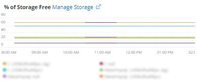
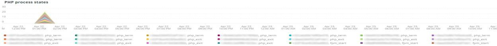
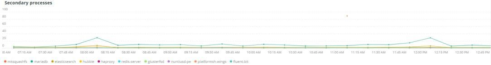

# O [!UICONTROL Summary] guia

O [!UICONTROL Summary] guia de [!DNL Observation for Adobe Commerce] O tem o objetivo de ver rapidamente alguns dos problemas enfrentados pelos sites para ajudá-lo a resolver automaticamente ou identificar possíveis causas raiz dos problemas do site. As guias adicionais fornecem informações de nível mais profundo sobre serviços de componentes, banco de dados, infraestrutura e estados de processos.

## [!UICONTROL Transaction Overview]

### [O que é uma transação?](https://docs.newrelic.com/docs/apm/transactions/intro-transactions/transactions-new-relic-apm/#:%7E:text=transactions%20are%20reported.-,What%20is%20a%20transaction%3F,work%20in%20a%20software%20application.&amp;text=For%20APM%2C%20it%20will%20many frequentemente, quando%20the%20response%20is%20sent)

&quot;Em [!DNL New Relic], uma transação é definida como uma unidade lógica de trabalho em um aplicativo de software. Especificamente, ele se refere às chamadas de função e chamadas de método que compõem essa unidade de trabalho. Geralmente se refere a uma transação da Web, que representa uma atividade que acontece de quando o aplicativo recebe uma solicitação da Web para quando a resposta é enviada.&quot;

### Tipos de transações:

**Web:** As transações são iniciadas com uma solicitação HTTP. Para a maioria das organizações, elas representam interações centradas no cliente e, portanto, são as transações mais importantes a serem monitoradas.

**Sem Web:** Transações que não sejam da Web não são iniciadas com uma solicitação da Web. Eles podem incluir processos de trabalho que não sejam da Web, processos em segundo plano, scripts, atividade de fila de mensagens e outras tarefas.

Olhando para o **[!UICONTROL Transaction Overview]** quadro, havia quase 53.000 transações com uma pontuação APDEX média de 0,76, e 95% dessas transações aconteciam em menos de 2,313 segundos. Esse seria um quadro em que um período mais apertado pode mostrar desvio em relação à média atual se houver uma ocorrência APDEX durante um curto período de tempo.

## [!UICONTROL 404 page errors frame]

O **[!UICONTROL 404 page errors]** O quadro lista o [URI](https://en.wikipedia.org/wiki/Uniform_Resource_Identifier) e a contagem de erros de 404 páginas durante o período selecionado.

## [!UICONTROL % of Storage Free frame]

O **[!UICONTROL % of Storage Free]** O quadro exibe a porcentagem média livre das montagens de armazenamento em todos os nós do cluster. Por exemplo, se você tiver um cluster de três nós, isso mostrará o \&lt;mount point=&quot;&quot;>, \&lt;environment name=&quot;&quot;>. Esse quadro pode ser enganador se houver uma variação entre três nós. Um exemplo de variação seria se a variável `/data/mysql` mount point free era um valor diferente no cluster de três nós. Há um quadro abaixo do [!UICONTROL MySQL] guia que faceta os pontos de montagem por nome de nó para ver com mais precisão o que `/data/mysql` o armazenamento gratuito em cada nó é realmente.

## [!UICONTROL % of system memory that is free frame]

Esse quadro exibe, por nó, a quantidade de memória do sistema que está livre em cada nó.

## [!UICONTROL Swap memory free in bytes]

O **[!UICONTROL Swap memory free in bytes]** quadro exibe, por nó, a quantidade de memória SWAP que está livre no nó.

## [!UICONTROL CPU % by host]

A agregação de todos os ambientes e nós é exibida na variável **[!UICONTROL CPU % by host]** quadro. Você deve desmarcar os ambientes de não produção. Você deve observar qualquer instância em que todos os nós do ambiente de produção não estejam presentes. Este artigo fornece dicas sobre alto uso da CPU: [Solucionar problemas de desempenho usando o New Relic no Adobe Commerce](https://support.magento.com/hc/en-us/articles/360042149832#high_cpu_usage).

## [!UICONTROL Alerts during timeframe]

O **[!UICONTROL Alerts during timeframe]** exibe todos os alertas, incluindo [!UICONTROL Managed Alerts] adicionado pelo Suporte da Adobe Commerce.

## [!UICONTROL CPU Usage]

Se a variável **[!UICONTROL CPU Usage]** estiver em branco, é um indicador de que a aplicação de infraestrutura de [!DNL New Relic] não está ativado. Se seu site estiver no Starter, você não verá essas informações. Se seu site estiver no Pro, abra um tíquete de suporte para ter [!DNL New Relic Infrastructure] habilitado para seu site.

## [!UICONTROL Average Response Time]

O **[!UICONTROL Average Response Time]** gráfico mostra o tempo médio de resposta para transações (da Web e outras).

## [!UICONTROL Long duration cron_schedule updates]

O **[!UICONTROL cron_schedule]** a tabela é escrita no início e no fim de trabalhos do cron. Trabalhos de cron de longa duração podem indicar latência na atualização dessa tabela, o que pode indicar uma pilha de cron ou um problema com como os crons são agendados.

## [!UICONTROL Response Code]

O **[!UICONTROL Response Code]** frame é uma boa indicação do tráfego da Web e do código de resposta das solicitações. É [!DNL New Relic] dados de transação, e são faceados pela variável `httpResponseCode` retornado.

## [!UICONTROL Web Traffic volume compared with one week ago Magento Managed Alerts Information]

Este quadro exibe o volume de tráfego da Web de uma semana atrás em comparação ao volume atual.

## [!UICONTROL Deployment Log Entries]

O **[!UICONTROL Deployment Log Entries]** frame exibe uma contagem de entradas de implantação e de log de nuvem e faceta as contagens pelo nome do log de implantação.

## [!UICONTROL Deployment State]

O **[!UICONTROL Deployment State]** o quadro faceta frases de implantação específicas dos logs de implantação. Estes são exemplos de frases contadas no log e o nome da faceta:

**Frases do log de implantação:**

* ‘%Iniciando gerar comando%&#39;) como &#39;start_gen&#39;
* &#39;%git apply /app/vendor/magento/ece-tools/patches%&#39;) como &#39;apply_patches&#39;
* &#39;%Definir sinalizador: .static_content_deploy%&#39;) como &#39;SCD&#39;
* &#39;%AVISO: Gerar comando concluído%&#39;) como &#39;gen_compl&#39;
* &#39;%AVISO: Implantação concluída%&#39;) como &#39;deploy_compl&#39;
* &#39;%AVISO: Iniciar pós-implantação.%&#39;) como &#39;start_deploy&#39;
* &#39;%AVISO: A pós-implantação foi concluída (%) como &quot;implantar&quot;
* &#39;%deploy-complete%&#39;) como &#39;cl_deploy_compl&#39;

## [!UICONTROL IP Frequency]

O **[!UICONTROL IP Frequency]** O quadro conta os status (&quot;MISS&quot; e &quot;PASS&quot;) para cada IP a partir do [!DNL Fastly] logs. As solicitações da Web com esses status alcançarão o servidor de origem e adicionarão carga ao servidor. Ele mostra os vinte principais endereços com frequência. Esse quadro pode ser usado para detectar ataques de IP ou fontes de carga pesada em um site.

## [!UICONTROL IP Response – top 20 URLs in duration]

Esse quadro exibe os URLs com a maior duração em resposta. Pode indicar arquivos de imagem grandes ou páginas, API ou páginas com a maior duração de resposta.

## [!UICONTROL API Calls by IP]

O **[!UICONTROL API Calls by IP]** ajuda a identificar tráfego pesado contra as APIs e os endereços IP que fazem solicitações dos URLs da API.

## [!UICONTROL API Calls by IP, details by URL]

O **[!UICONTROL API Calls by IP, details by URL]** O quadro fornece detalhes de tráfego intenso em relação às APIs e detalhes dos URLs que fazem as solicitações.

## [!UICONTROL IP Frequency Rate per minute]

Às vezes, é difícil saber qual endereço IP tem mais solicitações nos outros quadros. O **[!UICONTROL IP Frequency Rate per minute]** quadro mostra a taxa por minuto por endereço IP.

## [!UICONTROL Potential Bots]

O **[!UICONTROL Potential Bots]** o quadro procura solicitações com um nome request_user_agent como NULL ou ‘%bot%’. Normalmente, o request_user_agent ‘%bot%’ seguirá a configuração da política em `robots.txt` arquivo.

## [!UICONTROL Transaction Errors]

O **[!UICONTROL Transaction Errors]** quadro exibe a contagem de erros de transação de [!DNL New Relic].

## [!UICONTROL Nginx access by node]

O **[!UICONTROL Nginx access by node]** o quadro observa as contagens a partir do `access.log` por nó. É útil ver se a carga é distribuída uniformemente. Geralmente é exibido quando um nó cai. Isso também mostrará a carga no site.

## [!UICONTROL Galera Log]

[Galera](https://galeracluster.com/library/galera-documentation.pdf) é usada para o cluster de banco de dados. Este quadro está focado em sinais específicos da [!UICONTROL Galera] cluster. Esses sinais se concentram em nós que entram e saem do cluster, que é um comportamento normal para manter a integridade dos dados do banco de dados. Os nós são mantidos sincronizados como [!UICONTROL Galera] alterações no estado do cluster.

**Lista de [!UICONTROL Galera] alterações de estado:**

* &#39;%1047 WSREP ainda não preparou o nó para a utilização da aplicação%&#39;) como &#39;node_not_prep_for_use&#39;
* &#39;%\[ERROR\] WSREP: Falha ao ler de: wsrep_sst_xtrabackup-v2%&#39;) como &#39;xtrabackup_read_fail&#39;
* &#39;%\[ERROR\] WSREP: Processo concluído com erro: wsrep_sst_xtrabackup-v2 %&#39;) como &#39;xtrabackup_compl_w_err&#39;
* &#39;%\[ERROR\] WSREP: rbr write fail%&#39;) como &#39;rbr_write_fail&#39;
* &#39;%self-Leave%&#39;) como &#39;susp_node&#39;
* &#39;%membros = 3/3 (associado/total)%&#39;) como &#39;3of3&#39;
* &#39;%membros = 2/3 (associado/total)%&#39;) como &#39;2of3&#39;
* &#39;%membros = 2/2%&#39;) como &#39;2of2&#39; ・ &#39;%membros = 1/2%&#39;) como &#39;1of2&#39; ・ &#39;%membros = 1/3%&#39;) como &#39;1of3&#39;
* &#39;%membros = 1/1%&#39;) como &#39;1of1&#39;
* &#39;%\[Observação\] /usr/sbin/mysqld (mysqld 10.%&#39;) como &#39;sql_restart&#39;
* &#39;%Quorum: Nenhum nó com estado completo:%&#39;) como &#39;no_node_count&#39;
* &#39;%WSREP: Membro 0%&quot;) como &#39;mem_0&#39;
* &#39;%WSREP: Membro 1,0%&quot;) como &#39;mem_1&#39;
* &#39;%WSREP: Membro 2%&quot;) como &quot;mem2&quot;
* &#39;%WSREP: Sincronizado com grupo, pronto para conexões%&#39;) como &#39;pronto&#39;
* &#39;%/usr/sbin/mysqld, Version:%&#39;) como &#39;mysql_restart_mysql.low&#39;
* &quot;%\[Nota\] WSREP: Nova visualização de cluster: estado global:%&#39;) como &#39;galera_cluster_view_change&#39;

Esses sinais podem indicar problemas de armazenamento, memória ou consulta se o estado for alterado com frequência.

## [!UICONTROL Database errors]

**Lista de erros ou mensagens do banco de dados detectados:**

* &#39;%O tamanho da memória alocado para a tabela temporária é superior a 20% de inocdb_buffer_pool_size%&#39;) como &#39;temp_tbl_buff_pool&#39;
* &#39;%\[ERROR\] WSREP: rbr write fail%&#39;) como &#39;rbr_write_fail&#39;
* &#39;%mysqld: Disco cheio%&#39;) como &#39;disk_full&#39;
* &#39;%Error number 28%&#39;) como &#39;err_28&#39;
* &#39;%rollback%&#39;) como &#39;rollback&#39;
* &#39;%Restrição de chave estrangeira falha para tabela%&#39;) como &#39;external_key_constraint&#39;
* &#39;%Error_code: 1114%&#39;) como &#39;sql_1114_full&#39;
* &#39;%CRÍTICO: SQLSTATE\[HY000\] \[2006\] O servidor MySQL sumiu%&#39;) como &#39;sql_Go&#39;
* &#39;%SQLSTATE\[HY000\] \[1040\] Excesso de conexões%&#39;) como &#39;sql_1040&#39;
* &#39;%CRÍTICO: SQLSTATE\[HY000\] \[2002\]%&#39;) como &#39;sql_2002&#39;
* &#39;%SQLSTATE\[08S01\]:%&#39;) como &#39;sql_1047&#39;
* &#39;%\[Warning\] Aborted connection%&#39;) como &#39;aborted_conn&#39;
* &#39;%SQLSTATE\[23000\]: Violação de restrição de integridade:%&#39;) como &#39;sql_23000&#39;
* &#39;%1205 Bloquear tempo limite de espera%&#39;) como &#39;sql_1205&#39;
* &#39;%SQLSTATE\[HY000\] \[1049\] Unknown database%&#39;) como &#39;sql_1049&#39;
* &#39;%SQLSTATE\[42S02\]: Tabela ou exibição base não encontrada:%&#39;) como &#39;sql_42S02&#39;
* &#39;%Erro geral: 1114%&#39;) como &#39;sql_1114&#39;
* &#39;%SQLSTATE\[40001\]%&#39;) como &#39;sql_1213&#39;
* &#39;%SQLSTATE\[42S22\]: Coluna não encontrada: 1054 Unknown column%&#39;) como &#39;sq1_1054&#39;
* &#39;%SQLSTATE\[42000\]: Erro de sintaxe ou violação de acesso:%&#39;) como &#39;sql_42000&#39;
* &#39;%SQLSTATE\[21000\]: Violação de cardinalidade:%&#39;) como &#39;sql_1241&#39;
* &#39;%SQLSTATE\[2003\]:%&#39;) como &#39;sql_22003&#39;
* &#39;%SQLSTATE\[HY000\] \[9000\] Cliente com endereço IP%&#39;) como &#39;sql_9000&#39;
* &#39;%SQLSTATE\[HY000\]: Erro geral: 2014%&#39;) como &#39;sql_2014&#39;
* &#39;%1927 A ligação foi eliminada%&#39;) como &#39;sql_1927&#39;
* &#39;%1062 \[\ERROR\] InnoDB:%&#39;) como &#39;sql_1062_e&#39;
* &#39;%\[Nota\] WSREP: A transferir mapa de memória para o disco...%&#39;) como &#39;mem_map_flush&#39;
* &#39;%Código de erro interno de MariaDB: 1146%&#39;) como &#39;sql_1146&#39;
* &#39;%Código de erro interno de MariaDB: 1062%&#39;) como &#39;sql_1062&#39; ・ &#39;%1062 \[Aviso\] InnoDB:%&#39;) como &#39;sql_1062_w&#39;
* &#39;%Código de erro interno de MariaDB: 1064%&#39;) como &#39;sql_1064&#39;
* &#39;%InnoDB: Falha de asserção no arquivo%&#39;) como &#39;assertion_err&#39;
* &#39;%mysqld_safe Número de processos em execução agora: 0%&#39;) como &#39;mysql_oom&#39;
* &#39;%\[ERROR\] mysqld got signal%&#39;) como &#39;mysql_sigterm&#39;
* &#39;%1452 Não é possível adicionar%&#39;) como &#39;sql_1452&#39;
* &#39;%ERROR 1698%&#39;) como &#39;sql_1698&#39;
* &#39;%SQLSTATE\[HY000\]: Erro geral: 3%&#39;) como &#39;cnt_write_tmp&#39;
* &#39;%Erro geral: 1 %&#39;) como &#39;sql_syntax&#39;
* &#39;%42S22%&#39;) como &#39;sql_42S22&#39;
* &#39;%InnoDB: Erro (Chave duplicada)%&#39;) como &#39;inocdb_dup_key&#39;

## [!UICONTROL Database traces]

O **[!UICONTROL Database traces]** o quadro procura dados do [rastreamento sql](https://docs.newrelic.com/docs/apm/transactions/transaction-traces/transaction-traces-database-queries-page/) entidade de [!DNL New Relic] e retorna o caminho do rastreamento.

## [!UICONTROL Database mysql-slow.log]

O **[!UICONTROL Database mysql-slow.log]** O quadro faz uma contagem de entradas no [mysql-low.log](https://dev.mysql.com/doc/refman/5.7/en/slow-query-log.html) por tipo de solicitação de consulta. Ele isola visualmente os intervalos de tempo que podem ser de interesse no mysql-low.log (log de consulta lento). Consultas de tabelas sem índices ou consultas que atualizam tabelas grandes podem bloquear outros queries.

## [!UICONTROL Redis synchronization from Log]

[Redis](https://redis.io/docs/about/) é um armazenamento de estrutura de dados na memória de código aberto (BSD licenciado) usado como um banco de dados, cache e agente de mensagens. Ele pode fazer cache de banco de dados e sessão se estiver configurado. O **[!UICONTROL Redis synchronization from Log]** o quadro foca em [Sincronização de Redis](https://redis.io/docs/manual/replication/). Quanto maior o [!DNL Redis] conjunto de dados, mais provavelmente haverá problemas de sincronização (mais dados para manter a sincronização).

**[!DNL Redis]erros e mensagens**

* &#39;%SLAVE synchronization: Nenhum espaço deixado em dispositivo%&#39;) como &#39;espaço&#39;
* &#39;%Server iniciado, Redis version%&#39;) como &#39;serv_start&#39;
* &#39;%O servidor agora está pronto para aceitar conexões%&#39;) como &#39;pronto&#39;
* &#39;%Conexão com principal perdida.%&#39;) como &#39;mstr_lost&#39;
* &#39;%+sentinela%&#39;) como &#39;+sentinela&#39;
* &#39;%-sdown sentinel%&#39;) como &#39;-sentinal&#39;
* &#39;%- sdown slave%&#39;) como &#39;- slave&#39;, &#39;%+sdown slave%&#39;) como &#39;+slave&#39;
* &#39;%-failover-abort-not seleted principal mymaster%&#39;) como &#39;-failover&#39;
* &#39;%+failover-abort-not-seleted principal mymaster%&#39;) como &#39;+failover&#39;
* &#39;%Não é possível ressincronizar parcialmente (nenhum principal em cache)%&#39; como &#39;part_sync_err&#39;
* &#39;%PRINCIPAL anulou a replicação com um erro: ERR Can%&#39;) como &#39;mstr_sync_err&#39;
* &#39;%Principal não suporta PSYNC ou está em estado de erro%&#39;) como &#39;mstr_psync_err&#39;
* &#39;%SLAVE sync: Concluído com êxito%&#39;) como &#39; slv_sync_suc&#39;
* &#39;%PRINCIPAL anulou a replicação com um erro: ERR Can%&#39;) como &#39;mstr_sync_err,coun&#39;
* &#39;%OOM comando não permitido quando usado memória%&#39;) como &#39; max_mem_err&#39;
* &#39;%CredisException(code: 0): ler erro em conexão%&#39;) como &#39;credis_read_error&#39;
* &#39;%Uncaught RedisException:%&#39;) como &#39;redis_excp_err&#39;
* &#39;%psync agendado para ser fechado ASAP para superação do buffer de saída%&#39;) como &#39;output_buf_err&#39;

## [!UICONTROL PHP process states]

A forma como os processos PHP se comportam depende de [configuração](https://www.php.net/manual/en/install.fpm.configuration.php). A configuração é complexa, com muitas variáveis e opções. O **[!UICONTROL PHP process states]** ajuda a entender quando os processos PHP são terminados e reiniciados.

### [!UICONTROL PHP errors]

O **[!UICONTROL PHP errors]** frame mostra o número de erros PHP com trabalhadores durante o período selecionado. Para obter mais informações, consulte [Configurações PHP do Adobe Commerce](https://devdocs.magento.com/guides/v2.4/install-gde/prereq/php-settings.html).

**mensagens e erros PHP**

* &#39;%worker_connections não é suficiente%&#39;) como &#39;worker&#39;
* &#39;%PHP Erro fatal: Tamanho de memória permitido!%&#39;) como &#39;mem_size&#39;
* &#39;%saiu no sinal 11 (SIGSEGV)%&#39; como &#39;sig_11&#39;
* &#39;%saiu no sinal 7 (SIGBUS)%&#39; como &#39;sig_7&#39;
* &#39;%aumentar pm.start_servers%&#39;) como &#39;pmstart_serv&#39;
* &#39;%max_children%&#39;) como &#39;max_children_cnt&#39;
* &#39;%PHP Erro fatal: Tamanho de memória permitido de%&#39;) como &#39;mem_out_coun&#39;
* &#39;%Não é possível alocar memória para pool%&#39;) como &#39;opc_mem_count&#39;
* &#39;%Warning Interned string buffer overflow%&#39;) como &#39;opc_str_buf&#39;
* &#39;%Illegal string offsetl%&#39;) como &#39;opc_sv_comments&#39;
* &#39;%PHP Erro fatal: RedisException não capturado: ler erro em conexão%&#39;) como &#39;php_exc&#39;

## [!UICONTROL PHP processes]

[PHP-FPM](https://php-fpm.org/), a [!UICONTROL FastCGI Process Manager] usado por [!DNL Nginx]. Para saber mais sobre os requisitos do sistema, consulte [Requisitos da versão PHP mapeados para versões Adobe Commerce](https://devdocs.magento.com/guides/v2.4/install-gde/system-requirements.html). O **[!UICONTROL PHP processes]** frame mostra o número de processos PHP em execução em um horário específico na linha do tempo selecionada.

## [!UICONTROL Secondary processes]

Processos secundários podem afetar a resposta do site. O **[!UICONTROL Secondary processes]** O quadro pode indicar um processo ou processos que podem estar adicionando carga ao site. O banco de dados tem principalmente os processos mais secundários em execução.

## [!UICONTROL Traffic vs Week Ago]

O **[!UICONTROL Traffic vs Week Ago]** o quadro verifica o tráfego do site (solicitações) a partir do [!DNL Fastly] registros com status de cache (&quot;MISS&quot;, &quot;PASS&quot;). Essas solicitações adicionam carga aos servidores de origem. Este quadro exibe o volume de solicitação da Web versus uma semana atrás durante o mesmo período.

## [!UICONTROL Fastly Cache]

O **[!UICONTROL Fastly Cache]** frame mostra uma exibição agregada do status do cache de solicitações dos logs Fastly. Se você clicar em ERRO, ele mostrará a % de erros nas solicitações. Isso normalmente aumenta quando o servidor de origem não está respondendo rapidamente o suficiente para solicitações de página.

## [!UICONTROL Page Rendering]

O **[!UICONTROL Page Rendering]** quadro exibe a duração média da renderização da página da fonte de visualização da página de [!DNL New Relic] em comparação com o mesmo período da semana anterior.

## [!UICONTROL Page loading detail]

O **[!UICONTROL Page loading detail]** quadro descreve os eventos de carregamento da página. Ela detalha os significados dessas facetas. Esta é a consulta que está sendo executada para este quadro:

`SELECT percentile(timeToResponseStart, 50) AS 'first byte', percentile(firstPaint, 50) as 'First paint', percentile(firstContentfulPaint, 50) as 'First contentful paint', percentile(timeToDomContentLoadedEventEnd, 50) AS 'DOM content loaded', percentile(duration, 50) AS 'Window load + AJAX' FROM BrowserInteraction TIMESERIES`

## [!UICONTROL Transactions – Avg, Max, Min]

A duração da transação é em segundos. Dependendo da transação, ela pode afetar outras transações se estiver em execução longa. As transações listadas em nome e as durações são para o período de tempo específico. Se houver um período de problema conciso, redimensione o [!DNL Observation for Adobe Commerce] seletor de data/hora para esse período de tempo estreito.

## [!UICONTROL Admin Activities]

O **[!UICONTROL Admin Activities]** O quadro identifica transações com um usuário administrador.

## [!UICONTROL Order transactions (default?)]

O **[!UICONTROL Order transactions (default?)]** o quadro procura transações `request.headers.host` de transações em que o nome = &#39;WebTransaction/Action/checkout/onepage/success&#39;. Se o URL de sucesso do pedido for diferente, este quadro não terá dados.

## [!UICONTROL Elasticsearch Index information]

**[Status do Elasticsearch:](https://www.elastic.co/guide/en/elasticsearch/reference/current/cluster-health.html)**

* Verde: Todos os fragmentos são atribuídos.
* Amarelo: Todos os compartilhamentos primários são atribuídos, mas um ou mais compartilhamentos de réplica não são atribuídos. Se um nó no cluster falhar, alguns dados poderão estar indisponíveis até que esse nó seja reparado.
* Vermelho: Um ou mais fragmentos primários não estão atribuídos, portanto alguns dados não estão disponíveis. Isso pode ocorrer brevemente durante a inicialização do cluster, pois os fragmentos primários são atribuídos.

## [!UICONTROL Elasticsearch Errors]

**[!DNL Elasticsearch]erros:**

* &#39;%todos os fragmentos falharam%&#39; como &#39;all_shards_failed&#39;
* &#39;%NoNodesAvailableException%&#39; como &#39;no_alive_nodes&#39;
* &#39;%PHP Erro fatal: Erro não detectado: Parâmetros incorretos para Elasticsearch%&#39; como &#39;invalid_param&#39;
* &#39;%Você pode corrigir esse problema atualizando o serviço Elasticsearch na infraestrutura da Magento Cloud para a versão%&#39; como &#39;ver_err&#39;
* &#39;%status de integridade do cluster alterado de \[AMARELO\] para \[VERMELHO\] (motivo:%&#39; como &#39;yel_red&#39;)
* &#39;%Nenhum espaço deixado no dispositivo%&#39; como &#39;no_space&#39;
* &#39;% Falha ao executar [SearchRequest{searchType=%&#39; como &#39;failed_query&#39;

## [!UICONTROL Cron view]

O **[!UICONTROL Cron view]** O frame procura no log do cron o equilíbrio entre o número de crons iniciados e o número de crons terminando.

## [!UICONTROL Cron error]

**Erros Cron do cron.log:**

* &#39;%_stg%&#39; como &#39;stg_crons&#39;
* &#39;%Não foi possível adquirir bloqueio para trabalho cron%&#39; como &#39;cron_lock&#39;
* &#39;%Erro geral: 2006 O servidor MySQL sumiu% como &#39;mysql_has_away_away&#39;
* &#39;%error%&#39; como &#39;error&#39;
* &#39;%Erro geral: 1205 O tempo limite de espera de bloqueio excedeu%’ como sql_1205_cron

## [!UICONTROL cron_schedule table updates]

O **[!UICONTROL cron_schedule table updates]** o frame procura a duração máxima em segundos, onde as atualizações das operações do armazenamento de dados envolvem a tabela cron_schedule . Ele é faceado no tipo de solicitação SQL.

## [!UICONTROL Datastore Operations Tables]

Essa **[!UICONTROL Datastore Operations Tables]** O quadro exibe as 25 operações principais por tempo de duração, nome da tabela e tipo de solicitação SQL. Passe o mouse sobre os picos para ver os detalhes de qual tabela estava sendo acessada e por que tipo de solicitação.

## [!UICONTROL Cache Flush]

**Liberações de cache detectadas:**

* &#39;%config%&#39; como &#39;config_cache_flush&#39;
* &#39;%layout%&#39; como &#39;layout_cache_flush&#39;
* &#39;%block_html%&#39; como &#39;block_html_cache_flush&#39;
* &#39;%collections%&#39; como &#39;collections_cache_flush&#39;
* &#39;%reflexão%&#39; como &#39;reflexão_cache_flush&#39;
* &#39;%db_ddl%&#39; como &#39;db_ddl_cache_flush&#39;
* &#39;%compilado_config%&#39; como &#39;compilado_config_cache_flush&#39;
* &#39;%eav%&#39; como &#39;eav_cache_flush&#39;
* &#39;%customer_notification%&#39; como &#39;cust_notif_cache_flush&#39;
* &#39;%config_integration%&#39; como &#39;config_integ_cache_flush&#39;
* &#39;%config_integration_api%&#39; como &#39;config_integ_api_cache_flush&#39;
* &#39;%full_page%&#39; como &#39;full_page_cache_flush&#39;
* &#39;%config_webservice%&#39; como &#39;config_webserv_cache_flush&#39;
* &#39;%translate%&#39; como &#39;translate_cache_flush&#39;
