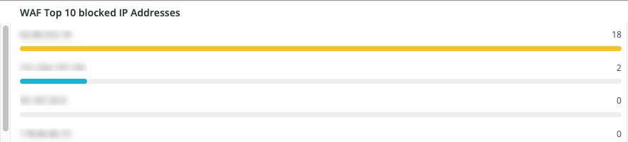

# A variável [!DNL WAF] guia

A variável **[!DNL WAF]** mostra o tráfego passado e bloqueado pela variável [!DNL firewall].

## [!DNL WAF traffic summary]

A variável **[!DNL WAF traffic summary]** mostra uma contagem de tráfego passado, registrado, bloqueado e com falha pelo [!DNL firewall].

## [!DNL WAF Top 10 blocked IP Addresses]

A variável **[!DNL WAF Top 10 blocked IP Addresses]** mostra os 10 principais endereços IP mais bloqueados pelo [!DNL firewall].

## [!DNL WAF Top 10 countries for blocked requests]

A variável **[!DNL WAF Top 10 countries for blocked requests]** O quadro mostra uma contagem de solicitações bloqueadas para países entre os 10 principais para solicitações bloqueadas pelo [!DNL firewall].

## [!DNL WAF Top 10 logged IP Addresses]

A variável **[!DNL WAF Top 10 logged IP Addresses]** mostra os endereços IP nos 10 principais endereços IP registrados pelo [!DNL firewall].

## [!DNL Top 10 WAF Rules Executed and Logged by IP address]

A variável **[!DNL Top 10 WAF Rules Executed and Logged by IP address]** O quadro mostra endereços IP que estão entre os 10 primeiros [!DNL firewall] regras.

## [!DNL WAF Logged Details]

A variável **[!DNL WAF Logged Details]** quadro mostra solicitações registradas pelo [!DNL firewall], incluindo detalhes como carimbo de data e hora, cidade, região e data center.

## [!DNL WAF Blocked Details]

A variável **[!DNL WAF Blocked Details]** quadro mostra solicitações bloqueadas pelo [!DNL firewall], incluindo detalhes como carimbo de data e hora, cidade, região e data center.
