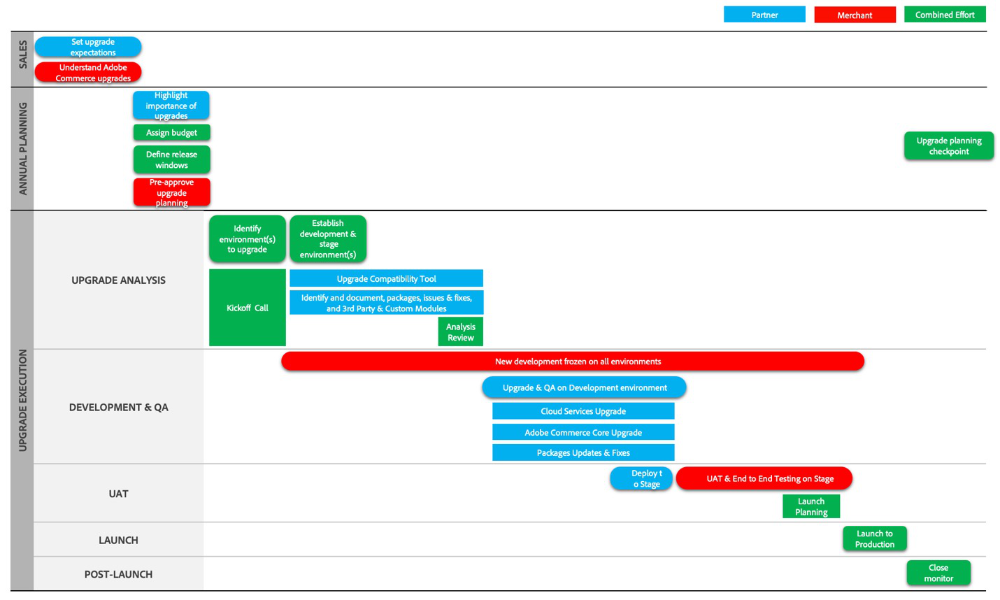

# Fases de jornada de atualização

As atualizações exigem muita atenção, planejamento e gerenciamento. Para ajudar você a entender a jornada de atualização do Adobe Commerce, descrevemos o processo em três fases principais:

- [Lançamento do projeto](project-launch.md)
- [Planejamento anual](annual-planning.md)
- [Implementação](implementation.md)

