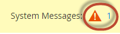

# Concluir os pré-requisitos de atualização

É importante entender o que é necessário para executar o Adobe Commerce. Você deve primeiro revisar os [requisitos do sistema](../../installation/system-requirements.md) para a versão para a qual você pretende atualizar.

Depois de revisar os requisitos do sistema, você deve concluir os seguintes pré-requisitos antes de atualizar o sistema:

* Atualizar todo o software
* Verifique se há um mecanismo de pesquisa compatível instalado
* Converter formato de tabela de banco de dados
* Definir o limite de arquivos abertos
* Verifique se os trabalhos cron estão em execução
* Conjunto `DATA_CONVERTER_BATCH_SIZE`
* Verificar permissões do sistema de arquivos
* Definir a raiz do diretório `pub/`
* Instalar o plug-in de atualização do Composer

## Atualizar todo o software

Os [requisitos de sistema](../../installation/system-requirements.md) descrevem exatamente quais versões de software de terceiros foram testadas com versões do Adobe Commerce.

Atualize todos os requisitos e dependências do sistema em seu ambiente. Consulte PHP [7.4](https://www.php.net/manual/en/migration74.php), PHP [8.0](https://www.php.net/manual/en/migration80.php), PHP [8.1](https://www.php.net/manual/en/migration81.php) e [configurações PHP necessárias](../../installation/prerequisites/php-settings.md#php-settings).

>[!NOTE]
>
>Para projetos Pro da infraestrutura em nuvem do Adobe Commerce, você deve criar um tíquete de [Suporte](https://experienceleague.adobe.com/docs/commerce-knowledge-base/kb/help-center-guide/magento-help-center-user-guide.html#submit-ticket) para instalar ou atualizar serviços em ambientes de Preparo e Produção. Indique as mudanças de serviço necessárias e inclua seus arquivos `.magento.app.yaml` e `services.yaml` atualizados e a versão do PHP no tíquete. Pode levar até 48 horas para a equipe de infraestrutura da nuvem atualizar seu projeto. Consulte [Software e serviços com suporte](https://experienceleague.adobe.com/docs/commerce-cloud-service/user-guide/architecture/cloud-architecture.html#supported-software-and-services).

## Verifique se há um mecanismo de pesquisa compatível instalado

O Adobe Commerce exige que o Elasticsearch ou o OpenSearch esteja instalado para usar o software.

**Se estiver atualizando da versão 2.3.x para a 2.4**, verifique se você está usando MySQL, Elasticsearch ou uma extensão de terceiros como mecanismo de pesquisa de catálogo na instância 2.3.x. O resultado determina o que você deve fazer _antes_ de atualizar para a versão 2.4.

**Se você estiver atualizando versões de patch nas linhas de versão 2.3.x ou 2.4.x**, se o Elasticsearch 7.x já estiver instalado, será possível [migrar para OpenSearch](opensearch-migration.md), se desejar.

Você pode usar a linha de comando ou o Administrador para determinar o mecanismo de pesquisa do catálogo:

* Digite o comando `bin/magento config:show catalog/search/engine`. O comando retorna um valor de `mysql`, `elasticsearch` (que indica que o Elasticsearch 2 está configurado), `elasticsearch5`, `elasticsearch6`, `elasticsearch7` ou um valor personalizado, indicando que você instalou um mecanismo de pesquisa de terceiros. Para versões anteriores à 2.4.6, use o valor `elasticsearch7` para o mecanismo Elasticsearch 7 ou OpenSearch. Para a versão 2.4.6 e posterior, use o valor `opensearch` para o mecanismo OpenSearch.

* No Admin, verifique o valor do campo **[!UICONTROL Stores]** > [!UICONTROL Settings] > **[!UICONTROL Configuration]** > **[!UICONTROL Catalog]** > **[!UICONTROL Catalog]** > **[!UICONTROL Catalog Search]** > **[!UICONTROL Search Engine]**.

As seções a seguir descrevem quais ações devem ser executadas antes da atualização para a versão 2.4.0.

### MySQL

A partir da versão 2.4, o MySQL não é mais um mecanismo de pesquisa de catálogo compatível. Você deve instalar e configurar o Elasticsearch ou o OpenSearch antes de atualizar. Use os seguintes recursos para ajudar a orientá-lo durante esse processo:

* [Instalar e configurar o Elasticsearch](../../configuration/search/overview-search.md)
* [Instalando o Elasticsearch](https://www.elastic.co/guide/en/elasticsearch/reference/current/install-elasticsearch.html)
* Configure o [nginx](../../installation/prerequisites/search-engine/configure-nginx.md) ou o [Apache](../../installation/prerequisites/search-engine/configure-apache.md) para funcionar com o mecanismo de pesquisa
* [Configurar Commerce para usar Elasticsearch](../../configuration/search/configure-search-engine.md) e reindexar

Alguns mecanismos de pesquisa de catálogos de terceiros são executados sobre o mecanismo de pesquisa do Adobe Commerce. Entre em contato com seu fornecedor para determinar se você deve atualizar sua extensão.

### Alterações no MySQL 8.4

A Adobe adicionou suporte para o MySQL 8.4 na versão 2.4.8.
Esta seção descreve as principais alterações no MySQL 8.4 que os desenvolvedores devem estar cientes.

#### Chave não padrão obsoleta

O uso de chaves não exclusivas ou parciais como chaves estrangeiras não é padrão e foi descontinuado no MySQL 8.4. A partir do MySQL 8.4.0, você deve habilitar explicitamente essas chaves definindo [`restrict_fk_on_non_standard_key`](https://dev.mysql.com/doc/refman/8.4/en/server-system-variables.html#sysvar_restrict_fk_on_non_standard_key) como `OFF` ou iniciando o servidor com a opção `--skip-restrict-fk-on-non-standard-key`.

#### Atualização do MySQL 8.0 ( ou versões mais antigas ) para MySQL 8.4

Para atualizar corretamente o MySQL da versão 8.0 para a versão 8.4, siga estas etapas na ordem:

1. Habilitar modo de manutenção:

   ```bash
   bin/magento maintenance:enable
   ```

1. Faça um backup do banco de dados:

   ```bash
   bin/magento setup:backup --db
   ```

1. Atualize o MySQL para a versão 8.4.
1. Defina `restrict_fk_on_non_standard_key` como `OFF` em `[mysqld]` no arquivo `my.cnf`.

   ```bash
   [mysqld]
   restrict_fk_on_non_standard_key = OFF 
   ```

   >[!WARNING]
   >
   >Se você não alterar o valor de `restrict_fk_on_non_standard_key` para `OFF`, receberá o seguinte erro durante a importação:
   >
   ```sql
   > ERROR 6125 (HY000) at line 2164: Failed to add the foreign key constraint. Missing unique key for constraint 'CAT_PRD_FRONTEND_ACTION_PRD_ID_CAT_PRD_ENTT_ENTT_ID' in the referenced table 'catalog_product_entity'
   >```
1. Reinicie o servidor MySQL.
1. Importe os dados de backup para o MySQL.
1. Limpe o cache:

   ```bash
   bin/magento cache:clean
   ```

1. Desabilitar modo de manutenção:

   ```bash
   bin/magento maintenance:disable
   ```

#### MariaDB

{{$include /help/_includes/maria-db-config.md}}

### Mecanismo de pesquisa

Você deve instalar e configurar o Elasticsearch 7.6 ou superior ou o OpenSearch 1.2 antes de atualizar para a versão 2.4.0. O Adobe não é mais compatível com o Elasticsearch 2.x, 5.x e 6.x. A [configuração do mecanismo de pesquisa](../../configuration/search/configure-search-engine.md), no _Guia de Configuração_, descreve as tarefas que devem ser executadas após atualizar o Elasticsearch para uma versão com suporte.

Consulte [Atualizando o Elasticsearch](https://www.elastic.co/guide/en/elasticsearch/reference/current/setup-upgrade.html) para obter instruções completas sobre como fazer backup de seus dados, detectar possíveis problemas de migração e testar atualizações antes de implantar na produção. Dependendo da sua versão atual do Elasticsearch, uma reinicialização completa do cluster pode ou não ser necessária.

O Elasticsearch requer o Java Development Kit (JDK) 1.8 ou superior. Consulte [Instalar o Java Software Development Kit (JDK)](../../installation/prerequisites/search-engine/overview.md#install-the-java-software-development-kit-jdk) para verificar qual versão do JDK está instalada.

#### OpenSearch

O OpenSearch é uma bifurcação de código aberto do Elasticsearch 7.10.2, após a alteração de licenciamento da Elasticsearch. As seguintes versões do Adobe Commerce apresentam suporte para o OpenSearch:

* 2.4.6 (O OpenSearch tem um módulo e configurações separados)
* 2.4.5
* 2.4.4
* 2.4.3-p2
* 2.3.7-p3

Você pode [migrar do Elasticsearch para o OpenSearch](opensearch-migration.md) somente se estiver atualizando para uma versão do Adobe Commerce listada acima (ou superior).

OpenSearch requer JDK 1.8 ou superior. Consulte [Instalar o Java Software Development Kit (JDK)](../../installation/prerequisites/search-engine/overview.md#install-the-java-software-development-kit-jdk) para verificar qual versão do JDK está instalada.

[A configuração do mecanismo de pesquisa](../../configuration/search/configure-search-engine.md) descreve as tarefas que devem ser executadas após a alteração dos mecanismos de pesquisa.

#### Atualizar o Elasticsearch

O suporte para o Elasticsearch 8.x foi introduzido no Adobe Commerce 2.4.6. As instruções a seguir mostram um exemplo de atualização do Elasticsearch de 7.x para 8.x:

>[!NOTE]
>
>Na próxima versão 2.4.8, essas etapas não serão necessárias, pois o módulo Elasticsearch 8 está incluído por padrão e você não precisará instalá-lo separadamente.

1. Atualize o servidor do Elasticsearch 7.x para 8.x e verifique se está ativo e em execução. Consulte a [documentação do Elasticsearch](https://www.elastic.co/guide/en/elasticsearch/reference/current/install-elasticsearch.html).

1. Habilite o campo `id_field_data` adicionando a seguinte configuração ao arquivo `elasticsearch.yml` e reiniciando o serviço Elasticsearch 8.x.

   ```yaml
   indices:
     id_field_data:
       enabled: true
   ```

   >[!INFO]
   >
   >Para oferecer suporte ao Elasticsearch 8.x, o Adobe Commerce 2.4.6 não permite a propriedade `indices.id_field_data` por padrão e usa o campo `_id` na propriedade `docvalue_fields`.

1. No diretório raiz do seu projeto Adobe Commerce, atualize suas dependências do Composer para remover o módulo `Magento_Elasticsearch7` e instalar o módulo `Magento_Elasticsearch8`.

   ```bash
   composer require magento/module-elasticsearch-8 --update-with-all-dependencies
   ```

   Se você encontrar um erro de dependência para `psr/http-message`, clique para expandir a seguinte seção de solução de problemas:

   +++Solução de problemas

   Se você encontrar conflitos de dependência ao instalar o Elasticsearch 8, especialmente com o `psr/http-message`, poderá resolver isso seguindo estas etapas:

   1. Primeiro, exija o módulo Elasticsearch 8 sem atualizar outras dependências:

      ```bash
      composer require magento/module-elasticsearch-8 --no-update
      ```

   1. Em seguida, atualize o módulo Elasticsearch 8 e os pacotes `aws/aws-sdk-php`:

      ```bash
      composer update magento/module-elasticsearch-8 aws/aws-sdk-php -W
      ```

   Esta abordagem funciona para 2.4.7-p4 com PHP 8.3. O problema ocorre porque `aws/aws-sdk-php` requer `psr/http-message >= 2.0`, o que pode causar conflitos. As etapas acima ajudam a resolver esses problemas de dependência.

   +++

1. Atualize os componentes do projeto.

   ```bash
   bin/magento setup:upgrade
   ```

1. [Configurar o Elasticsearch](../../configuration/search/configure-search-engine.md#configure-your-search-engine-from-the-admin) no [!DNL Admin].

1. Reindexe o índice do catálogo.

   ```bash
   bin/magento indexer:reindex catalogsearch_fulltext
   ```

1. Excluir todos os itens dos tipos de cache ativados.

   ```bash
   bin/magento cache:clean
   ```

#### Fazer downgrade do Elasticsearch

Se você atualizar inadvertidamente a versão do Elasticsearch no servidor ou determinar que precisa fazer downgrade por qualquer outro motivo, também deverá atualizar as dependências do projeto do Adobe Commerce. Por exemplo, para fazer o downgrade do Elasticsearch 8.x para o 7.x

1. Faça o downgrade do servidor do Elasticsearch 8.x para 7.x e verifique se o está ativo e em execução. Consulte a [documentação do Elasticsearch](https://www.elastic.co/guide/en/elasticsearch/reference/current/install-elasticsearch.html).

1. No diretório raiz do seu projeto Adobe Commerce, atualize suas dependências do Composer para remover o módulo `Magento_Elasticsearch8` e suas dependências do Composer, e instale o módulo `Magento_Elasticsearch7`.

   ```bash
   composer remove magento/module-elasticsearch-8
   ```

1. Atualize os componentes do projeto.

   ```bash
   bin/magento setup:upgrade
   ```

1. [Configurar o Elasticsearch](../../configuration/search/configure-search-engine.md#configure-your-search-engine-from-the-admin) no [!DNL Admin].

1. Reindexe o índice do catálogo.

   ```bash
   bin/magento indexer:reindex catalogsearch_fulltext
   ```

1. Excluir todos os itens dos tipos de cache ativados.

   ```bash
   bin/magento cache:clean
   ```

### Extensões de terceiros

Recomendamos que você entre em contato com o fornecedor do mecanismo de pesquisa para determinar se sua extensão é totalmente compatível com uma versão do Adobe Commerce.

## Converter formato de tabela de banco de dados

Você deve converter o formato de todas as tabelas do banco de dados de `COMPACT` para `DYNAMIC`. Você também deve converter o tipo de mecanismo de armazenamento de `MyISAM` para `InnoDB`. Consulte [práticas recomendadas](../../implementation-playbook/best-practices/maintenance/mariadb-upgrade.md).

## Definir o limite de arquivos abertos

Definir o limite de arquivos abertos (ulimit) pode ajudar a evitar falhas de várias chamadas recursivas de cadeias de caracteres de consulta longas ou problemas com o uso do comando `bin/magento setup:rollback`. Esse comando é diferente para shells UNIX diferentes. Consulte seu tipo individual para obter informações específicas sobre o comando `ulimit`.

A Adobe recomenda definir os arquivos abertos [ulimit](https://ss64.com/bash/ulimit.html) com um valor de `65536` ou mais, mas você poderá usar um valor maior, se necessário. Você pode definir o ulimit na linha de comando ou pode torná-lo uma configuração permanente para o shell do usuário.

Para definir o ulimit a partir da linha de comando:

1. Alternar para o [proprietário do sistema de arquivos](../../installation/prerequisites/file-system/overview.md).
1. Defina o limite para `65536`.

   ```bash
   ulimit -n 65536
   ```

Para definir o valor no seu shell Bash:

1. Alternar para o [proprietário do sistema de arquivos](../../installation/prerequisites/file-system/overview.md).
1. Abra `/home/<username>/.bashrc` em um editor de texto.
1. Adicione a seguinte linha:

   ```bash
   ulimit -n 65536
   ```

1. Salve as alterações no arquivo `.bashrc` e saia do editor de texto.

>[!IMPORTANT]
>
>Recomendamos que você evite definir um valor para a propriedade `pcre.recursion_limit` no arquivo `php.ini` porque isso pode resultar em reversões incompletas sem aviso de falha.

## Verifique se os trabalhos cron estão em execução

O agendador de tarefas do UNIX `cron` é essencial para as operações diárias do Adobe Commerce. Ele agenda itens como reindexação, boletins informativos, emails e mapas de site. Vários recursos exigem pelo menos um trabalho cron em execução como proprietário do sistema de arquivos.

Para verificar se o trabalho cron está configurado corretamente, verifique o crontab inserindo o seguinte comando como proprietário do sistema de arquivos:

>[!NOTE]
>
>O crontab é o arquivo de configuração responsável pela execução dos trabalhos cron.

```bash
crontab -l
```

Resultados semelhantes aos seguintes devem ser exibidos:

```cron
#~ MAGENTO START c5f9e5ed71cceaabc4d4fd9b3e827a2b
* * * * * /usr/bin/php /var/www/html/magento2/bin/magento cron:run 2>&1 | grep -v "Ran jobs by schedule" >> /var/www/html/magento2/var/log/magento.cron.log
#~ MAGENTO END c5f9e5ed71cceaabc4d4fd9b3e827a2b
```

Outro sintoma de que o CRON não está sendo executado é o seguinte erro no Administrador:


Para ver o erro, clique em **Mensagens do Sistema** na parte superior da janela da seguinte maneira:



Consulte [Configurar e executar o cron](../../configuration/cli/configure-cron-jobs.md) para obter mais informações.

## Definir DATA_CONVERTER_BATCH_SIZE

O Adobe Commerce 2.4 inclui aprimoramentos de segurança que exigem que alguns dados sejam convertidos de serializados para JSON. Essa conversão ocorre durante a atualização e pode levar muito tempo, dependendo da quantidade de dados no banco de dados.

As tabelas a seguir são as mais afetadas:

* `catalogrule`
* `core_config_data`
* `magento_reward_history`
* `quote_payment`
* `quote`
* `sales_order_payment`
* `sales_order`
* `salesrule`
* `url_rewrite`

Se você tiver uma grande quantidade de dados, poderá melhorar o desempenho definindo o valor de uma variável de ambiente, `DATA_CONVERTER_BATCH_SIZE`. Por padrão, o valor está definido como `50,000`.

Para definir a variável de ambiente:

1. Alternar para o [proprietário do sistema de arquivos](../../installation/prerequisites/file-system/overview.md).
1. Defina a variável:

   ```bash
   export DATA_CONVERTER_BATCH_SIZE=100000
   ```

   >[!NOTE]
   >
   > `DATA_CONVERTER_BATCH_SIZE` requer memória; evite configurá-la com um valor alto (aproximadamente 1 GB) sem testá-la primeiro.

1. Após a conclusão da atualização, é possível desfazer a definição da variável:

   ```bash
   unset DATA_CONVERTER_BATCH_SIZE
   ```

## Verificar permissões do sistema de arquivos

Por motivos de segurança, o Adobe Commerce exige determinadas permissões no sistema de arquivos. As permissões são diferentes de _[propriedade](../../upgrade/prepare/prerequisites.md#verify-file-system-permissions)_. A propriedade determina quem pode executar ações no sistema de arquivos; as permissões determinam o que o usuário pode fazer.

Os diretórios no sistema de arquivos devem ser graváveis pelo grupo [ do ](../../installation/prerequisites/file-system/overview.md)proprietário do sistema de arquivos.

Para verificar se as permissões do sistema de arquivos estão definidas corretamente, faça logon no servidor de aplicativos ou use o aplicativo gerenciador de arquivos do provedor de hospedagem.

Por exemplo, insira o seguinte comando se o aplicativo estiver instalado em `/var/www/html/magento2`:

```bash
ls -l /var/www/html/magento2
```

Saída de exemplo:

```console
total 1028
drwxrwx---. 12 magento_user apache   4096 Jun  7 07:55 .
drwxr-xr-x.  3 root         root     4096 May 11 14:29 ..
drwxrwx---.  4 magento_user apache   4096 Jun  7 07:53 app
drwxrwx---.  2 magento_user apache   4096 Jun  7 07:53 bin
-rw-rw----.  1 magento_user apache 439792 Apr 27 21:23 CHANGELOG.md
-rw-rw----.  1 magento_user apache   3422 Apr 27 21:23 composer.json
-rw-rw----.  1 magento_user apache 425214 Apr 27 21:27 composer.lock
-rw-rw----.  1 magento_user apache   3425 Apr 27 21:23 CONTRIBUTING.md
-rw-rw----.  1 magento_user apache  10011 Apr 27 21:23 CONTRIBUTOR_LICENSE_AGREEMENT.html
-rw-rw----.  1 magento_user apache    631 Apr 27 21:23 COPYING.txt
drwxrwx---.  4 magento_user apache   4096 Jun  7 07:53 dev
-rw-rw----.  1 magento_user apache   2926 Apr 27 21:23 Gruntfile.js
-rw-rw----.  1 magento_user apache   7592 Apr 27 21:23 .htaccess
-rw-rw----.  1 magento_user apache   6419 Apr 27 21:23 .htaccess.sample
drwxrwx---.  4 magento_user apache   4096 Jun  7 07:53 lib
-rw-rw----.  1 magento_user apache  10376 Apr 27 21:23 LICENSE_AFL.txt
-rw-rw----.  1 magento_user apache  30634 Apr 27 21:23 LICENSE_EE.txt
-rw-rw----.  1 magento_user apache  10364 Apr 27 21:23 LICENSE.txt
-rw-rw----.  1 magento_user apache   4108 Apr 27 21:23 nginx.conf.sample
-rw-rw----.  1 magento_user apache   1427 Apr 27 21:23 package.json
-rw-rw----.  1 magento_user apache   1659 Apr 27 21:23 .php_cs
-rw-rw----.  1 magento_user apache    804 Apr 27 21:23 php.ini.sample
drwxrwx---.  2 magento_user apache   4096 Jun  7 07:53 phpserver
drwxrwx---.  6 magento_user apache   4096 Jun  7 07:53 pub
-rw-rw----.  1 magento_user apache   2207 Apr 27 21:23 README_EE.md
drwxrwx---.  7 magento_user apache   4096 Jun  7 07:53 setup
-rw-rw----.  1 magento_user apache   3731 Apr 27 21:23 .travis.yml
drwxrwx---.  7 magento_user apache   4096 Jun  7 07:53 update
drwxrws---. 11 magento_user apache   4096 Jun 13 16:05 var
drwxrws---. 29 magento_user apache   4096 Jun  7 07:53 vendor
```

Consulte o seguinte para obter uma explicação do exemplo de saída:

* A maioria dos arquivos é `-rw-rw----`, que é `660`
* `drwxrwx---` = `770`
* `-rw-rw-rw-` = `666`
* O proprietário do sistema de arquivos é `magento_user`

Para obter informações mais detalhadas, você pode inserir o seguinte comando:

```bash
ls -la /var/www/html/magento2/pub
```

Como o Adobe Commerce implanta ativos de arquivos estáticos em subdiretórios de `pub`, também é uma boa ideia verificar as permissões e a propriedade lá.

Para obter mais informações, consulte [Permissões e propriedade do sistema de arquivos](../../installation/prerequisites/file-system/overview.md).

## Definir a raiz do diretório `pub/`

Consulte [Modificar docroot para melhorar a segurança](../../installation/tutorials/docroot.md) para obter mais detalhes.

## Instalar o plug-in de atualização do Composer

O plug-in Composer [`magento/composer-root-update-plugin`](https://github.com/magento/composer-root-update-plugin) resolve as alterações que devem ser feitas no arquivo `composer.json` do projeto raiz antes da atualização para um novo requisito de produto.

O plug-in automatiza parcialmente a atualização manual, identificando e ajudando você a resolver conflitos de dependência em vez de exigir que você os identifique e corrija manualmente.

Para instalar o plugin:

1. Adicione o pacote ao arquivo `composer.json`.

   ```bash
   composer require magento/composer-root-update-plugin ~2.0 --no-update
   ```

1. Atualize as dependências:

   ```bash
   composer update
   ```

<!-- Last updated from includes: 2025-11-25 11:39:51 -->
