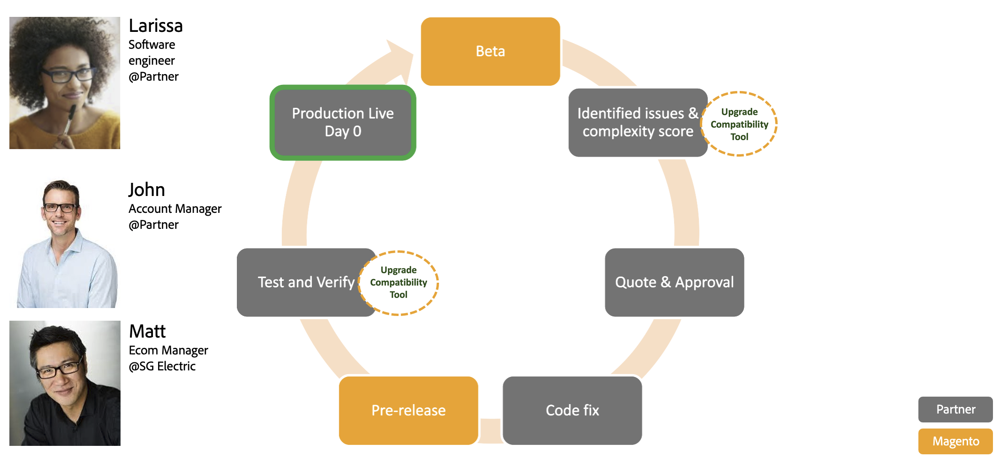

# Instale a Ferramenta de compatibilidade de atualização

A Ferramenta de Compatibilidade de Atualização é uma ferramenta de linha de comando que verifica uma instância personalizada do Adobe Commerce em relação a uma versão específica ao analisar todos os módulos instalados nela. Retorna uma lista de erros e avisos que devem ser endereçados antes de atualizar para a versão mais recente do Adobe Commerce.

## Fluxo de trabalho

O diagrama a seguir mostra o fluxo de trabalho esperado ao executar a Ferramenta de Compatibilidade de Atualização:


## Para quem é a ferramenta de compatibilidade de atualização?

O caso de uso a seguir descreve o processo típico de um parceiro da Adobe Commerce para atualizar a instância de um cliente:

1. Um engenheiro de software do parceiro baixa o pacote da Ferramenta de compatibilidade de atualização do [Repositório Adobe Commerce](https://repo.magento.com/) O e o executa durante a fase beta da versão mais recente do Adobe Commerce. Consulte a [Baixe a Ferramenta de compatibilidade de atualização](../upgrade-compatibility-tool/install.md#download-the-upgrade-compatibility-tool) para obter mais informações.
1. The Software Engineer generates a vanilla instance for the specific version of Adobe Commerce that is currently installed. Consulte a [Guia do colaborador](https://devdocs.magento.com/contributor-guide/contributing.html#vanilla-pr) para obter mais informações sobre como usar o `instance` para gerar uma instalação baunilha.
1. O Engenheiro de Software vê que há várias áreas personalizadas quebradas nos módulos de inventário e catálogo e elas também obtêm uma pontuação de complexidade de X. Consulte o [Desenvolvedor](../upgrade-compatibility-tool/developer.md) para obter mais informações sobre o índice de complexidade.
1. Com essas informações, o engenheiro de software é capaz de entender a complexidade da atualização e pode retransmitir essas informações para o gerente de conta do parceiro.
1. O Gerente de conta cria uma linha do tempo e um custo para a atualização do Adobe Commerce, o que permite que o gerente obtenha a aprovação.
1. Com a aprovação do gerente, o engenheiro de software trabalha com as modificações de código necessárias para corrigir os módulos quebrados.
1. O Engenheiro de Software executa a Ferramenta de Compatibilidade de Atualização mais uma vez com um pré-lançamento da Adobe Commerce para garantir que não haja novos problemas e que suas alterações de código corrigiram os problemas encontrados durante a fase beta.
1. Tudo é verificado e o engenheiro de software envia o código para um ambiente de preparo, onde os testes de regressão confirmam que todos os testes são verdes, o que permite que ele libere a versão mais recente do Adobe Commerce para produção no mesmo dia em que o pré-lançamento do Adobe Commerce foi lançado.

   

>[!NOTE]
>
>Uma instância baunilha é uma instalação limpa de uma tag ou ramificação de versão especificada para uma versão específica.

## Pré-requisitos

Consulte [pré-requisitos](../upgrade-compatibility-tool/prerequisites.md) para obter mais informações.

>[!NOTE]
>
>Você pode executar a Ferramenta de compatibilidade de atualização em qualquer sistema operacional. Não há requisito para executar a Ferramenta de Compatibilidade de Atualização, onde a instância do Adobe Commerce está localizada. É necessário que a Ferramenta de Compatibilidade de Atualização tenha acesso ao código-fonte da instância do Adobe Commerce. Por exemplo, você pode instalar a ferramenta em um servidor e apontá-la para a instalação do Adobe Commerce em outro servidor.

Se você estiver executando a Ferramenta de Compatibilidade de Atualização em uma instância do Adobe Commerce com módulos e arquivos grandes, a ferramenta poderá exigir uma quantidade alta de RAM, pelo menos 2 GB de RAM.

### Ações recomendadas

As práticas recomendadas da Adobe Commerce recomendam evitar dois módulos com o mesmo nome. Se isso acontecer, a Ferramenta de compatibilidade de atualização mostra um erro de falha de segmentação.

Para evitar esse erro, é recomendável executar a variável `bin` com a opção adicionada `-m`:

```bash
bin/uct upgrade:check /<dir>/<instance-name> --coming-version=2.4.1 -m /vendor/<vendor-name>/<module-name>
```

>[!NOTE]
>
>O `<dir>` é o diretório onde sua instância do Adobe Commerce está localizada.

The `-m` option allows the Upgrade Compatibility Tool to analyze each specific module independently to avoid encountering two modules with the same name in your Adobe Commerce instance.

This command option also allows the Upgrade Compatibility Tool to analyze a folder containing several modules:

```bash
bin/uct upgrade:check /<dir>/<instance-name> --coming-version=2.4.1 -m /vendor/<vendor-name>/
```

Essa recomendação também ajuda em problemas de memória que podem ocorrer ao executar a Ferramenta de Compatibilidade de Atualização.

## Baixe a Ferramenta de compatibilidade de atualização

Para baixar a Ferramenta de compatibilidade de atualização, execute o seguinte comando:

```bash
composer create-project magento/upgrade-compatibility-tool uct --repository https://repo.magento.com
```

## Instalar

Para instalar a Ferramenta de Compatibilidade de Atualização, você deve instalar os pré-requisitos necessários:

* Chaves de acesso do Adobe Commerce
* Composer
* Node.js

### Chaves de acesso do Adobe Commerce

Você deve ter [Chaves de acesso do Adobe Commerce](https://devdocs.magento.com/marketplace/sellers/profile-information.html#access-keys) para baixar e usar a ferramenta Atualizar compatibilidade. Adicione as chaves de acesso do Adobe Commerce à `auth.json` arquivo , localizado em `~/.composer` por padrão.

>[!WARNING]
>
>Verifique sua **COMPOSER_HOME** variável de ambiente para ver onde a variável `auth.json` está localizado.

O **chave pública** corresponde a _username_ Considerando que **chave privada** é _senha_:

### Exemplo de chaves de acesso do Adobe Commerce

```json
    "http-basic": {
        "repo.magento.com": {
            "username": "YOUR_MAGENTO_PUBLIC_KEY",
            "password": "YOUR_MAGENTO_PRIVATE_KEY"
        }
    },
```

### Composer

Clonar o repositório da Ferramenta de Compatibilidade de Atualização e executar `composer install` no terminal para instalar dependências.

>[!WARNING]
>
>Se a variável **Chaves de acesso do Adobe Commerce** não estiverem configurados corretamente, a Ferramenta de Compatibilidade de Atualização não será instalada e ocorrerão erros ao executar o `composer install` comando.

### Node.js

Para instalar o Node.js, consulte Node.js [documentação](https://nodejs.dev/learn/how-to-install-nodejs).

## Extensões de terceiros

O Adobe recomenda que você entre em contato com o fornecedor da extensão para determinar se a extensão é totalmente compatível com o Adobe Commerce 2.4.x.

Consulte [Executar a ferramenta](../upgrade-compatibility-tool/run.md) para obter informações sobre como executar a Ferramenta de Compatibilidade de Atualização.
