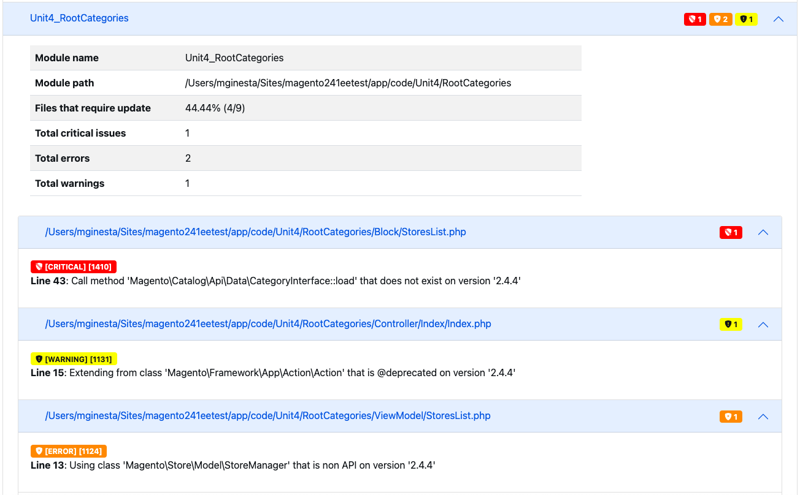

# Execute o [!DNL Upgrade Compatibility Tool]

O [!DNL Upgrade Compatibility Tool] é uma ferramenta de linha de comando que verifica uma instância personalizada do Adobe Commerce em relação a uma versão específica ao analisar todos os módulos instalados nela. Ele retorna uma lista de problemas críticos, erros e avisos que devem ser abordados antes da atualização para a versão mais recente do Adobe Commerce.

O [!DNL Upgrade Compatibility Tool] O identifica possíveis problemas que devem ser corrigidos no código antes de tentar atualizar para uma versão mais recente do Adobe Commerce.

## Use o `upgrade:check` comando

O `upgrade:check` é o comando principal para executar a ferramenta:

```bash
bin/uct upgrade:check <dir>
```

>[!TIP]
>
>O `<dir>` é o diretório onde sua instância do Adobe Commerce está localizada.

O `upgrade:check` executa o [!DNL Upgrade Compatibility Tool] e verifica uma instância personalizada do Adobe Commerce em relação a uma versão específica ao analisar todos os módulos instalados nela. Ele retorna uma lista de problemas críticos, erros e avisos que devem ser abordados antes da atualização para a versão mais recente do Adobe Commerce.

>[!WARNING]
>
>Executar somente quando o diretório raiz do projeto (ou principal) for fornecido.

Esse comando verifica as alterações no código principal da instância específica do Adobe Commerce e todas as alterações no código personalizado instaladas na instância.

Você pode executar o `core:code:changes` para analisar apenas as alterações do código principal para essa instância específica do Adobe Commerce. Consulte [Alterações no código principal](../upgrade-compatibility-tool/run.md#use-the-core:code:changes-command) seção.

Embora você possa usar a variável `graphql:compare` para comparar dois esquemas GraphQL e verificar se há alterações entre eles. Consulte [Verificação de compatibilidade de esquema GraphQL](../upgrade-compatibility-tool/run.md#graphql-schema-compatibility-verification) seção.

### Recommendations para usar o `upgrade:check` comando

- O [!DNL Upgrade Compatibility Tool] requer pelo menos 2 GB de RAM para ser executado. Essa configuração é recomendada para evitar problemas devido a uma limitação de memória baixa. O [!DNL Upgrade Compatibility Tool] exibe uma pergunta se você executar a variável `upgrade:check` comando com baixo `memory_limit` configuração.
- Especifique a `-m` para executar a ferramenta em relação a um módulo específico:

   ```bash
   bin/uct upgrade:check <dir> -m[=MODULE-PATH]
   ```

Onde os argumentos são os seguintes:

- `<dir>`: Diretório de instalação do Adobe Commerce.
- `[=MODULE-PATH]`: Diretório de caminho do módulo específico.

### Use o `--help` opção

Para ver o [!DNL Upgrade Compatibility Tool] comando opções gerais e ajuda, executar:

```bash
bin/uct --help
```

No entanto, é possível executar `--help` como uma opção ao executar um comando específico, como `bin/uct upgrade:check`. Isso retorna específico `--help` opções para esse comando:

```bash
bin/uct upgrade:check --help
```

Disponível `--help` para a `upgrade:check` comando:

- `-m, --module-path[=MODULE-PATH]`: Caminho dos módulos a serem analisados
- `-a, --current-version[=CURRENT-VERSION]`: A versão atual do Adobe Commerce, versão da instalação do Adobe Commerce, será usada se omitida.
- `-c, --coming-version[=COMING-VERSION]`: Versão do Adobe Commerce de destino, versão da instalação do Adobe Commerce será usada se omitida.
- `--json-output-path[=JSON-OUTPUT-PATH]`: Caminho do arquivo em que a saída será exportada no formato json.
- `--html-output-path[=HTML-OUTPUT-PATH]`: Caminho do arquivo no qual a saída será exportada no formato HTML.
- `--min-issue-level`: Nível mínimo de problema a ser exibido no relatório. O padrão é [AVISO].
- `--ignore-current-version-compatibility-issues`: Use esta opção quando não quiser incluir problemas críticos conhecidos, erros e avisos na sua [!DNL Upgrade Compatibility Tool] relatório.
- `--context=CONTEXT`: Contexto de execução. Essa opção é para fins de integração e não afeta o resultado da execução.
- `-h, --help`: Exibe a ajuda desse comando específico. Se nenhum comando for fornecido, `list` é o resultado padrão.
- `-q, --quiet`: Não envie mensagens durante a execução do comando.
- `-v, --version`: Exibir versão do aplicativo.
- `--ansi, --no-ansi`: Ative a saída ANSI.
- `-n, --no-interaction`: Não faça nenhuma pergunta interativa ao executar o comando.
- `-v, --vv, --vvv, --verbose`: Aumente a verbosidade das comunicações de saída. 1 para saída normal, 2 para saída detalhada e 3 para saída DEBUG.

### Saída

Como resultado da análise realizada, a variável [!DNL Upgrade Compatibility Tool] exporta um relatório que contém uma lista de problemas para cada arquivo especificando sua gravidade, código de erro e descrição do erro.

Veja o exemplo abaixo:

```terminal
File: /app/code/Custom/CatalogExtension/Controller/Index/Index.php
------------------------------------------------------------------
 * [WARNING][1131] Line 23: Extending from class 'Magento\Framework\App\Action\Action' that is @deprecated on version '2.4.2'
 * [ERROR][1429] Line 103: Call method 'Magento\Framework\Api\SearchCriteriaBuilder::addFilters' that is non API on version '2.4.2'
 * [CRITICAL][1110] Line 60: Instantiating class/interface 'Magento\Catalog\Model\ProductRepository' that does not exist on version '2.4.2'
```

Verifique a [Referência da mensagem de erro](error-messages.md) para obter mais informações.

O relatório também inclui um resumo detalhado que mostra:

- *Versão atual*: a versão atualmente instalada.
- *Versão de destino*: a versão para a qual você deseja atualizar.
- *Tempo de execução*: o tempo que a análise levou para criar o relatório (mm:ss).
- *Módulos que exigem atualização*: a porcentagem de módulos que contêm problemas de compatibilidade e exigem atualização.
- *Arquivos que exigem atualização*: a porcentagem de arquivos que contêm problemas de compatibilidade e exigem atualização.
- *Total de erros críticos*: o número de erros críticos encontrados.
- *Total de erros*: o número de erros encontrados.
- *Total de avisos*: o número de avisos encontrados.

Veja o exemplo abaixo:

```terminal
 ----------------------------- ------------------
  Current version               2.4.2
  Target version                2.4.3
  Execution time                1m:10s
  Modules that require update   78.33% (47/60)
  Files that require update     21.62% (115/532)
  Total critical issues         35
  Total errors                  201
  Total warnings                103
 ----------------------------- ------------------
```

>[!NOTE]
>
>Por padrão, a variável [!DNL Upgrade Compatibility Tool] exporta o relatório para dois formatos diferentes: `json` e `html`.

#### JSON

O arquivo JSON contém exatamente as mesmas informações mostradas na saída:

- Lista dos problemas identificados.
- Resumo da análise.

Para cada problema encontrado, o relatório fornece informações detalhadas como a gravidade e a descrição do problema.

>[!NOTE]
>
>O caminho padrão da pasta de saída é `var/output/[TIME]-results.json`.

Para exportar este relatório para uma pasta de saída diferente, execute:

```bash
bin/uct upgrade:check <dir> --json-output-path[=JSON-OUTPUT-PATH]
```

Onde os argumentos são os seguintes:

- `<dir>`: Diretório de instalação do Adobe Commerce.
- `[=JSON-OUTPUT-PATH]`: Diretório de caminho para exportar o `.json` arquivo de saída.

>[!NOTE]
>
>O caminho padrão da pasta de saída é `var/output/[TIME]-results.json`.

#### HTML

O arquivo HTML também contém a lista de problemas identificados e o resumo da análise. Ele também inclui quatro gráficos diferentes:

- **Módulos por gravidade de problema**: Mostra a distribuição de severidade por módulos.
- **Arquivos por gravidade de problema**: Mostra a distribuição de severidade por arquivos.
- **Módulos ordenados pelo número total de problemas**: Mostra os 10 módulos mais comprometidos levando em conta avisos, erros e erros críticos.
- **Módulos com tamanhos e problemas relativos**: Quanto mais arquivos um módulo contiver, maior será seu círculo. Quanto mais problemas um módulo tiver, mais vermelho será o seu círculo.

Esses gráficos permitem identificar (imediatamente) as partes mais comprometidas e as que exigem mais trabalho para executar uma atualização.




Para exportar este relatório para uma pasta de saída diferente, execute:

```bash
bin/uct upgrade:check <dir> --html-output-path[=HTML-OUTPUT-PATH]
```

Onde os argumentos são os seguintes:

- `<dir>`: {{site.data.var.ee}} diretório de instalação.
- `[=HTML-OUTPUT-PATH]`: Diretório de caminho para exportar o `.html` arquivo de saída.

>[!NOTE]
>
>O caminho padrão da pasta de saída é `var/output/[TIME]-results.html`.

### Use o `--ignore-current-version-compatibility-issues` opção

O [!DNL Upgrade Compatibility Tool] permite que você execute o `upgrade:check` com um `--ignore-current-version-compatibility-issues` , portanto, mostra somente problemas críticos novos ou desconhecidos, erros e avisos. Use esta opção quando não quiser incluir problemas críticos conhecidos, erros e avisos na sua [!DNL Upgrade Compatibility Tool] relatório.

```bash
bin/uct upgrade:check --ignore-current-version-compatibility-issues <dir>
```

>[!NOTE]
>
>Isso se aplica somente às validações da API PHP.

### Instalação de baunilha

A _baunilha_ instalação é uma instalação limpa de uma tag ou ramificação de versão especificada para uma versão específica.

O `bin/uct core:code:changes` O comando verifica se há uma instância baunilha no sistema. Se esta for a primeira vez que usa uma instalação baunilha, uma pergunta interativa de linha de comando solicitará que você baixe o projeto baunilha do [Repositório Adobe Commerce](https://repo.magento.com/).

Você pode executar um [!DNL Upgrade Compatibility Tool] com o `--vanilla-dir` para especificar o diretório de instalação Adobe Commerce baunilha.

Consulte a [Implantar instância baunilha](https://devdocs.magento.com/contributor-guide/contributing.html#vanilla-pr) para obter mais informações.

## Use o `list` comando

Para retornar uma lista de [!DNL Upgrade Compatibility Tool] comandos disponíveis, executar:

```bash
bin/uct list
```

O `list` retorna o seguinte:

- `-h, --help`: Exibe a ajuda desse comando específico. Se nenhum comando for fornecido, `list` é o resultado padrão.
- `-q, --quiet`: Não envie mensagens durante a execução do comando.
- `-v, --version`: Exibir versão do aplicativo.
- `--ansi, --no-ansi`: Ative a saída ANSI.
- `-n, --no-interaction`: Não faça nenhuma pergunta interativa ao executar o comando.
- `-v, --vv, --vvv, --verbose`: Aumente a verbosidade das comunicações de saída. 1 para saída normal, 2 para saída detalhada e 3 para saída DEBUG.

## Use o `core:code:changes` comando

Você pode comparar sua instalação atual do Adobe Commerce com uma instalação baunilha limpa para ver se o código principal tem modificações feitas para implementar um novo recurso ou personalização. Essa validação ajuda a estimar o esforço que a atualização requer com base nessas alterações.

```bash
bin/uct core:code:changes <dir> <vanilla dir>
```

Onde os argumentos são os seguintes:

- `<dir>`: Diretório de instalação do Adobe Commerce.
- `<vanilla dir>`: Diretório de instalação Adobe Commerce vanilla.

Existem algumas limitações ao executar este comando:

- Executar somente quando o diretório raiz do projeto (ou principal) for fornecido.
- Mostra apenas uma lista de modificações principais.

### Use o `core:code:changes` com o `--help` opção

Disponível `--help` para a `core:code:changes` comando:

- `-h, --help`: Exibe a ajuda desse comando específico. Se nenhum comando for fornecido, `list` é o resultado padrão.
- `-q, --quiet`: Não envie mensagens durante a execução do comando.
- `-v, --version`: Exibir versão do aplicativo.
- `--ansi, --no-ansi`: Ative a saída ANSI.
- `-n, --no-interaction`: Não faça nenhuma pergunta interativa ao executar o comando.
- `-v, --vv, --vvv, --verbose`: Aumente a verbosidade das comunicações de saída. 1 para saída normal, 2 para saída detalhada e 3 para saída DEBUG.

## Versão

Você pode comparar sua instalação atual do Adobe Commerce com as versões do Adobe Commerce `>=2.3`.

Você deve fornecer a versão como um parâmetro ao executar o comando:

```bash
bin/uct upgrade:check <dir> -c 2.4.3
```

Em que:

- `-c, --coming-version[=COMING-VERSION]`: A versão de destino do Adobe Commerce.

Existem algumas limitações ao executar o comando anterior:

- Esse parâmetro se refere a qualquer tag que identifique uma versão específica do Adobe Commerce.
- Trata-se de um requisito que prevê explicitamente esta disposição; a condição de apenas o valor não funcionar.
- Forneça a versão da tag sem aspas (nem simples nem duplo): ~~&quot;2.4.1-desenvolver&quot;~~.
- Você NÃO deve fornecer versões mais antigas do que as que instalou atualmente, ou mais antigas do que a 2.3, que é a mais antiga compatível no momento.

## Verificação de compatibilidade de esquema GraphQL

O [!DNL Upgrade Compatibility Tool] O também oferece a opção de inserir dois pontos de extremidade GraphQL e comparar seus esquemas que buscam alterações perigosas e de quebra entre eles:

```bash
bin/uct graphql:compare <schema1> <schema2>
```

Onde os argumentos são os seguintes:

- `<schema1>`: URL do terminal para a instalação existente.
- `<schema2>`: URL de terminal para a instalação baunilha.

Você deve estar executando `instance before` e `instance after` a atualização.

### comando de comparação GraphQL `--help` opções

Disponível `--help` para a `graphql:compare` comando:

- `-h, --help`: Exibe a ajuda desse comando específico. Se nenhum comando for fornecido, `list` é o resultado padrão.
- `-q, --quiet`: Não envie mensagens durante a execução do comando.
- `-v, --version`: Exibir versão do aplicativo.
- `--ansi, --no-ansi`: Ative a saída ANSI.
- `-n, --no-interaction`: Não faça nenhuma pergunta interativa ao executar o comando.
- `-v, --vv, --vvv, --verbose`: Aumente a verbosidade das comunicações de saída. 1 para saída normal, 2 para saída detalhada e 3 para saída DEBUG.

### Exemplo com uma lista de problemas críticos, erros e avisos para GraphQL

```terminal
 *   [WARNING] FIELD_CHANGED_KIND: ConfigurableProduct.gender changed type from Int to String.
 *   [WARNING] OPTIONAL_INPUT_FIELD_ADDED: An optional field sku on input type ProductAttributeSortInput was added.
```

Consulte [Informações do desenvolvedor](../upgrade-compatibility-tool/developer.md) para obter mais informações.

Você pode executar o [!DNL Upgrade Compatibility Tool] com uma configuração de execução por meio do plug-in PhpStorm. Consulte a [[!DNL Upgrade Compatibility Tool] Executar configuração](https://devdocs.magento.com/guides/v2.3/ext-best-practices/phpstorm/uct-run-configuration.html) para obter mais informações.

## Solução de problemas

### Saída vazia

>[!NOTE]
>
>O `M2_VERSION` é a versão de destino do Adobe Commerce que você deseja comparar com a instância do Adobe Commerce.

Se depois de executar este comando:

```bash
bin/uct upgrade:check INSTALLATION_DIR -c M2_VERSION
```

A única saída é `Upgrade compatibility tool`:

```terminal
bin/uct upgrade:check /var/www/project/magento/ -c 2.4.1
Upgrade compatibility tool
```

A causa provável é uma limitação de memória PHP.
Substitua a limitação de memória definindo `memory_limit` para `-1`:

```bash
php -d memory_limit=-1 /bin/uct upgrade:check INSTALLATION_DIR -c M2_VERSION
```
